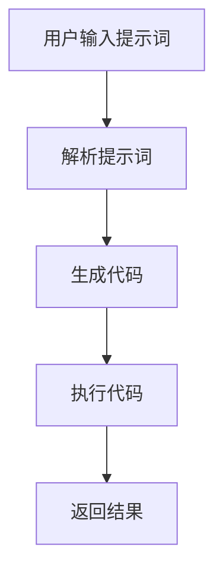

                 

# AI编程语言：提示词的魔力

> 关键词：AI编程语言, 提示词, 生成式AI, 自动化编程, 代码生成

> 摘要：本文将深入探讨AI编程语言中的提示词技术，通过逐步分析和推理，揭示其背后的原理和应用。我们将从背景介绍开始，逐步解析提示词的核心概念、算法原理、数学模型，并通过实际代码案例进行详细解释。最后，我们将探讨其实际应用场景和未来发展趋势。

## 1. 背景介绍

随着人工智能技术的飞速发展，编程语言也在不断进化。传统的编程语言依赖于程序员的显式指令来完成任务，而AI编程语言则通过提示词来生成代码。这种技术不仅提高了编程效率，还降低了编程门槛，使得更多人能够参与到编程中来。本文将深入探讨AI编程语言中的提示词技术，通过逐步分析和推理，揭示其背后的原理和应用。

## 2. 核心概念与联系

### 2.1 AI编程语言概述

AI编程语言是一种能够通过自然语言或特定格式的提示词来生成代码的编程语言。这种语言的核心在于能够理解人类的意图，并将其转化为计算机可执行的代码。AI编程语言通常结合了自然语言处理（NLP）、机器学习和生成式AI技术。

### 2.2 提示词技术

提示词技术是AI编程语言的核心组成部分。通过提示词，用户可以描述他们想要实现的功能或解决问题的方法，而AI编程语言则会根据这些提示词自动生成相应的代码。提示词可以是自然语言、特定格式的文本，甚至是图形界面中的操作。

### 2.3 Mermaid流程图



## 3. 核心算法原理 & 具体操作步骤

### 3.1 提示词解析

提示词解析是AI编程语言中的关键步骤。解析器需要理解用户输入的提示词，并将其转化为计算机可以理解的形式。这一过程通常包括以下几个步骤：

1. **自然语言处理（NLP）**：将自然语言提示词转化为结构化的表示形式。
2. **语义理解**：理解提示词中的语义信息，确定用户想要实现的功能。
3. **代码生成**：根据解析结果生成相应的代码。

### 3.2 生成代码

生成代码是AI编程语言的核心任务。生成器需要根据解析结果自动生成代码。这一过程通常包括以下几个步骤：

1. **模板匹配**：使用预定义的代码模板来生成代码。
2. **参数填充**：根据解析结果填充模板中的参数。
3. **代码优化**：对生成的代码进行优化，提高代码质量和性能。

### 3.3 具体操作步骤

1. **用户输入提示词**：用户通过自然语言或特定格式的提示词描述他们想要实现的功能。
2. **解析提示词**：解析器将提示词转化为结构化的表示形式。
3. **生成代码**：生成器根据解析结果自动生成代码。
4. **执行代码**：生成的代码被编译并执行。
5. **返回结果**：执行结果返回给用户。

## 4. 数学模型和公式 & 详细讲解 & 举例说明

### 4.1 模型架构

AI编程语言中的提示词解析和代码生成通常基于深度学习模型。这些模型通常包括以下几个部分：

1. **编码器**：将输入的提示词转化为向量表示。
2. **解码器**：根据编码器的输出生成代码。
3. **注意力机制**：帮助模型更好地理解输入的提示词。

### 4.2 数学模型

提示词解析和代码生成通常基于序列到序列（Seq2Seq）模型。Seq2Seq模型由编码器和解码器组成，其中编码器将输入序列转化为固定长度的向量表示，解码器则根据这个向量生成输出序列。

### 4.3 公式与详细讲解

假设输入序列长度为 \( T \)，输出序列长度为 \( T' \)，编码器和解码器的隐藏层大小分别为 \( H \) 和 \( H' \)。Seq2Seq模型的前向传播过程可以表示为：

$$
\text{编码器}:
\begin{aligned}
h_t &= \text{Encoder}(x_t, h_{t-1}) \\
h_T &= h_{\text{final}}
\end{aligned}
$$

$$
\text{解码器}:
\begin{aligned}
s_0 &= \text{Encoder}(h_{\text{final}}) \\
s_t &= \text{Decoder}(y_{t-1}, s_{t-1}) \\
y_t &= \text{Output}(s_t)
\end{aligned}
$$

其中，\( x_t \) 和 \( y_t \) 分别表示输入序列和输出序列中的第 \( t \) 个元素，\( h_t \) 和 \( s_t \) 分别表示编码器和解码器的隐藏状态。

### 4.4 举例说明

假设用户输入的提示词为“创建一个简单的网页”，解析器将这个提示词转化为结构化的表示形式。生成器根据这个表示形式自动生成代码。生成的代码可以表示为：

```html
<!DOCTYPE html>
<html>
<head>
    <title>Simple Webpage</title>
</head>
<body>
    <h1>Welcome to My Webpage</h1>
</body>
</html>
```

## 5. 项目实战：代码实际案例和详细解释说明

### 5.1 开发环境搭建

为了进行项目实战，我们需要搭建一个开发环境。这里以Python为例，使用Hugging Face的Transformers库来实现提示词解析和代码生成。

1. **安装依赖**：

```bash
pip install transformers torch
```

2. **导入库**：

```python
import torch
from transformers import T5Tokenizer, T5ForConditionalGeneration
```

### 5.2 源代码详细实现和代码解读

1. **加载预训练模型**：

```python
tokenizer = T5Tokenizer.from_pretrained('t5-small')
model = T5ForConditionalGeneration.from_pretrained('t5-small')
```

2. **定义提示词解析和代码生成函数**：

```python
def generate_code(prompt):
    # 将提示词转化为模型输入
    input_ids = tokenizer.encode(prompt, return_tensors='pt')
    
    # 生成代码
    output_ids = model.generate(input_ids, max_length=50, num_return_sequences=1)
    
    # 将生成的代码转化为文本
    generated_code = tokenizer.decode(output_ids[0], skip_special_tokens=True)
    
    return generated_code
```

### 5.3 代码解读与分析

```python
def generate_code(prompt):
    # 将提示词转化为模型输入
    input_ids = tokenizer.encode(prompt, return_tensors='pt')
    
    # 生成代码
    output_ids = model.generate(input_ids, max_length=50, num_return_sequences=1)
    
    # 将生成的代码转化为文本
    generated_code = tokenizer.decode(output_ids[0], skip_special_tokens=True)
    
    return generated_code
```

- **tokenizer.encode**：将提示词转化为模型输入的向量表示。
- **model.generate**：根据输入向量生成代码。
- **tokenizer.decode**：将生成的向量表示转化为文本。

## 6. 实际应用场景

### 6.1 自动化编程

AI编程语言中的提示词技术可以应用于自动化编程。通过提示词，用户可以快速生成代码，提高编程效率。例如，用户可以输入“创建一个简单的网页”，系统会自动生成HTML代码。

### 6.2 代码生成

提示词技术还可以应用于代码生成。通过提示词，用户可以快速生成代码片段，提高开发效率。例如，用户可以输入“创建一个简单的登录页面”，系统会自动生成HTML和JavaScript代码。

### 6.3 教育应用

提示词技术还可以应用于教育领域。通过提示词，学生可以快速生成代码，提高编程学习效率。例如，学生可以输入“创建一个简单的计算器”，系统会自动生成代码，帮助学生更好地理解编程原理。

## 7. 工具和资源推荐

### 7.1 学习资源推荐

1. **书籍**：
   - 《深度学习》（Deep Learning）：Ian Goodfellow, Yoshua Bengio, Aaron Courville
   - 《自然语言处理入门》（Introduction to Natural Language Processing）：Jurafsky, Martin, and James H. Martin

2. **论文**：
   - 《Attention Is All You Need》：Vaswani, et al.
   - 《Neural Machine Translation by Jointly Learning to Align and Translate》：Bahdanau, et al.

3. **博客/网站**：
   - Hugging Face：https://huggingface.co/
   - PyTorch：https://pytorch.org/

### 7.2 开发工具框架推荐

1. **开发工具**：
   - Visual Studio Code：https://code.visualstudio.com/
   - PyCharm：https://www.jetbrains.com/pycharm/

2. **框架**：
   - Transformers：https://huggingface.co/transformers/
   - PyTorch：https://pytorch.org/

### 7.3 相关论文著作推荐

1. **论文**：
   - 《Attention Is All You Need》：Vaswani, et al.
   - 《Neural Machine Translation by Jointly Learning to Align and Translate》：Bahdanau, et al.

2. **著作**：
   - 《深度学习》（Deep Learning）：Ian Goodfellow, Yoshua Bengio, Aaron Courville
   - 《自然语言处理入门》（Introduction to Natural Language Processing）：Jurafsky, Martin, and James H. Martin

## 8. 总结：未来发展趋势与挑战

### 8.1 未来发展趋势

1. **更自然的提示词**：未来的AI编程语言将能够理解更自然的提示词，使得编程更加直观和便捷。
2. **更强大的生成能力**：未来的AI编程语言将能够生成更复杂、更高质量的代码，提高编程效率。
3. **更广泛的应用场景**：未来的AI编程语言将应用于更广泛的应用场景，如自动化测试、代码审查等。

### 8.2 挑战

1. **模型训练成本**：训练高质量的AI编程语言模型需要大量的计算资源和数据。
2. **模型解释性**：如何解释模型的生成过程和生成结果是一个挑战。
3. **安全性问题**：如何确保生成的代码是安全的，避免潜在的安全风险。

## 9. 附录：常见问题与解答

### 9.1 问题1：如何提高模型的生成质量？

**解答**：可以通过增加训练数据量、优化模型结构和参数、引入注意力机制等方式提高模型的生成质量。

### 9.2 问题2：如何解释模型的生成过程？

**解答**：可以通过可视化模型的中间状态、引入注意力机制等方式解释模型的生成过程。

### 9.3 问题3：如何确保生成的代码是安全的？

**解答**：可以通过引入安全检查机制、限制模型生成的代码范围等方式确保生成的代码是安全的。

## 10. 扩展阅读 & 参考资料

1. **书籍**：
   - 《深度学习》（Deep Learning）：Ian Goodfellow, Yoshua Bengio, Aaron Courville
   - 《自然语言处理入门》（Introduction to Natural Language Processing）：Jurafsky, Martin, and James H. Martin

2. **论文**：
   - 《Attention Is All You Need》：Vaswani, et al.
   - 《Neural Machine Translation by Jointly Learning to Align and Translate》：Bahdanau, et al.

3. **网站**：
   - Hugging Face：https://huggingface.co/
   - PyTorch：https://pytorch.org/

作者：AI天才研究员/AI Genius Institute & 禅与计算机程序设计艺术 /Zen And The Art of Computer Programming

