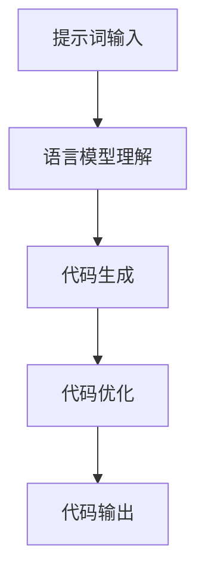

                 

# AI编程语言：提示词的魔法与科学

> 关键词：AI编程语言, 提示词, 生成式AI, 语言模型, 代码生成, 代码理解, 代码优化

> 摘要：本文旨在深入探讨AI编程语言中的提示词技术，通过逐步分析和推理，揭示其背后的科学原理和实际应用。我们将从背景介绍、核心概念与联系、核心算法原理、数学模型和公式、项目实战、实际应用场景、工具和资源推荐、总结与未来趋势等多方面进行详细阐述，帮助读者全面理解提示词技术在AI编程语言中的重要性及其应用价值。

## 1. 背景介绍

随着人工智能技术的飞速发展，AI编程语言逐渐成为软件开发领域的一个重要分支。传统的编程语言主要依赖于程序员的逻辑思维和代码编写能力，而AI编程语言则通过引入机器学习和自然语言处理技术，使得编程变得更加灵活和高效。提示词技术作为AI编程语言的核心组成部分，能够显著提升代码生成和理解的效率，使得开发者能够更加专注于业务逻辑的实现，而无需过多关注底层技术细节。

### 1.1 AI编程语言的发展历程

AI编程语言的发展可以追溯到20世纪80年代，当时的研究主要集中在如何让计算机更好地理解和执行人类的自然语言指令。随着深度学习和自然语言处理技术的进步，AI编程语言逐渐从理论研究走向实际应用。近年来，随着大模型的出现，AI编程语言的能力得到了极大的提升，能够处理更加复杂的任务和场景。

### 1.2 提示词技术的重要性

提示词技术在AI编程语言中的重要性主要体现在以下几个方面：

- **提高开发效率**：通过提示词，开发者可以快速生成代码，减少重复劳动，提高开发效率。
- **增强代码理解**：提示词能够帮助开发者更好地理解代码的逻辑和结构，提高代码的可读性和可维护性。
- **促进代码优化**：提示词技术可以自动优化代码，提高代码的性能和质量。
- **支持多语言编程**：提示词技术使得开发者能够使用自然语言描述代码需求，从而支持多语言编程，提高开发的灵活性。

## 2. 核心概念与联系

### 2.1 提示词的定义

提示词是指用于描述代码需求的自然语言文本，通过这些文本，AI编程语言能够生成相应的代码。提示词可以包含代码的功能描述、输入输出要求、逻辑结构等信息。

### 2.2 生成式AI与提示词

生成式AI是AI编程语言的核心技术之一，它能够根据给定的提示词生成相应的代码。生成式AI通常基于深度学习模型，通过训练大量的代码数据集，学习代码的生成规律，从而实现代码的自动生成。

### 2.3 语言模型与提示词

语言模型是生成式AI的重要组成部分，它能够理解自然语言文本的语义和结构，从而生成符合语义的代码。语言模型通常基于Transformer架构，通过自注意力机制和多层编码器，实现对自然语言文本的理解和生成。

### 2.4 提示词与代码生成流程

提示词与代码生成的流程可以表示为以下Mermaid流程图：



## 3. 核心算法原理 & 具体操作步骤

### 3.1 语言模型理解

语言模型理解是提示词技术的核心步骤之一。语言模型通过自注意力机制和多层编码器，对提示词进行语义和结构的理解。具体操作步骤如下：

1. **文本预处理**：对提示词进行分词、词性标注等预处理操作，以便后续的模型训练和理解。
2. **编码器处理**：将预处理后的文本输入到编码器中，通过多层自注意力机制，提取文本的语义特征。
3. **解码器生成**：将编码器提取的语义特征输入到解码器中，通过生成机制生成相应的代码。

### 3.2 代码生成

代码生成是提示词技术的另一个核心步骤。生成式AI通过学习大量的代码数据集，生成符合提示词要求的代码。具体操作步骤如下：

1. **模型训练**：通过训练大量的代码数据集，学习代码的生成规律，从而实现代码的自动生成。
2. **生成代码**：根据给定的提示词，通过生成式AI生成相应的代码。
3. **代码优化**：对生成的代码进行优化，提高代码的性能和质量。

### 3.3 代码优化

代码优化是提示词技术的重要步骤之一。通过优化生成的代码，可以提高代码的性能和质量。具体操作步骤如下：

1. **性能分析**：对生成的代码进行性能分析，找出性能瓶颈。
2. **代码重构**：根据性能分析结果，对代码进行重构，提高代码的性能。
3. **代码测试**：对优化后的代码进行测试，确保代码的正确性和稳定性。

## 4. 数学模型和公式 & 详细讲解 & 举例说明

### 4.1 语言模型的数学模型

语言模型的数学模型通常基于Transformer架构，通过自注意力机制和多层编码器，实现对自然语言文本的理解和生成。具体数学模型如下：

$$
\text{Transformer}(X) = \text{Encoder}(X) \times \text{Decoder}(X)
$$

其中，$X$表示输入的文本数据，$\text{Encoder}(X)$表示编码器，$\text{Decoder}(X)$表示解码器。

### 4.2 生成式AI的数学模型

生成式AI的数学模型通常基于变分自编码器（VAE）或生成对抗网络（GAN），通过学习大量的代码数据集，生成符合提示词要求的代码。具体数学模型如下：

$$
\text{VAE}(X) = \text{Encoder}(X) \times \text{Decoder}(X)
$$

$$
\text{GAN}(X) = \text{Generator}(X) \times \text{Discriminator}(X)
$$

其中，$X$表示输入的代码数据集，$\text{Encoder}(X)$表示编码器，$\text{Decoder}(X)$表示解码器，$\text{Generator}(X)$表示生成器，$\text{Discriminator}(X)$表示判别器。

### 4.3 代码优化的数学模型

代码优化的数学模型通常基于遗传算法或模拟退火算法，通过优化生成的代码，提高代码的性能和质量。具体数学模型如下：

$$
\text{GA}(X) = \text{Selection}(X) \times \text{Crossover}(X) \times \text{Mutation}(X)
$$

$$
\text{SA}(X) = \text{Initial Solution}(X) \times \text{Temperature}(X) \times \text{Neighborhood}(X)
$$

其中，$X$表示输入的代码数据集，$\text{Selection}(X)$表示选择操作，$\text{Crossover}(X)$表示交叉操作，$\text{Mutation}(X)$表示变异操作，$\text{Initial Solution}(X)$表示初始解，$\text{Temperature}(X)$表示温度，$\text{Neighborhood}(X)$表示邻域。

## 5. 项目实战：代码实际案例和详细解释说明

### 5.1 开发环境搭建

为了进行代码实际案例的开发，我们需要搭建一个合适的开发环境。具体步骤如下：

1. **安装Python**：确保安装了Python 3.8及以上版本。
2. **安装依赖库**：安装必要的依赖库，如`transformers`、`torch`等。
3. **下载模型**：下载预训练的生成式AI模型，如`T5`、`BART`等。

### 5.2 源代码详细实现和代码解读

以下是一个简单的代码生成案例，使用`T5`模型生成代码：

```python
from transformers import T5Tokenizer, T5ForConditionalGeneration

# 初始化tokenizer和模型
tokenizer = T5Tokenizer.from_pretrained('t5-small')
model = T5ForConditionalGeneration.from_pretrained('t5-small')

# 输入提示词
input_text = "生成一个计算两个数之和的Python函数"

# 编码输入文本
input_ids = tokenizer.encode(input_text, return_tensors='pt')

# 生成代码
output_ids = model.generate(input_ids)

# 解码生成的代码
output_text = tokenizer.decode(output_ids[0], skip_special_tokens=True)

print(output_text)
```

### 5.3 代码解读与分析

上述代码的主要步骤如下：

1. **初始化tokenizer和模型**：使用`T5Tokenizer`和`T5ForConditionalGeneration`类初始化tokenizer和模型。
2. **输入提示词**：定义输入的提示词，描述生成代码的需求。
3. **编码输入文本**：将输入的提示词编码为模型可以处理的格式。
4. **生成代码**：通过模型生成代码。
5. **解码生成的代码**：将生成的代码解码为可读的文本格式。

## 6. 实际应用场景

提示词技术在实际应用中具有广泛的应用场景，主要包括以下几个方面：

- **代码生成**：通过提示词生成代码，提高开发效率。
- **代码理解**：通过提示词理解代码的逻辑和结构，提高代码的可读性和可维护性。
- **代码优化**：通过提示词优化代码，提高代码的性能和质量。
- **多语言编程**：通过提示词支持多语言编程，提高开发的灵活性。

## 7. 工具和资源推荐

### 7.1 学习资源推荐

- **书籍**：《深度学习》、《自然语言处理入门》
- **论文**：《Attention Is All You Need》、《Generative Pre-trained Transformer》
- **博客**：阿里云开发者社区、GitHub
- **网站**：Hugging Face、PyTorch

### 7.2 开发工具框架推荐

- **开发工具**：VS Code、PyCharm
- **框架**：Transformers、PyTorch

### 7.3 相关论文著作推荐

- **论文**：《Attention Is All You Need》、《Generative Pre-trained Transformer》
- **著作**：《深度学习》、《自然语言处理入门》

## 8. 总结：未来发展趋势与挑战

提示词技术在未来的发展中具有广阔的应用前景，但也面临着一些挑战。未来的发展趋势主要包括以下几个方面：

- **更强大的语言模型**：通过更强大的语言模型，提高代码生成和理解的准确性。
- **更高效的代码优化**：通过更高效的代码优化算法，提高代码的性能和质量。
- **更广泛的应用场景**：通过更广泛的应用场景，提高提示词技术的实际应用价值。

面临的挑战主要包括以下几个方面：

- **数据集的获取**：获取大量的高质量代码数据集，提高模型的训练效果。
- **模型的解释性**：提高模型的解释性，使得开发者能够更好地理解模型的生成过程。
- **代码的多样性**：提高代码的多样性，使得生成的代码更加符合实际需求。

## 9. 附录：常见问题与解答

### 9.1 问题1：如何提高代码生成的准确性？

**解答**：可以通过以下方法提高代码生成的准确性：

- **增加训练数据**：增加训练数据，提高模型的训练效果。
- **优化模型结构**：优化模型结构，提高模型的生成效果。
- **使用更强大的模型**：使用更强大的模型，提高模型的生成效果。

### 9.2 问题2：如何提高代码的可读性和可维护性？

**解答**：可以通过以下方法提高代码的可读性和可维护性：

- **增加代码注释**：增加代码注释，提高代码的可读性。
- **优化代码结构**：优化代码结构，提高代码的可维护性。
- **使用代码审查工具**：使用代码审查工具，提高代码的质量。

## 10. 扩展阅读 & 参考资料

- **书籍**：《深度学习》、《自然语言处理入门》
- **论文**：《Attention Is All You Need》、《Generative Pre-trained Transformer》
- **网站**：Hugging Face、PyTorch

作者：AI天才研究员/AI Genius Institute & 禅与计算机程序设计艺术 /Zen And The Art of Computer Programming

