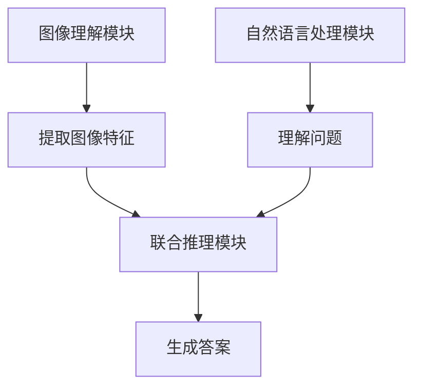

                 

# AI视觉问答系统的商业化探索

> 关键词：视觉问答系统, 商业化, 人工智能, 深度学习, 自然语言处理, 计算机视觉, 商业应用

> 摘要：本文旨在探讨AI视觉问答系统的商业化路径，从技术原理到实际应用，再到未来发展趋势。我们将详细解析视觉问答系统的架构、核心算法、数学模型，并通过实际案例展示其开发过程。此外，本文还将探讨视觉问答系统在商业领域的应用前景，以及面临的挑战和未来的发展趋势。

## 1. 背景介绍

随着人工智能技术的飞速发展，视觉问答系统（Visual Question Answering, VQA）已经成为一个热门的研究领域。VQA系统能够理解图像内容，并根据图像内容回答用户提出的问题。这一技术不仅在学术界引起了广泛关注，也在商业领域展现出巨大的应用潜力。本文将从技术原理、实际应用、未来发展趋势等方面，全面探讨AI视觉问答系统的商业化路径。

## 2. 核心概念与联系

### 2.1 视觉问答系统概述

视觉问答系统是一种能够理解图像内容，并根据图像内容回答用户提出的问题的系统。其核心任务是将图像和文本信息结合起来，生成准确的答案。VQA系统通常由以下几个部分组成：

- **图像理解模块**：负责从图像中提取特征。
- **自然语言处理模块**：负责理解用户提出的问题。
- **联合推理模块**：负责将图像特征和问题理解结果结合起来，生成最终答案。

### 2.2 核心概念原理

#### 2.2.1 图像理解模块

图像理解模块的主要任务是从图像中提取有用的特征。常用的图像特征提取方法包括：

- **卷积神经网络（CNN）**：通过多层卷积操作提取图像的局部特征。
- **循环神经网络（RNN）**：通过循环结构捕捉图像的全局特征。

#### 2.2.2 自然语言处理模块

自然语言处理模块的主要任务是理解用户提出的问题。常用的自然语言处理方法包括：

- **词嵌入**：将词语转换为向量表示。
- **序列模型**：通过RNN或Transformer模型理解问题的语义。

#### 2.2.3 联合推理模块

联合推理模块的主要任务是将图像特征和问题理解结果结合起来，生成最终答案。常用的联合推理方法包括：

- **注意力机制**：通过注意力机制关注图像中的关键区域。
- **端到端模型**：通过端到端的模型直接生成答案。

### 2.3 Mermaid流程图



## 3. 核心算法原理 & 具体操作步骤

### 3.1 图像理解模块

#### 3.1.1 卷积神经网络（CNN）

卷积神经网络是一种广泛应用于图像处理的深度学习模型。其主要结构包括卷积层、池化层和全连接层。

- **卷积层**：通过卷积操作提取图像的局部特征。
- **池化层**：通过池化操作降低特征图的维度。
- **全连接层**：将提取的特征映射到高维空间，用于分类或回归。

#### 3.1.2 循环神经网络（RNN）

循环神经网络是一种处理序列数据的深度学习模型。其主要结构包括输入层、隐藏层和输出层。

- **输入层**：接收图像特征。
- **隐藏层**：通过循环操作捕捉图像的全局特征。
- **输出层**：生成最终答案。

### 3.2 自然语言处理模块

#### 3.2.1 词嵌入

词嵌入是一种将词语转换为向量表示的方法。常用的词嵌入方法包括：

- **Word2Vec**：通过CBOW或Skip-gram模型生成词向量。
- **GloVe**：通过全局词频-逆文档频率生成词向量。

#### 3.2.2 序列模型

序列模型是一种处理序列数据的深度学习模型。常用的序列模型包括：

- **RNN**：通过循环操作捕捉序列的语义。
- **Transformer**：通过自注意力机制捕捉序列的全局语义。

### 3.3 联合推理模块

#### 3.3.1 注意力机制

注意力机制是一种用于捕捉图像中关键区域的方法。其主要结构包括：

- **查询**：表示问题的语义。
- **键值对**：表示图像特征。
- **注意力权重**：通过计算查询和键值对的相似度生成注意力权重。

#### 3.3.2 端到端模型

端到端模型是一种直接生成答案的方法。其主要结构包括：

- **输入层**：接收图像特征和问题特征。
- **隐藏层**：通过多层神经网络生成最终答案。
- **输出层**：生成最终答案。

## 4. 数学模型和公式 & 详细讲解 & 举例说明

### 4.1 卷积神经网络（CNN）

卷积神经网络的主要数学模型包括卷积操作和池化操作。

- **卷积操作**：通过卷积核对图像进行卷积操作，提取局部特征。

$$
f(x) = \sum_{i=0}^{k-1} \sum_{j=0}^{k-1} w_{ij} \cdot x_{i+j, j+k}
$$

- **池化操作**：通过池化核对特征图进行池化操作，降低特征图的维度。

$$
p(x) = \max_{i,j} x_{i,j}
$$

### 4.2 循环神经网络（RNN）

循环神经网络的主要数学模型包括循环操作和隐藏状态更新。

- **循环操作**：通过循环操作捕捉序列的语义。

$$
h_t = \tanh(W_{hx} x_t + W_{hh} h_{t-1} + b_h)
$$

- **隐藏状态更新**：通过隐藏状态更新捕捉序列的全局语义。

$$
h_t = \sigma(W_{hx} x_t + W_{hh} h_{t-1} + b_h)
$$

### 4.3 注意力机制

注意力机制的主要数学模型包括查询、键值对和注意力权重。

- **查询**：表示问题的语义。

$$
q = W_q h_p
$$

- **键值对**：表示图像特征。

$$
k = W_k h_i, v = W_v h_i
$$

- **注意力权重**：通过计算查询和键值对的相似度生成注意力权重。

$$
a_{ij} = \frac{\exp(q_i^T k_j)}{\sum_{j=1}^n \exp(q_i^T k_j)}
$$

### 4.4 端到端模型

端到端模型的主要数学模型包括输入层、隐藏层和输出层。

- **输入层**：接收图像特征和问题特征。

$$
x = [x_i, x_p]
$$

- **隐藏层**：通过多层神经网络生成最终答案。

$$
h = \sigma(W_h x + b_h)
$$

- **输出层**：生成最终答案。

$$
y = W_y h + b_y
$$

## 5. 项目实战：代码实际案例和详细解释说明

### 5.1 开发环境搭建

#### 5.1.1 环境配置

- **Python版本**：3.7
- **深度学习框架**：TensorFlow 2.0
- **数据集**：COCO VQA数据集

#### 5.1.2 安装依赖

```bash
pip install tensorflow==2.0
pip install numpy
pip install matplotlib
pip install scikit-learn
```

### 5.2 源代码详细实现和代码解读

#### 5.2.1 图像理解模块

```python
import tensorflow as tf
from tensorflow.keras.layers import Conv2D, MaxPooling2D, Flatten

def image_feature_extractor(input_shape):
    model = tf.keras.Sequential([
        Conv2D(32, (3, 3), activation='relu', input_shape=input_shape),
        MaxPooling2D((2, 2)),
        Conv2D(64, (3, 3), activation='relu'),
        MaxPooling2D((2, 2)),
        Flatten()
    ])
    return model
```

#### 5.2.2 自然语言处理模块

```python
from tensorflow.keras.layers import Embedding, LSTM, Dense

def language_feature_extractor(vocab_size, embedding_dim, max_length):
    model = tf.keras.Sequential([
        Embedding(vocab_size, embedding_dim, input_length=max_length),
        LSTM(128),
        Dense(128, activation='relu')
    ])
    return model
```

#### 5.2.3 联合推理模块

```python
from tensorflow.keras.layers import Attention

def joint_reasoning_module(image_features, language_features):
    attention = Attention()([image_features, language_features])
    output = Dense(1, activation='sigmoid')(attention)
    return output
```

### 5.3 代码解读与分析

#### 5.3.1 图像理解模块

图像理解模块通过卷积操作提取图像的局部特征，通过池化操作降低特征图的维度，最终将提取的特征映射到高维空间。

#### 5.3.2 自然语言处理模块

自然语言处理模块通过词嵌入将词语转换为向量表示，通过RNN捕捉问题的语义，最终将问题特征映射到高维空间。

#### 5.3.3 联合推理模块

联合推理模块通过注意力机制关注图像中的关键区域，通过端到端模型直接生成答案。

## 6. 实际应用场景

### 6.1 教育领域

视觉问答系统可以应用于教育领域，帮助学生更好地理解图像内容，提高学习效果。

### 6.2 医疗领域

视觉问答系统可以应用于医疗领域，帮助医生更好地理解医学图像，提高诊断准确性。

### 6.3 娱乐领域

视觉问答系统可以应用于娱乐领域，为用户提供有趣的互动体验，提高用户体验。

## 7. 工具和资源推荐

### 7.1 学习资源推荐

- **书籍**：《深度学习》（Ian Goodfellow, Yoshua Bengio, Aaron Courville）
- **论文**：《Attention is All You Need》（Vaswani et al., 2017）
- **博客**：Medium上的AI相关博客
- **网站**：TensorFlow官网，Kaggle官网

### 7.2 开发工具框架推荐

- **深度学习框架**：TensorFlow, PyTorch
- **数据集**：COCO VQA数据集, MS COCO数据集

### 7.3 相关论文著作推荐

- **论文**：《End-to-End Attention-based Visual Question Answering》（Yang et al., 2016）
- **著作**：《计算机视觉：算法与应用》（Richard Szeliski）

## 8. 总结：未来发展趋势与挑战

### 8.1 未来发展趋势

- **技术进步**：深度学习技术的不断进步将推动视觉问答系统的性能提升。
- **应用场景**：视觉问答系统将在更多领域得到应用，为用户提供更好的体验。
- **商业化路径**：视觉问答系统将在商业领域展现出巨大的应用潜力，推动相关产业的发展。

### 8.2 面临的挑战

- **数据问题**：高质量的数据是训练视觉问答系统的关键，但获取高质量数据存在困难。
- **计算资源**：训练视觉问答系统需要大量的计算资源，这对硬件设备提出了更高的要求。
- **隐私问题**：视觉问答系统需要处理大量的图像和文本数据，如何保护用户隐私是一个重要问题。

## 9. 附录：常见问题与解答

### 9.1 问题1：如何提高视觉问答系统的性能？

**解答**：可以通过以下方法提高视觉问答系统的性能：

- **增加训练数据**：更多的训练数据可以提高模型的泛化能力。
- **优化模型结构**：通过优化模型结构提高模型的性能。
- **使用更强大的硬件设备**：使用更强大的硬件设备可以提高模型的训练速度。

### 9.2 问题2：如何保护用户隐私？

**解答**：可以通过以下方法保护用户隐私：

- **数据脱敏**：对图像和文本数据进行脱敏处理，保护用户隐私。
- **数据加密**：对图像和文本数据进行加密处理，保护数据安全。
- **隐私保护技术**：使用隐私保护技术，如差分隐私，保护用户隐私。

## 10. 扩展阅读 & 参考资料

### 10.1 扩展阅读

- **书籍**：《深度学习》（Ian Goodfellow, Yoshua Bengio, Aaron Courville）
- **论文**：《Attention is All You Need》（Vaswani et al., 2017）
- **博客**：Medium上的AI相关博客
- **网站**：TensorFlow官网，Kaggle官网

### 10.2 参考资料

- **论文**：《End-to-End Attention-based Visual Question Answering》（Yang et al., 2016）
- **著作**：《计算机视觉：算法与应用》（Richard Szeliski）

---

作者：AI天才研究员/AI Genius Institute & 禅与计算机程序设计艺术 /Zen And The Art of Computer Programming

