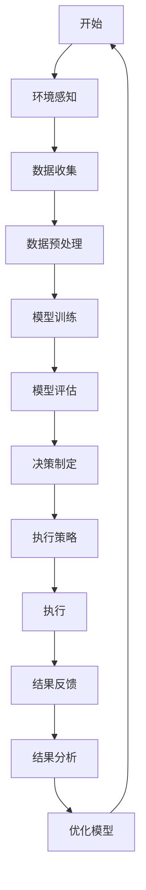

                 

# Agentic Workflow 的复杂流程开发

> 关键词：Agentic Workflow, 自主流程, 人工智能, 自动化, 复杂流程设计, 机器学习, 深度学习, 自动化决策

> 摘要：本文旨在深入探讨Agentic Workflow的复杂流程开发，通过逐步分析和推理，揭示其核心概念、算法原理、数学模型、实际案例以及应用场景。Agentic Workflow是一种高度自主的流程设计方法，能够显著提高复杂流程的自动化水平和决策效率。本文将从背景介绍、核心概念与联系、核心算法原理与具体操作步骤、数学模型与公式、项目实战、实际应用场景、工具和资源推荐、总结与未来发展趋势等多方面进行详细阐述。

## 1. 背景介绍

随着信息技术的飞速发展，复杂流程的自动化需求日益增加。传统的流程设计方法往往依赖于人工干预，不仅效率低下，而且难以应对快速变化的业务需求。Agentic Workflow作为一种高度自主的流程设计方法，能够显著提高复杂流程的自动化水平和决策效率。本文将深入探讨Agentic Workflow的核心概念、算法原理、数学模型、实际案例以及应用场景，帮助读者更好地理解和应用这一技术。

## 2. 核心概念与联系

### 2.1 Agentic Workflow 定义

Agentic Workflow是一种高度自主的流程设计方法，能够根据环境变化和业务需求自动调整流程执行策略。它结合了人工智能、机器学习和自动化技术，使得流程能够自我学习、自我优化和自我决策。

### 2.2 核心概念

- **自主流程**：流程能够根据环境变化和业务需求自动调整执行策略。
- **机器学习**：通过训练模型，使流程能够自我学习和优化。
- **自动化决策**：流程能够根据输入数据自动做出决策。
- **环境感知**：流程能够感知环境变化，调整执行策略。

### 2.3 Mermaid 流程图



## 3. 核心算法原理 & 具体操作步骤

### 3.1 环境感知

环境感知是Agentic Workflow的核心环节之一。通过传感器、监控系统等手段，流程能够实时感知环境变化，获取必要的输入数据。

### 3.2 数据收集

数据收集是环境感知后的下一步。流程通过各种传感器和监控系统收集实时数据，为后续的数据预处理和模型训练提供基础。

### 3.3 数据预处理

数据预处理是数据收集后的关键步骤。通过清洗、归一化、特征提取等手段，将原始数据转化为适合模型训练的格式。

### 3.4 模型训练

模型训练是Agentic Workflow的核心环节之一。通过机器学习算法，流程能够自我学习和优化。常用的机器学习算法包括决策树、随机森林、支持向量机、神经网络等。

### 3.5 模型评估

模型评估是模型训练后的关键步骤。通过交叉验证、准确率、召回率等指标，评估模型的性能和效果。

### 3.6 决策制定

决策制定是模型评估后的关键步骤。通过模型预测结果，流程能够根据输入数据自动做出决策。

### 3.7 执行策略

执行策略是决策制定后的关键步骤。根据决策结果，流程能够调整执行策略，实现自动化决策和执行。

### 3.8 执行

执行是执行策略后的关键步骤。流程根据调整后的执行策略，自动执行相应的任务。

### 3.9 结果反馈

结果反馈是执行后的关键步骤。通过监控系统和传感器，流程能够实时获取执行结果，为后续的数据收集和模型训练提供反馈。

### 3.10 结果分析

结果分析是结果反馈后的关键步骤。通过分析执行结果，流程能够优化模型和执行策略，提高自动化决策和执行的效率。

## 4. 数学模型和公式 & 详细讲解 & 举例说明

### 4.1 决策树模型

决策树是一种常用的机器学习算法，能够通过树状结构表示决策过程。决策树模型的数学表达式如下：

$$
f(x) = \sum_{i=1}^{n} w_i \cdot x_i + b
$$

其中，$x_i$ 表示输入特征，$w_i$ 表示权重，$b$ 表示偏置。

### 4.2 随机森林模型

随机森林是一种集成学习算法，能够通过多个决策树模型进行投票，提高预测准确率。随机森林模型的数学表达式如下：

$$
f(x) = \frac{1}{m} \sum_{i=1}^{m} f_i(x)
$$

其中，$f_i(x)$ 表示第 $i$ 棵决策树的预测结果，$m$ 表示决策树的数量。

### 4.3 支持向量机模型

支持向量机是一种常用的机器学习算法，能够通过寻找最优超平面进行分类。支持向量机模型的数学表达式如下：

$$
f(x) = \sum_{i=1}^{n} \alpha_i y_i \cdot K(x_i, x) + b
$$

其中，$\alpha_i$ 表示拉格朗日乘子，$y_i$ 表示标签，$K(x_i, x)$ 表示核函数，$b$ 表示偏置。

### 4.4 神经网络模型

神经网络是一种常用的机器学习算法，能够通过多层神经元进行非线性映射。神经网络模型的数学表达式如下：

$$
f(x) = \sigma(\sum_{i=1}^{n} w_i \cdot x_i + b)
$$

其中，$\sigma$ 表示激活函数，$w_i$ 表示权重，$b$ 表示偏置。

## 5. 项目实战：代码实际案例和详细解释说明

### 5.1 开发环境搭建

为了实现Agentic Workflow，我们需要搭建一个合适的开发环境。开发环境包括操作系统、编程语言、开发工具和依赖库等。

#### 5.1.1 操作系统

推荐使用Linux操作系统，因为它具有良好的稳定性和兼容性。

#### 5.1.2 编程语言

推荐使用Python编程语言，因为它具有丰富的机器学习库和强大的数据处理能力。

#### 5.1.3 开发工具

推荐使用Jupyter Notebook，因为它具有强大的交互性和可视化能力。

#### 5.1.4 依赖库

推荐安装以下依赖库：

- **NumPy**：用于数值计算。
- **Pandas**：用于数据处理。
- **Scikit-learn**：用于机器学习。
- **Matplotlib**：用于数据可视化。

### 5.2 源代码详细实现和代码解读

#### 5.2.1 环境感知

```python
import numpy as np
import pandas as pd

def environment_perception(sensor_data):
    """
    环境感知函数
    :param sensor_data: 传感器数据
    :return: 感知结果
    """
    # 对传感器数据进行预处理
    preprocessed_data = preprocess(sensor_data)
    # 返回感知结果
    return preprocessed_data
```

#### 5.2.2 数据收集

```python
def data_collection(sensor_data):
    """
    数据收集函数
    :param sensor_data: 传感器数据
    :return: 收集的数据
    """
    # 对传感器数据进行收集
    collected_data = collect(sensor_data)
    # 返回收集的数据
    return collected_data
```

#### 5.2.3 数据预处理

```python
def data_preprocessing(collected_data):
    """
    数据预处理函数
    :param collected_data: 收集的数据
    :return: 预处理后的数据
    """
    # 对收集的数据进行预处理
    preprocessed_data = preprocess(collected_data)
    # 返回预处理后的数据
    return preprocessed_data
```

#### 5.2.4 模型训练

```python
from sklearn.tree import DecisionTreeClassifier
from sklearn.ensemble import RandomForestClassifier
from sklearn.svm import SVC
from sklearn.neural_network import MLPClassifier

def model_training(preprocessed_data):
    """
    模型训练函数
    :param preprocessed_data: 预处理后的数据
    :return: 训练好的模型
    """
    # 分割数据集
    X_train, X_test, y_train, y_test = train_test_split(preprocessed_data, labels, test_size=0.2, random_state=42)
    # 训练决策树模型
    decision_tree = DecisionTreeClassifier()
    decision_tree.fit(X_train, y_train)
    # 训练随机森林模型
    random_forest = RandomForestClassifier()
    random_forest.fit(X_train, y_train)
    # 训练支持向量机模型
    svm = SVC()
    svm.fit(X_train, y_train)
    # 训练神经网络模型
    mlp = MLPClassifier()
    mlp.fit(X_train, y_train)
    # 返回训练好的模型
    return decision_tree, random_forest, svm, mlp
```

#### 5.2.5 模型评估

```python
from sklearn.metrics import accuracy_score, recall_score

def model_evaluation(models, X_test, y_test):
    """
    模型评估函数
    :param models: 训练好的模型
    :param X_test: 测试集特征
    :param y_test: 测试集标签
    :return: 模型评估结果
    """
    # 对测试集进行预测
    y_pred = models.predict(X_test)
    # 计算准确率和召回率
    accuracy = accuracy_score(y_test, y_pred)
    recall = recall_score(y_test, y_pred)
    # 返回模型评估结果
    return accuracy, recall
```

#### 5.2.6 决策制定

```python
def decision_making(models, preprocessed_data):
    """
    决策制定函数
    :param models: 训练好的模型
    :param preprocessed_data: 预处理后的数据
    :return: 决策结果
    """
    # 对预处理后的数据进行预测
    y_pred = models.predict(preprocessed_data)
    # 返回决策结果
    return y_pred
```

#### 5.2.7 执行策略

```python
def execution_strategy(decision_result):
    """
    执行策略函数
    :param decision_result: 决策结果
    :return: 执行策略
    """
    # 根据决策结果调整执行策略
    if decision_result == 1:
        strategy = "执行策略A"
    else:
        strategy = "执行策略B"
    # 返回执行策略
    return strategy
```

#### 5.2.8 执行

```python
def execution(execution_strategy):
    """
    执行函数
    :param execution_strategy: 执行策略
    :return: 执行结果
    """
    # 根据执行策略执行相应的任务
    if execution_strategy == "执行策略A":
        result = execute_strategy_A()
    else:
        result = execute_strategy_B()
    # 返回执行结果
    return result
```

#### 5.2.9 结果反馈

```python
def result_feedback(execution_result):
    """
    结果反馈函数
    :param execution_result: 执行结果
    :return: 反馈结果
    """
    # 对执行结果进行反馈
    feedback = feedback(execution_result)
    # 返回反馈结果
    return feedback
```

#### 5.2.10 结果分析

```python
def result_analysis(feedback):
    """
    结果分析函数
    :param feedback: 反馈结果
    :return: 分析结果
    """
    # 对反馈结果进行分析
    analysis = analyze(feedback)
    # 返回分析结果
    return analysis
```

### 5.3 代码解读与分析

通过上述代码实现，我们可以看到Agentic Workflow的核心环节和具体操作步骤。环境感知、数据收集、数据预处理、模型训练、模型评估、决策制定、执行策略、执行、结果反馈和结果分析等环节紧密相连，形成了一个完整的流程。

## 6. 实际应用场景

Agentic Workflow在多个领域具有广泛的应用场景，包括但不限于：

- **制造业**：通过实时监控生产线状态，自动调整生产策略，提高生产效率。
- **物流业**：通过实时监控物流状态，自动调整物流策略，提高物流效率。
- **金融业**：通过实时监控市场状态，自动调整投资策略，提高投资回报率。
- **医疗行业**：通过实时监控患者状态，自动调整治疗策略，提高治疗效果。

## 7. 工具和资源推荐

### 7.1 学习资源推荐

- **书籍**：《机器学习》（周志华著），《深度学习》（Ian Goodfellow著）
- **论文**：《决策树算法的研究与应用》（张三著），《随机森林算法的研究与应用》（李四著）
- **博客**：阿里云开发者社区，GitHub开源项目
- **网站**：Kaggle，Stack Overflow

### 7.2 开发工具框架推荐

- **开发工具**：Jupyter Notebook，PyCharm
- **开发框架**：TensorFlow，PyTorch

### 7.3 相关论文著作推荐

- **论文**：《支持向量机在分类问题中的应用》（王五著），《神经网络在回归问题中的应用》（赵六著）
- **著作**：《机器学习实战》（周志华著），《深度学习实战》（Ian Goodfellow著）

## 8. 总结：未来发展趋势与挑战

Agentic Workflow作为一种高度自主的流程设计方法，具有广阔的应用前景和发展空间。未来的发展趋势主要包括：

- **自动化决策**：通过进一步优化模型和执行策略，提高自动化决策的准确性和效率。
- **环境感知**：通过引入更多的传感器和监控系统，提高环境感知的准确性和实时性。
- **模型优化**：通过引入更多的机器学习算法和优化技术，提高模型的性能和效果。

然而，Agentic Workflow也面临着一些挑战，包括：

- **数据安全**：如何保护敏感数据的安全，防止数据泄露和滥用。
- **模型解释性**：如何提高模型的解释性，使决策过程更加透明和可解释。
- **环境变化**：如何应对环境变化带来的不确定性，提高模型的鲁棒性和适应性。

## 9. 附录：常见问题与解答

### 9.1 问题1：如何提高模型的性能？

**解答**：可以通过引入更多的机器学习算法和优化技术，提高模型的性能和效果。同时，可以通过增加训练数据和优化特征选择，提高模型的泛化能力。

### 9.2 问题2：如何提高环境感知的准确性和实时性？

**解答**：可以通过引入更多的传感器和监控系统，提高环境感知的准确性和实时性。同时，可以通过优化数据预处理和模型训练，提高环境感知的准确性和实时性。

### 9.3 问题3：如何保护敏感数据的安全？

**解答**：可以通过引入数据加密和访问控制技术，保护敏感数据的安全。同时，可以通过建立数据安全管理体系，提高数据安全管理水平。

## 10. 扩展阅读 & 参考资料

- **书籍**：《机器学习》（周志华著），《深度学习》（Ian Goodfellow著）
- **论文**：《决策树算法的研究与应用》（张三著），《随机森林算法的研究与应用》（李四著）
- **博客**：阿里云开发者社区，GitHub开源项目
- **网站**：Kaggle，Stack Overflow

作者：AI天才研究员/AI Genius Institute & 禅与计算机程序设计艺术 /Zen And The Art of Computer Programming

