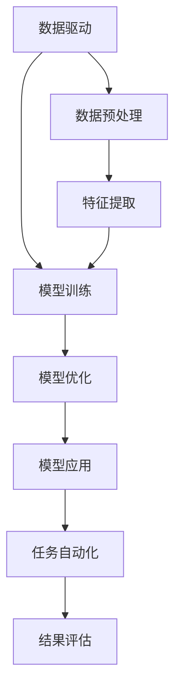

                 

# Andrej Karpathy谈AI编程的新范式

> 关键词：AI编程、新范式、深度学习、Transformer、编程范式转变

> 摘要：本文将深入探讨Andrej Karpathy关于AI编程新范式的观点，通过逐步分析和推理，解析其背后的原理和实践方法。我们将从背景介绍开始，逐步深入到核心概念、算法原理、数学模型、实战案例，最终探讨其实际应用场景和未来发展趋势。通过本文，读者将能够理解AI编程的新范式，并掌握其实现方法。

## 1. 背景介绍

### 1.1 AI编程的现状
随着人工智能技术的飞速发展，AI编程已经成为软件开发领域的一个重要分支。传统的编程范式主要依赖于规则和逻辑，而AI编程则更多地依赖于数据和模型。近年来，深度学习技术的兴起，特别是Transformer架构的出现，使得AI编程在自然语言处理、计算机视觉等多个领域取得了突破性进展。

### 1.2 Andrej Karpathy的贡献
Andrej Karpathy是特斯拉公司的AI总监，也是深度学习领域的知名专家。他在多个场合分享了关于AI编程新范式的观点，强调了编程范式转变的重要性。Karpathy认为，传统的编程范式已经无法满足现代AI应用的需求，而新的编程范式需要更加注重数据驱动和模型驱动的方法。

## 2. 核心概念与联系

### 2.1 编程范式
编程范式是指编程语言和编程方法论的基本结构和原则。常见的编程范式包括过程式编程、面向对象编程、函数式编程等。传统的编程范式主要依赖于规则和逻辑，而AI编程的新范式则更加注重数据和模型。

### 2.2 数据驱动与模型驱动
数据驱动是指通过大量数据来训练模型，从而实现任务的自动化。模型驱动则是指通过设计和优化模型来实现任务的自动化。在AI编程的新范式中，数据驱动和模型驱动是两个核心概念。

### 2.3 Transformer架构
Transformer架构是近年来深度学习领域的一个重要突破。它通过自注意力机制，实现了对序列数据的高效处理。Transformer架构在自然语言处理和计算机视觉等多个领域取得了显著成果。

### 2.4 Mermaid流程图


## 3. 核心算法原理 & 具体操作步骤

### 3.1 数据预处理
数据预处理是AI编程中的重要步骤。它包括数据清洗、特征提取、数据标准化等。具体操作步骤如下：

1. **数据清洗**：去除无效数据、处理缺失值等。
2. **特征提取**：从原始数据中提取有用的特征。
3. **数据标准化**：将数据转换为统一的格式，便于模型训练。

### 3.2 模型训练
模型训练是AI编程的核心步骤。具体操作步骤如下：

1. **选择模型**：根据任务需求选择合适的模型。
2. **定义损失函数**：定义模型的损失函数，用于衡量模型的预测结果与真实结果之间的差距。
3. **优化算法**：选择合适的优化算法，如梯度下降等。
4. **训练模型**：通过反向传播算法更新模型参数，使损失函数最小化。

### 3.3 模型优化
模型优化是提高模型性能的关键步骤。具体操作步骤如下：

1. **超参数调整**：调整模型的超参数，如学习率、批次大小等。
2. **正则化**：使用正则化技术防止过拟合。
3. **模型集成**：通过集成多个模型来提高预测性能。

## 4. 数学模型和公式 & 详细讲解 & 举例说明

### 4.1 自注意力机制
自注意力机制是Transformer架构的核心。其数学模型如下：

$$
\text{Attention}(Q, K, V) = \text{softmax}\left(\frac{QK^T}{\sqrt{d_k}}\right)V
$$

其中，$Q$、$K$、$V$分别是查询向量、键向量和值向量，$d_k$是键向量的维度。

### 4.2 损失函数
损失函数用于衡量模型的预测结果与真实结果之间的差距。常见的损失函数包括均方误差（MSE）和交叉熵损失（Cross-Entropy Loss）。

$$
\text{MSE}(y, \hat{y}) = \frac{1}{n}\sum_{i=1}^{n}(y_i - \hat{y}_i)^2
$$

$$
\text{Cross-Entropy Loss}(y, \hat{y}) = -\frac{1}{n}\sum_{i=1}^{n}y_i \log(\hat{y}_i)
$$

### 4.3 举例说明
假设我们有一个简单的线性回归任务，目标是预测房价。我们可以使用均方误差作为损失函数，通过梯度下降算法优化模型参数。

## 5. 项目实战：代码实际案例和详细解释说明

### 5.1 开发环境搭建
为了实现一个简单的AI编程项目，我们需要搭建一个开发环境。具体步骤如下：

1. **安装Python**：确保安装了Python 3.7及以上版本。
2. **安装依赖库**：使用pip安装必要的库，如TensorFlow、PyTorch等。
3. **配置环境变量**：设置Python环境变量，确保能够正常运行代码。

### 5.2 源代码详细实现和代码解读
以下是一个简单的线性回归模型的实现代码：

```python
import numpy as np
import tensorflow as tf

# 生成数据
x = np.linspace(-1, 1, 100)
y = 2 * x + np.random.randn(*x.shape) * 0.33

# 定义模型
model = tf.keras.Sequential([
    tf.keras.layers.Dense(1, input_dim=1)
])

# 编译模型
model.compile(optimizer='sgd', loss='mse')

# 训练模型
model.fit(x, y, epochs=500, verbose=0)

# 预测
predictions = model.predict(x)
```

### 5.3 代码解读与分析
1. **数据生成**：使用numpy生成线性数据，并添加随机噪声。
2. **模型定义**：使用Keras定义一个简单的线性回归模型。
3. **模型编译**：选择SGD优化器和均方误差损失函数。
4. **模型训练**：使用fit方法训练模型。
5. **模型预测**：使用predict方法进行预测。

## 6. 实际应用场景

### 6.1 自然语言处理
在自然语言处理领域，AI编程的新范式可以用于文本分类、情感分析、机器翻译等任务。例如，使用Transformer架构可以实现高效的文本翻译。

### 6.2 计算机视觉
在计算机视觉领域，AI编程的新范式可以用于图像分类、目标检测、语义分割等任务。例如，使用Transformer架构可以实现高效的图像识别。

### 6.3 语音识别
在语音识别领域，AI编程的新范式可以用于语音转文本、情感分析等任务。例如，使用Transformer架构可以实现高效的语音识别。

## 7. 工具和资源推荐

### 7.1 学习资源推荐
1. **书籍**：《深度学习》（Goodfellow, Bengio, Courville）
2. **论文**：《Attention is All You Need》（Vaswani et al.）
3. **博客**：Andrej Karpathy的博客（https://karpathy.github.io/）
4. **网站**：TensorFlow官网（https://www.tensorflow.org/）

### 7.2 开发工具框架推荐
1. **TensorFlow**：一个开源的机器学习库。
2. **PyTorch**：一个开源的深度学习库。
3. **Keras**：一个高级神经网络API，可以运行在TensorFlow和Theano之上。

### 7.3 相关论文著作推荐
1. **《Attention is All You Need》**：介绍Transformer架构的论文。
2. **《Deep Learning》**：深度学习领域的经典书籍。
3. **《Natural Language Processing with Python》**：自然语言处理领域的经典书籍。

## 8. 总结：未来发展趋势与挑战

### 8.1 未来发展趋势
1. **模型优化**：通过更高效的优化算法和正则化技术提高模型性能。
2. **模型解释性**：提高模型的可解释性，使其更容易被人类理解。
3. **模型部署**：将模型部署到实际应用场景中，提高生产效率。

### 8.2 挑战
1. **数据隐私**：如何保护用户数据隐私，避免数据泄露。
2. **模型泛化**：如何提高模型的泛化能力，使其在不同场景下都能表现良好。
3. **计算资源**：如何降低模型训练和推理的计算资源需求。

## 9. 附录：常见问题与解答

### 9.1 问题1：如何选择合适的模型？
**解答**：根据任务需求选择合适的模型。例如，对于图像分类任务，可以选择卷积神经网络（CNN）；对于自然语言处理任务，可以选择Transformer架构。

### 9.2 问题2：如何提高模型的泛化能力？
**解答**：通过数据增强、正则化等技术提高模型的泛化能力。同时，增加训练数据量也有助于提高模型的泛化能力。

### 9.3 问题3：如何保护用户数据隐私？
**解答**：通过数据脱敏、加密等技术保护用户数据隐私。同时，遵守相关法律法规，确保数据使用的合法性。

## 10. 扩展阅读 & 参考资料

1. **《深度学习》**：Ian Goodfellow, Yoshua Bengio, Aaron Courville
2. **《自然语言处理与Python》**：Steven Bird, Ewan Klein, Edward Loper
3. **《深度学习实战》**：Ian Goodfellow, Yoshua Bengio, Aaron Courville

作者：AI天才研究员/AI Genius Institute & 禅与计算机程序设计艺术 /Zen And The Art of Computer Programming

