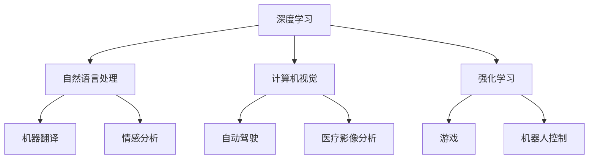

                 

# Andrej Karpathy：人工智能的未来发展方向

> 关键词：人工智能、深度学习、自然语言处理、计算机视觉、强化学习、自动驾驶、神经网络

> 摘要：本文将深入探讨人工智能领域的未来发展方向，通过分析当前的技术趋势和挑战，结合Andrej Karpathy的观点，探讨深度学习、自然语言处理、计算机视觉、强化学习等领域的最新进展。我们将从技术原理、实际应用、未来趋势等多个角度进行详细分析，旨在为读者提供一个全面而深入的理解。

## 1. 背景介绍

### 1.1 人工智能的发展历程
人工智能（AI）自20世纪50年代诞生以来，经历了多次高潮和低谷。近年来，随着计算能力的提升、大数据的普及以及算法的创新，AI迎来了前所未有的发展机遇。特别是深度学习技术的突破，使得机器在图像识别、语音识别、自然语言处理等领域取得了显著成果。

### 1.2 Andrej Karpathy的贡献
Andrej Karpathy是特斯拉公司的AI总监，同时也是斯坦福大学的客座教授。他在深度学习领域有着丰富的研究和实践经验，特别是在自然语言处理和计算机视觉方面做出了重要贡献。Karpathy的观点和见解对于理解AI的未来发展方向具有重要参考价值。

## 2. 核心概念与联系

### 2.1 深度学习
深度学习是机器学习的一个分支，通过多层神经网络来模拟人脑的处理过程。其核心在于利用大量的数据训练模型，从而实现对复杂模式的识别和预测。

### 2.2 自然语言处理
自然语言处理（NLP）是AI的一个重要分支，旨在使计算机能够理解、生成和处理人类语言。NLP技术广泛应用于机器翻译、情感分析、问答系统等领域。

### 2.3 计算机视觉
计算机视觉是AI领域的一个重要分支，旨在使计算机能够理解和解释图像和视频。计算机视觉技术在自动驾驶、医疗影像分析、安全监控等领域有着广泛的应用。

### 2.4 强化学习
强化学习是一种通过试错来学习最优策略的方法。它通过与环境的交互来优化决策过程，广泛应用于游戏、机器人控制等领域。

### 2.5 Mermaid流程图


## 3. 核心算法原理 & 具体操作步骤

### 3.1 深度学习算法原理
深度学习的核心在于构建多层神经网络，通过反向传播算法优化权重。具体步骤如下：

1. **数据预处理**：对原始数据进行清洗、归一化等预处理。
2. **构建模型**：设计多层神经网络结构，包括输入层、隐藏层和输出层。
3. **训练模型**：使用反向传播算法优化模型参数，通过大量数据进行训练。
4. **评估模型**：使用验证集评估模型性能，调整超参数以提高准确率。

### 3.2 自然语言处理算法原理
自然语言处理的核心在于将人类语言转化为计算机可以理解的形式。具体步骤如下：

1. **文本预处理**：进行分词、去除停用词等预处理。
2. **特征提取**：使用词袋模型、TF-IDF等方法提取文本特征。
3. **模型训练**：使用分类器（如SVM、LR）进行训练。
4. **模型评估**：使用准确率、召回率等指标评估模型性能。

### 3.3 计算机视觉算法原理
计算机视觉的核心在于从图像中提取特征并进行分类或识别。具体步骤如下：

1. **图像预处理**：进行灰度化、归一化等预处理。
2. **特征提取**：使用卷积神经网络（CNN）提取图像特征。
3. **模型训练**：使用反向传播算法优化模型参数。
4. **模型评估**：使用准确率、召回率等指标评估模型性能。

### 3.4 强化学习算法原理
强化学习的核心在于通过试错来学习最优策略。具体步骤如下：

1. **环境建模**：定义状态空间、动作空间和奖励函数。
2. **策略选择**：选择探索或利用策略。
3. **执行动作**：根据当前策略执行动作。
4. **接收奖励**：根据执行结果接收奖励。
5. **更新策略**：根据奖励更新策略。

## 4. 数学模型和公式 & 详细讲解 & 举例说明

### 4.1 深度学习数学模型
深度学习的核心在于构建多层神经网络，其数学模型可以表示为：

$$
f(x) = \sigma(W_1 \sigma(W_2 \cdots \sigma(W_n x + b_n) + b_{n-1}) \cdots + b_2) + b_1
$$

其中，$x$是输入，$W_i$和$b_i$是权重和偏置，$\sigma$是激活函数。

### 4.2 自然语言处理数学模型
自然语言处理的核心在于将文本转化为向量表示，其数学模型可以表示为：

$$
\text{Word Embedding} = \text{Word2Vec}(w)
$$

其中，$w$是单词，$\text{Word2Vec}$是词嵌入模型。

### 4.3 计算机视觉数学模型
计算机视觉的核心在于从图像中提取特征，其数学模型可以表示为：

$$
\text{Feature Map} = \text{CNN}(I)
$$

其中，$I$是输入图像，$\text{CNN}$是卷积神经网络。

### 4.4 强化学习数学模型
强化学习的核心在于通过试错来学习最优策略，其数学模型可以表示为：

$$
Q(s, a) = Q(s, a) + \alpha [r + \gamma \max_{a'} Q(s', a') - Q(s, a)]
$$

其中，$Q(s, a)$是状态动作值函数，$\alpha$是学习率，$\gamma$是折扣因子，$r$是奖励，$s$和$s'$是状态，$a$和$a'$是动作。

## 5. 项目实战：代码实际案例和详细解释说明

### 5.1 开发环境搭建
为了进行深度学习项目，我们需要搭建一个合适的开发环境。具体步骤如下：

1. **安装Python**：确保安装了最新版本的Python。
2. **安装深度学习库**：使用pip安装TensorFlow或PyTorch等深度学习库。
3. **安装数据处理库**：使用pandas、numpy等库进行数据处理。
4. **安装可视化库**：使用matplotlib、seaborn等库进行数据可视化。

### 5.2 源代码详细实现和代码解读
以下是一个简单的深度学习模型实现示例：

```python
import tensorflow as tf
from tensorflow.keras import layers, models

# 定义模型
model = models.Sequential([
    layers.Dense(64, activation='relu', input_shape=(100,)),
    layers.Dense(64, activation='relu'),
    layers.Dense(10, activation='softmax')
])

# 编译模型
model.compile(optimizer='adam',
              loss='sparse_categorical_crossentropy',
              metrics=['accuracy'])

# 训练模型
model.fit(x_train, y_train, epochs=10, validation_data=(x_val, y_val))

# 评估模型
test_loss, test_acc = model.evaluate(x_test, y_test)
print(f'Test accuracy: {test_acc}')
```

### 5.3 代码解读与分析
- **模型定义**：使用`Sequential`模型定义了一个三层神经网络，每层包含64个神经元，激活函数为ReLU。
- **编译模型**：使用Adam优化器和稀疏分类交叉熵损失函数进行编译。
- **训练模型**：使用训练数据进行10轮训练，并使用验证数据进行验证。
- **评估模型**：使用测试数据评估模型性能。

## 6. 实际应用场景

### 6.1 自然语言处理应用
自然语言处理技术广泛应用于机器翻译、情感分析、问答系统等领域。例如，Google Translate使用深度学习技术实现了高质量的机器翻译。

### 6.2 计算机视觉应用
计算机视觉技术在自动驾驶、医疗影像分析、安全监控等领域有着广泛的应用。例如，特斯拉的Autopilot系统使用计算机视觉技术实现自动驾驶。

### 6.3 强化学习应用
强化学习技术在游戏、机器人控制等领域有着广泛的应用。例如，DeepMind的AlphaGo使用强化学习技术实现了围棋的顶级水平。

## 7. 工具和资源推荐

### 7.1 学习资源推荐
- **书籍**：《深度学习》（Ian Goodfellow, Yoshua Bengio, Aaron Courville）
- **论文**：《Attention Is All You Need》（Vaswani et al.）
- **博客**：Andrej Karpathy的博客（https://karpathy.github.io/）
- **网站**：TensorFlow官网（https://www.tensorflow.org/）

### 7.2 开发工具框架推荐
- **深度学习框架**：TensorFlow、PyTorch
- **数据处理库**：pandas、numpy
- **可视化库**：matplotlib、seaborn

### 7.3 相关论文著作推荐
- **论文**：《Attention Is All You Need》（Vaswani et al.）
- **著作**：《深度学习》（Ian Goodfellow, Yoshua Bengio, Aaron Courville）

## 8. 总结：未来发展趋势与挑战

### 8.1 未来发展趋势
- **技术融合**：深度学习、自然语言处理、计算机视觉等技术将进一步融合，实现更复杂的应用。
- **自动化**：自动化将成为AI领域的重要趋势，通过自动化工具提高开发效率。
- **伦理与隐私**：随着AI技术的广泛应用，伦理和隐私问题将成为重要挑战。

### 8.2 挑战
- **数据隐私**：如何保护用户数据隐私成为一个重要问题。
- **算法公平性**：如何确保算法的公平性，避免偏见和歧视。
- **计算资源**：如何降低计算资源消耗，提高模型的可扩展性。

## 9. 附录：常见问题与解答

### 9.1 问题1：如何选择合适的深度学习框架？
- **解答**：选择合适的深度学习框架需要考虑项目需求、团队熟悉度和社区支持等因素。TensorFlow和PyTorch是目前最流行的两个框架，可以根据具体需求进行选择。

### 9.2 问题2：如何提高模型的泛化能力？
- **解答**：提高模型的泛化能力可以通过增加数据量、使用正则化技术、进行数据增强等方法实现。

## 10. 扩展阅读 & 参考资料

- **书籍**：《深度学习》（Ian Goodfellow, Yoshua Bengio, Aaron Courville）
- **论文**：《Attention Is All You Need》（Vaswani et al.）
- **博客**：Andrej Karpathy的博客（https://karpathy.github.io/）
- **网站**：TensorFlow官网（https://www.tensorflow.org/）

---

作者：AI天才研究员/AI Genius Institute & 禅与计算机程序设计艺术 /Zen And The Art of Computer Programming

