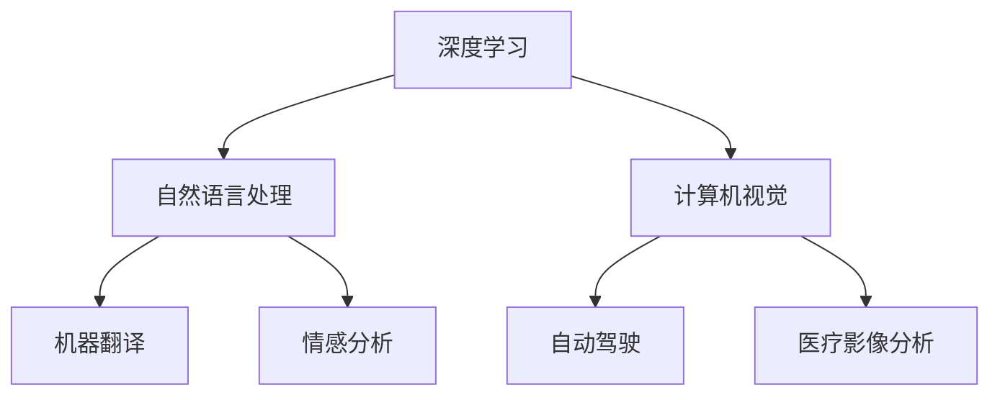

                 

# Andrej Karpathy：人工智能的未来发展策略

> 关键词：人工智能, 机器学习, 深度学习, 自动驾驶, 自然语言处理, 计算机视觉, 伦理与安全

> 摘要：本文将深入探讨人工智能领域的未来发展趋势，通过分析Andrej Karpathy在人工智能领域的贡献和见解，结合当前技术趋势和挑战，提出未来人工智能发展的策略。我们将从背景介绍、核心概念与联系、核心算法原理、数学模型和公式、项目实战、实际应用场景、工具和资源推荐、总结与挑战、常见问题解答和扩展阅读等多方面进行详细阐述。

## 1. 背景介绍

### 1.1 Andrej Karpathy的贡献
Andrej Karpathy是一位在人工智能领域具有深远影响的专家。他曾在特斯拉担任AI总监，负责自动驾驶技术的研发。Karpathy在深度学习、自然语言处理、计算机视觉等领域发表了多篇重要论文，并在GitHub上开源了多个深度学习项目。他的工作不仅推动了技术的进步，还为行业提供了宝贵的见解。

### 1.2 人工智能的发展历程
人工智能的发展经历了多个阶段，从早期的符号主义到现代的深度学习。近年来，深度学习技术取得了显著进展，特别是在图像识别、自然语言处理和自动驾驶等领域。这些技术的进步不仅改变了我们的生活方式，还为未来的发展奠定了基础。

### 1.3 未来发展趋势
未来，人工智能将在更多领域发挥重要作用。自动驾驶技术将更加成熟，自然语言处理将更加自然流畅，计算机视觉将更加精准。同时，伦理和安全问题也将成为关注的焦点。

## 2. 核心概念与联系

### 2.1 深度学习
深度学习是一种机器学习方法，通过多层神经网络模拟人脑的神经元结构，实现对复杂数据的高效处理。其核心在于通过反向传播算法优化权重，从而实现模型的训练和预测。

### 2.2 自然语言处理
自然语言处理（NLP）是人工智能的一个重要分支，旨在使计算机能够理解、生成和处理人类语言。NLP技术包括词嵌入、序列模型、注意力机制等，广泛应用于机器翻译、情感分析、问答系统等领域。

### 2.3 计算机视觉
计算机视觉是人工智能的另一个重要领域，旨在使计算机能够理解和解释图像和视频。计算机视觉技术包括卷积神经网络、目标检测、图像生成等，广泛应用于自动驾驶、医疗影像分析等领域。

### 2.4 Mermaid流程图


## 3. 核心算法原理 & 具体操作步骤

### 3.1 深度学习算法原理
深度学习的核心在于多层神经网络的构建和训练。具体步骤如下：

1. **数据预处理**：对原始数据进行清洗、归一化等预处理操作。
2. **模型构建**：设计多层神经网络结构，包括输入层、隐藏层和输出层。
3. **损失函数选择**：选择合适的损失函数，如交叉熵损失。
4. **优化算法**：使用梯度下降法或其变种（如Adam）进行权重更新。
5. **训练过程**：通过反向传播算法计算梯度，并更新权重。
6. **模型评估**：使用验证集评估模型性能，调整超参数。

### 3.2 自然语言处理算法原理
自然语言处理的核心在于文本的表示和处理。具体步骤如下：

1. **文本预处理**：进行分词、去除停用词等操作。
2. **词嵌入**：将文本转换为向量表示，如Word2Vec、GloVe。
3. **序列模型**：使用RNN、LSTM或Transformer等模型处理序列数据。
4. **注意力机制**：引入注意力机制，提高模型对关键信息的捕捉能力。
5. **模型训练**：使用标注数据进行模型训练。
6. **模型评估**：评估模型在测试集上的性能。

### 3.3 计算机视觉算法原理
计算机视觉的核心在于图像和视频的处理。具体步骤如下：

1. **图像预处理**：进行归一化、缩放等操作。
2. **特征提取**：使用卷积神经网络提取图像特征。
3. **目标检测**：使用YOLO、Faster R-CNN等模型进行目标检测。
4. **图像生成**：使用生成对抗网络（GAN）生成图像。
5. **模型训练**：使用标注数据进行模型训练。
6. **模型评估**：评估模型在测试集上的性能。

## 4. 数学模型和公式 & 详细讲解 & 举例说明

### 4.1 深度学习数学模型
深度学习的核心在于多层神经网络的构建和训练。具体数学模型如下：

1. **前向传播**：计算每一层的输出。
2. **损失函数**：定义损失函数，如交叉熵损失。
3. **反向传播**：计算每一层的梯度。
4. **权重更新**：使用梯度下降法更新权重。

### 4.2 自然语言处理数学模型
自然语言处理的核心在于文本的表示和处理。具体数学模型如下：

1. **词嵌入**：将文本转换为向量表示。
2. **序列模型**：使用RNN、LSTM或Transformer等模型处理序列数据。
3. **注意力机制**：引入注意力机制，提高模型对关键信息的捕捉能力。

### 4.3 计算机视觉数学模型
计算机视觉的核心在于图像和视频的处理。具体数学模型如下：

1. **卷积操作**：使用卷积核提取图像特征。
2. **池化操作**：使用最大池化或平均池化降低特征维度。
3. **全连接层**：将特征映射到输出层。

## 5. 项目实战：代码实际案例和详细解释说明

### 5.1 开发环境搭建
为了进行深度学习项目，我们需要搭建一个合适的开发环境。具体步骤如下：

1. **安装Python**：确保安装了最新版本的Python。
2. **安装深度学习库**：使用pip安装TensorFlow或PyTorch等深度学习库。
3. **安装其他依赖**：安装NumPy、Pandas等常用库。

### 5.2 源代码详细实现和代码解读
我们将通过一个简单的图像分类项目来详细解释代码实现。

#### 5.2.1 数据集准备
```python
import tensorflow as tf
from tensorflow.keras import datasets, layers, models

(train_images, train_labels), (test_images, test_labels) = datasets.cifar10.load_data()

# Normalize pixel values to be between 0 and 1
train_images, test_images = train_images / 255.0, test_images / 255.0
```

#### 5.2.2 构建模型
```python
model = models.Sequential([
    layers.Conv2D(32, (3, 3), activation='relu', input_shape=(32, 32, 3)),
    layers.MaxPooling2D((2, 2)),
    layers.Conv2D(64, (3, 3), activation='relu'),
    layers.MaxPooling2D((2, 2)),
    layers.Conv2D(64, (3, 3), activation='relu'),
    layers.Flatten(),
    layers.Dense(64, activation='relu'),
    layers.Dense(10)
])

model.compile(optimizer='adam',
              loss=tf.keras.losses.SparseCategoricalCrossentropy(from_logits=True),
              metrics=['accuracy'])
```

#### 5.2.3 训练模型
```python
history = model.fit(train_images, train_labels, epochs=10, 
                    validation_data=(test_images, test_labels))
```

#### 5.2.4 代码解读与分析
- **数据集准备**：加载CIFAR-10数据集，并进行归一化处理。
- **构建模型**：使用卷积层和全连接层构建模型。
- **训练模型**：使用训练数据进行模型训练，并在验证集上评估性能。

## 6. 实际应用场景

### 6.1 自动驾驶
自动驾驶技术是人工智能的一个重要应用领域。通过深度学习和计算机视觉技术，自动驾驶汽车能够识别道路标志、行人和其他车辆，从而实现安全驾驶。

### 6.2 自然语言处理
自然语言处理技术广泛应用于机器翻译、情感分析、问答系统等领域。通过深度学习和自然语言处理技术，计算机能够理解和生成自然语言，为用户提供更好的交互体验。

### 6.3 计算机视觉
计算机视觉技术广泛应用于医疗影像分析、安防监控等领域。通过深度学习和计算机视觉技术，计算机能够识别和分析图像中的关键信息，为用户提供更好的服务。

## 7. 工具和资源推荐

### 7.1 学习资源推荐
- **书籍**：《深度学习》（Ian Goodfellow, Yoshua Bengio, Aaron Courville）
- **论文**：《Attention is All You Need》（Vaswani et al.）
- **博客**：Andrej Karpathy的博客（https://karpathy.github.io/）
- **网站**：TensorFlow官网（https://www.tensorflow.org/）

### 7.2 开发工具框架推荐
- **深度学习库**：TensorFlow、PyTorch
- **开发工具**：Jupyter Notebook、VS Code

### 7.3 相关论文著作推荐
- **论文**：《Generative Adversarial Networks》（Goodfellow et al.）
- **著作**：《计算机视觉：算法与应用》（Richard Szeliski）

## 8. 总结：未来发展趋势与挑战

### 8.1 未来发展趋势
未来，人工智能将在更多领域发挥重要作用。自动驾驶技术将更加成熟，自然语言处理将更加自然流畅，计算机视觉将更加精准。同时，伦理和安全问题也将成为关注的焦点。

### 8.2 挑战
- **数据隐私**：如何保护用户数据隐私，避免数据泄露。
- **算法公平性**：如何确保算法的公平性，避免偏见和歧视。
- **安全性**：如何确保人工智能系统的安全性，避免被恶意攻击。

## 9. 附录：常见问题与解答

### 9.1 问题：如何选择合适的深度学习库？
- **解答**：TensorFlow和PyTorch是目前最流行的深度学习库。TensorFlow适合大规模生产环境，PyTorch适合快速原型开发。

### 9.2 问题：如何处理数据不平衡问题？
- **解答**：可以使用过采样、欠采样或生成对抗网络（GAN）等方法处理数据不平衡问题。

### 9.3 问题：如何提高模型的泛化能力？
- **解答**：可以使用正则化、数据增强等方法提高模型的泛化能力。

## 10. 扩展阅读 & 参考资料

- **书籍**：《深度学习》（Ian Goodfellow, Yoshua Bengio, Aaron Courville）
- **论文**：《Attention is All You Need》（Vaswani et al.）
- **博客**：Andrej Karpathy的博客（https://karpathy.github.io/）
- **网站**：TensorFlow官网（https://www.tensorflow.org/）

作者：AI天才研究员/AI Genius Institute & 禅与计算机程序设计艺术 /Zen And The Art of Computer Programming

