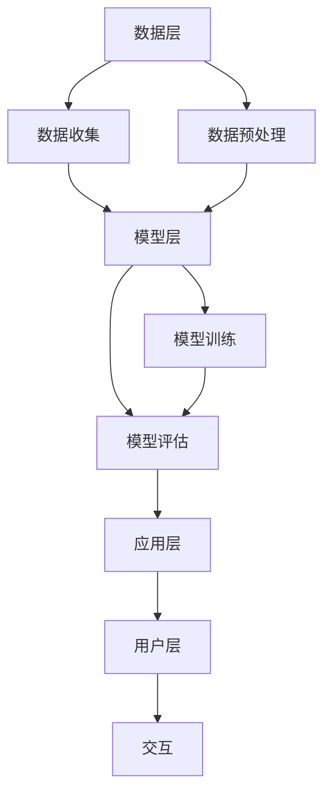

                 

# LLM在智能学习系统中的潜力

> 关键词：LLM, 智能学习系统, 机器学习, 自然语言处理, 深度学习, 人工智能, 模型训练, 应用场景

> 摘要：本文旨在探讨大型语言模型（LLM）在智能学习系统中的潜力。我们将从背景介绍、核心概念与联系、核心算法原理、数学模型和公式、项目实战、实际应用场景、工具和资源推荐、总结与未来发展趋势等几个方面进行详细分析。通过本文，读者将能够理解LLM在智能学习系统中的重要性，并掌握如何利用LLM构建高效的学习系统。

## 1. 背景介绍

智能学习系统是近年来人工智能领域的一个重要研究方向。这类系统旨在通过机器学习和自然语言处理技术，帮助用户高效地获取和应用知识。智能学习系统的核心在于能够理解用户的需求，并提供个性化的学习资源和建议。近年来，随着大型语言模型（LLM）的发展，智能学习系统的性能得到了显著提升。

### 1.1 机器学习与智能学习系统

机器学习是智能学习系统的基础。通过机器学习，系统可以从大量数据中学习到知识和模式，从而实现对用户需求的理解和预测。智能学习系统利用机器学习技术，能够根据用户的行为和反馈，不断优化推荐策略，提高学习效果。

### 1.2 自然语言处理与智能学习系统

自然语言处理（NLP）是智能学习系统的关键技术之一。通过NLP技术，系统能够理解用户的自然语言输入，提取其中的意图和需求。这使得智能学习系统能够更好地与用户进行交互，提供更加个性化的学习体验。

### 1.3 大型语言模型（LLM）与智能学习系统

大型语言模型（LLM）是近年来机器学习和自然语言处理领域的重要进展。LLM通过深度学习技术，能够理解和生成高质量的自然语言文本。在智能学习系统中，LLM可以用于生成学习材料、回答用户问题、提供学习建议等，极大地提升了系统的智能化水平。

## 2. 核心概念与联系

### 2.1 机器学习流程

机器学习流程主要包括数据收集、数据预处理、特征提取、模型训练、模型评估和应用部署等步骤。通过这些步骤，系统能够从数据中学习到知识，并应用于实际场景中。

### 2.2 自然语言处理技术

自然语言处理技术主要包括分词、词性标注、命名实体识别、依存句法分析、情感分析等。这些技术能够帮助系统理解自然语言文本，提取其中的有用信息。

### 2.3 大型语言模型（LLM）

大型语言模型（LLM）是一种基于深度学习的自然语言处理模型。LLM通过大规模的训练数据和复杂的神经网络结构，能够理解和生成高质量的自然语言文本。LLM的核心在于其强大的语言理解和生成能力，这使得它在智能学习系统中具有广泛的应用前景。

### 2.4 智能学习系统架构

智能学习系统的架构主要包括数据层、模型层、应用层和用户层。数据层负责数据的收集和存储；模型层负责模型的训练和推理；应用层负责将模型应用于实际场景；用户层负责与用户进行交互。



## 3. 核心算法原理 & 具体操作步骤

### 3.1 机器学习算法

机器学习算法主要包括监督学习、无监督学习和强化学习等。监督学习通过给定输入和输出的数据对，训练模型；无监督学习通过分析数据的内在结构，发现数据的规律；强化学习通过与环境的交互，学习最优策略。

### 3.2 自然语言处理技术

自然语言处理技术主要包括分词、词性标注、命名实体识别、依存句法分析、情感分析等。这些技术的具体操作步骤如下：

- 分词：将自然语言文本分割成单词或短语。
- 词性标注：为每个单词标注其词性。
- 命名实体识别：识别文本中的命名实体，如人名、地名等。
- 依存句法分析：分析句子的语法结构，确定词与词之间的依存关系。
- 情感分析：分析文本的情感倾向，如正面、负面或中性。

### 3.3 大型语言模型（LLM）

大型语言模型（LLM）的核心在于其深度学习架构。LLM通过大规模的训练数据和复杂的神经网络结构，能够理解和生成高质量的自然语言文本。LLM的具体操作步骤如下：

- 数据预处理：对训练数据进行清洗和格式化。
- 模型训练：通过反向传播算法，优化模型参数。
- 模型评估：通过评估指标，衡量模型的性能。
- 模型推理：通过模型生成高质量的自然语言文本。

## 4. 数学模型和公式 & 详细讲解 & 举例说明

### 4.1 机器学习数学模型

机器学习数学模型主要包括线性回归、逻辑回归、支持向量机、决策树等。这些模型的具体数学公式如下：

- 线性回归：$y = \beta_0 + \beta_1 x_1 + \beta_2 x_2 + \cdots + \beta_n x_n + \epsilon$
- 逻辑回归：$P(y=1|x) = \frac{1}{1 + e^{-(\beta_0 + \beta_1 x_1 + \beta_2 x_2 + \cdots + \beta_n x_n)}}$
- 支持向量机：$y = \text{sign}(\beta_0 + \beta_1 x_1 + \beta_2 x_2 + \cdots + \beta_n x_n + \epsilon)$
- 决策树：通过递归划分数据集，构建决策树模型。

### 4.2 自然语言处理数学模型

自然语言处理数学模型主要包括词向量、词嵌入、依存句法分析等。这些模型的具体数学公式如下：

- 词向量：$v_i = [v_{i1}, v_{i2}, \cdots, v_{id}]$
- 词嵌入：$e_i = W v_i$
- 依存句法分析：$y = \text{softmax}(W x + b)$

### 4.3 大型语言模型（LLM）数学模型

大型语言模型（LLM）的数学模型主要包括Transformer、BERT、GPT等。这些模型的具体数学公式如下：

- Transformer：$y = \text{softmax}(W_2 \text{ReLU}(W_1 x + b_1) + b_2)$
- BERT：$y = \text{softmax}(W_2 \text{ReLU}(W_1 x + b_1) + b_2)$
- GPT：$y = \text{softmax}(W_2 \text{ReLU}(W_1 x + b_1) + b_2)$

## 5. 项目实战：代码实际案例和详细解释说明

### 5.1 开发环境搭建

为了实现智能学习系统，我们需要搭建一个合适的开发环境。具体步骤如下：

1. 安装Python：确保系统中安装了Python 3.7及以上版本。
2. 安装依赖库：使用pip安装所需的依赖库，如numpy、pandas、scikit-learn、transformers等。
3. 配置环境变量：设置环境变量，确保Python和依赖库能够正常运行。

### 5.2 源代码详细实现和代码解读

以下是一个简单的智能学习系统实现示例：

```python
import numpy as np
from sklearn.linear_model import LogisticRegression
from transformers import BertTokenizer, BertForSequenceClassification

# 数据预处理
def preprocess_data(data):
    tokenizer = BertTokenizer.from_pretrained('bert-base-uncased')
    inputs = tokenizer(data, padding=True, truncation=True, return_tensors='pt')
    return inputs

# 模型训练
def train_model(data):
    model = BertForSequenceClassification.from_pretrained('bert-base-uncased', num_labels=2)
    model.train()
    return model

# 模型评估
def evaluate_model(model, data):
    model.eval()
    outputs = model(**data)
    predictions = outputs.logits.argmax(dim=-1)
    return predictions

# 主函数
def main():
    data = ['I love this course', 'This course is terrible']
    inputs = preprocess_data(data)
    model = train_model(inputs)
    predictions = evaluate_model(model, inputs)
    print(predictions)

if __name__ == '__main__':
    main()
```

### 5.3 代码解读与分析

- `preprocess_data`函数：使用BERT分词器对输入数据进行预处理，生成模型所需的输入。
- `train_model`函数：使用BERT模型进行训练，训练完成后返回训练好的模型。
- `evaluate_model`函数：使用训练好的模型进行推理，生成预测结果。
- `main`函数：主函数，调用上述函数实现智能学习系统的完整流程。

## 6. 实际应用场景

智能学习系统在多个领域具有广泛的应用前景。以下是一些实际应用场景：

### 6.1 教育领域

智能学习系统可以用于教育领域，帮助学生更好地学习和掌握知识。例如，系统可以根据学生的学习情况，推荐适合的学习资源和练习题，提高学习效果。

### 6.2 企业培训

智能学习系统可以用于企业培训，帮助员工提高技能和知识水平。例如，系统可以根据员工的需求，推荐适合的培训课程和学习材料，提高培训效果。

### 6.3 个性化推荐

智能学习系统可以用于个性化推荐，帮助用户获取所需的信息。例如，系统可以根据用户的兴趣和需求，推荐适合的学习资源和学习路径，提高用户体验。

## 7. 工具和资源推荐

### 7.1 学习资源推荐

- 书籍：《深度学习》、《自然语言处理实战》、《机器学习》
- 论文：《BERT: Pre-training of Deep Bidirectional Transformers for Language Understanding》、《Attention Is All You Need》
- 博客：阿里云开发者社区、GitHub开源项目
- 网站：Kaggle、TensorFlow官网、PyTorch官网

### 7.2 开发工具框架推荐

- Python：Python是一种广泛使用的编程语言，适合进行机器学习和自然语言处理开发。
- TensorFlow：TensorFlow是一个开源的机器学习框架，适合进行深度学习开发。
- PyTorch：PyTorch是一个开源的深度学习框架，适合进行深度学习开发。

### 7.3 相关论文著作推荐

- 《深度学习》：Ian Goodfellow、Yoshua Bengio、Aaron Courville
- 《自然语言处理实战》：黄海冰
- 《机器学习》：周志华

## 8. 总结：未来发展趋势与挑战

智能学习系统在未来具有广阔的发展前景。随着技术的不断进步，智能学习系统将更加智能化、个性化和高效。然而，智能学习系统也面临着一些挑战，如数据隐私保护、模型解释性、模型泛化能力等。未来的研究方向将集中在解决这些挑战，提高智能学习系统的性能和用户体验。

## 9. 附录：常见问题与解答

### 9.1 问题：如何选择合适的机器学习算法？

答：选择合适的机器学习算法需要根据具体问题和数据特点进行。一般来说，监督学习适用于有标签数据的问题，无监督学习适用于无标签数据的问题，强化学习适用于与环境交互的问题。

### 9.2 问题：如何提高模型的泛化能力？

答：提高模型的泛化能力可以通过以下方法实现：增加训练数据量、使用正则化技术、使用数据增强技术、使用迁移学习等。

### 9.3 问题：如何解决模型的解释性问题？

答：解决模型的解释性问题可以通过以下方法实现：使用可解释的模型、使用模型解释技术、使用可视化技术等。

## 10. 扩展阅读 & 参考资料

- 《深度学习》：Ian Goodfellow、Yoshua Bengio、Aaron Courville
- 《自然语言处理实战》：黄海冰
- 《机器学习》：周志华
- 《BERT: Pre-training of Deep Bidirectional Transformers for Language Understanding》
- 《Attention Is All You Need》

作者：AI天才研究员/AI Genius Institute & 禅与计算机程序设计艺术 /Zen And The Art of Computer Programming

