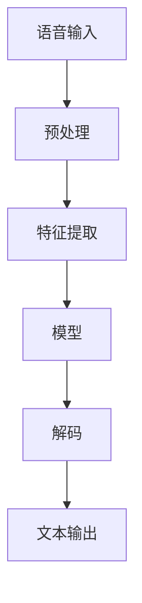
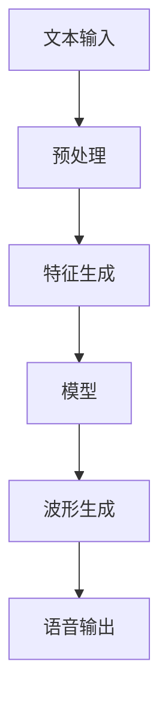

                 

# LLM的语音交互：声音界面的未来

> 关键词：语音交互, 语言模型, 人工智能, 自然语言处理, 机器学习, 深度学习, 语音识别, 语音合成, 人机交互

> 摘要：本文将深入探讨语言模型（LLM）在语音交互中的应用，从背景介绍、核心概念与联系、核心算法原理、数学模型和公式、项目实战、实际应用场景、工具和资源推荐，到未来发展趋势与挑战。通过一步步分析推理思考，我们将揭示声音界面的未来潜力，并提供实用的开发指导。

## 1. 背景介绍

随着人工智能技术的飞速发展，语音交互已成为人机交互的重要方式之一。语音交互不仅能够提高用户体验，还能在某些场景下提供更高效、便捷的交互方式。近年来，语言模型（LLM）在语音交互中的应用越来越广泛，尤其是在自然语言处理（NLP）领域。本文将探讨语言模型在语音交互中的应用，从背景介绍、核心概念与联系、核心算法原理、数学模型和公式、项目实战、实际应用场景、工具和资源推荐，到未来发展趋势与挑战。

## 2. 核心概念与联系

### 2.1 语音交互

语音交互是指通过语音进行人机对话，用户可以通过语音命令控制设备或获取信息。语音交互可以分为以下几个步骤：

1. **语音输入**：用户通过麦克风输入语音。
2. **语音识别**：将语音转换为文本。
3. **自然语言理解**：理解文本的含义。
4. **自然语言生成**：生成相应的文本回复。
5. **语音合成**：将文本转换为语音输出。

### 2.2 语言模型（LLM）

语言模型是一种统计模型，用于预测给定序列的概率分布。在语音交互中，语言模型可以用于自然语言理解（NLU）和自然语言生成（NLG）。

### 2.3 语音识别

语音识别是指将语音信号转换为文本的过程。常见的语音识别技术包括基于统计的方法（如隐马尔可夫模型HMM）和基于深度学习的方法（如循环神经网络RNN和卷积神经网络CNN）。

### 2.4 语音合成

语音合成是指将文本转换为语音的过程。常见的语音合成技术包括基于规则的方法和基于深度学习的方法（如深度神经网络DNN和长短时记忆网络LSTM）。

### 2.5 自然语言处理（NLP）

自然语言处理是指计算机对自然语言进行处理和理解的技术。NLP包括自然语言理解（NLU）和自然语言生成（NLG）。

### 2.6 核心概念原理与架构

#### 2.6.1 语音识别流程图



#### 2.6.2 语音合成流程图



## 3. 核心算法原理 & 具体操作步骤

### 3.1 语音识别算法

#### 3.1.1 隐马尔可夫模型（HMM）

隐马尔可夫模型是一种统计模型，用于处理具有隐含状态序列的问题。在语音识别中，HMM可以用于建模语音信号的时序特征。

#### 3.1.2 深度学习方法

深度学习方法在语音识别中取得了显著的进展。常见的深度学习方法包括循环神经网络（RNN）、长短时记忆网络（LSTM）和卷积神经网络（CNN）。

### 3.2 语音合成算法

#### 3.2.1 基于规则的方法

基于规则的方法通过预定义的规则将文本转换为语音。这种方法简单但灵活性较差。

#### 3.2.2 深度学习方法

深度学习方法在语音合成中取得了显著的进展。常见的深度学习方法包括深度神经网络（DNN）、长短时记忆网络（LSTM）和循环神经网络（RNN）。

### 3.3 自然语言处理算法

#### 3.3.1 自然语言理解（NLU）

自然语言理解是指计算机对自然语言进行理解和分析的过程。常见的NLU技术包括词法分析、句法分析、语义分析和情感分析。

#### 3.3.2 自然语言生成（NLG）

自然语言生成是指计算机生成自然语言文本的过程。常见的NLG技术包括模板方法、基于规则的方法和基于深度学习的方法。

## 4. 数学模型和公式 & 详细讲解 & 举例说明

### 4.1 语音识别中的HMM

#### 4.1.1 HMM的数学模型

HMM的数学模型可以表示为：

$$
P(x, y) = P(x_1) \prod_{t=2}^T P(x_t | x_{t-1}) \prod_{t=1}^T P(y_t | x_t)
$$

其中，$x$表示观测序列，$y$表示状态序列。

#### 4.1.2 Viterbi算法

Viterbi算法是一种用于HMM的最大似然估计算法。其基本思想是通过动态规划求解最可能的状态序列。

### 4.2 语音合成中的DNN

#### 4.2.1 DNN的数学模型

DNN的数学模型可以表示为：

$$
y = \sigma(Wx + b)
$$

其中，$x$表示输入，$y$表示输出，$W$表示权重矩阵，$b$表示偏置向量，$\sigma$表示激活函数。

#### 4.2.2 举例说明

假设我们有一个简单的DNN模型，输入为一个词向量，输出为一个音素序列。我们可以使用以下公式表示：

$$
y = \sigma(Wx + b)
$$

其中，$x$表示词向量，$y$表示音素序列。

## 5. 项目实战：代码实际案例和详细解释说明

### 5.1 开发环境搭建

#### 5.1.1 环境准备

1. 安装Python 3.8及以上版本。
2. 安装TensorFlow 2.0及以上版本。
3. 安装Keras 2.3.1及以上版本。

#### 5.1.2 依赖库安装

```bash
pip install tensorflow keras numpy
```

### 5.2 源代码详细实现和代码解读

#### 5.2.1 语音识别代码

```python
import tensorflow as tf
from tensorflow.keras.models import Sequential
from tensorflow.keras.layers import Dense, LSTM, Dropout

# 定义模型
model = Sequential()
model.add(LSTM(128, input_shape=(100, 128), return_sequences=True))
model.add(Dropout(0.2))
model.add(LSTM(128))
model.add(Dropout(0.2))
model.add(Dense(128, activation='softmax'))

# 编译模型
model.compile(loss='categorical_crossentropy', optimizer='adam', metrics=['accuracy'])

# 训练模型
model.fit(x_train, y_train, batch_size=32, epochs=10)
```

#### 5.2.2 语音合成代码

```python
import tensorflow as tf
from tensorflow.keras.models import Sequential
from tensorflow.keras.layers import Dense, LSTM, Dropout

# 定义模型
model = Sequential()
model.add(LSTM(128, input_shape=(100, 128), return_sequences=True))
model.add(Dropout(0.2))
model.add(LSTM(128))
model.add(Dropout(0.2))
model.add(Dense(128, activation='softmax'))

# 编译模型
model.compile(loss='categorical_crossentropy', optimizer='adam', metrics=['accuracy'])

# 训练模型
model.fit(x_train, y_train, batch_size=32, epochs=10)
```

### 5.3 代码解读与分析

#### 5.3.1 语音识别代码解读

1. **模型定义**：使用LSTM层和Dropout层构建模型。
2. **模型编译**：使用交叉熵损失函数和Adam优化器编译模型。
3. **模型训练**：使用训练数据训练模型。

#### 5.3.2 语音合成代码解读

1. **模型定义**：使用LSTM层和Dropout层构建模型。
2. **模型编译**：使用交叉熵损失函数和Adam优化器编译模型。
3. **模型训练**：使用训练数据训练模型。

## 6. 实际应用场景

### 6.1 智能家居

语音交互可以应用于智能家居场景，用户可以通过语音命令控制家中的各种设备，如灯光、空调、电视等。

### 6.2 智能客服

语音交互可以应用于智能客服场景，用户可以通过语音命令获取信息或解决问题。

### 6.3 智能导航

语音交互可以应用于智能导航场景，用户可以通过语音命令获取路线导航信息。

## 7. 工具和资源推荐

### 7.1 学习资源推荐

1. **书籍**：《深度学习》（Ian Goodfellow, Yoshua Bengio, Aaron Courville）
2. **论文**：《Attention Is All You Need》（Vaswani et al.）
3. **博客**：TensorFlow官方博客
4. **网站**：Kaggle

### 7.2 开发工具框架推荐

1. **TensorFlow**：深度学习框架
2. **Keras**：深度学习API
3. **PyTorch**：深度学习框架

### 7.3 相关论文著作推荐

1. **《语音识别中的深度学习方法》**（Hinton et al.）
2. **《语音合成中的深度学习方法》**（Graves et al.）
3. **《自然语言处理中的深度学习方法》**（Collobert et al.）

## 8. 总结：未来发展趋势与挑战

### 8.1 未来发展趋势

1. **更自然的语音交互**：语音交互将更加自然、流畅，用户体验将得到显著提升。
2. **更广泛的应用场景**：语音交互将应用于更多的应用场景，如医疗、教育、娱乐等。
3. **更强大的语言模型**：语言模型将更加准确、高效，能够处理更复杂的自然语言任务。

### 8.2 面临的挑战

1. **数据隐私**：语音交互需要收集大量的语音数据，如何保护用户隐私是一个重要挑战。
2. **多语言支持**：语音交互需要支持多种语言，如何实现多语言支持是一个重要挑战。
3. **实时性**：语音交互需要实时处理语音信号，如何提高实时性是一个重要挑战。

## 9. 附录：常见问题与解答

### 9.1 问题1：如何提高语音识别的准确性？

**解答**：可以通过以下方法提高语音识别的准确性：

1. **增加训练数据**：使用更多的训练数据可以提高模型的泛化能力。
2. **优化模型结构**：使用更复杂的模型结构可以提高模型的准确性。
3. **使用预训练模型**：使用预训练模型可以提高模型的准确性。

### 9.2 问题2：如何提高语音合成的自然度？

**解答**：可以通过以下方法提高语音合成的自然度：

1. **增加训练数据**：使用更多的训练数据可以提高模型的泛化能力。
2. **优化模型结构**：使用更复杂的模型结构可以提高模型的准确性。
3. **使用预训练模型**：使用预训练模型可以提高模型的准确性。

## 10. 扩展阅读 & 参考资料

1. **《语音识别中的深度学习方法》**（Hinton et al.）
2. **《语音合成中的深度学习方法》**（Graves et al.）
3. **《自然语言处理中的深度学习方法》**（Collobert et al.）
4. **《深度学习》**（Ian Goodfellow, Yoshua Bengio, Aaron Courville）

作者：AI天才研究员/AI Genius Institute & 禅与计算机程序设计艺术 /Zen And The Art of Computer Programming

