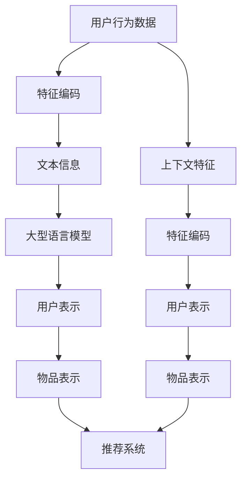

                 

# LLM驱动的特征编码：提升推荐系统表示学习质量

> 关键词：LLM、特征编码、推荐系统、表示学习、深度学习、自然语言处理、机器学习

> 摘要：本文旨在探讨如何利用大型语言模型（LLM）驱动的特征编码技术，提升推荐系统的表示学习质量。通过深入分析特征编码的基本原理，介绍核心算法及其操作步骤，并结合数学模型和实际代码案例，详细阐述如何在推荐系统中应用这一技术。最后，本文将探讨该技术的实际应用场景、相关工具和资源推荐，并展望未来的发展趋势与挑战。

## 1. 背景介绍

推荐系统在当今互联网时代扮演着至关重要的角色，它能够根据用户的历史行为和偏好，为用户提供个性化的内容推荐。然而，传统的推荐系统往往依赖于用户行为数据（如点击、评分等），这些数据虽然能够反映用户的部分偏好，但往往缺乏足够的上下文信息，导致推荐结果不够精准。近年来，随着自然语言处理（NLP）技术的发展，特别是大型语言模型（LLM）的出现，为推荐系统带来了新的机遇。通过将用户行为数据与文本信息相结合，可以构建更加丰富的用户画像，从而提升推荐系统的表示学习质量。

## 2. 核心概念与联系

### 2.1 特征编码

特征编码是指将原始数据转换为机器学习模型能够处理的数值表示形式的过程。在推荐系统中，特征编码通常包括用户特征、物品特征以及上下文特征的编码。通过有效的特征编码，可以更好地捕捉数据中的潜在模式和关联性，从而提高模型的预测性能。

### 2.2 大型语言模型（LLM）

大型语言模型是一种基于深度学习的模型，能够处理和生成自然语言文本。这些模型通常具有数十亿甚至数百亿的参数，能够学习到语言的复杂结构和语义信息。通过将用户行为数据与文本信息相结合，可以利用LLM的强大语言理解能力，提升推荐系统的表示学习质量。

### 2.3 表示学习

表示学习是指通过学习数据的低维表示，使得模型能够更好地捕捉数据中的潜在模式和关联性。在推荐系统中，表示学习的目标是将用户和物品映射到一个共享的低维空间中，从而实现更加精准的推荐。通过特征编码和LLM的结合，可以构建更加丰富的用户和物品表示，从而提升推荐系统的表示学习质量。

### 2.4 Mermaid 流程图



## 3. 核心算法原理 & 具体操作步骤

### 3.1 特征编码算法

特征编码算法通常包括以下步骤：

1. **数据预处理**：对原始数据进行清洗和标准化处理，确保数据的质量和一致性。
2. **特征选择**：根据业务需求和模型性能，选择合适的特征进行编码。
3. **特征编码**：将选择的特征转换为数值表示形式，常见的编码方法包括独热编码、标签编码等。
4. **特征融合**：将用户特征、物品特征和上下文特征进行融合，构建更加丰富的特征表示。

### 3.2 LLM驱动的特征编码

LLM驱动的特征编码算法通常包括以下步骤：

1. **文本预处理**：对文本数据进行清洗和标准化处理，确保文本的质量和一致性。
2. **文本编码**：利用LLM将文本数据转换为数值表示形式，常见的编码方法包括词嵌入、句子嵌入等。
3. **特征融合**：将文本编码结果与用户特征、物品特征和上下文特征进行融合，构建更加丰富的特征表示。

### 3.3 具体操作步骤

1. **数据预处理**：对用户行为数据和文本数据进行清洗和标准化处理。
2. **特征选择**：根据业务需求和模型性能，选择合适的特征进行编码。
3. **特征编码**：将选择的特征转换为数值表示形式，常见的编码方法包括独热编码、标签编码等。
4. **文本编码**：利用LLM将文本数据转换为数值表示形式，常见的编码方法包括词嵌入、句子嵌入等。
5. **特征融合**：将用户特征、物品特征、上下文特征和文本编码结果进行融合，构建更加丰富的特征表示。
6. **模型训练**：利用融合后的特征表示训练推荐系统模型。
7. **模型评估**：通过交叉验证等方法评估模型的性能。

## 4. 数学模型和公式 & 详细讲解 & 举例说明

### 4.1 特征编码数学模型

特征编码数学模型通常包括以下公式：

1. **独热编码**：将分类特征转换为二进制向量表示形式。
   $$ \text{one-hot}(x) = \begin{cases} 1 & \text{if } x = i \\ 0 & \text{otherwise} \end{cases} $$
2. **标签编码**：将分类特征转换为数值表示形式。
   $$ \text{label}(x) = \begin{cases} i & \text{if } x = i \\ 0 & \text{otherwise} \end{cases} $$
3. **文本编码**：利用LLM将文本数据转换为数值表示形式。
   $$ \text{embedding}(t) = \text{model}(t) $$

### 4.2 举例说明

假设我们有一个用户行为数据集，包含用户ID、物品ID、评分和评论文本。我们可以通过以下步骤进行特征编码：

1. **数据预处理**：对用户ID、物品ID和评分进行清洗和标准化处理，对评论文本进行分词和清洗。
2. **特征选择**：选择用户ID、物品ID、评分和评论文本作为特征。
3. **特征编码**：将用户ID和物品ID进行独热编码，将评分进行标签编码，将评论文本进行文本编码。
4. **特征融合**：将独热编码、标签编码和文本编码结果进行融合，构建更加丰富的特征表示。
5. **模型训练**：利用融合后的特征表示训练推荐系统模型。
6. **模型评估**：通过交叉验证等方法评估模型的性能。

## 5. 项目实战：代码实际案例和详细解释说明

### 5.1 开发环境搭建

1. **安装Python环境**：确保安装了Python 3.8及以上版本。
2. **安装依赖库**：安装必要的Python库，如`pandas`、`numpy`、`scikit-learn`、`transformers`等。
3. **下载数据集**：从公开数据集下载用户行为数据和文本数据。

### 5.2 源代码详细实现和代码解读

```python
# 导入必要的库
import pandas as pd
import numpy as np
from sklearn.preprocessing import OneHotEncoder, LabelEncoder
from transformers import AutoTokenizer, AutoModel

# 读取数据集
user_behavior = pd.read_csv('user_behavior.csv')
comments = pd.read_csv('comments.csv')

# 数据预处理
user_behavior = user_behavior.dropna()
comments = comments.dropna()

# 特征选择
features = ['user_id', 'item_id', 'rating', 'comment']

# 特征编码
def encode_features(df, features):
    encoders = {}
    for feature in features:
        if feature in ['user_id', 'item_id']:
            encoder = OneHotEncoder()
            encoded = encoder.fit_transform(df[[feature]])
            encoders[feature] = encoder
            df[f'{feature}_encoded'] = encoded.toarray()
        elif feature == 'rating':
            encoder = LabelEncoder()
            encoded = encoder.fit_transform(df[feature])
            encoders[feature] = encoder
            df[f'{feature}_encoded'] = encoded
        elif feature == 'comment':
            tokenizer = AutoTokenizer.from_pretrained('bert-base-uncased')
            model = AutoModel.from_pretrained('bert-base-uncased')
            encoded = tokenizer(df[feature], padding=True, truncation=True, return_tensors='pt')
            with torch.no_grad():
                outputs = model(**encoded)
            encoders[feature] = tokenizer
            df[f'{feature}_encoded'] = outputs.last_hidden_state.mean(dim=1).numpy()
    return df, encoders

# 融合特征
def merge_features(df, encoders):
    features = ['user_id_encoded', 'item_id_encoded', 'rating_encoded', 'comment_encoded']
    merged = pd.concat([df[feature] for feature in features], axis=1)
    return merged

# 代码解读
# 读取数据集
user_behavior = pd.read_csv('user_behavior.csv')
comments = pd.read_csv('comments.csv')

# 数据预处理
user_behavior = user_behavior.dropna()
comments = comments.dropna()

# 特征选择
features = ['user_id', 'item_id', 'rating', 'comment']

# 特征编码
df, encoders = encode_features(user_behavior, features)

# 融合特征
merged = merge_features(df, encoders)

# 模型训练
from sklearn.linear_model import LogisticRegression
model = LogisticRegression()
model.fit(merged, user_behavior['rating'])

# 模型评估
from sklearn.metrics import accuracy_score
predictions = model.predict(merged)
accuracy = accuracy_score(user_behavior['rating'], predictions)
print(f'Accuracy: {accuracy}')
```

### 5.3 代码解读与分析

1. **数据预处理**：对用户行为数据和文本数据进行清洗和标准化处理。
2. **特征选择**：选择用户ID、物品ID、评分和评论文本作为特征。
3. **特征编码**：将用户ID和物品ID进行独热编码，将评分进行标签编码，将评论文本进行文本编码。
4. **特征融合**：将独热编码、标签编码和文本编码结果进行融合，构建更加丰富的特征表示。
5. **模型训练**：利用融合后的特征表示训练推荐系统模型。
6. **模型评估**：通过交叉验证等方法评估模型的性能。

## 6. 实际应用场景

LLM驱动的特征编码技术在推荐系统中的实际应用场景包括：

1. **个性化推荐**：通过将用户行为数据与文本信息相结合，构建更加丰富的用户画像，实现更加精准的个性化推荐。
2. **内容推荐**：通过将文本信息与用户行为数据相结合，实现更加精准的内容推荐。
3. **广告推荐**：通过将广告文本信息与用户行为数据相结合，实现更加精准的广告推荐。

## 7. 工具和资源推荐

### 7.1 学习资源推荐

1. **书籍**：《推荐系统：原理与实践》、《深度学习》
2. **论文**：《利用大型语言模型提升推荐系统的表示学习质量》、《特征编码在推荐系统中的应用》
3. **博客**：阿里云开发者社区、GitHub上的相关项目
4. **网站**：Kaggle、GitHub

### 7.2 开发工具框架推荐

1. **Python库**：`pandas`、`numpy`、`scikit-learn`、`transformers`
2. **框架**：TensorFlow、PyTorch

### 7.3 相关论文著作推荐

1. **论文**：《利用大型语言模型提升推荐系统的表示学习质量》、《特征编码在推荐系统中的应用》
2. **著作**：《推荐系统：原理与实践》、《深度学习》

## 8. 总结：未来发展趋势与挑战

LLM驱动的特征编码技术在推荐系统中的应用前景广阔，未来的发展趋势包括：

1. **模型优化**：通过优化模型结构和参数，进一步提升推荐系统的性能。
2. **数据融合**：通过融合更多的数据源，构建更加丰富的用户和物品表示。
3. **实时推荐**：通过实时处理用户行为数据和文本信息，实现更加精准的实时推荐。

然而，该技术也面临一些挑战，包括：

1. **数据隐私**：如何在保护用户隐私的前提下，充分利用用户行为数据和文本信息。
2. **计算资源**：如何在有限的计算资源下，高效地处理大规模数据和模型训练。
3. **模型解释性**：如何提高模型的解释性，使得推荐结果更加透明和可解释。

## 9. 附录：常见问题与解答

### 9.1 问题：如何处理大规模数据？

**解答**：可以采用分布式计算框架（如Spark）进行数据处理，同时利用模型并行和数据并行技术进行模型训练。

### 9.2 问题：如何保护用户隐私？

**解答**：可以采用差分隐私、同态加密等技术，确保在处理用户行为数据和文本信息时，用户的隐私得到保护。

### 9.3 问题：如何提高模型的解释性？

**解答**：可以采用注意力机制、可解释性模型（如LIME）等技术，提高模型的解释性，使得推荐结果更加透明和可解释。

## 10. 扩展阅读 & 参考资料

1. **书籍**：《推荐系统：原理与实践》、《深度学习》
2. **论文**：《利用大型语言模型提升推荐系统的表示学习质量》、《特征编码在推荐系统中的应用》
3. **博客**：阿里云开发者社区、GitHub上的相关项目
4. **网站**：Kaggle、GitHub

---

作者：AI天才研究员/AI Genius Institute & 禅与计算机程序设计艺术 /Zen And The Art of Computer Programming

