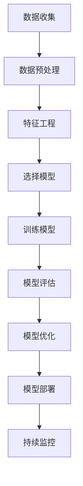

                 

# Machine Learning原理与代码实例讲解

> 关键词：机器学习, 深度学习, 神经网络, 人工智能, 算法, 数学模型, 代码实现

> 摘要：本文旨在深入探讨机器学习的基本原理及其在实际项目中的应用。通过逐步分析和推理，我们将从背景介绍、核心概念与联系、核心算法原理、数学模型和公式、项目实战、实际应用场景、工具和资源推荐、总结与未来发展趋势等多方面进行详细讲解。本文不仅适合初学者入门，也适合有一定基础的开发者深入理解机器学习的精髓。

## 1. 背景介绍

机器学习（Machine Learning, ML）是人工智能（Artificial Intelligence, AI）的一个分支，旨在使计算机能够从数据中自动学习并改进性能，而无需进行显式编程。随着大数据时代的到来，机器学习技术在各个领域得到了广泛应用，如自然语言处理、计算机视觉、推荐系统、医疗诊断等。

### 1.1 机器学习的历史与发展

机器学习的历史可以追溯到20世纪50年代，当时的研究主要集中在符号主义方法上。随着计算能力的提升和数据量的增加，统计学习方法逐渐成为主流。近年来，深度学习技术的兴起使得机器学习在图像识别、语音识别等领域取得了突破性进展。

### 1.2 机器学习的应用场景

机器学习在各个领域都有着广泛的应用，包括但不限于：

- **自然语言处理**：文本分类、情感分析、机器翻译等。
- **计算机视觉**：图像识别、目标检测、图像生成等。
- **推荐系统**：个性化推荐、协同过滤等。
- **医疗诊断**：疾病预测、药物发现等。
- **金融风控**：信用评估、欺诈检测等。

## 2. 核心概念与联系

### 2.1 机器学习的基本概念

机器学习的核心在于通过算法从数据中学习模式，并利用这些模式进行预测或决策。主要分为监督学习、无监督学习和强化学习三大类。

#### 2.1.1 监督学习

监督学习是指给定一组带有标签的数据，通过学习这些数据的特征与标签之间的关系，来预测新的未标记数据的标签。常见的监督学习算法包括线性回归、逻辑回归、支持向量机（SVM）、决策树、随机森林等。

#### 2.1.2 无监督学习

无监督学习是指给定一组未标记的数据，通过学习数据的内在结构和模式，来发现数据的潜在分布或聚类。常见的无监督学习算法包括K-means聚类、层次聚类、主成分分析（PCA）等。

#### 2.1.3 强化学习

强化学习是一种通过与环境交互来学习最优策略的方法。智能体通过采取行动并根据环境反馈来优化其行为。常见的强化学习算法包括Q-learning、深度Q网络（DQN）等。

### 2.2 机器学习的流程图



## 3. 核心算法原理 & 具体操作步骤

### 3.1 线性回归

线性回归是最简单的监督学习算法之一，用于预测连续值。其基本原理是通过最小化预测值与实际值之间的平方误差来拟合一条直线。

#### 3.1.1 线性回归的数学模型

$$
y = \beta_0 + \beta_1 x + \epsilon
$$

其中，$y$ 是目标变量，$x$ 是特征变量，$\beta_0$ 和 $\beta_1$ 是模型参数，$\epsilon$ 是误差项。

#### 3.1.2 梯度下降法

梯度下降法是一种常用的优化算法，用于最小化损失函数。其基本步骤如下：

1. 初始化参数 $\beta_0$ 和 $\beta_1$。
2. 计算损失函数的梯度。
3. 更新参数：$\beta_0 = \beta_0 - \alpha \frac{\partial L}{\partial \beta_0}$，$\beta_1 = \beta_1 - \alpha \frac{\partial L}{\partial \beta_1}$，其中 $\alpha$ 是学习率。

### 3.2 决策树

决策树是一种常用的监督学习算法，通过递归地将数据集划分为子集来构建树结构。每个内部节点表示一个特征，每个分支表示一个特征值，每个叶节点表示一个类别或连续值。

#### 3.2.1 决策树的构建

1. 选择最佳特征进行划分。
2. 递归地对子集进行划分，直到满足停止条件。

#### 3.2.2 ID3算法

ID3算法是一种经典的决策树构建算法，其基本步骤如下：

1. 计算每个特征的信息增益。
2. 选择信息增益最大的特征作为根节点。
3. 递归地对子集进行划分，直到所有数据属于同一类别或满足停止条件。

## 4. 数学模型和公式 & 详细讲解 & 举例说明

### 4.1 线性回归的损失函数

线性回归的损失函数通常采用均方误差（Mean Squared Error, MSE）：

$$
L(\beta_0, \beta_1) = \frac{1}{n} \sum_{i=1}^{n} (y_i - (\beta_0 + \beta_1 x_i))^2
$$

### 4.2 决策树的信息增益

信息增益用于衡量一个特征划分数据集的效果。其计算公式如下：

$$
Gain(S, A) = H(S) - \sum_{v \in Values(A)} \frac{|S_v|}{|S|} H(S_v)
$$

其中，$H(S)$ 是数据集 $S$ 的熵，$S_v$ 是特征 $A$ 取值为 $v$ 的子集。

### 4.3 举例说明

假设我们有一个数据集，包含两个特征 $x_1$ 和 $x_2$，以及一个目标变量 $y$。我们使用线性回归模型进行预测，并使用梯度下降法进行参数优化。

```python
import numpy as np

# 数据集
X = np.array([[1, 2], [2, 3], [3, 4], [4, 5]])
y = np.array([2, 3, 4, 5])

# 初始化参数
beta_0 = 0
beta_1 = 0
alpha = 0.01
epochs = 1000

# 梯度下降法
for _ in range(epochs):
    y_pred = beta_0 + beta_1 * X[:, 0]
    error = y - y_pred
    beta_0 -= alpha * np.mean(error)
    beta_1 -= alpha * np.mean(error * X[:, 0])

print("beta_0:", beta_0)
print("beta_1:", beta_1)
```

## 5. 项目实战：代码实际案例和详细解释说明

### 5.1 开发环境搭建

为了进行机器学习项目，我们需要安装Python及其相关库。常用的库包括NumPy、Pandas、Scikit-learn等。

```bash
pip install numpy pandas scikit-learn
```

### 5.2 源代码详细实现和代码解读

我们将使用Scikit-learn库实现一个简单的线性回归模型，并进行数据预处理和模型评估。

```python
import numpy as np
import pandas as pd
from sklearn.model_selection import train_test_split
from sklearn.linear_model import LinearRegression
from sklearn.metrics import mean_squared_error, r2_score

# 加载数据集
data = pd.read_csv('data.csv')

# 数据预处理
X = data[['feature1', 'feature2']]
y = data['target']

# 划分训练集和测试集
X_train, X_test, y_train, y_test = train_test_split(X, y, test_size=0.2, random_state=42)

# 创建线性回归模型
model = LinearRegression()

# 训练模型
model.fit(X_train, y_train)

# 预测
y_pred = model.predict(X_test)

# 评估模型
mse = mean_squared_error(y_test, y_pred)
r2 = r2_score(y_test, y_pred)

print("Mean Squared Error:", mse)
print("R2 Score:", r2)
```

### 5.3 代码解读与分析

1. **数据加载**：使用Pandas库加载CSV文件。
2. **数据预处理**：将特征和目标变量分别存储在X和y中。
3. **数据划分**：使用train_test_split函数将数据集划分为训练集和测试集。
4. **模型创建**：使用Scikit-learn库创建线性回归模型。
5. **模型训练**：使用fit方法训练模型。
6. **模型预测**：使用predict方法进行预测。
7. **模型评估**：使用mean_squared_error和r2_score函数评估模型性能。

## 6. 实际应用场景

机器学习在各个领域都有着广泛的应用，以下是一些实际应用场景：

### 6.1 金融风控

通过机器学习模型预测客户的信用风险，帮助金融机构做出更准确的决策。

### 6.2 医疗诊断

利用机器学习模型进行疾病预测和诊断，提高医疗效率和准确性。

### 6.3 推荐系统

通过分析用户行为数据，为用户提供个性化推荐，提高用户体验。

## 7. 工具和资源推荐

### 7.1 学习资源推荐

- **书籍**：《机器学习》（周志华著）、《深度学习》（Ian Goodfellow著）
- **论文**：《神经网络与深度学习》（Yann LeCun等）
- **博客**：Medium、Towards Data Science
- **网站**：Kaggle、GitHub

### 7.2 开发工具框架推荐

- **Python库**：NumPy、Pandas、Scikit-learn、TensorFlow、PyTorch
- **IDE**：Jupyter Notebook、PyCharm

### 7.3 相关论文著作推荐

- **论文**：《深度学习》（Ian Goodfellow著）
- **著作**：《统计学习方法》（李航著）

## 8. 总结：未来发展趋势与挑战

机器学习技术在未来将继续快速发展，面临的主要挑战包括：

- **数据隐私**：如何在保护用户隐私的前提下利用大数据。
- **模型解释性**：如何提高模型的可解释性，使其更容易被人类理解。
- **计算资源**：如何在有限的计算资源下实现高效的学习和推理。

## 9. 附录：常见问题与解答

### 9.1 问题：如何选择合适的机器学习算法？

**解答**：选择合适的算法需要考虑数据集的特征、问题类型以及计算资源等因素。通常可以通过实验和比较不同算法的性能来做出决策。

### 9.2 问题：如何处理缺失数据？

**解答**：可以采用填充缺失值、删除缺失值或使用插值方法等策略来处理缺失数据。

## 10. 扩展阅读 & 参考资料

- **书籍**：《机器学习》（周志华著）、《深度学习》（Ian Goodfellow著）
- **论文**：《神经网络与深度学习》（Yann LeCun等）
- **网站**：Kaggle、GitHub

---

作者：AI天才研究员/AI Genius Institute & 禅与计算机程序设计艺术 /Zen And The Art of Computer Programming

