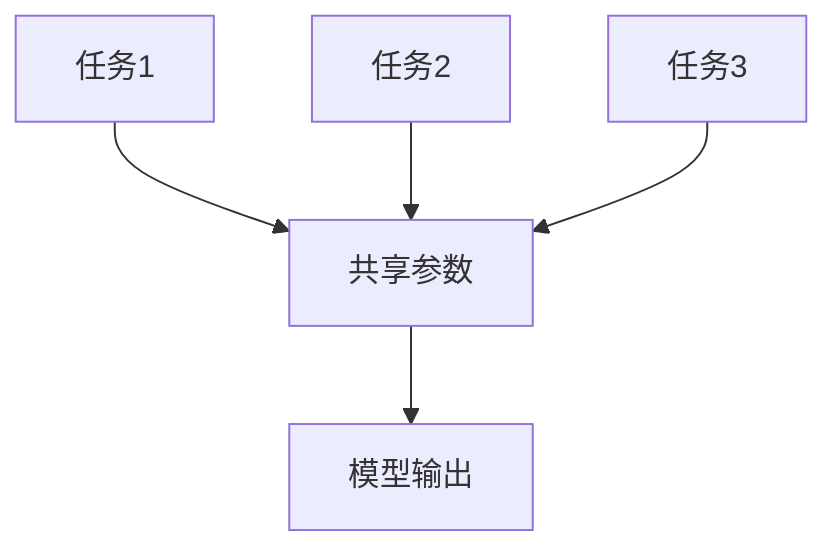

                 

# Multi-Task Learning原理与代码实例讲解

> 关键词：多任务学习, 机器学习, 深度学习, 神经网络, 任务共享, 代码实现

> 摘要：本文将深入探讨多任务学习（Multi-Task Learning, MTL）的基本原理、核心算法、数学模型，并通过实际代码案例进行详细解释。我们将从背景介绍开始，逐步解析多任务学习的概念、架构、算法原理，以及如何在实际项目中应用。最后，我们将讨论多任务学习的实际应用场景、相关资源推荐，并展望未来的发展趋势与挑战。

## 1. 背景介绍

多任务学习（Multi-Task Learning, MTL）是一种机器学习技术，旨在通过共享模型参数来同时学习多个相关任务。这种技术可以显著提高模型的泛化能力，尤其是在数据稀缺的情况下。MTL的核心思想是利用任务之间的相关性，通过共享模型参数来提高每个任务的学习效果。这种共享机制可以减少模型的复杂度，从而提高模型的泛化能力。

## 2. 核心概念与联系

### 2.1 多任务学习的基本概念

多任务学习的基本概念是通过共享模型参数来同时学习多个任务。假设我们有多个任务 $T_1, T_2, \ldots, T_n$，每个任务都有自己的损失函数 $L_i$。在传统的单任务学习中，每个任务都有独立的模型参数 $\theta_i$。而在多任务学习中，我们共享模型参数 $\theta$，即 $\theta = \theta_1 = \theta_2 = \ldots = \theta_n$。

### 2.2 任务相关性

任务之间的相关性是多任务学习的关键。如果任务之间存在相关性，共享模型参数可以提高每个任务的学习效果。例如，如果任务 $T_1$ 和任务 $T_2$ 都涉及图像分类，那么共享模型参数可以利用图像特征的相似性，从而提高两个任务的性能。

### 2.3 任务共享机制

任务共享机制可以通过不同的方式实现。常见的方法包括：

- **参数共享**：共享模型的权重参数。
- **门控机制**：通过门控机制控制不同任务之间的信息流动。
- **任务特定权重**：为每个任务分配特定的权重，以调整任务之间的贡献。

### 2.4 Mermaid 流程图



## 3. 核心算法原理 & 具体操作步骤

### 3.1 多任务学习的目标函数

多任务学习的目标函数通常是一个加权和的形式，即：

$$
L(\theta) = \sum_{i=1}^{n} \lambda_i L_i(\theta)
$$

其中，$\lambda_i$ 是任务 $i$ 的权重，$L_i(\theta)$ 是任务 $i$ 的损失函数。

### 3.2 任务权重的确定

任务权重 $\lambda_i$ 可以通过以下几种方式确定：

- **手动设置**：根据任务的重要性手动设置权重。
- **自动调整**：通过交叉验证或其他方法自动调整权重。
- **自适应调整**：根据模型在训练过程中的表现动态调整权重。

### 3.3 任务相关性矩阵

任务相关性矩阵 $R$ 描述了任务之间的相关性。任务相关性矩阵可以用于优化任务权重，从而提高模型的性能。任务相关性矩阵的计算方法如下：

$$
R_{ij} = \frac{1}{N} \sum_{k=1}^{N} \mathbb{I}(y_{ik} = y_{jk})
$$

其中，$N$ 是样本数量，$\mathbb{I}(y_{ik} = y_{jk})$ 是指示函数，表示样本 $k$ 在任务 $i$ 和任务 $j$ 中的标签是否相同。

### 3.4 任务共享机制的实现

任务共享机制可以通过以下几种方式实现：

- **参数共享**：共享模型的权重参数。
- **门控机制**：通过门控机制控制不同任务之间的信息流动。
- **任务特定权重**：为每个任务分配特定的权重，以调整任务之间的贡献。

## 4. 数学模型和公式 & 详细讲解 & 举例说明

### 4.1 参数共享模型

参数共享模型的基本形式如下：

$$
f_{\theta}(x) = \theta^T x
$$

其中，$\theta$ 是共享的权重参数，$x$ 是输入特征。

### 4.2 任务相关性矩阵

任务相关性矩阵 $R$ 描述了任务之间的相关性。任务相关性矩阵的计算方法如下：

$$
R_{ij} = \frac{1}{N} \sum_{k=1}^{N} \mathbb{I}(y_{ik} = y_{jk})
$$

其中，$N$ 是样本数量，$\mathbb{I}(y_{ik} = y_{jk})$ 是指示函数，表示样本 $k$ 在任务 $i$ 和任务 $j$ 中的标签是否相同。

### 4.3 任务权重的确定

任务权重 $\lambda_i$ 可以通过以下几种方式确定：

- **手动设置**：根据任务的重要性手动设置权重。
- **自动调整**：通过交叉验证或其他方法自动调整权重。
- **自适应调整**：根据模型在训练过程中的表现动态调整权重。

### 4.4 任务共享机制的实现

任务共享机制可以通过以下几种方式实现：

- **参数共享**：共享模型的权重参数。
- **门控机制**：通过门控机制控制不同任务之间的信息流动。
- **任务特定权重**：为每个任务分配特定的权重，以调整任务之间的贡献。

## 5. 项目实战：代码实际案例和详细解释说明

### 5.1 开发环境搭建

为了实现多任务学习，我们需要搭建一个合适的开发环境。以下是开发环境的搭建步骤：

1. **安装Python**：确保安装了Python 3.7及以上版本。
2. **安装TensorFlow**：使用pip安装TensorFlow库。
3. **安装Keras**：使用pip安装Keras库。
4. **安装NumPy**：使用pip安装NumPy库。
5. **安装Matplotlib**：使用pip安装Matplotlib库。

### 5.2 源代码详细实现和代码解读

以下是一个简单的多任务学习代码示例：

```python
import numpy as np
from tensorflow.keras.models import Model
from tensorflow.keras.layers import Input, Dense, concatenate

# 定义输入层
input_layer = Input(shape=(100,))

# 共享层
shared_layer = Dense(64, activation='relu')(input_layer)

# 任务1的输出层
task1_output = Dense(10, activation='softmax', name='task1_output')(shared_layer)

# 任务2的输出层
task2_output = Dense(5, activation='softmax', name='task2_output')(shared_layer)

# 构建模型
model = Model(inputs=input_layer, outputs=[task1_output, task2_output])

# 编译模型
model.compile(optimizer='adam', loss=['categorical_crossentropy', 'categorical_crossentropy'], metrics=['accuracy'])

# 打印模型结构
model.summary()
```

### 5.3 代码解读与分析

- **输入层**：定义了一个输入层，输入特征的维度为100。
- **共享层**：定义了一个共享层，使用ReLU激活函数。
- **任务1的输出层**：定义了任务1的输出层，使用softmax激活函数。
- **任务2的输出层**：定义了任务2的输出层，使用softmax激活函数。
- **模型构建**：通过`Model`类构建了一个多任务学习模型。
- **模型编译**：使用`adam`优化器和交叉熵损失函数编译模型。
- **模型结构**：使用`model.summary()`打印模型结构。

## 6. 实际应用场景

多任务学习在许多实际应用场景中都有广泛的应用，例如：

- **图像分类与目标检测**：通过共享模型参数，可以提高图像分类和目标检测的性能。
- **自然语言处理**：通过共享模型参数，可以提高文本分类、情感分析和命名实体识别的性能。
- **医疗诊断**：通过共享模型参数，可以提高多种疾病的诊断性能。

## 7. 工具和资源推荐

### 7.1 学习资源推荐

- **书籍**：《深度学习》（Goodfellow, Bengio, and Courville）
- **论文**：《Multi-Task Learning》（Caruana, 1997）
- **博客**：《多任务学习入门》（阿里云开发者社区）
- **网站**：Kaggle, TensorFlow, PyTorch

### 7.2 开发工具框架推荐

- **TensorFlow**：一个强大的深度学习框架。
- **Keras**：一个高级神经网络API，可以运行在TensorFlow之上。
- **PyTorch**：一个灵活的深度学习框架。

### 7.3 相关论文著作推荐

- **《Multi-Task Learning for Neural Networks》**（Caruana, 1997）
- **《Deep Multi-Task Learning with Shared Representations》**（Caruana, 2007）
- **《Multi-Task Learning with Shared Representations》**（Caruana, 2007）

## 8. 总结：未来发展趋势与挑战

多任务学习在未来的发展趋势和挑战包括：

- **模型复杂度**：随着任务数量的增加，模型的复杂度也会增加，如何平衡模型复杂度和性能是一个挑战。
- **任务相关性**：如何更准确地确定任务之间的相关性，从而提高模型的性能。
- **数据稀缺**：在数据稀缺的情况下，如何利用任务之间的相关性提高模型的泛化能力。

## 9. 附录：常见问题与解答

### 9.1 问题1：如何确定任务之间的相关性？

**解答**：可以通过计算任务相关性矩阵来确定任务之间的相关性。任务相关性矩阵的计算方法如下：

$$
R_{ij} = \frac{1}{N} \sum_{k=1}^{N} \mathbb{I}(y_{ik} = y_{jk})
$$

### 9.2 问题2：如何调整任务权重？

**解答**：任务权重可以通过手动设置、自动调整或自适应调整来确定。手动设置可以根据任务的重要性手动设置权重；自动调整可以通过交叉验证或其他方法自动调整权重；自适应调整可以根据模型在训练过程中的表现动态调整权重。

## 10. 扩展阅读 & 参考资料

- **《深度学习》**（Goodfellow, Bengio, and Courville）
- **《多任务学习入门》**（阿里云开发者社区）
- **《Multi-Task Learning for Neural Networks》**（Caruana, 1997）
- **《Deep Multi-Task Learning with Shared Representations》**（Caruana, 2007）
- **《Multi-Task Learning with Shared Representations》**（Caruana, 2007）

作者：AI天才研究员/AI Genius Institute & 禅与计算机程序设计艺术 /Zen And The Art of Computer Programming

