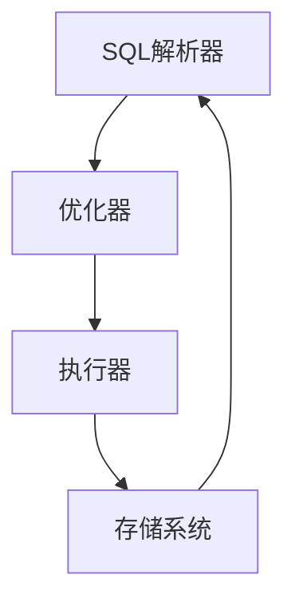

                 

# Spark SQL 原理与代码实例讲解

> 关键词：Spark, SQL, 数据处理, 高效计算, 数据分析, 代码实例, 数据架构

> 摘要：本文旨在深入探讨Apache Spark SQL的核心原理与实现机制，通过详细的代码实例，帮助读者理解Spark SQL在大数据处理中的高效性和灵活性。我们将从背景介绍、核心概念与联系、核心算法原理、数学模型与公式、项目实战、实际应用场景、工具和资源推荐、总结与未来趋势等多方面进行探讨。

## 1. 背景介绍

Apache Spark SQL是Apache Spark的一个模块，它提供了一种SQL查询语言，使得用户能够以SQL的方式处理大规模数据集。Spark SQL不仅支持SQL查询，还提供了丰富的API，支持多种数据源，如Hadoop文件系统、Hive表、外部数据库等。Spark SQL的核心优势在于其高性能和灵活性，能够在内存中进行数据处理，大大提高了数据处理速度。

## 2. 核心概念与联系

### 2.1 Spark SQL架构

Spark SQL的架构可以分为几个主要部分：SQL解析器、优化器、执行器和存储系统。这些部分通过一系列的流程图来展示其工作流程。



### 2.2 核心概念

- **DataFrame**：DataFrame是Spark SQL中的核心数据结构，它是一个分布式的数据集，类似于表格，具有固定的数据类型。
- **RDD**：Resilient Distributed Dataset（弹性分布式数据集），是Spark的核心数据抽象，用于表示不可变的、分区的数据集。
- **SQL解析器**：负责将SQL查询转换为内部表示形式。
- **优化器**：对查询进行优化，提高执行效率。
- **执行器**：负责执行优化后的查询计划。
- **存储系统**：用于存储中间结果和最终结果。

## 3. 核心算法原理 & 具体操作步骤

### 3.1 DataFrame的创建

DataFrame可以通过多种方式创建，包括从RDD、外部数据源（如HDFS、Hive表）等。

```python
from pyspark.sql import SparkSession

spark = SparkSession.builder.appName("DataFrameExample").getOrCreate()

# 从RDD创建DataFrame
data = [("Alice", 1), ("Bob", 2), ("Charlie", 3)]
columns = ["name", "age"]
df = spark.createDataFrame(data, columns)

# 从外部数据源创建DataFrame
df_hdfs = spark.read.csv("hdfs://path/to/file.csv", header=True, inferSchema=True)
```

### 3.2 SQL查询

DataFrame支持SQL查询，可以通过`sql`方法执行SQL语句。

```python
df.createOrReplaceTempView("people")
result = spark.sql("SELECT name, age FROM people WHERE age > 1")
result.show()
```

### 3.3 优化器与执行器

优化器会对查询进行优化，提高执行效率。执行器负责执行优化后的查询计划。

```python
# 优化查询
optimized_plan = df.explain(True)
```

## 4. 数学模型和公式 & 详细讲解 & 举例说明

### 4.1 优化器的数学模型

优化器使用一系列的规则来优化查询计划。这些规则可以表示为数学模型，例如：

$$
\text{Cost} = \text{CPU Cost} + \text{IO Cost} + \text{Memory Cost}
$$

### 4.2 举例说明

假设有一个查询需要从两个表中进行连接操作，优化器会根据表的大小、索引情况等因素来选择最优的连接策略。

```python
df1 = spark.read.csv("hdfs://path/to/file1.csv", header=True, inferSchema=True)
df2 = spark.read.csv("hdfs://path/to/file2.csv", header=True, inferSchema=True)

# 优化连接操作
optimized_plan = df1.join(df2, df1.id == df2.id).explain(True)
```

## 5. 项目实战：代码实际案例和详细解释说明

### 5.1 开发环境搭建

首先，确保已经安装了Apache Spark和PySpark。

```bash
pip install pyspark
```

### 5.2 源代码详细实现和代码解读

```python
from pyspark.sql import SparkSession

# 创建SparkSession
spark = SparkSession.builder.appName("SparkSQLExample").getOrCreate()

# 从HDFS读取数据
df = spark.read.csv("hdfs://path/to/data.csv", header=True, inferSchema=True)

# 创建临时视图
df.createOrReplaceTempView("data")

# 执行SQL查询
result = spark.sql("SELECT * FROM data WHERE age > 18")

# 显示结果
result.show()

# 优化查询计划
optimized_plan = df.explain(True)
```

### 5.3 代码解读与分析

- **创建SparkSession**：初始化Spark环境。
- **读取数据**：从HDFS读取CSV文件。
- **创建临时视图**：将DataFrame转换为临时视图，以便执行SQL查询。
- **执行SQL查询**：使用`sql`方法执行SQL语句。
- **显示结果**：输出查询结果。
- **优化查询计划**：使用`explain`方法查看查询计划，并进行优化。

## 6. 实际应用场景

Spark SQL广泛应用于大数据处理和分析场景，如：

- **实时数据分析**：快速处理实时数据流。
- **数据仓库**：构建数据仓库，支持复杂的SQL查询。
- **机器学习**：集成Spark MLlib，支持机器学习模型的训练和预测。

## 7. 工具和资源推荐

### 7.1 学习资源推荐

- **书籍**：《Learning Spark》、《Spark in Action》
- **论文**：《Spark: Cluster Computing with Working Sets》
- **博客**：Spark官方文档、Databricks博客
- **网站**：Apache Spark官网、Spark官方论坛

### 7.2 开发工具框架推荐

- **IDE**：IntelliJ IDEA、Eclipse
- **版本控制**：Git
- **构建工具**：Maven、Sbt

### 7.3 相关论文著作推荐

- **论文**：《Spark: Cluster Computing with Working Sets》
- **著作**：《Spark in Action》、《Learning Spark》

## 8. 总结：未来发展趋势与挑战

Spark SQL在未来的发展趋势包括：

- **性能优化**：进一步优化查询计划，提高执行效率。
- **兼容性增强**：支持更多数据源和存储系统。
- **易用性提升**：简化API，提高用户体验。

面临的挑战包括：

- **资源管理**：优化资源分配，提高集群利用率。
- **安全性**：增强安全性，保护数据隐私。

## 9. 附录：常见问题与解答

### 9.1 问题1：如何处理数据倾斜？

**解答**：可以通过数据分区和哈希分桶来处理数据倾斜。

### 9.2 问题2：如何优化查询计划？

**解答**：使用`explain`方法查看查询计划，根据实际情况进行优化。

## 10. 扩展阅读 & 参考资料

- **官方文档**：[Apache Spark SQL](https://spark.apache.org/sql/)
- **GitHub项目**：[Spark SQL GitHub](https://github.com/apache/spark/tree/master/sql/core)
- **Databricks博客**：[Databricks Spark SQL博客](https://databricks.com/blog/tagged/spark-sql)

---

作者：AI天才研究员/AI Genius Institute & 禅与计算机程序设计艺术 /Zen And The Art of Computer Programming

