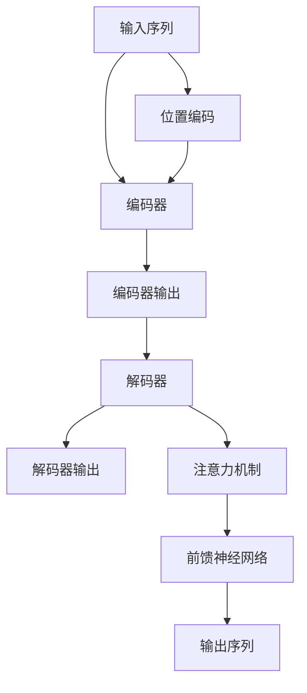

                 

# Transformer架构剖析

> 关键词：Transformer, 自注意力机制, 序列建模, 深度学习, 自然语言处理, 机器翻译

> 摘要：Transformer架构是近年来深度学习领域的一项重大突破，尤其在自然语言处理任务中展现出卓越的性能。本文将从Transformer的背景介绍出发，深入剖析其核心概念、算法原理、数学模型，通过实际代码案例进行详细解释，并探讨其应用场景及未来发展趋势。通过本文，读者将对Transformer架构有全面而深入的理解。

## 1. 背景介绍

Transformer架构最初由Vaswani等人在2017年提出，旨在解决序列建模问题，特别是自然语言处理任务中的长距离依赖问题。传统的循环神经网络（RNN）虽然能够处理序列数据，但其在处理长序列时存在梯度消失或梯度爆炸的问题，导致训练效率低下。Transformer通过引入自注意力机制，极大地提高了模型的并行化能力，使得处理长序列数据变得更加高效。

### 1.1 问题背景

在自然语言处理任务中，长距离依赖问题是一个关键挑战。例如，在机器翻译任务中，源语言句子中的某个词可能与目标语言句子中的某个词之间存在较远的距离。传统的RNN模型在处理这种长距离依赖时，需要经过多次迭代才能捕捉到这种依赖关系，导致训练时间长且效果不佳。

### 1.2 解决方案

为了解决上述问题，Transformer架构引入了自注意力机制。自注意力机制允许模型在处理序列数据时，能够同时关注序列中的多个位置，从而捕捉到长距离依赖关系。此外，Transformer还采用了并行化处理的方式，极大地提高了模型的训练效率。

## 2. 核心概念与联系

### 2.1 自注意力机制

自注意力机制是Transformer的核心组成部分，它允许模型在处理序列数据时，能够同时关注序列中的多个位置。自注意力机制通过计算序列中每个位置与其他位置之间的相似度，生成注意力权重，从而实现对序列中不同位置的加权关注。

### 2.2 位置编码

由于Transformer模型中没有循环结构，无法直接获取序列中每个位置的顺序信息。因此，引入了位置编码机制，通过位置编码将序列中的位置信息嵌入到模型中，使得模型能够理解序列的顺序关系。

### 2.3 编码器-解码器架构

Transformer架构采用编码器-解码器结构，其中编码器负责将输入序列编码为固定长度的向量表示，解码器则负责生成输出序列。编码器和解码器都由多层相同的模块组成，每个模块包括自注意力机制和前馈神经网络。

### 2.4 Mermaid流程图



## 3. 核心算法原理 & 具体操作步骤

### 3.1 编码器模块

编码器模块由多层相同的子层组成，每个子层包括自注意力机制和前馈神经网络。编码器模块的具体操作步骤如下：

1. **输入序列**：输入序列经过位置编码后，送入编码器模块。
2. **自注意力机制**：每个位置的嵌入向量与所有其他位置的嵌入向量进行相似度计算，生成注意力权重。
3. **加权求和**：根据注意力权重对所有位置的嵌入向量进行加权求和，得到新的嵌入向量。
4. **残差连接**：将新的嵌入向量与原始嵌入向量相加，得到残差连接后的嵌入向量。
5. **层归一化**：对残差连接后的嵌入向量进行层归一化。
6. **前馈神经网络**：对归一化后的嵌入向量进行前馈神经网络处理。
7. **残差连接**：将前馈神经网络的输出与归一化后的嵌入向量相加，得到最终的嵌入向量。
8. **层归一化**：对最终的嵌入向量进行层归一化。

### 3.2 解码器模块

解码器模块与编码器模块类似，但解码器模块还引入了掩码机制，以防止解码器在生成输出序列时看到未来的信息。解码器模块的具体操作步骤如下：

1. **输入序列**：输入序列经过位置编码后，送入解码器模块。
2. **自注意力机制**：每个位置的嵌入向量与所有其他位置的嵌入向量进行相似度计算，生成注意力权重。
3. **加权求和**：根据注意力权重对所有位置的嵌入向量进行加权求和，得到新的嵌入向量。
4. **残差连接**：将新的嵌入向量与原始嵌入向量相加，得到残差连接后的嵌入向量。
5. **层归一化**：对残差连接后的嵌入向量进行层归一化。
6. **掩码机制**：在自注意力机制中引入掩码机制，防止解码器在生成输出序列时看到未来的信息。
7. **前馈神经网络**：对归一化后的嵌入向量进行前馈神经网络处理。
8. **残差连接**：将前馈神经网络的输出与归一化后的嵌入向量相加，得到最终的嵌入向量。
9. **层归一化**：对最终的嵌入向量进行层归一化。

## 4. 数学模型和公式 & 详细讲解 & 举例说明

### 4.1 自注意力机制

自注意力机制的核心公式如下：

$$
\text{Attention}(Q, K, V) = \text{softmax}\left(\frac{QK^T}{\sqrt{d_k}}\right)V
$$

其中，$Q$、$K$、$V$ 分别表示查询向量、键向量和值向量，$d_k$ 表示键向量的维度。$\text{softmax}$ 函数用于生成注意力权重，$QK^T$ 表示查询向量与键向量的点积。

### 4.2 位置编码

位置编码的公式如下：

$$
\text{Pos}(i, j) = \begin{cases}
\sin\left(\frac{i}{10000^{2j/d}}\right) & \text{if } j \text{ is even} \\
\cos\left(\frac{i}{10000^{2j/d}}\right) & \text{if } j \text{ is odd}
\end{cases}
$$

其中，$i$ 表示位置索引，$j$ 表示嵌入向量的维度索引，$d$ 表示嵌入向量的维度。

### 4.3 编码器模块

编码器模块的具体公式如下：

$$
\text{Encoder}(X) = \text{LayerNorm}(X + \text{Sublayer}(X))
$$

其中，$\text{Sublayer}(X)$ 表示编码器模块中的子层，包括自注意力机制和前馈神经网络。

### 4.4 解码器模块

解码器模块的具体公式如下：

$$
\text{Decoder}(X) = \text{LayerNorm}(X + \text{Sublayer}(X))
$$

其中，$\text{Sublayer}(X)$ 表示解码器模块中的子层，包括自注意力机制、掩码机制和前馈神经网络。

## 5. 项目实战：代码实际案例和详细解释说明

### 5.1 开发环境搭建

为了实现Transformer模型，我们需要搭建一个Python开发环境。推荐使用Anaconda进行环境搭建，安装必要的库，如PyTorch、TensorFlow等。

```bash
conda create -n transformer_env python=3.8
conda activate transformer_env
pip install torch torchvision torchaudio
pip install transformers
```

### 5.2 源代码详细实现和代码解读

以下是一个简单的Transformer模型实现代码示例：

```python
import torch
import torch.nn as nn
from torch.nn import TransformerEncoder, TransformerEncoderLayer

class TransformerModel(nn.Module):
    def __init__(self, ntoken, ninp, nhead, nhid, nlayers, dropout=0.5):
        super(TransformerModel, self).__init__()
        self.model_type = 'Transformer'
        self.src_mask = None
        self.pos_encoder = PositionalEncoding(ninp, dropout)
        encoder_layers = TransformerEncoderLayer(ninp, nhead, nhid, dropout)
        self.transformer_encoder = TransformerEncoder(encoder_layers, nlayers)
        self.encoder = nn.Embedding(ntoken, ninp)
        self.ninp = ninp
        self.decoder = nn.Linear(ninp, ntoken)

        self.init_weights()

    def _generate_square_subsequent_mask(self, sz):
        mask = (torch.triu(torch.ones(sz, sz)) == 1).transpose(0, 1)
        mask = mask.float().masked_fill(mask == 0, float('-inf')).masked_fill(mask == 1, float(0.0))
        return mask

    def init_weights(self):
        initrange = 0.1
        self.encoder.weight.data.uniform_(-initrange, initrange)
        self.decoder.bias.data.zero_()
        self.decoder.weight.data.uniform_(-initrange, initrange)

    def forward(self, src):
        if self.src_mask is None or self.src_mask.size(0) != len(src):
            device = src.device
            mask = self._generate_square_subsequent_mask(len(src)).to(device)
            self.src_mask = mask

        src = self.encoder(src) * math.sqrt(self.ninp)
        src = self.pos_encoder(src)
        output = self.transformer_encoder(src, self.src_mask)
        output = self.decoder(output)
        return output
```

### 5.3 代码解读与分析

1. **TransformerModel类**：定义了一个Transformer模型类，包含编码器、解码器和位置编码。
2. **_generate_square_subsequent_mask方法**：生成掩码矩阵，用于解码器中的掩码机制。
3. **init_weights方法**：初始化模型参数。
4. **forward方法**：定义模型的前向传播过程，包括位置编码、掩码生成和编码器的前向传播。

## 6. 实际应用场景

Transformer架构在自然语言处理任务中表现出色，尤其在机器翻译、文本生成、情感分析等领域得到了广泛应用。例如，在机器翻译任务中，Transformer模型能够捕捉到长距离依赖关系，从而生成更准确的翻译结果。

## 7. 工具和资源推荐

### 7.1 学习资源推荐

- **书籍**：《Attention Is All You Need》
- **论文**：Vaswani, A., et al. "Attention is all you need." NeurIPS 2017.
- **博客**：阿里云开发者社区、Medium上的相关文章
- **网站**：PyTorch官网、TensorFlow官网

### 7.2 开发工具框架推荐

- **PyTorch**：深度学习框架，支持Transformer模型的实现。
- **TensorFlow**：深度学习框架，支持Transformer模型的实现。

### 7.3 相关论文著作推荐

- **论文**：Vaswani, A., et al. "Attention is all you need." NeurIPS 2017.
- **书籍**：《Attention Is All You Need》

## 8. 总结：未来发展趋势与挑战

Transformer架构在自然语言处理领域取得了巨大成功，但仍然面临一些挑战。未来的发展趋势包括：

1. **模型优化**：通过模型剪枝、量化等技术进一步优化模型性能。
2. **多模态学习**：将Transformer模型应用于多模态数据处理，如图像-文本联合学习。
3. **可解释性**：提高Transformer模型的可解释性，使其能够更好地应用于实际场景。

## 9. 附录：常见问题与解答

### 9.1 问题1：Transformer模型为什么能够处理长距离依赖？

**解答**：Transformer模型通过自注意力机制，能够在处理序列数据时同时关注序列中的多个位置，从而捕捉到长距离依赖关系。

### 9.2 问题2：Transformer模型的训练效率如何？

**解答**：Transformer模型通过并行化处理的方式，极大地提高了模型的训练效率，使得处理长序列数据变得更加高效。

### 9.3 问题3：Transformer模型的计算复杂度如何？

**解答**：Transformer模型的计算复杂度主要由自注意力机制决定，其复杂度为O(n^2)，其中n为序列长度。通过优化技术，可以进一步降低计算复杂度。

## 10. 扩展阅读 & 参考资料

- **论文**：Vaswani, A., et al. "Attention is all you need." NeurIPS 2017.
- **书籍**：《Attention Is All You Need》
- **网站**：PyTorch官网、TensorFlow官网

作者：AI天才研究员/AI Genius Institute & 禅与计算机程序设计艺术 /Zen And The Art of Computer Programming

