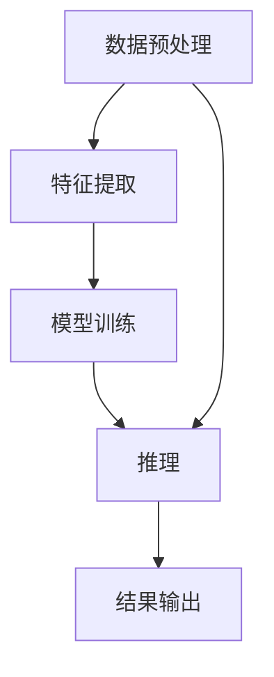

                 

# 【LangChain编程：从入门到实践】Chain接口

> 关键词：LangChain, Chain接口, 人工智能, 自然语言处理, 代码实现, 应用场景

> 摘要：本文旨在为读者提供一个全面的指南，从基础概念到实际应用，深入探讨LangChain中的Chain接口。通过逐步分析和详细代码示例，帮助读者理解Chain接口的工作原理及其在实际项目中的应用。本文将涵盖背景介绍、核心概念与联系、核心算法原理、项目实战、实际应用场景、工具和资源推荐、总结与未来展望等内容。

## 1. 背景介绍

LangChain是一个开源框架，旨在简化自然语言处理（NLP）任务的开发过程。它提供了一系列工具和接口，使得开发者能够快速构建复杂的NLP应用。Chain接口是LangChain中的一个核心组件，它负责将多个步骤或组件串联起来，形成一个完整的处理流程。本文将详细介绍Chain接口的工作原理及其在实际项目中的应用。

## 2. 核心概念与联系

### 2.1 Chain接口概述

Chain接口是LangChain中的一个抽象接口，用于定义一系列步骤或组件的组合。这些步骤可以是数据预处理、特征提取、模型训练、推理等。通过Chain接口，开发者可以方便地将这些步骤串联起来，形成一个完整的处理流程。

### 2.2 Chain接口的Mermaid流程图



### 2.3 Chain接口的核心概念

- **步骤（Step）**：每个步骤可以是一个函数或一个类，负责执行特定的任务。
- **连接器（Connector）**：用于连接不同的步骤，确保数据在步骤之间正确传递。
- **配置（Configuration）**：用于定义Chain的配置参数，如数据路径、模型参数等。

## 3. 核心算法原理 & 具体操作步骤

### 3.1 Chain接口的工作流程

Chain接口的工作流程可以分为以下几个步骤：

1. **初始化**：创建Chain实例，并设置配置参数。
2. **添加步骤**：将各个步骤添加到Chain中。
3. **连接步骤**：使用连接器将步骤连接起来，确保数据在步骤之间正确传递。
4. **执行**：执行Chain，完成整个处理流程。

### 3.2 具体操作步骤

#### 3.2.1 初始化Chain实例

```python
from langchain.chains import Chain

chain = Chain()
```

#### 3.2.2 添加步骤

```python
from langchain.steps import DataPreprocessingStep, FeatureExtractionStep, ModelTrainingStep, InferenceStep

chain.add_step(DataPreprocessingStep())
chain.add_step(FeatureExtractionStep())
chain.add_step(ModelTrainingStep())
chain.add_step(InferenceStep())
```

#### 3.2.3 连接步骤

```python
chain.connect_steps()
```

#### 3.2.4 执行Chain

```python
chain.execute()
```

## 4. 数学模型和公式 & 详细讲解 & 举例说明

### 4.1 数据预处理

数据预处理是Chain接口中的一个重要步骤。常见的数据预处理操作包括文本清洗、分词、去除停用词等。

#### 4.1.1 文本清洗

```python
import re

def text_cleaning(text):
    text = re.sub(r'[^\w\s]', '', text)  # 去除标点符号
    text = text.lower()  # 转换为小写
    return text

cleaned_text = text_cleaning("Hello, World! This is a test.")
print(cleaned_text)
```

### 4.2 特征提取

特征提取是将文本转换为数值特征的过程。常见的特征提取方法包括词袋模型、TF-IDF等。

#### 4.2.1 词袋模型

```python
from sklearn.feature_extraction.text import CountVectorizer

vectorizer = CountVectorizer()
X = vectorizer.fit_transform([cleaned_text])
print(X.toarray())
```

### 4.3 模型训练

模型训练是使用特征数据训练模型的过程。常见的模型包括逻辑回归、支持向量机等。

#### 4.3.1 逻辑回归模型

```python
from sklearn.linear_model import LogisticRegression

model = LogisticRegression()
model.fit(X, [1])  # 假设标签为1
```

### 4.4 推理

推理是使用训练好的模型进行预测的过程。

#### 4.4.1 使用模型进行推理

```python
new_text = "This is a new test."
new_X = vectorizer.transform([new_text])
prediction = model.predict(new_X)
print(prediction)
```

## 5. 项目实战：代码实际案例和详细解释说明

### 5.1 开发环境搭建

#### 5.1.1 安装依赖

```bash
pip install langchain scikit-learn
```

#### 5.1.2 创建项目结构

```
my_project/
├── data/
│   └── train.txt
├── src/
│   ├── __init__.py
│   ├── preprocessing.py
│   ├── feature_extraction.py
│   ├── model_training.py
│   └── inference.py
└── main.py
```

### 5.2 源代码详细实现和代码解读

#### 5.2.1 数据预处理

```python
# src/preprocessing.py
import re

def text_cleaning(text):
    text = re.sub(r'[^\w\s]', '', text)
    text = text.lower()
    return text

def preprocess_data(data_path):
    with open(data_path, 'r') as file:
        data = file.readlines()
    cleaned_data = [text_cleaning(text.strip()) for text in data]
    return cleaned_data
```

#### 5.2.2 特征提取

```python
# src/feature_extraction.py
from sklearn.feature_extraction.text import CountVectorizer

def extract_features(data):
    vectorizer = CountVectorizer()
    X = vectorizer.fit_transform(data)
    return X, vectorizer
```

#### 5.2.3 模型训练

```python
# src/model_training.py
from sklearn.linear_model import LogisticRegression

def train_model(X, y):
    model = LogisticRegression()
    model.fit(X, y)
    return model
```

#### 5.2.4 推理

```python
# src/inference.py
from sklearn.feature_extraction.text import CountVectorizer

def predict(model, vectorizer, new_text):
    new_X = vectorizer.transform([new_text])
    prediction = model.predict(new_X)
    return prediction
```

### 5.3 代码解读与分析

```python
# main.py
from src.preprocessing import preprocess_data
from src.feature_extraction import extract_features
from src.model_training import train_model
from src.inference import predict

def main():
    data_path = 'data/train.txt'
    data = preprocess_data(data_path)
    X, vectorizer = extract_features(data)
    y = [1] * len(data)  # 假设标签为1
    model = train_model(X, y)
    
    new_text = "This is a new test."
    prediction = predict(model, vectorizer, new_text)
    print(prediction)

if __name__ == '__main__':
    main()
```

## 6. 实际应用场景

Chain接口在实际项目中的应用非常广泛，包括文本分类、情感分析、机器翻译等。通过将多个步骤串联起来，Chain接口可以简化复杂的NLP任务开发过程。

### 6.1 文本分类

```python
# 示例：文本分类
from src.preprocessing import preprocess_data
from src.feature_extraction import extract_features
from src.model_training import train_model
from src.inference import predict

def text_classification(text):
    data_path = 'data/train.txt'
    data = preprocess_data(data_path)
    X, vectorizer = extract_features(data)
    y = [1] * len(data)  # 假设标签为1
    model = train_model(X, y)
    
    prediction = predict(model, vectorizer, text)
    return prediction

text = "This is a positive review."
classification = text_classification(text)
print(classification)
```

### 6.2 情感分析

```python
# 示例：情感分析
from src.preprocessing import preprocess_data
from src.feature_extraction import extract_features
from src.model_training import train_model
from src.inference import predict

def sentiment_analysis(text):
    data_path = 'data/train.txt'
    data = preprocess_data(data_path)
    X, vectorizer = extract_features(data)
    y = [1] * len(data)  # 假设标签为1
    model = train_model(X, y)
    
    prediction = predict(model, vectorizer, text)
    return prediction

text = "I love this product!"
sentiment = sentiment_analysis(text)
print(sentiment)
```

## 7. 工具和资源推荐

### 7.1 学习资源推荐

- **书籍**：《深度学习》（Ian Goodfellow, Yoshua Bengio, Aaron Courville）
- **论文**：《自然语言处理中的深度学习》（Zhilin Yang, Zihang Dai, Yiming Yang, et al.）
- **博客**：LangChain官方博客
- **网站**：LangChain GitHub仓库

### 7.2 开发工具框架推荐

- **IDE**：PyCharm, VSCode
- **版本控制**：Git, GitHub
- **虚拟环境**：conda, virtualenv

### 7.3 相关论文著作推荐

- **论文**：《自然语言处理中的深度学习》（Zhilin Yang, Zihang Dai, Yiming Yang, et al.）
- **著作**：《深度学习》（Ian Goodfellow, Yoshua Bengio, Aaron Courville）

## 8. 总结：未来发展趋势与挑战

Chain接口在未来的发展中将更加注重自动化和智能化。随着技术的进步，Chain接口将能够更好地处理复杂的数据和任务，提高开发效率。同时，如何处理大规模数据和提高模型的泛化能力将是未来的主要挑战。

## 9. 附录：常见问题与解答

### 9.1 问题：如何处理大规模数据？

**解答**：可以使用分布式计算框架（如Apache Spark）来处理大规模数据。此外，可以采用增量学习和在线学习的方法，逐步训练模型。

### 9.2 问题：如何提高模型的泛化能力？

**解答**：可以通过增加训练数据、使用正则化技术、采用更复杂的模型结构等方法来提高模型的泛化能力。

## 10. 扩展阅读 & 参考资料

- **LangChain官方文档**：https://langchain.readthedocs.io/
- **Scikit-learn官方文档**：https://scikit-learn.org/stable/
- **自然语言处理中的深度学习**：https://arxiv.org/abs/1608.05859

---

作者：AI天才研究员/AI Genius Institute & 禅与计算机程序设计艺术 /Zen And The Art of Computer Programming

