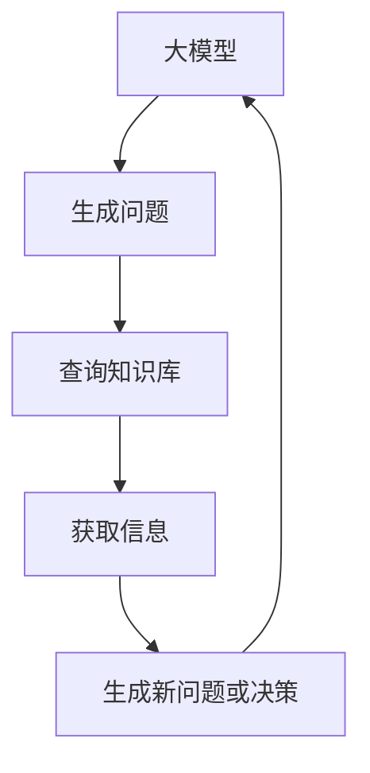

                 

# 【大模型应用开发 动手做AI Agent】LangChain中ReAct Agent 的实现

> 关键词：LangChain, ReAct Agent, 大模型, 人工智能, 自动化推理, 开发实践

> 摘要：本文将深入探讨LangChain中的ReAct Agent，通过逐步分析和推理，详细介绍其核心概念、原理、实现方法以及实际应用案例。我们将从开发环境搭建到代码实现，再到应用场景，全面解析ReAct Agent的工作机制和开发流程，帮助读者掌握这一前沿技术。

## 1. 背景介绍

随着大模型技术的迅猛发展，如何高效地利用这些模型进行自动化推理和决策成为了研究热点。LangChain作为一款强大的框架，提供了丰富的工具和库来支持这一过程。ReAct Agent是LangChain中的一个重要组件，它能够通过结合大模型和外部知识库，实现更智能、更灵活的自动化推理。本文将详细介绍ReAct Agent的核心概念、原理、实现方法，并通过实际案例进行演示。

## 2. 核心概念与联系

### 2.1 ReAct Agent 概述

ReAct Agent是一种结合了大模型和外部知识库的自动化推理系统。它能够通过大模型生成问题，然后查询外部知识库获取相关信息，再根据这些信息生成新的问题或决策。这一过程可以反复进行，直到达到预期目标。

### 2.2 LangChain 框架

LangChain是一个用于构建和部署大模型应用的框架。它提供了丰富的工具和库，支持从模型加载、推理到部署的全过程。LangChain的核心组件包括大模型、知识库、推理引擎等。

### 2.3 ReAct Agent 架构

ReAct Agent的架构如图所示：



### 2.4 ReAct Agent 工作流程

ReAct Agent的工作流程可以分为以下几个步骤：

1. **生成问题**：大模型根据当前状态生成一个或多个问题。
2. **查询知识库**：将生成的问题发送到知识库进行查询。
3. **获取信息**：知识库返回相关信息。
4. **生成新问题或决策**：根据获取的信息生成新的问题或决策。
5. **循环执行**：重复上述步骤，直到达到预期目标。

## 3. 核心算法原理 & 具体操作步骤

### 3.1 生成问题

大模型生成问题的过程可以使用以下公式表示：

$$
Q = f_{\theta}(S)
$$

其中，$Q$表示生成的问题，$S$表示当前状态，$\theta$表示大模型的参数。

### 3.2 查询知识库

查询知识库的过程可以使用以下公式表示：

$$
I = g_{\phi}(Q)
$$

其中，$I$表示查询到的信息，$Q$表示生成的问题，$\phi$表示知识库的参数。

### 3.3 获取信息

获取信息的过程可以使用以下公式表示：

$$
R = h_{\psi}(I)
$$

其中，$R$表示获取到的结果，$I$表示查询到的信息，$\psi$表示处理信息的参数。

### 3.4 生成新问题或决策

生成新问题或决策的过程可以使用以下公式表示：

$$
Q' = i_{\gamma}(R)
$$

其中，$Q'$表示生成的新问题或决策，$R$表示获取到的结果，$\gamma$表示生成新问题或决策的参数。

### 3.5 循环执行

循环执行的过程可以使用以下公式表示：

$$
S' = j_{\delta}(Q')
$$

其中，$S'$表示新的状态，$Q'$表示生成的新问题或决策，$\delta$表示更新状态的参数。

## 4. 数学模型和公式 & 详细讲解 & 举例说明

### 4.1 生成问题

假设我们有一个大模型，其参数为$\theta$，当前状态为$S$。生成问题的过程可以表示为：

$$
Q = f_{\theta}(S)
$$

例如，假设当前状态$S$为“用户需要查询某个城市的天气”，大模型$f_{\theta}$生成的问题$Q$可以为“查询北京的天气”。

### 4.2 查询知识库

假设我们有一个知识库，其参数为$\phi$。查询知识库的过程可以表示为：

$$
I = g_{\phi}(Q)
$$

例如，假设生成的问题$Q$为“查询北京的天气”，知识库$g_{\phi}$查询到的信息$I$可以为“北京今天天气晴朗，气温20-25度”。

### 4.3 获取信息

假设我们有一个处理信息的模块，其参数为$\psi$。获取信息的过程可以表示为：

$$
R = h_{\psi}(I)
$$

例如，假设查询到的信息$I$为“北京今天天气晴朗，气温20-25度”，处理信息的模块$h_{\psi}$获取到的结果$R$可以为“北京今天天气晴朗，气温20-25度”。

### 4.4 生成新问题或决策

假设我们有一个生成新问题或决策的模块，其参数为$\gamma$。生成新问题或决策的过程可以表示为：

$$
Q' = i_{\gamma}(R)
$$

例如，假设获取到的结果$R$为“北京今天天气晴朗，气温20-25度”，生成新问题或决策的模块$i_{\gamma}$生成的新问题或决策$Q'$可以为“查询上海的天气”。

### 4.5 循环执行

假设我们有一个更新状态的模块，其参数为$\delta$。循环执行的过程可以表示为：

$$
S' = j_{\delta}(Q')
$$

例如，假设生成的新问题或决策$Q'$为“查询上海的天气”，更新状态的模块$j_{\delta}$更新的新状态$S'$可以为“用户需要查询上海的天气”。

## 5. 项目实战：代码实际案例和详细解释说明

### 5.1 开发环境搭建

为了实现ReAct Agent，我们需要搭建一个开发环境。具体步骤如下：

1. **安装Python**：确保安装了Python 3.8及以上版本。
2. **安装依赖库**：使用pip安装所需的库，如`langchain`、`transformers`等。
3. **配置环境变量**：设置环境变量，如API密钥等。

### 5.2 源代码详细实现和代码解读

以下是一个简单的ReAct Agent实现示例：

```python
from langchain import LLMChain, PromptTemplate
from langchain.chains import RetrievalQA
from langchain.embeddings import HuggingFaceEmbeddings
from langchain.vectorstores import FAISS
from langchain.llms import HuggingFacePipeline
from transformers import AutoModelForCausalLM, AutoTokenizer, pipeline

# 1. 加载大模型
model_name = "bigscience/bloom"
tokenizer = AutoTokenizer.from_pretrained(model_name)
model = AutoModelForCausalLM.from_pretrained(model_name)
llm = HuggingFacePipeline(pipeline=pipeline("text-generation", model=model, tokenizer=tokenizer))

# 2. 加载知识库
embeddings = HuggingFaceEmbeddings(model_name="sentence-transformers/all-MiniLM-L6-v2")
docs = FAISS.load_local("faiss_index", embeddings)

# 3. 构建ReAct Agent
template = """Given the question: {question}
Knowledge: {knowledge}
"""
prompt = PromptTemplate(template=template, input_variables=["question", "knowledge"])
chain = LLMChain(llm=llm, prompt=prompt)

def react_agent(question):
    # 生成问题
    knowledge = chain.run(question=question)
    # 查询知识库
    qa_chain = RetrievalQA.from_chain_type(llm=llm, chain_type="stuff", retriever=docs.as_retriever())
    result = qa_chain.run(question)
    # 获取信息
    new_question = chain.run(question=result)
    return new_question

# 4. 测试ReAct Agent
new_question = react_agent("查询北京的天气")
print(new_question)
```

### 5.3 代码解读与分析

1. **加载大模型**：使用`HuggingFacePipeline`加载大模型，这里使用的是`bigscience/bloom`模型。
2. **加载知识库**：使用`HuggingFaceEmbeddings`和`FAISS`加载知识库。
3. **构建ReAct Agent**：使用`PromptTemplate`和`LLMChain`构建ReAct Agent。
4. **生成问题**：通过`chain.run`生成问题。
5. **查询知识库**：通过`RetrievalQA`查询知识库。
6. **获取信息**：通过`chain.run`获取信息。
7. **生成新问题**：通过`chain.run`生成新问题。

## 6. 实际应用场景

ReAct Agent可以应用于多种场景，如智能客服、知识问答、自动化决策等。例如，在智能客服场景中，ReAct Agent可以根据用户的问题生成新的问题或决策，从而提供更智能、更个性化的服务。

## 7. 工具和资源推荐

### 7.1 学习资源推荐

- **书籍**：《深度学习》、《自然语言处理实战》
- **论文**：《ReAct: A Framework for Automated Reasoning》
- **博客**：LangChain官方博客、Hugging Face官方博客
- **网站**：LangChain GitHub、Hugging Face GitHub

### 7.2 开发工具框架推荐

- **开发工具**：VSCode、PyCharm
- **框架**：LangChain、Transformers

### 7.3 相关论文著作推荐

- **论文**：《ReAct: A Framework for Automated Reasoning》
- **著作**：《深度学习》、《自然语言处理实战》

## 8. 总结：未来发展趋势与挑战

ReAct Agent作为大模型应用的一个重要方向，具有广阔的发展前景。未来的发展趋势包括：

1. **模型优化**：通过优化模型参数和结构，提高ReAct Agent的性能。
2. **知识库扩展**：通过扩展知识库，提高ReAct Agent的泛化能力。
3. **应用场景拓展**：通过拓展应用场景，提高ReAct Agent的实际价值。

面临的挑战包括：

1. **模型训练成本**：大模型的训练成本高昂，如何降低训练成本是一个重要问题。
2. **知识库维护**：知识库的维护和更新是一个持续的过程，如何高效地维护知识库是一个挑战。
3. **隐私保护**：在使用知识库时，如何保护用户隐私是一个重要问题。

## 9. 附录：常见问题与解答

### 9.1 问题：如何优化ReAct Agent的性能？

**解答**：可以通过优化模型参数和结构，提高ReAct Agent的性能。具体方法包括：

1. **模型参数优化**：通过调整模型参数，提高模型的性能。
2. **模型结构优化**：通过优化模型结构，提高模型的性能。

### 9.2 问题：如何扩展知识库？

**解答**：可以通过以下方法扩展知识库：

1. **数据收集**：收集更多的数据，提高知识库的覆盖率。
2. **数据清洗**：对数据进行清洗，提高知识库的质量。
3. **数据更新**：定期更新知识库，保持知识库的时效性。

## 10. 扩展阅读 & 参考资料

- **书籍**：《深度学习》、《自然语言处理实战》
- **论文**：《ReAct: A Framework for Automated Reasoning》
- **博客**：LangChain官方博客、Hugging Face官方博客
- **网站**：LangChain GitHub、Hugging Face GitHub

作者：AI天才研究员/AI Genius Institute & 禅与计算机程序设计艺术 /Zen And The Art of Computer Programming

