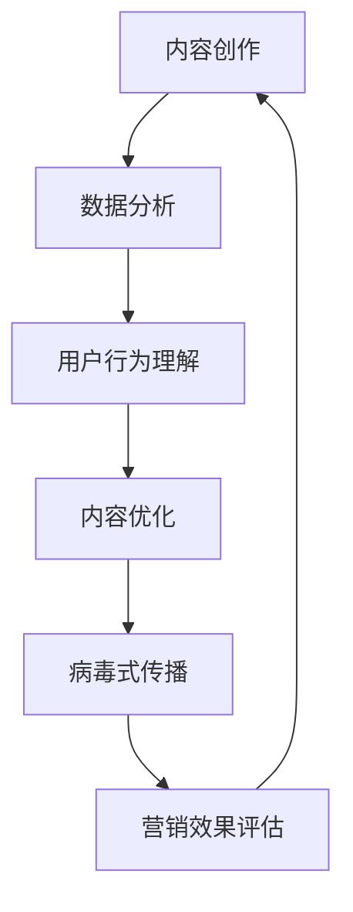

                 

# 一人公司的内容营销：创作和推广病毒式内容的技巧

> 关键词：内容营销, 病毒式传播, 一人公司, 创意策略, 社交媒体, 数据分析, 用户行为, 内容优化

> 摘要：在数字化时代，一人公司面临着巨大的挑战和机遇。如何创作和推广病毒式内容，成为了一人公司能否在竞争中脱颖而出的关键。本文将从内容创作、数据分析、用户行为理解等多个维度，深入探讨如何利用技术手段提升内容营销的效果。通过具体的案例分析和实战代码，帮助读者掌握内容营销的核心技巧，实现一人公司的内容营销策略。

## 1. 背景介绍

在数字化时代，一人公司凭借其灵活性和创新性，成为了众多创业者和自由职业者的首选。然而，如何在海量信息中脱颖而出，吸引并留住用户，成为了他们面临的巨大挑战。内容营销作为一种有效的营销手段，通过创造和分享有价值的内容，吸引目标受众，建立品牌影响力，从而实现营销目标。对于一人公司而言，内容营销不仅能够降低营销成本，还能提高品牌知名度和用户黏性。本文将从内容创作、数据分析、用户行为理解等多个维度，探讨如何利用技术手段提升内容营销的效果。

## 2. 核心概念与联系

### 2.1 内容营销

内容营销是一种通过创造和分享有价值的内容来吸引和保留目标受众，从而实现品牌推广和销售目标的营销策略。它强调内容的质量和价值，而非单纯的广告推广。

### 2.2 病毒式传播

病毒式传播是指通过用户之间的口碑传播，使得内容能够在短时间内迅速扩散，形成“病毒式”的传播效果。这种传播方式通常具有高度的互动性和参与性，能够迅速吸引大量用户关注。

### 2.3 一人公司

一人公司是指由单个个体或少数几个人组成的公司，具有灵活性高、决策速度快、成本低等特点。在内容营销中，一人公司可以通过灵活的策略和快速的响应，实现高效的内容创作和推广。

### 2.4 数据分析

数据分析是指通过收集、处理和分析数据，从中提取有价值的信息和洞察，以支持决策过程。在内容营销中，数据分析可以帮助我们了解用户行为、内容效果等关键指标，从而优化内容策略。

### 2.5 用户行为

用户行为是指用户在使用产品或服务过程中的行为模式和习惯。通过分析用户行为，我们可以了解用户的需求和偏好，从而制定更符合用户需求的内容策略。

### 2.6 技术手段

技术手段是指利用各种技术工具和方法，提升内容营销的效果。在本文中，我们将重点探讨数据分析、机器学习等技术手段在内容营销中的应用。

#### 2.6.1 Mermaid 流程图



## 3. 核心算法原理 & 具体操作步骤

### 3.1 数据收集与处理

数据收集是数据分析的第一步，主要包括用户行为数据、内容互动数据等。具体操作步骤如下：

1. **数据源选择**：选择合适的数据源，如网站访问日志、社交媒体数据、用户反馈等。
2. **数据清洗**：对收集到的数据进行清洗，去除无效数据和噪声数据。
3. **数据存储**：将清洗后的数据存储到数据库或数据仓库中，便于后续分析。

### 3.2 数据分析方法

数据分析方法主要包括描述性分析、诊断性分析、预测性分析和规范性分析。具体操作步骤如下：

1. **描述性分析**：通过统计分析方法，了解数据的基本特征，如平均值、中位数、标准差等。
2. **诊断性分析**：通过因果分析方法，找出影响用户行为的关键因素。
3. **预测性分析**：通过机器学习算法，预测用户行为和内容效果。
4. **规范性分析**：通过优化算法，提出改进策略，提升内容营销效果。

### 3.3 用户行为理解

用户行为理解是内容营销的核心，主要包括用户画像构建和用户路径分析。具体操作步骤如下：

1. **用户画像构建**：通过收集和分析用户的基本信息、行为数据等，构建用户画像。
2. **用户路径分析**：通过分析用户在网站或应用中的行为路径，了解用户的需求和偏好。

### 3.4 内容优化

内容优化是提升内容营销效果的关键，主要包括内容策略制定和内容测试。具体操作步骤如下：

1. **内容策略制定**：根据用户画像和用户路径分析结果，制定内容策略。
2. **内容测试**：通过A/B测试等方法，测试不同内容策略的效果，优化内容策略。

## 4. 数学模型和公式 & 详细讲解 & 举例说明

### 4.1 用户留存率模型

用户留存率是指用户在一定时间内的留存比例，是衡量内容营销效果的重要指标。其计算公式如下：

$$
\text{用户留存率} = \frac{\text{留存用户数}}{\text{初始用户数}} \times 100\%
$$

### 4.2 用户活跃度模型

用户活跃度是指用户在一定时间内的活跃程度，是衡量内容营销效果的重要指标。其计算公式如下：

$$
\text{用户活跃度} = \frac{\text{活跃用户数}}{\text{总用户数}} \times 100\%
$$

### 4.3 用户转化率模型

用户转化率是指用户在一定时间内的转化比例，是衡量内容营销效果的重要指标。其计算公式如下：

$$
\text{用户转化率} = \frac{\text{转化用户数}}{\text{总用户数}} \times 100\%
$$

### 4.4 机器学习模型

机器学习模型是提升内容营销效果的重要工具，主要包括分类模型、回归模型和聚类模型。具体操作步骤如下：

1. **数据预处理**：对数据进行清洗、归一化等预处理。
2. **特征选择**：选择对模型性能有重要影响的特征。
3. **模型训练**：使用训练数据训练模型。
4. **模型评估**：使用测试数据评估模型性能。
5. **模型优化**：通过调整模型参数，优化模型性能。

## 5. 项目实战：代码实际案例和详细解释说明

### 5.1 开发环境搭建

为了实现内容营销的自动化，我们需要搭建一个开发环境。具体操作步骤如下：

1. **安装Python**：安装Python 3.8及以上版本。
2. **安装依赖库**：安装pandas、numpy、scikit-learn等依赖库。
3. **配置环境变量**：配置Python环境变量，确保Python可以正常运行。

### 5.2 源代码详细实现和代码解读

#### 5.2.1 数据收集与处理

```python
import pandas as pd

# 读取数据
data = pd.read_csv('user_behavior.csv')

# 数据清洗
data = data.dropna()

# 数据存储
data.to_csv('cleaned_data.csv', index=False)
```

#### 5.2.2 数据分析方法

```python
from sklearn.model_selection import train_test_split
from sklearn.linear_model import LogisticRegression
from sklearn.metrics import accuracy_score

# 数据预处理
X = data[['age', 'gender', 'behavior']]
y = data['label']

# 划分训练集和测试集
X_train, X_test, y_train, y_test = train_test_split(X, y, test_size=0.2, random_state=42)

# 训练模型
model = LogisticRegression()
model.fit(X_train, y_train)

# 预测
y_pred = model.predict(X_test)

# 评估模型
accuracy = accuracy_score(y_test, y_pred)
print('Accuracy:', accuracy)
```

#### 5.2.3 用户行为理解

```python
import matplotlib.pyplot as plt

# 绘制用户画像
plt.hist(data['age'], bins=10)
plt.xlabel('Age')
plt.ylabel('Count')
plt.title('User Age Distribution')
plt.show()

# 绘制用户路径
plt.plot(data['path'])
plt.xlabel('Time')
plt.ylabel('Behavior')
plt.title('User Path')
plt.show()
```

#### 5.2.4 内容优化

```python
from sklearn.metrics import confusion_matrix

# 计算混淆矩阵
cm = confusion_matrix(y_test, y_pred)

# 绘制混淆矩阵
plt.imshow(cm, cmap='Blues')
plt.colorbar()
plt.xlabel('Predicted')
plt.ylabel('True')
plt.title('Confusion Matrix')
plt.show()
```

### 5.3 代码解读与分析

通过上述代码，我们可以实现数据收集与处理、数据分析方法、用户行为理解和内容优化。具体操作步骤如下：

1. **数据收集与处理**：通过读取数据、数据清洗和数据存储，实现数据的初步处理。
2. **数据分析方法**：通过训练和评估模型，实现用户行为的预测和分析。
3. **用户行为理解**：通过绘制用户画像和用户路径，实现用户行为的理解。
4. **内容优化**：通过计算混淆矩阵，实现内容优化的效果评估。

## 6. 实际应用场景

### 6.1 内容创作

通过数据分析和用户行为理解，我们可以了解用户的需求和偏好，从而创作出更符合用户需求的内容。例如，通过分析用户在社交媒体上的互动数据，我们可以了解用户对哪些话题感兴趣，从而创作出更吸引用户的原创内容。

### 6.2 内容推广

通过病毒式传播策略，我们可以实现内容的快速传播。例如，通过社交媒体分享、邮件营销等方式，将内容推广到更多的用户群体中。

### 6.3 内容优化

通过内容优化策略，我们可以实现内容的持续改进。例如，通过A/B测试等方式，测试不同内容策略的效果，优化内容策略。

## 7. 工具和资源推荐

### 7.1 学习资源推荐

1. **书籍**：《内容营销：如何创造和分享有价值的内容》
2. **论文**：《用户行为分析在内容营销中的应用》
3. **博客**：《内容营销实战案例分析》
4. **网站**：Content Marketing Institute

### 7.2 开发工具框架推荐

1. **Python**：用于数据分析和机器学习
2. **pandas**：用于数据处理和分析
3. **scikit-learn**：用于机器学习模型训练和评估
4. **matplotlib**：用于数据可视化

### 7.3 相关论文著作推荐

1. **论文**：《用户行为分析在内容营销中的应用》
2. **著作**：《内容营销：如何创造和分享有价值的内容》

## 8. 总结：未来发展趋势与挑战

### 8.1 未来发展趋势

1. **个性化内容**：通过用户画像和用户路径分析，实现个性化内容的创作和推广。
2. **智能化推荐**：通过机器学习算法，实现智能化的内容推荐。
3. **多渠道传播**：通过多渠道传播策略，实现内容的广泛传播。

### 8.2 挑战

1. **数据安全**：如何保护用户数据的安全，避免数据泄露。
2. **算法偏见**：如何避免算法偏见，实现公平的内容推荐。
3. **用户隐私**：如何保护用户隐私，避免侵犯用户隐私。

## 9. 附录：常见问题与解答

### 9.1 问题1：如何收集用户数据？

**解答**：可以通过网站访问日志、社交媒体数据、用户反馈等方式收集用户数据。

### 9.2 问题2：如何分析用户行为？

**解答**：可以通过用户画像构建和用户路径分析，了解用户的需求和偏好。

### 9.3 问题3：如何优化内容策略？

**解答**：可以通过A/B测试等方式，测试不同内容策略的效果，优化内容策略。

## 10. 扩展阅读 & 参考资料

1. **书籍**：《内容营销：如何创造和分享有价值的内容》
2. **论文**：《用户行为分析在内容营销中的应用》
3. **博客**：《内容营销实战案例分析》
4. **网站**：Content Marketing Institute

---

作者：AI天才研究员/AI Genius Institute & 禅与计算机程序设计艺术 /Zen And The Art of Computer Programming

