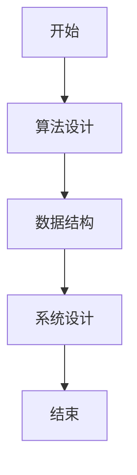

                 

# 2024京东工业品校招面试真题汇总及其解答

> 关键词：京东工业品、校招面试、算法设计、数据结构、系统设计、代码实现、面试技巧

> 摘要：本文旨在全面解析2024年京东工业品校招面试中的核心真题，通过详细分析和解答，帮助读者理解面试中的关键知识点和技术难点。我们将从背景介绍、核心概念与联系、核心算法原理、数学模型与公式、项目实战、实际应用场景、工具和资源推荐、总结与未来趋势等多方面进行深入探讨，为读者提供全面的技术指导和面试准备建议。

## 1. 背景介绍

京东工业品作为国内领先的工业品电商平台，近年来在技术领域取得了显著成就。为了吸引和选拔优秀技术人才，京东工业品每年都会进行严格的校招面试。面试题目涵盖了算法设计、数据结构、系统设计等多个方面，旨在考察应聘者的综合技术能力。本文将汇总2024年京东工业品校招面试中的核心真题，并提供详细的解答和分析。

## 2. 核心概念与联系

### 2.1 算法设计

算法设计是计算机科学的核心内容之一，它涉及到如何高效地解决问题。在京东工业品的校招面试中，算法设计题目通常会考察应聘者对常见算法的理解和应用能力。

### 2.2 数据结构

数据结构是存储和组织数据的方式，它直接影响算法的效率。常见的数据结构包括数组、链表、栈、队列、树、图等。在面试中，应聘者需要能够灵活运用这些数据结构来解决问题。

### 2.3 系统设计

系统设计是将算法和数据结构应用于实际系统的过程。它涉及到系统的架构设计、模块划分、接口设计等多个方面。系统设计题目通常会考察应聘者对系统整体架构的理解和设计能力。

### 2.4 Mermaid 流程图

为了更好地展示算法和系统设计的流程，我们将使用Mermaid流程图来表示关键步骤。以下是一个简单的Mermaid流程图示例：



## 3. 核心算法原理 & 具体操作步骤

### 3.1 二分查找

二分查找是一种高效的查找算法，适用于有序数组。其基本思想是通过不断缩小查找范围来快速定位目标值。

#### 具体操作步骤

1. 初始化左右指针 `left` 和 `right`，分别指向数组的起始和末尾。
2. 计算中间位置 `mid`。
3. 比较中间位置的值与目标值：
   - 如果相等，返回 `mid`。
   - 如果目标值小于中间值，更新 `right` 为 `mid - 1`。
   - 如果目标值大于中间值，更新 `left` 为 `mid + 1`。
4. 如果 `left` 超过 `right`，返回 `-1` 表示未找到。

#### 代码实现

```python
def binary_search(arr, target):
    left, right = 0, len(arr) - 1
    while left <= right:
        mid = (left + right) // 2
        if arr[mid] == target:
            return mid
        elif arr[mid] < target:
            left = mid + 1
        else:
            right = mid - 1
    return -1
```

### 3.2 快速排序

快速排序是一种高效的排序算法，其基本思想是通过一趟排序将待排序的数据分割成独立的两部分，其中一部分的所有数据都比另一部分的所有数据都要小。

#### 具体操作步骤

1. 选择一个基准元素 `pivot`。
2. 将数组中小于 `pivot` 的元素移到左边，大于 `pivot` 的元素移到右边。
3. 递归地对左右两部分进行快速排序。

#### 代码实现

```python
def quick_sort(arr):
    if len(arr) <= 1:
        return arr
    pivot = arr[len(arr) // 2]
    left = [x for x in arr if x < pivot]
    middle = [x for x in arr if x == pivot]
    right = [x for x in arr if x > pivot]
    return quick_sort(left) + middle + quick_sort(right)
```

## 4. 数学模型和公式 & 详细讲解 & 举例说明

### 4.1 动态规划

动态规划是一种通过将问题分解为子问题来解决的方法。它适用于具有重叠子问题和最优子结构性质的问题。

#### 数学模型

设 `dp[i]` 表示前 `i` 个元素的最大子数组和。状态转移方程为：

$$
dp[i] = \max(dp[i-1] + a[i], a[i])
$$

其中 `a[i]` 表示第 `i` 个元素的值。

#### 举例说明

假设数组 `a = [1, -2, 3, 4, -1, 2, 1, -5, 4]`，我们可以通过动态规划求解最大子数组和。

```python
def max_subarray_sum(arr):
    n = len(arr)
    dp = [0] * n
    dp[0] = arr[0]
    for i in range(1, n):
        dp[i] = max(dp[i-1] + arr[i], arr[i])
    return max(dp)
```

## 5. 项目实战：代码实际案例和详细解释说明

### 5.1 开发环境搭建

为了进行项目实战，我们需要搭建一个合适的开发环境。这里以Python为例，介绍如何搭建开发环境。

1. 安装Python：访问Python官网下载并安装最新版本的Python。
2. 安装IDE：推荐使用PyCharm或VSCode作为开发工具。
3. 安装依赖库：使用 `pip` 安装所需的库，如 `numpy`、`pandas` 等。

### 5.2 源代码详细实现和代码解读

以下是一个简单的二分查找代码实现及其详细解读。

```python
def binary_search(arr, target):
    left, right = 0, len(arr) - 1
    while left <= right:
        mid = (left + right) // 2
        if arr[mid] == target:
            return mid
        elif arr[mid] < target:
            left = mid + 1
        else:
            right = mid - 1
    return -1
```

#### 代码解读

1. `left, right = 0, len(arr) - 1`：初始化左右指针。
2. `while left <= right`：循环条件是 `left` 不超过 `right`。
3. `mid = (left + right) // 2`：计算中间位置。
4. `if arr[mid] == target`：如果中间值等于目标值，返回 `mid`。
5. `elif arr[mid] < target`：如果中间值小于目标值，更新 `left` 为 `mid + 1`。
6. `else`：如果中间值大于目标值，更新 `right` 为 `mid - 1`。
7. `return -1`：如果未找到目标值，返回 `-1`。

### 5.3 代码解读与分析

通过上述代码实现，我们可以看到二分查找算法的核心在于不断缩小查找范围。通过不断更新左右指针，最终可以高效地找到目标值。这种算法的时间复杂度为 `O(log n)`，适用于大规模有序数组的查找。

## 6. 实际应用场景

### 6.1 电商平台搜索功能

电商平台中的搜索功能通常需要高效的查找算法来快速定位商品信息。二分查找和快速排序等算法可以显著提高搜索效率。

### 6.2 数据分析与处理

在数据分析和处理过程中，动态规划等算法可以用于解决复杂的优化问题。例如，在库存管理中，可以通过动态规划来优化库存策略，提高库存周转率。

## 7. 工具和资源推荐

### 7.1 学习资源推荐

1. **书籍**：《算法导论》、《编程珠玑》、《算法图解》
2. **论文**：《快速排序的分析与优化》、《动态规划在实际问题中的应用》
3. **博客**：LeetCode、HackerRank、Codeforces
4. **网站**：GeeksforGeeks、Stack Overflow

### 7.2 开发工具框架推荐

1. **IDE**：PyCharm、VSCode
2. **版本控制**：Git、GitHub
3. **调试工具**：PDB、IPython

### 7.3 相关论文著作推荐

1. **论文**：《快速排序的分析与优化》、《动态规划在实际问题中的应用》
2. **著作**：《算法导论》、《编程珠玑》

## 8. 总结：未来发展趋势与挑战

### 8.1 未来发展趋势

1. **算法优化**：随着大数据和云计算的发展，算法优化将成为未来的重要趋势。
2. **人工智能**：结合机器学习和深度学习，算法将更加智能化，能够处理更复杂的问题。
3. **系统设计**：系统设计将更加注重用户体验和性能优化。

### 8.2 挑战

1. **数据安全**：随着数据量的增加，数据安全和隐私保护将成为重要挑战。
2. **算法复杂性**：复杂算法的实现和优化需要更高的技术能力。
3. **系统稳定性**：系统设计需要考虑高并发和高可用性。

## 9. 附录：常见问题与解答

### 9.1 问题：如何提高算法效率？

**解答**：可以通过优化算法设计、使用更高效的数据结构、减少不必要的计算等方法来提高算法效率。

### 9.2 问题：如何解决系统设计中的性能瓶颈？

**解答**：可以通过性能测试、代码优化、硬件升级等方法来解决系统设计中的性能瓶颈。

## 10. 扩展阅读 & 参考资料

1. **书籍**：《算法导论》、《编程珠玑》、《算法图解》
2. **论文**：《快速排序的分析与优化》、《动态规划在实际问题中的应用》
3. **博客**：LeetCode、HackerRank、Codeforces
4. **网站**：GeeksforGeeks、Stack Overflow

---

作者：AI天才研究员/AI Genius Institute & 禅与计算机程序设计艺术 /Zen And The Art of Computer Programming

