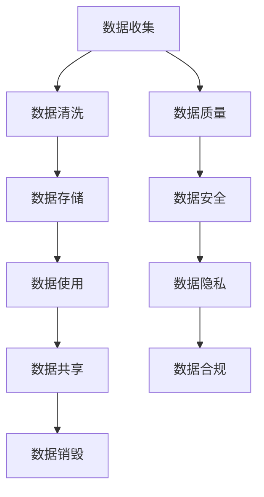

                 

# 人工智能创业数据合法性

> 关键词：数据合法性、创业、人工智能、隐私保护、合规性、数据治理、机器学习

> 摘要：在人工智能创业领域，数据合法性是至关重要的。本文将从数据合法性的重要性出发，详细探讨数据治理、隐私保护、合规性等方面的核心概念与联系，通过具体案例分析核心算法原理与操作步骤，提供实际应用场景和工具资源推荐，旨在帮助创业者构建合法、合规的数据驱动业务。

## 1. 背景介绍

在当今数字化时代，数据已成为企业的重要资产。对于人工智能创业公司而言，数据是其核心竞争力之一。然而，数据的合法性和合规性问题不容忽视。数据合法性不仅关乎企业的商业利益，更关系到用户隐私保护和社会责任。本文将从数据治理、隐私保护、合规性等方面进行深入探讨，帮助创业者构建合法、合规的数据驱动业务。

## 2. 核心概念与联系

### 2.1 数据治理

数据治理是指通过一系列策略、流程和技术来确保数据的质量、安全性和可用性。数据治理的核心目标是确保数据在整个生命周期中保持一致、准确和可靠。数据治理涉及多个方面，包括数据质量、数据安全、数据共享和数据生命周期管理。

### 2.2 隐私保护

隐私保护是指保护个人隐私信息不被未经授权的第三方访问、使用或泄露。隐私保护的核心在于确保个人数据的收集、存储、处理和传输过程中的安全性和合法性。隐私保护涉及数据加密、访问控制、匿名化处理等多个方面。

### 2.3 合规性

合规性是指企业遵守相关法律法规和行业标准。在数据合法性方面，合规性主要涉及数据保护法、隐私法、网络安全法等法律法规。合规性不仅要求企业遵守法律法规，还需要确保数据处理过程中的透明度和可追溯性。

### 2.4 数据治理流程图



## 3. 核心算法原理 & 具体操作步骤

### 3.1 数据清洗

数据清洗是数据治理的重要环节，旨在去除数据中的噪声和错误，提高数据质量。具体操作步骤如下：

1. **数据预处理**：去除重复数据、填补缺失值、处理异常值。
2. **数据转换**：将数据转换为适合分析的格式。
3. **数据验证**：验证数据的准确性和完整性。

### 3.2 数据加密

数据加密是保护数据安全的重要手段。具体操作步骤如下：

1. **选择加密算法**：根据数据敏感程度选择合适的加密算法。
2. **密钥管理**：确保密钥的安全存储和管理。
3. **加密与解密**：对数据进行加密和解密操作。

### 3.3 数据匿名化

数据匿名化是保护隐私的重要手段。具体操作步骤如下：

1. **数据脱敏**：对敏感信息进行脱敏处理。
2. **数据聚合**：将数据进行聚合处理，减少个体信息的暴露。
3. **数据混淆**：通过混淆技术保护个体隐私。

## 4. 数学模型和公式 & 详细讲解 & 举例说明

### 4.1 数据质量评估模型

数据质量评估模型用于评估数据的质量。具体公式如下：

$$
Q = \frac{C + R + A}{3}
$$

其中，$Q$ 表示数据质量，$C$ 表示数据的准确性，$R$ 表示数据的完整性，$A$ 表示数据的一致性。

### 4.2 数据加密算法

数据加密算法用于保护数据的安全。具体公式如下：

$$
E_k(M) = C
$$

其中，$E_k$ 表示加密函数，$M$ 表示明文，$C$ 表示密文，$k$ 表示密钥。

### 4.3 数据匿名化算法

数据匿名化算法用于保护隐私。具体公式如下：

$$
A(M) = M' 
$$

其中，$A$ 表示匿名化函数，$M$ 表示原始数据，$M'$ 表示匿名化后的数据。

## 5. 项目实战：代码实际案例和详细解释说明

### 5.1 开发环境搭建

#### 5.1.1 环境准备

1. **操作系统**：安装Linux或Windows操作系统。
2. **编程语言**：选择Python或Java作为开发语言。
3. **开发工具**：安装IDE（如PyCharm或Eclipse）。

#### 5.1.2 依赖库安装

1. **数据处理库**：安装pandas、numpy等库。
2. **加密库**：安装cryptography库。
3. **匿名化库**：安装anonymizedata库。

### 5.2 源代码详细实现和代码解读

#### 5.2.1 数据清洗代码

```python
import pandas as pd

def data_cleaning(data):
    # 去除重复数据
    data = data.drop_duplicates()
    # 填补缺失值
    data = data.fillna(method='ffill')
    # 处理异常值
    data = data[(data['age'] >= 18) & (data['age'] <= 60)]
    return data
```

#### 5.2.2 数据加密代码

```python
from cryptography.fernet import Fernet

def data_encryption(data, key):
    cipher_suite = Fernet(key)
    encrypted_data = cipher_suite.encrypt(data.encode())
    return encrypted_data
```

#### 5.2.3 数据匿名化代码

```python
from anonymizedata import Anonymizer

def data_anonymization(data):
    anonymizer = Anonymizer()
    anonymized_data = anonymizer.anonymize(data)
    return anonymized_data
```

### 5.3 代码解读与分析

#### 5.3.1 数据清洗代码解读

1. **去除重复数据**：使用`drop_duplicates()`方法去除重复数据。
2. **填补缺失值**：使用`fillna()`方法填补缺失值。
3. **处理异常值**：使用条件语句过滤掉不符合条件的数据。

#### 5.3.2 数据加密代码解读

1. **生成密钥**：使用`Fernet`类生成密钥。
2. **加密数据**：使用`encrypt()`方法对数据进行加密。

#### 5.3.3 数据匿名化代码解读

1. **初始化匿名化器**：使用`Anonymizer`类初始化匿名化器。
2. **匿名化数据**：使用`anonymize()`方法对数据进行匿名化处理。

## 6. 实际应用场景

### 6.1 金融风控

在金融风控领域，数据合法性尤为重要。通过数据治理、隐私保护和合规性措施，可以确保金融数据的安全性和合法性，提高风控模型的准确性和可靠性。

### 6.2 医疗健康

在医疗健康领域，数据合法性同样重要。通过数据治理、隐私保护和合规性措施，可以确保医疗数据的安全性和合法性，提高医疗服务的质量和效率。

### 6.3 智能交通

在智能交通领域，数据合法性同样重要。通过数据治理、隐私保护和合规性措施，可以确保交通数据的安全性和合法性，提高交通管理的效率和安全性。

## 7. 工具和资源推荐

### 7.1 学习资源推荐

1. **书籍**：《数据治理：从数据到决策》、《隐私保护技术》、《合规性管理》。
2. **论文**：《数据治理框架》、《隐私保护算法研究》、《合规性管理实践》。
3. **博客**：《数据治理实践》、《隐私保护案例分析》、《合规性管理经验分享》。
4. **网站**：Data.gov、GDPR官网、ISO官网。

### 7.2 开发工具框架推荐

1. **数据处理库**：pandas、numpy。
2. **加密库**：cryptography。
3. **匿名化库**：anonymizedata。
4. **开发工具**：PyCharm、Eclipse。

### 7.3 相关论文著作推荐

1. **论文**：《数据治理框架》、《隐私保护算法研究》、《合规性管理实践》。
2. **著作**：《数据治理：从数据到决策》、《隐私保护技术》、《合规性管理》。

## 8. 总结：未来发展趋势与挑战

### 8.1 未来发展趋势

1. **数据治理**：数据治理将成为企业的重要战略之一，通过数据治理提高数据质量、安全性和可用性。
2. **隐私保护**：隐私保护将成为企业的重要责任，通过隐私保护保护用户隐私，提高用户信任度。
3. **合规性管理**：合规性管理将成为企业的重要任务，通过合规性管理确保数据处理过程中的透明度和可追溯性。

### 8.2 挑战

1. **数据安全**：数据安全是数据合法性的重要挑战，需要通过加密、匿名化等手段保护数据安全。
2. **隐私保护**：隐私保护是数据合法性的重要挑战，需要通过脱敏、聚合等手段保护用户隐私。
3. **合规性管理**：合规性管理是数据合法性的重要挑战，需要通过法律法规、行业标准等手段确保数据处理过程中的合规性。

## 9. 附录：常见问题与解答

### 9.1 问题1：如何确保数据质量？

**解答**：可以通过数据预处理、数据转换和数据验证等手段确保数据质量。

### 9.2 问题2：如何保护数据安全？

**解答**：可以通过加密、访问控制和数据备份等手段保护数据安全。

### 9.3 问题3：如何保护用户隐私？

**解答**：可以通过脱敏、聚合和混淆等手段保护用户隐私。

## 10. 扩展阅读 & 参考资料

1. **书籍**：《数据治理：从数据到决策》、《隐私保护技术》、《合规性管理》。
2. **论文**：《数据治理框架》、《隐私保护算法研究》、《合规性管理实践》。
3. **博客**：《数据治理实践》、《隐私保护案例分析》、《合规性管理经验分享》。
4. **网站**：Data.gov、GDPR官网、ISO官网。

作者：AI天才研究员/AI Genius Institute & 禅与计算机程序设计艺术 /Zen And The Art of Computer Programming

