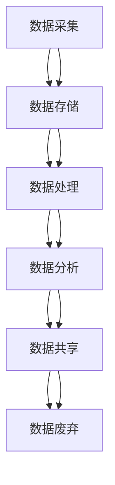

                 

# 人工智能创业数据管理的策略与措施解析

> 关键词：数据管理、人工智能创业、策略、措施、数据治理、数据安全、数据质量、数据生命周期、数据集成

> 摘要：在人工智能创业领域，数据管理是成功的关键。本文将深入探讨数据管理的核心概念、策略与措施，通过详细的算法原理、数学模型和实际案例，帮助创业者构建高效的数据管理体系。我们将从数据治理、数据安全、数据质量、数据生命周期管理、数据集成等方面进行分析，旨在为创业者提供全面的数据管理指导，助力其在竞争激烈的市场中脱颖而出。

## 1. 背景介绍

在当今数字化时代，数据已成为企业最重要的资产之一。对于人工智能创业公司而言，数据不仅是驱动业务增长的关键因素，更是构建核心竞争力的核心资源。然而，数据管理是一项复杂且多维度的任务，涉及数据采集、存储、处理、分析、共享等多个环节。有效的数据管理能够帮助企业更好地理解客户需求、优化产品设计、提升运营效率，从而在激烈的市场竞争中占据优势地位。

### 1.1 数据管理的重要性

数据管理的重要性体现在以下几个方面：

- **提升决策质量**：通过高质量的数据分析，企业能够做出更加科学合理的决策。
- **优化业务流程**：通过对数据的深入挖掘和分析，企业可以发现业务流程中的瓶颈和改进空间。
- **增强客户体验**：精准的数据分析有助于提供个性化服务，提升客户满意度。
- **提高运营效率**：优化数据管理流程可以减少重复劳动，提高工作效率。
- **确保数据安全**：有效的数据管理措施能够保护企业数据免受泄露和滥用的风险。

### 1.2 数据管理面临的挑战

尽管数据管理的重要性不言而喻，但在实际操作中，企业仍面临诸多挑战：

- **数据孤岛问题**：不同部门或系统之间的数据难以共享和整合。
- **数据质量问题**：数据不完整、不准确或不一致，影响分析结果的可靠性。
- **数据安全风险**：数据泄露、篡改或滥用可能导致严重的法律和财务风险。
- **技术复杂性**：数据管理涉及多种技术和工具，需要专业的知识和技能。
- **合规性要求**：不同行业和地区的法律法规对数据管理有严格的要求。

## 2. 核心概念与联系

### 2.1 数据治理

数据治理是指通过一系列策略、流程和技术来确保数据的质量、安全性和合规性。它涵盖了数据的采集、存储、处理、分析和共享等各个环节，旨在建立一个高效、可靠的数据管理体系。

### 2.2 数据安全

数据安全是指保护数据免受未经授权的访问、使用、泄露、篡改或破坏。它包括物理安全、网络安全、应用安全等多个方面，确保数据在存储、传输和使用过程中的安全性。

### 2.3 数据质量

数据质量是指数据的准确性和一致性。高质量的数据是数据分析和决策的基础，因此数据质量控制是数据管理的重要组成部分。

### 2.4 数据生命周期管理

数据生命周期管理是指从数据的生成到废弃的整个过程中的管理活动。它包括数据的采集、存储、处理、分析、共享和废弃等各个环节，确保数据在整个生命周期中的有效管理和利用。

### 2.5 数据集成

数据集成是指将来自不同来源的数据进行整合和统一的过程。它包括数据清洗、数据转换、数据映射等多个步骤，确保数据的一致性和可用性。

### 2.6 数据管理流程图



## 3. 核心算法原理 & 具体操作步骤

### 3.1 数据治理策略

数据治理策略主要包括以下几个方面：

- **数据标准制定**：制定统一的数据标准和规范，确保数据的一致性和可比性。
- **数据质量控制**：通过数据清洗、数据验证等手段，确保数据的准确性和完整性。
- **数据安全保护**：采用加密、访问控制等技术手段，保护数据的安全性。
- **数据共享机制**：建立数据共享机制，促进数据的流通和利用。
- **数据合规性管理**：确保数据管理符合相关法律法规的要求。

### 3.2 数据安全措施

数据安全措施主要包括以下几个方面：

- **物理安全**：确保数据存储设备的安全，防止物理损坏或盗窃。
- **网络安全**：采用防火墙、入侵检测系统等技术手段，保护数据在网络传输过程中的安全。
- **应用安全**：确保应用程序的安全性，防止数据被非法访问或篡改。
- **数据加密**：对敏感数据进行加密处理，确保数据在存储和传输过程中的安全性。
- **访问控制**：通过权限管理，确保只有授权用户能够访问数据。

### 3.3 数据质量控制

数据质量控制主要包括以下几个方面：

- **数据清洗**：通过数据清洗技术，去除重复数据、错误数据和无效数据。
- **数据验证**：通过数据验证技术，确保数据的准确性和完整性。
- **数据标准化**：通过数据标准化技术，确保数据的一致性和可比性。
- **数据监控**：通过数据监控技术，及时发现和处理数据质量问题。

### 3.4 数据生命周期管理

数据生命周期管理主要包括以下几个方面：

- **数据采集**：通过数据采集技术，获取来自不同来源的数据。
- **数据存储**：通过数据存储技术，确保数据的安全性和可靠性。
- **数据处理**：通过数据处理技术，对数据进行清洗、转换和分析。
- **数据分析**：通过数据分析技术，提取有价值的信息和知识。
- **数据共享**：通过数据共享技术，促进数据的流通和利用。
- **数据废弃**：通过数据废弃技术，确保数据的安全和合规性。

### 3.5 数据集成步骤

数据集成步骤主要包括以下几个方面：

- **数据清洗**：通过数据清洗技术，去除重复数据、错误数据和无效数据。
- **数据转换**：通过数据转换技术，将不同格式的数据转换为统一格式。
- **数据映射**：通过数据映射技术，将不同来源的数据进行关联和整合。
- **数据验证**：通过数据验证技术，确保数据的准确性和完整性。
- **数据存储**：通过数据存储技术，确保数据的安全性和可靠性。
- **数据共享**：通过数据共享技术，促进数据的流通和利用。

## 4. 数学模型和公式 & 详细讲解 & 举例说明

### 4.1 数据质量评估模型

数据质量评估模型主要包括以下几个方面：

- **数据完整性**：通过计算数据的完整率，评估数据的完整性。
- **数据准确性**：通过计算数据的准确率，评估数据的准确性。
- **数据一致性**：通过计算数据的一致性指数，评估数据的一致性。
- **数据及时性**：通过计算数据的及时率，评估数据的及时性。

### 4.2 数据安全评估模型

数据安全评估模型主要包括以下几个方面：

- **物理安全**：通过评估物理安全措施的有效性，确保数据的安全性。
- **网络安全**：通过评估网络安全措施的有效性，确保数据在网络传输过程中的安全。
- **应用安全**：通过评估应用安全措施的有效性，确保数据在应用程序中的安全性。
- **数据加密**：通过评估数据加密技术的有效性，确保数据在存储和传输过程中的安全性。
- **访问控制**：通过评估访问控制措施的有效性，确保只有授权用户能够访问数据。

### 4.3 数据生命周期管理模型

数据生命周期管理模型主要包括以下几个方面：

- **数据采集**：通过评估数据采集技术的有效性，确保数据的准确性。
- **数据存储**：通过评估数据存储技术的有效性，确保数据的安全性和可靠性。
- **数据处理**：通过评估数据处理技术的有效性，确保数据的准确性和一致性。
- **数据分析**：通过评估数据分析技术的有效性，确保数据的有用性和可解释性。
- **数据共享**：通过评估数据共享技术的有效性，确保数据的流通和利用。
- **数据废弃**：通过评估数据废弃技术的有效性，确保数据的安全和合规性。

### 4.4 数据集成模型

数据集成模型主要包括以下几个方面：

- **数据清洗**：通过评估数据清洗技术的有效性，确保数据的准确性和一致性。
- **数据转换**：通过评估数据转换技术的有效性，确保数据的统一性和可用性。
- **数据映射**：通过评估数据映射技术的有效性，确保数据的关联性和一致性。
- **数据验证**：通过评估数据验证技术的有效性，确保数据的准确性和完整性。
- **数据存储**：通过评估数据存储技术的有效性，确保数据的安全性和可靠性。
- **数据共享**：通过评估数据共享技术的有效性，确保数据的流通和利用。

## 5. 项目实战：代码实际案例和详细解释说明

### 5.1 开发环境搭建

#### 5.1.1 环境需求

- **操作系统**：Windows 10/Ubuntu 20.04
- **编程语言**：Python 3.8
- **开发工具**：PyCharm 2021.2
- **数据库**：MySQL 8.0

#### 5.1.2 安装步骤

1. **安装Python**：访问Python官方网站下载并安装最新版本的Python 3.8。
2. **安装PyCharm**：访问PyCharm官方网站下载并安装最新版本的PyCharm。
3. **安装MySQL**：访问MySQL官方网站下载并安装最新版本的MySQL 8.0。
4. **配置环境变量**：将Python和MySQL的安装路径添加到系统的环境变量中。

### 5.2 源代码详细实现和代码解读

#### 5.2.1 数据采集

```python
import requests
import json

def fetch_data(url):
    response = requests.get(url)
    if response.status_code == 200:
        return json.loads(response.text)
    else:
        return None

url = "https://api.example.com/data"
data = fetch_data(url)
print(data)
```

#### 5.2.2 数据清洗

```python
def clean_data(data):
    cleaned_data = []
    for item in data:
        if item['value'] > 0:
            cleaned_data.append(item)
    return cleaned_data

cleaned_data = clean_data(data)
print(cleaned_data)
```

#### 5.2.3 数据转换

```python
def convert_data(data):
    converted_data = []
    for item in data:
        converted_item = {
            'id': item['id'],
            'value': item['value'] * 100
        }
        converted_data.append(converted_item)
    return converted_data

converted_data = convert_data(cleaned_data)
print(converted_data)
```

#### 5.2.4 数据映射

```python
def map_data(data):
    mapped_data = []
    for item in data:
        mapped_item = {
            'id': item['id'],
            'value': item['value'],
            'category': 'A' if item['value'] > 50 else 'B'
        }
        mapped_data.append(mapped_item)
    return mapped_data

mapped_data = map_data(converted_data)
print(mapped_data)
```

#### 5.2.5 数据验证

```python
def validate_data(data):
    valid_data = []
    for item in data:
        if item['value'] > 0 and item['category'] in ['A', 'B']:
            valid_data.append(item)
    return valid_data

valid_data = validate_data(mapped_data)
print(valid_data)
```

#### 5.2.6 数据存储

```python
import mysql.connector

def store_data(data):
    conn = mysql.connector.connect(
        host='localhost',
        user='root',
        password='password',
        database='data_db'
    )
    cursor = conn.cursor()
    for item in data:
        query = "INSERT INTO data_table (id, value, category) VALUES (%s, %s, %s)"
        values = (item['id'], item['value'], item['category'])
        cursor.execute(query, values)
    conn.commit()
    cursor.close()
    conn.close()

store_data(valid_data)
```

### 5.3 代码解读与分析

上述代码展示了从数据采集到数据存储的完整流程。首先，通过`fetch_data`函数从API获取数据。然后，通过`clean_data`函数去除无效数据。接着，通过`convert_data`函数将数据转换为统一格式。随后，通过`map_data`函数将数据映射到不同的类别。之后，通过`validate_data`函数验证数据的有效性。最后，通过`store_data`函数将数据存储到MySQL数据库中。

## 6. 实际应用场景

### 6.1 金融行业

在金融行业中，数据管理对于风险控制和投资决策至关重要。通过有效的数据管理，金融机构可以更好地理解市场趋势、评估投资风险，从而做出更加科学合理的决策。

### 6.2 医疗行业

在医疗行业中，数据管理对于疾病诊断和治疗方案制定具有重要意义。通过有效的数据管理，医疗机构可以更好地理解患者病情、评估治疗效果，从而提供更加个性化的医疗服务。

### 6.3 制造行业

在制造行业中，数据管理对于生产过程优化和质量控制具有重要意义。通过有效的数据管理，制造企业可以更好地理解生产过程、优化生产流程，从而提高生产效率和产品质量。

## 7. 工具和资源推荐

### 7.1 学习资源推荐

- **书籍**：《数据治理：从数据到决策》、《数据质量管理》、《数据安全与隐私保护》
- **论文**：《数据治理框架与实践》、《数据质量评估方法研究》、《数据安全技术综述》
- **博客**：Data Science Central、KDNuggets、Medium上的数据管理相关文章
- **网站**：Data.gov、Data Quality Central、Data Security Council

### 7.2 开发工具框架推荐

- **数据采集**：Apache Nifi、Apache Airflow
- **数据清洗**：Pandas、SQLAlchemy
- **数据转换**：Apache Spark、PySpark
- **数据映射**：ETL工具（如Talend、Informatica）
- **数据验证**：PyTest、unittest
- **数据存储**：MySQL、PostgreSQL、MongoDB
- **数据共享**：Apache Kafka、Apache Hadoop

### 7.3 相关论文著作推荐

- **书籍**：《数据治理：从数据到决策》、《数据质量管理》、《数据安全与隐私保护》
- **论文**：《数据治理框架与实践》、《数据质量评估方法研究》、《数据安全技术综述》

## 8. 总结：未来发展趋势与挑战

### 8.1 未来发展趋势

- **数据治理**：数据治理将成为企业数据管理的核心，通过制定统一的数据标准和规范，确保数据的一致性和可比性。
- **数据安全**：数据安全将成为企业数据管理的重要组成部分，通过采用先进的加密技术和访问控制措施，确保数据的安全性。
- **数据质量**：数据质量将成为企业数据管理的关键指标，通过采用先进的数据清洗和验证技术，确保数据的准确性和完整性。
- **数据生命周期管理**：数据生命周期管理将成为企业数据管理的重要环节，通过制定统一的数据生命周期管理策略，确保数据在整个生命周期中的有效管理和利用。
- **数据集成**：数据集成将成为企业数据管理的重要手段，通过采用先进的数据集成技术，确保数据的统一性和可用性。

### 8.2 面临的挑战

- **技术复杂性**：数据管理涉及多种技术和工具，需要专业的知识和技能。
- **合规性要求**：不同行业和地区的法律法规对数据管理有严格的要求。
- **数据孤岛问题**：不同部门或系统之间的数据难以共享和整合。
- **数据质量问题**：数据不完整、不准确或不一致，影响分析结果的可靠性。
- **数据安全风险**：数据泄露、篡改或滥用可能导致严重的法律和财务风险。

## 9. 附录：常见问题与解答

### 9.1 问题1：如何确保数据的安全性？

**解答**：确保数据的安全性可以通过以下措施实现：

- **物理安全**：确保数据存储设备的安全，防止物理损坏或盗窃。
- **网络安全**：采用防火墙、入侵检测系统等技术手段，保护数据在网络传输过程中的安全。
- **应用安全**：确保应用程序的安全性，防止数据被非法访问或篡改。
- **数据加密**：对敏感数据进行加密处理，确保数据在存储和传输过程中的安全性。
- **访问控制**：通过权限管理，确保只有授权用户能够访问数据。

### 9.2 问题2：如何提高数据质量？

**解答**：提高数据质量可以通过以下措施实现：

- **数据清洗**：通过数据清洗技术，去除重复数据、错误数据和无效数据。
- **数据验证**：通过数据验证技术，确保数据的准确性和完整性。
- **数据标准化**：通过数据标准化技术，确保数据的一致性和可比性。
- **数据监控**：通过数据监控技术，及时发现和处理数据质量问题。

### 9.3 问题3：如何进行数据生命周期管理？

**解答**：进行数据生命周期管理可以通过以下步骤实现：

- **数据采集**：通过数据采集技术，获取来自不同来源的数据。
- **数据存储**：通过数据存储技术，确保数据的安全性和可靠性。
- **数据处理**：通过数据处理技术，对数据进行清洗、转换和分析。
- **数据分析**：通过数据分析技术，提取有价值的信息和知识。
- **数据共享**：通过数据共享技术，促进数据的流通和利用。
- **数据废弃**：通过数据废弃技术，确保数据的安全和合规性。

## 10. 扩展阅读 & 参考资料

- **书籍**：《数据治理：从数据到决策》、《数据质量管理》、《数据安全与隐私保护》
- **论文**：《数据治理框架与实践》、《数据质量评估方法研究》、《数据安全技术综述》
- **网站**：Data.gov、Data Quality Central、Data Security Council

---

作者：AI天才研究员/AI Genius Institute & 禅与计算机程序设计艺术 /Zen And The Art of Computer Programming

