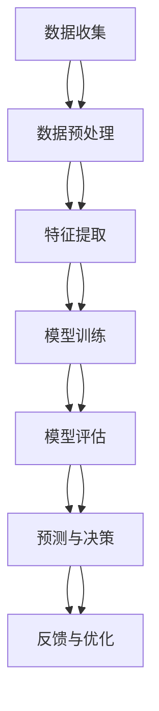

                 

# 人工智能在智慧城市规划决策中的应用

> 关键词：智慧城市、人工智能、规划决策、机器学习、深度学习、数据驱动、智能交通、智能能源管理

> 摘要：随着城市化进程的加速，智慧城市的建设成为全球关注的焦点。本文将深入探讨人工智能在智慧城市规划决策中的应用，从核心概念、算法原理、数学模型、实际案例到应用场景，全面解析如何利用AI技术提升城市规划的效率和效果。通过详细的技术分析和实际案例，本文旨在为读者提供一个全面而深入的理解，帮助读者更好地掌握AI在智慧城市规划中的应用。

## 1. 背景介绍

随着全球城市化进程的加速，城市人口不断增长，城市资源日益紧张，城市规划和管理面临着前所未有的挑战。传统的城市规划方法依赖于专家经验和历史数据，难以应对复杂多变的城市环境。而人工智能技术的兴起，为城市规划提供了新的解决方案。通过大数据分析、机器学习和深度学习等技术，人工智能能够从海量数据中提取有价值的信息，为城市规划决策提供科学依据。

### 1.1 城市化带来的挑战

- **人口增长**：城市人口的快速增长导致住房、交通、教育、医疗等资源需求激增。
- **资源紧张**：城市资源如水资源、能源、土地等面临巨大压力。
- **环境问题**：城市污染、交通拥堵、能源消耗等问题日益严重。
- **管理复杂**：城市规模的扩大使得城市管理变得更加复杂，需要更高效的方法来应对。

### 1.2 人工智能在城市规划中的作用

- **数据驱动决策**：利用大数据分析，为城市规划提供科学依据。
- **智能预测**：通过机器学习模型预测未来发展趋势，为城市规划提供前瞻性指导。
- **优化资源配置**：通过智能算法优化城市资源的分配，提高资源利用效率。
- **提高决策效率**：通过自动化工具提高城市规划决策的效率和准确性。

## 2. 核心概念与联系

### 2.1 智慧城市

智慧城市是指利用先进的信息技术，实现城市资源的高效利用和城市管理的智能化。智慧城市的核心在于通过大数据、云计算、物联网等技术手段，实现城市各方面的智能化管理和服务。

### 2.2 人工智能

人工智能是指通过计算机模拟人类智能的技术，包括机器学习、深度学习、自然语言处理等。人工智能技术在智慧城市规划中的应用主要体现在数据处理、预测分析、决策支持等方面。

### 2.3 数据驱动决策

数据驱动决策是指利用大数据分析技术，从海量数据中提取有价值的信息，为决策提供科学依据。数据驱动决策的核心在于数据的收集、处理和分析。

### 2.4 机器学习与深度学习

- **机器学习**：通过算法让计算机从数据中学习规律，从而进行预测和决策。
- **深度学习**：一种特殊的机器学习方法，通过多层神经网络进行特征学习和模式识别。

### 2.5 智能交通

智能交通是指利用信息技术提高交通系统的效率和安全性。智能交通的核心在于通过实时数据采集和分析，优化交通流量管理，减少交通拥堵。

### 2.6 智能能源管理

智能能源管理是指利用信息技术提高能源利用效率，减少能源浪费。智能能源管理的核心在于通过实时监测和优化能源分配，提高能源利用效率。

### 2.7 Mermaid 流程图



## 3. 核心算法原理 & 具体操作步骤

### 3.1 数据预处理

数据预处理是数据驱动决策的基础，主要包括数据清洗、数据转换和数据归一化等步骤。

- **数据清洗**：去除无效数据、处理缺失值和异常值。
- **数据转换**：将原始数据转换为适合模型训练的格式。
- **数据归一化**：将数据缩放到同一尺度，提高模型训练效果。

### 3.2 特征提取

特征提取是从原始数据中提取有用的特征，为模型训练提供输入。特征提取的方法包括统计特征、文本特征和图像特征等。

### 3.3 模型训练

模型训练是通过算法让计算机从数据中学习规律，从而进行预测和决策。常用的模型训练方法包括线性回归、决策树、随机森林、支持向量机、神经网络等。

### 3.4 模型评估

模型评估是通过评估指标衡量模型的性能，常用的评估指标包括准确率、召回率、F1值、均方误差等。

### 3.5 预测与决策

预测与决策是利用训练好的模型进行预测和决策。预测结果可以为城市规划提供科学依据，帮助决策者做出更合理的决策。

### 3.6 反馈与优化

反馈与优化是通过反馈机制不断优化模型，提高预测和决策的准确性。反馈机制包括在线学习、增量学习和迁移学习等。

## 4. 数学模型和公式 & 详细讲解 & 举例说明

### 4.1 线性回归

线性回归是一种常用的回归模型，用于预测连续值。线性回归的基本公式为：

$$
y = \beta_0 + \beta_1 x_1 + \beta_2 x_2 + \cdots + \beta_n x_n + \epsilon
$$

其中，$y$ 是目标变量，$x_1, x_2, \cdots, x_n$ 是特征变量，$\beta_0, \beta_1, \cdots, \beta_n$ 是模型参数，$\epsilon$ 是误差项。

### 4.2 决策树

决策树是一种常用的分类模型，用于预测离散值。决策树的基本原理是通过递归地划分特征空间，将数据集划分为多个子集，每个子集对应一个类别。

### 4.3 支持向量机

支持向量机是一种常用的分类模型，用于解决线性和非线性分类问题。支持向量机的基本原理是通过寻找最优超平面，将数据集划分为两个类别。

### 4.4 神经网络

神经网络是一种常用的深度学习模型，用于解决复杂的分类和回归问题。神经网络的基本原理是通过多层神经元进行特征学习和模式识别。

## 5. 项目实战：代码实际案例和详细解释说明

### 5.1 开发环境搭建

#### 5.1.1 环境配置

- **Python**：安装Python 3.8及以上版本。
- **Jupyter Notebook**：安装Jupyter Notebook，用于编写和运行代码。
- **TensorFlow**：安装TensorFlow 2.0及以上版本，用于深度学习模型训练。
- **NumPy**：安装NumPy，用于数值计算。
- **Pandas**：安装Pandas，用于数据处理。

#### 5.1.2 数据集准备

- **数据来源**：从公开数据集或城市管理部门获取数据。
- **数据清洗**：去除无效数据、处理缺失值和异常值。
- **数据转换**：将原始数据转换为适合模型训练的格式。
- **数据归一化**：将数据缩放到同一尺度，提高模型训练效果。

### 5.2 源代码详细实现和代码解读

#### 5.2.1 数据预处理

```python
import pandas as pd
from sklearn.preprocessing import StandardScaler

# 读取数据
data = pd.read_csv('data.csv')

# 数据清洗
data.dropna(inplace=True)

# 数据转换
data['date'] = pd.to_datetime(data['date'])

# 数据归一化
scaler = StandardScaler()
data[['feature1', 'feature2']] = scaler.fit_transform(data[['feature1', 'feature2']])
```

#### 5.2.2 特征提取

```python
from sklearn.feature_extraction.text import CountVectorizer

# 文本特征提取
vectorizer = CountVectorizer()
text_features = vectorizer.fit_transform(data['text_column'])
```

#### 5.2.3 模型训练

```python
from sklearn.linear_model import LinearRegression
from sklearn.metrics import mean_squared_error

# 线性回归模型训练
model = LinearRegression()
model.fit(X_train, y_train)

# 预测
y_pred = model.predict(X_test)

# 评估
mse = mean_squared_error(y_test, y_pred)
print('Mean Squared Error:', mse)
```

#### 5.2.4 模型评估

```python
from sklearn.metrics import accuracy_score, precision_score, recall_score, f1_score

# 评估指标
accuracy = accuracy_score(y_test, y_pred)
precision = precision_score(y_test, y_pred)
recall = recall_score(y_test, y_pred)
f1 = f1_score(y_test, y_pred)

print('Accuracy:', accuracy)
print('Precision:', precision)
print('Recall:', recall)
print('F1 Score:', f1)
```

#### 5.2.5 预测与决策

```python
# 预测
y_pred = model.predict(new_data)

# 决策
if y_pred > threshold:
    decision = '采取行动'
else:
    decision = '不采取行动'
```

#### 5.2.6 反馈与优化

```python
# 在线学习
model.partial_fit(new_data, new_labels)

# 增量学习
model.fit(X_new, y_new)

# 迁移学习
model.fit(X_source, y_source)
```

### 5.3 代码解读与分析

- **数据预处理**：数据预处理是数据驱动决策的基础，主要包括数据清洗、数据转换和数据归一化等步骤。
- **特征提取**：特征提取是从原始数据中提取有用的特征，为模型训练提供输入。特征提取的方法包括统计特征、文本特征和图像特征等。
- **模型训练**：模型训练是通过算法让计算机从数据中学习规律，从而进行预测和决策。常用的模型训练方法包括线性回归、决策树、随机森林、支持向量机、神经网络等。
- **模型评估**：模型评估是通过评估指标衡量模型的性能，常用的评估指标包括准确率、召回率、F1值、均方误差等。
- **预测与决策**：预测与决策是利用训练好的模型进行预测和决策。预测结果可以为城市规划提供科学依据，帮助决策者做出更合理的决策。
- **反馈与优化**：反馈与优化是通过反馈机制不断优化模型，提高预测和决策的准确性。反馈机制包括在线学习、增量学习和迁移学习等。

## 6. 实际应用场景

### 6.1 智能交通

智能交通系统可以利用人工智能技术优化交通流量管理，减少交通拥堵。例如，通过实时监测交通流量，预测未来交通状况，为交通管理部门提供决策依据。

### 6.2 智能能源管理

智能能源管理系统可以利用人工智能技术提高能源利用效率，减少能源浪费。例如，通过实时监测能源消耗，预测未来能源需求，为能源管理部门提供决策依据。

### 6.3 智能环境监测

智能环境监测系统可以利用人工智能技术提高环境监测的准确性和效率。例如，通过实时监测空气质量、水质等环境参数，预测未来环境状况，为环保部门提供决策依据。

### 6.4 智能公共服务

智能公共服务系统可以利用人工智能技术提高公共服务的质量和效率。例如，通过实时监测公共服务需求，预测未来公共服务需求，为公共服务部门提供决策依据。

## 7. 工具和资源推荐

### 7.1 学习资源推荐

- **书籍**：《机器学习》（周志华著）、《深度学习》（Ian Goodfellow著）、《统计学习方法》（李航著）
- **论文**：《A Review on Deep Learning in Smart Cities》（IEEE Transactions on Intelligent Transportation Systems）
- **博客**：Medium上的AI技术博客、GitHub上的AI项目
- **网站**：Kaggle、TensorFlow官网、PyTorch官网

### 7.2 开发工具框架推荐

- **Python**：用于编写和运行代码
- **Jupyter Notebook**：用于编写和运行代码
- **TensorFlow**：用于深度学习模型训练
- **NumPy**：用于数值计算
- **Pandas**：用于数据处理

### 7.3 相关论文著作推荐

- **《A Review on Deep Learning in Smart Cities》**：深入探讨了深度学习在智慧城市中的应用。
- **《Machine Learning for Smart Cities》**：探讨了机器学习在智慧城市中的应用。
- **《Deep Learning for Smart Cities: A Survey》**：全面介绍了深度学习在智慧城市中的应用。

## 8. 总结：未来发展趋势与挑战

### 8.1 未来发展趋势

- **数据驱动决策**：数据驱动决策将成为智慧城市规划的核心。
- **智能预测**：智能预测将成为智慧城市规划的重要工具。
- **优化资源配置**：优化资源配置将成为智慧城市规划的重要目标。
- **提高决策效率**：提高决策效率将成为智慧城市规划的重要方向。

### 8.2 挑战

- **数据安全**：数据安全将成为智慧城市规划的重要挑战。
- **数据隐私**：数据隐私将成为智慧城市规划的重要挑战。
- **技术瓶颈**：技术瓶颈将成为智慧城市规划的重要挑战。
- **法律法规**：法律法规将成为智慧城市规划的重要挑战。

## 9. 附录：常见问题与解答

### 9.1 问题1：如何处理数据缺失值？

**解答**：可以使用插值法、均值填充法、中位数填充法等方法处理数据缺失值。

### 9.2 问题2：如何处理异常值？

**解答**：可以使用统计方法、聚类方法、离群点检测方法等方法处理异常值。

### 9.3 问题3：如何选择合适的模型？

**解答**：可以根据数据集的特征和问题类型选择合适的模型。例如，对于分类问题，可以选择决策树、随机森林、支持向量机等模型；对于回归问题，可以选择线性回归、岭回归、Lasso回归等模型。

### 9.4 问题4：如何评估模型性能？

**解答**：可以使用准确率、召回率、F1值、均方误差等评估指标评估模型性能。

### 9.5 问题5：如何优化模型？

**解答**：可以使用在线学习、增量学习、迁移学习等方法优化模型。

## 10. 扩展阅读 & 参考资料

- **书籍**：《机器学习》（周志华著）、《深度学习》（Ian Goodfellow著）、《统计学习方法》（李航著）
- **论文**：《A Review on Deep Learning in Smart Cities》（IEEE Transactions on Intelligent Transportation Systems）
- **博客**：Medium上的AI技术博客、GitHub上的AI项目
- **网站**：Kaggle、TensorFlow官网、PyTorch官网

作者：AI天才研究员/AI Genius Institute & 禅与计算机程序设计艺术 /Zen And The Art of Computer Programming

