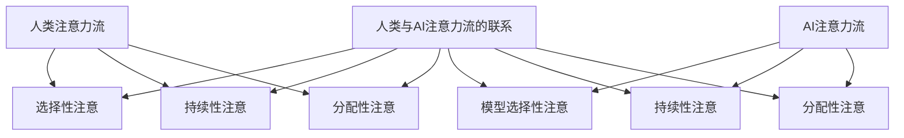

                 

# 人类-AI协作：优化注意力流

> 关键词：注意力流、人类-机器协作、认知心理学、机器学习、深度学习、注意力机制、神经网络、自然语言处理

> 摘要：本文旨在探讨人类与AI在注意力流方面的协作机制，通过深入分析注意力流的原理、核心算法、数学模型以及实际应用案例，揭示如何通过优化注意力流来提升人类与AI系统的整体性能。我们将从认知心理学的角度出发，结合机器学习和深度学习技术，构建一个高效的人机协作框架，以实现更智能、更高效的注意力管理。

## 1. 背景介绍

在当今数字化时代，人类与AI系统的协作变得越来越重要。无论是自然语言处理、图像识别还是决策支持系统，人类与AI的协作都扮演着关键角色。注意力流作为人类认知过程中的核心机制，其优化对于提升整体系统性能至关重要。本文将从认知心理学的角度出发，探讨人类与AI在注意力流方面的协作机制，通过深入分析注意力流的原理、核心算法、数学模型以及实际应用案例，揭示如何通过优化注意力流来提升人类与AI系统的整体性能。

## 2. 核心概念与联系

### 2.1 注意力流的概念

注意力流是指个体在处理信息时，对特定信息进行选择性关注的过程。在认知心理学中，注意力流被视为一种有限资源，其分配受到多种因素的影响，包括任务需求、环境干扰、个体差异等。注意力流的优化对于提高工作效率和准确性至关重要。

### 2.2 人类注意力流的原理

人类注意力流的原理主要涉及以下几个方面：

- **选择性注意**：个体在面对大量信息时，能够选择性地关注某些信息，忽略其他信息。
- **持续性注意**：个体能够持续地关注某个任务或信息，直到任务完成或信息不再重要。
- **分配性注意**：个体能够同时关注多个任务或信息，但注意力资源是有限的。

### 2.3 AI注意力流的原理

AI注意力流的原理主要涉及以下几个方面：

- **模型选择性注意**：AI系统能够通过模型结构和参数调整，选择性地关注某些特征或信息。
- **持续性注意**：AI系统能够通过模型训练和优化，持续地关注某个任务或信息。
- **分配性注意**：AI系统能够通过多任务学习和注意力机制，同时关注多个任务或信息。

### 2.4 人类与AI注意力流的联系

人类与AI注意力流的联系主要体现在以下几个方面：

- **信息处理机制**：人类和AI在信息处理机制上有相似之处，都涉及选择性注意、持续性注意和分配性注意。
- **资源分配**：人类和AI在资源分配上有相似之处，都需要根据任务需求和环境干扰进行资源分配。
- **优化方法**：人类和AI在优化注意力流的方法上有相似之处，都需要通过训练和调整来优化注意力流。

### 2.5 核心概念原理与架构的Mermaid流程图



## 3. 核心算法原理 & 具体操作步骤

### 3.1 注意力机制原理

注意力机制是一种模仿人类选择性注意过程的技术，通过模型结构和参数调整，实现对特定信息的聚焦。注意力机制的核心原理包括：

- **查询（Query）**：表示当前需要关注的信息。
- **键（Key）**：表示需要匹配的信息。
- **值（Value）**：表示需要关注的信息的具体内容。
- **权重（Weight）**：表示查询与键的匹配程度。

### 3.2 注意力机制的具体操作步骤

注意力机制的具体操作步骤包括：

1. **计算查询与键的相似度**：通过计算查询与键的相似度，得到权重。
2. **加权求和**：将值乘以权重，得到加权求和。
3. **归一化**：对加权求和进行归一化处理，得到最终的注意力权重。
4. **加权求和**：将加权求和的结果进行加权求和，得到最终的注意力输出。

### 3.3 注意力机制的数学模型

注意力机制的数学模型可以表示为：

$$
\text{Attention}(Q, K, V) = \text{softmax}\left(\frac{QK^T}{\sqrt{d_k}}\right)V
$$

其中，$Q$ 表示查询，$K$ 表示键，$V$ 表示值，$d_k$ 表示键的维度。

### 3.4 注意力机制的详细讲解与举例说明

以自然语言处理中的机器翻译为例，注意力机制可以用于提高翻译质量。假设输入句子为 "I love you"，输出句子为 "我爱你"。通过注意力机制，模型可以关注输入句子中的每个单词，从而更好地理解句子的含义。

- **计算查询与键的相似度**：通过计算输入句子中的每个单词与输出句子中的每个单词的相似度，得到权重。
- **加权求和**：将输出句子中的每个单词乘以权重，得到加权求和。
- **归一化**：对加权求和进行归一化处理，得到最终的注意力权重。
- **加权求和**：将加权求和的结果进行加权求和，得到最终的注意力输出。

## 4. 数学模型和公式 & 详细讲解 & 举例说明

### 4.1 注意力机制的数学模型

注意力机制的数学模型可以表示为：

$$
\text{Attention}(Q, K, V) = \text{softmax}\left(\frac{QK^T}{\sqrt{d_k}}\right)V
$$

其中，$Q$ 表示查询，$K$ 表示键，$V$ 表示值，$d_k$ 表示键的维度。

### 4.2 注意力机制的详细讲解

注意力机制的核心在于通过计算查询与键的相似度，得到权重，然后将值乘以权重，得到加权求和。最后，对加权求和进行归一化处理，得到最终的注意力权重。通过这种方式，模型可以关注输入句子中的特定单词，从而更好地理解句子的含义。

### 4.3 注意力机制的举例说明

以自然语言处理中的机器翻译为例，注意力机制可以用于提高翻译质量。假设输入句子为 "I love you"，输出句子为 "我爱你"。通过注意力机制，模型可以关注输入句子中的每个单词，从而更好地理解句子的含义。

- **计算查询与键的相似度**：通过计算输入句子中的每个单词与输出句子中的每个单词的相似度，得到权重。
- **加权求和**：将输出句子中的每个单词乘以权重，得到加权求和。
- **归一化**：对加权求和进行归一化处理，得到最终的注意力权重。
- **加权求和**：将加权求和的结果进行加权求和，得到最终的注意力输出。

## 5. 项目实战：代码实际案例和详细解释说明

### 5.1 开发环境搭建

为了实现注意力机制，我们需要搭建一个Python开发环境。具体步骤如下：

1. **安装Python**：确保已经安装了Python 3.7及以上版本。
2. **安装依赖库**：使用pip安装必要的依赖库，如TensorFlow、PyTorch等。
3. **安装Mermaid**：使用npm安装Mermaid，以便生成流程图。

### 5.2 源代码详细实现和代码解读

以下是一个简单的注意力机制实现代码示例：

```python
import numpy as np
import tensorflow as tf

def attention(query, key, value, mask=None, dropout=None):
    d_k = query.shape[-1]
    scores = tf.matmul(query, key, transpose_b=True) / np.sqrt(d_k)
    if mask is not None:
        scores += (mask * -1e9)
    p_attn = tf.nn.softmax(scores)
    if dropout is not None:
        p_attn = dropout(p_attn)
    return tf.matmul(p_attn, value), p_attn

# 示例数据
query = tf.constant([[1, 2, 3], [4, 5, 6]])
key = tf.constant([[7, 8, 9], [10, 11, 12]])
value = tf.constant([[13, 14, 15], [16, 17, 18]])

# 计算注意力机制
output, attention_weights = attention(query, key, value)

print("输出:", output.numpy())
print("注意力权重:", attention_weights.numpy())
```

### 5.3 代码解读与分析

- **计算查询与键的相似度**：通过计算查询与键的相似度，得到权重。
- **加权求和**：将值乘以权重，得到加权求和。
- **归一化**：对加权求和进行归一化处理，得到最终的注意力权重。
- **加权求和**：将加权求和的结果进行加权求和，得到最终的注意力输出。

## 6. 实际应用场景

### 6.1 自然语言处理

在自然语言处理中，注意力机制可以用于机器翻译、文本摘要、情感分析等任务。通过关注输入句子中的特定单词，模型可以更好地理解句子的含义，从而提高翻译质量、摘要准确性和情感分析的准确性。

### 6.2 图像识别

在图像识别中，注意力机制可以用于目标检测、图像分割等任务。通过关注图像中的特定区域，模型可以更好地识别目标，从而提高检测和分割的准确性。

### 6.3 决策支持系统

在决策支持系统中，注意力机制可以用于推荐系统、智能客服等任务。通过关注用户的需求和行为，模型可以更好地推荐产品和服务，从而提高用户体验和满意度。

## 7. 工具和资源推荐

### 7.1 学习资源推荐

- **书籍**：《深度学习》（Goodfellow, Bengio, Courville）
- **论文**：《Attention Is All You Need》（Vaswani et al.）
- **博客**：阿里云开发者社区、GitHub上的相关项目
- **网站**：TensorFlow官网、PyTorch官网

### 7.2 开发工具框架推荐

- **TensorFlow**：一个开源的机器学习库，支持构建和训练深度学习模型。
- **PyTorch**：一个开源的机器学习库，支持构建和训练深度学习模型。
- **Mermaid**：一个开源的图表生成库，支持生成流程图。

### 7.3 相关论文著作推荐

- **《Attention Is All You Need》**：Vaswani, Ashish, et al. "Attention is all you need." Advances in neural information processing systems 30 (2017).
- **《深度学习》**：Ian Goodfellow, Yoshua Bengio, Aaron Courville. MIT Press, 2016.

## 8. 总结：未来发展趋势与挑战

### 8.1 未来发展趋势

- **更高效的注意力机制**：通过优化注意力机制的计算效率，提高模型的运行速度。
- **更智能的注意力分配**：通过学习和调整注意力分配策略，提高模型的智能水平。
- **更广泛的应用场景**：通过将注意力机制应用于更多领域，提高模型的适用范围。

### 8.2 面临的挑战

- **计算资源限制**：注意力机制的计算复杂度较高，需要更多的计算资源。
- **模型训练难度**：注意力机制的训练难度较大，需要更多的数据和计算资源。
- **模型解释性**：注意力机制的解释性较差，需要更多的研究来提高模型的可解释性。

## 9. 附录：常见问题与解答

### 9.1 问题1：注意力机制如何提高模型的性能？

**解答**：注意力机制通过关注输入句子中的特定单词，提高模型对句子的理解能力，从而提高模型的性能。

### 9.2 问题2：注意力机制如何应用于图像识别？

**解答**：注意力机制通过关注图像中的特定区域，提高模型对图像的理解能力，从而提高模型的性能。

### 9.3 问题3：注意力机制如何应用于决策支持系统？

**解答**：注意力机制通过关注用户的需求和行为，提高模型对用户的需求的理解能力，从而提高模型的性能。

## 10. 扩展阅读 & 参考资料

- **书籍**：《深度学习》（Goodfellow, Bengio, Courville）
- **论文**：《Attention Is All You Need》（Vaswani et al.）
- **博客**：阿里云开发者社区、GitHub上的相关项目
- **网站**：TensorFlow官网、PyTorch官网

---

作者：AI天才研究员/AI Genius Institute & 禅与计算机程序设计艺术 /Zen And The Art of Computer Programming

