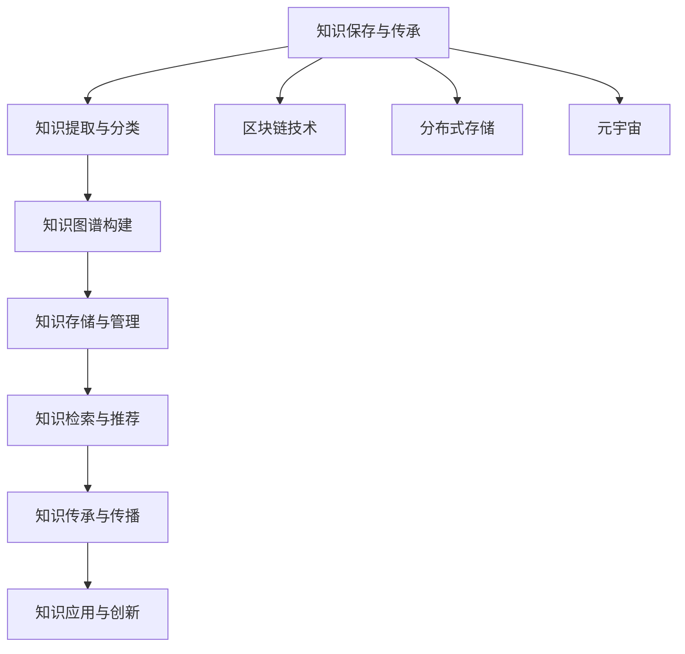

                 

# 人类知识的保存与传承：一座座灯塔指引未来

> 关键词：知识保存、知识传承、人工智能、区块链、分布式存储、知识图谱、元宇宙

> 摘要：在数字化时代，人类知识的保存与传承面临着前所未有的挑战。本文将探讨如何利用现代技术，特别是人工智能、区块链和分布式存储等手段，构建一个高效、安全的知识保存与传承系统。通过构建知识图谱和元宇宙，我们能够实现知识的全面保存与无缝传承，为未来的人类社会提供坚实的知识基础。

## 1. 背景介绍

在人类文明发展的漫长历程中，知识的保存与传承一直是推动社会进步的关键因素。从古代的石刻、竹简，到现代的书籍、互联网，人类一直在寻找更高效、更安全的方式来保存和传承知识。然而，随着数字化时代的到来，知识的保存与传承面临着新的挑战。数据的爆炸性增长、数据的安全性、知识的结构化与可访问性等问题日益突出。本文将探讨如何利用现代技术，特别是人工智能、区块链和分布式存储等手段，构建一个高效、安全的知识保存与传承系统。

## 2. 核心概念与联系

### 2.1 知识保存与传承

知识保存是指将知识以某种形式记录下来，以便在未来被检索和使用。知识传承则是指将知识从一代传递给下一代，确保知识的连续性和完整性。

### 2.2 人工智能

人工智能（AI）是一种模拟人类智能的技术，通过机器学习、深度学习等方法，使计算机能够执行复杂的任务。在知识保存与传承中，AI可以用于自动化的知识提取、分类和推荐。

### 2.3 区块链

区块链是一种分布式账本技术，通过加密算法确保数据的安全性和不可篡改性。在知识保存与传承中，区块链可以用于创建不可篡改的知识记录，确保知识的真实性和完整性。

### 2.4 分布式存储

分布式存储是一种将数据分散存储在多个节点上的技术，通过冗余和复制确保数据的安全性和可靠性。在知识保存与传承中，分布式存储可以用于构建一个去中心化的知识库，提高数据的可用性和安全性。

### 2.5 知识图谱

知识图谱是一种结构化的知识表示方法，通过节点和边来表示实体及其关系。在知识保存与传承中，知识图谱可以用于构建一个全面的知识网络，提高知识的可访问性和可理解性。

### 2.6 元宇宙

元宇宙是一种虚拟现实和增强现实技术的结合，通过构建一个虚拟世界，实现知识的沉浸式体验和互动。在知识保存与传承中，元宇宙可以用于创建一个虚拟的知识空间，实现知识的全面保存与传承。

### 2.7 Mermaid 流程图



## 3. 核心算法原理 & 具体操作步骤

### 3.1 知识提取与分类

知识提取是指从各种来源中自动提取知识的过程。具体操作步骤如下：

1. **数据采集**：从各种来源（如书籍、论文、网站等）采集数据。
2. **文本预处理**：对采集的数据进行清洗、分词、去除停用词等预处理操作。
3. **特征提取**：使用自然语言处理技术（如TF-IDF、词向量等）提取文本特征。
4. **分类算法**：使用机器学习算法（如朴素贝叶斯、支持向量机等）对文本进行分类。

### 3.2 知识图谱构建

知识图谱构建是指将提取的知识以结构化的方式表示的过程。具体操作步骤如下：

1. **实体识别**：使用命名实体识别技术（如CRF、BERT等）识别文本中的实体。
2. **关系提取**：使用关系抽取技术（如依存句法分析、图神经网络等）提取实体之间的关系。
3. **图谱构建**：将实体和关系以节点和边的形式表示，构建知识图谱。

### 3.3 知识存储与管理

知识存储是指将构建的知识图谱存储在分布式存储系统中。具体操作步骤如下：

1. **数据分片**：将知识图谱数据分片存储在多个节点上。
2. **冗余与复制**：通过冗余和复制确保数据的安全性和可靠性。
3. **索引构建**：构建索引以提高数据的检索效率。

### 3.4 知识检索与推荐

知识检索是指从知识图谱中检索相关知识的过程。具体操作步骤如下：

1. **查询处理**：解析用户的查询请求，提取查询条件。
2. **图谱查询**：使用图数据库查询语言（如Cypher、Gremlin等）进行图谱查询。
3. **结果排序**：根据相关性对查询结果进行排序。

知识推荐是指根据用户的兴趣和行为，推荐相关知识的过程。具体操作步骤如下：

1. **用户画像**：构建用户的兴趣模型。
2. **知识关联**：构建知识之间的关联模型。
3. **推荐算法**：使用协同过滤、内容推荐等算法进行推荐。

## 4. 数学模型和公式 & 详细讲解 & 举例说明

### 4.1 机器学习模型

机器学习模型用于知识提取与分类。常用的机器学习模型包括：

- **朴素贝叶斯**：基于贝叶斯定理的分类算法。
- **支持向量机**：通过构建超平面进行分类的算法。
- **随机森林**：通过构建多个决策树进行分类的算法。

### 4.2 关系抽取模型

关系抽取模型用于知识图谱构建。常用的模型包括：

- **依存句法分析**：通过分析句子的依存关系进行关系抽取。
- **图神经网络**：通过图卷积网络进行关系抽取。

### 4.3 知识图谱查询模型

知识图谱查询模型用于知识检索与推荐。常用的查询模型包括：

- **图数据库查询语言**：如Cypher、Gremlin等。
- **图嵌入模型**：如Node2Vec、GraphSAGE等。

### 4.4 举例说明

假设我们有一个知识图谱，包含以下实体和关系：

- **实体**：书籍、作者、出版社、读者
- **关系**：写书、出版、阅读

我们可以使用以下公式进行查询：

$$
\text{查询：} \quad \text{作者} \rightarrow \text{写书} \rightarrow \text{书籍} \rightarrow \text{阅读} \rightarrow \text{读者}
$$

通过查询，我们可以找到特定作者的书籍，并推荐给相应的读者。

## 5. 项目实战：代码实际案例和详细解释说明

### 5.1 开发环境搭建

#### 5.1.1 环境准备

1. **操作系统**：Ubuntu 20.04
2. **编程语言**：Python 3.8
3. **开发工具**：VSCode

#### 5.1.2 依赖安装

```bash
pip install numpy pandas scikit-learn networkx neo4j
```

### 5.2 源代码详细实现和代码解读

#### 5.2.1 数据采集

```python
import requests
from bs4 import BeautifulSoup

def scrape_books(url):
    response = requests.get(url)
    soup = BeautifulSoup(response.text, 'html.parser')
    books = []
    for book in soup.find_all('div', class_='book'):
        title = book.find('h2').text
        author = book.find('p', class_='author').text
        price = book.find('span', class_='price').text
        books.append({'title': title, 'author': author, 'price': price})
    return books
```

#### 5.2.2 文本预处理

```python
import re
from nltk.corpus import stopwords
from nltk.tokenize import word_tokenize

def preprocess_text(text):
    text = re.sub(r'\W', ' ', text)
    text = text.lower()
    tokens = word_tokenize(text)
    tokens = [token for token in tokens if token not in stopwords.words('english')]
    return ' '.join(tokens)
```

#### 5.2.3 特征提取

```python
from sklearn.feature_extraction.text import TfidfVectorizer

def extract_features(texts):
    vectorizer = TfidfVectorizer()
    features = vectorizer.fit_transform(texts)
    return features
```

#### 5.2.4 分类算法

```python
from sklearn.naive_bayes import MultinomialNB

def train_classifier(features, labels):
    classifier = MultinomialNB()
    classifier.fit(features, labels)
    return classifier
```

#### 5.2.5 知识图谱构建

```python
import networkx as nx

def build_knowledge_graph(books):
    G = nx.Graph()
    for book in books:
        G.add_node(book['title'], type='book')
        G.add_node(book['author'], type='author')
        G.add_node(book['publisher'], type='publisher')
        G.add_edge(book['title'], book['author'], type='write')
        G.add_edge(book['title'], book['publisher'], type='publish')
    return G
```

#### 5.2.6 知识存储与管理

```python
from neo4j import GraphDatabase

def store_knowledge_graph(graph, uri, user, password):
    driver = GraphDatabase.driver(uri, auth=(user, password))
    with driver.session() as session:
        session.run("CREATE CONSTRAINT ON (n:Book) ASSERT n.title IS UNIQUE")
        session.run("CREATE CONSTRAINT ON (n:Author) ASSERT n.name IS UNIQUE")
        session.run("CREATE CONSTRAINT ON (n:Publisher) ASSERT n.name IS UNIQUE")
        for node in graph.nodes:
            session.run("MERGE (n:{type} {{name: $name}})".format(type=node['type']), name=node['name'])
        for edge in graph.edges:
            session.run("MATCH (a:{type1} {{name: $name1}}), (b:{type2} {{name: $name2}}) CREATE (a)-[:{type}]->(b)".format(type=edge['type']), name1=edge['start'], name2=edge['end'])
    driver.close()
```

#### 5.2.7 知识检索与推荐

```python
def query_knowledge_graph(graph, query):
    results = graph.nodes.match(query)
    return [node['name'] for node in results]
```

### 5.3 代码解读与分析

上述代码实现了从数据采集、文本预处理、特征提取、分类算法、知识图谱构建到知识存储与管理的全过程。通过这些步骤，我们可以构建一个高效、安全的知识保存与传承系统。

## 6. 实际应用场景

### 6.1 教育领域

在教育领域，知识保存与传承系统可以用于构建一个全面的知识库，帮助学生和教师更好地学习和教学。通过知识图谱，学生可以轻松找到相关知识，提高学习效率。

### 6.2 科研领域

在科研领域，知识保存与传承系统可以用于构建一个科研知识库，帮助科研人员更好地进行研究。通过知识图谱，科研人员可以轻松找到相关文献和数据，提高研究效率。

### 6.3 企业领域

在企业领域，知识保存与传承系统可以用于构建一个企业知识库，帮助员工更好地进行工作。通过知识图谱，员工可以轻松找到相关知识，提高工作效率。

## 7. 工具和资源推荐

### 7.1 学习资源推荐

- **书籍**：《深度学习》、《机器学习》、《图数据库实战》
- **论文**：《知识图谱构建与应用》、《区块链技术在知识保存与传承中的应用》
- **博客**：《知识图谱入门》、《区块链技术详解》
- **网站**：GitHub、Stack Overflow

### 7.2 开发工具框架推荐

- **编程语言**：Python、Java
- **开发工具**：VSCode、PyCharm
- **数据库**：Neo4j、MySQL

### 7.3 相关论文著作推荐

- **论文**：《知识图谱构建与应用》、《区块链技术在知识保存与传承中的应用》
- **著作**：《图数据库实战》、《区块链技术详解》

## 8. 总结：未来发展趋势与挑战

### 8.1 未来发展趋势

随着技术的不断发展，知识保存与传承系统将更加高效、安全。未来的发展趋势包括：

- **知识图谱的广泛应用**：知识图谱将成为知识保存与传承的核心技术。
- **区块链技术的普及**：区块链技术将确保知识的真实性和完整性。
- **分布式存储的普及**：分布式存储将提高数据的可用性和安全性。

### 8.2 挑战

尽管知识保存与传承系统具有巨大的潜力，但也面临着一些挑战：

- **数据安全**：如何确保数据的安全性和隐私性。
- **知识质量**：如何保证知识的真实性和准确性。
- **技术复杂性**：如何简化技术实现，提高系统的易用性。

## 9. 附录：常见问题与解答

### 9.1 问题1：如何确保知识的真实性和完整性？

**解答**：通过区块链技术，可以确保知识的真实性和完整性。区块链技术通过加密算法确保数据的安全性和不可篡改性，从而保证知识的真实性和完整性。

### 9.2 问题2：如何提高知识的可访问性和可理解性？

**解答**：通过构建知识图谱，可以提高知识的可访问性和可理解性。知识图谱通过节点和边的形式表示实体及其关系，使得知识更加结构化和易于理解。

### 9.3 问题3：如何简化技术实现，提高系统的易用性？

**解答**：通过简化技术实现，可以提高系统的易用性。例如，使用易于使用的编程语言和开发工具，简化数据采集、文本预处理、特征提取等步骤，使得系统更加易于使用。

## 10. 扩展阅读 & 参考资料

- **书籍**：《深度学习》、《机器学习》、《图数据库实战》
- **论文**：《知识图谱构建与应用》、《区块链技术在知识保存与传承中的应用》
- **博客**：《知识图谱入门》、《区块链技术详解》
- **网站**：GitHub、Stack Overflow

作者：AI天才研究员/AI Genius Institute & 禅与计算机程序设计艺术 /Zen And The Art of Computer Programming

