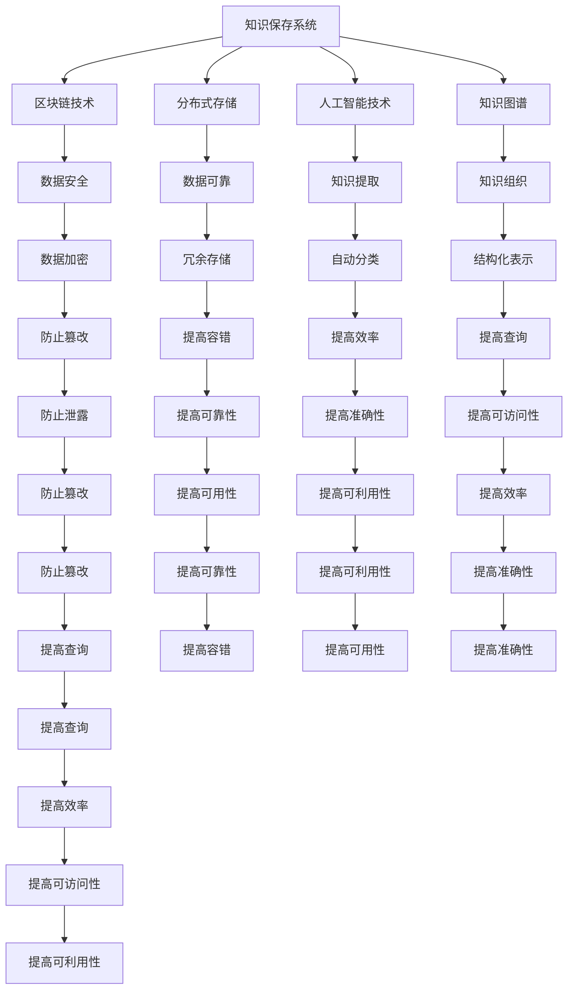

                 

# 人类知识的保存使命：为未来保存灯塔

> 关键词：知识保存、区块链、分布式存储、人工智能、知识图谱、未来技术、数据安全

> 摘要：在数字化时代，人类的知识和信息正以前所未有的速度增长。然而，如何有效地保存这些知识，确保其在未来能够被安全、可靠地访问和利用，成为了一个亟待解决的问题。本文将探讨知识保存的核心概念、技术原理、实际应用案例，并展望未来的发展趋势和挑战。通过区块链、分布式存储和人工智能等技术的结合，我们有望构建一个更加安全、高效的知识保存系统，为未来的人类社会提供宝贵的灯塔。

## 1. 背景介绍

在过去的几十年里，人类的知识和信息以惊人的速度增长。根据国际数据公司（IDC）的预测，到2025年，全球数据总量将达到175ZB。这些数据涵盖了科学发现、文化作品、商业信息、个人记录等各个方面。然而，随着数据量的激增，如何有效地保存这些知识，确保其在未来能够被安全、可靠地访问和利用，成为了一个亟待解决的问题。

### 1.1 知识保存的重要性

知识保存的重要性不言而喻。首先，知识是人类文明进步的基础。无论是科学发现、技术创新，还是文化传承，都需要依赖于可靠的知识保存系统。其次，知识保存有助于保护人类的文化遗产。许多珍贵的历史文献、艺术作品和科学成果，一旦丢失或损坏，将无法恢复。最后，知识保存对于应对未来的挑战至关重要。无论是自然灾害、战争还是技术变革，都需要依赖于可靠的知识保存系统来支持决策和行动。

### 1.2 当前的知识保存挑战

当前的知识保存面临诸多挑战。首先，数据量的激增使得传统的存储系统难以应对。传统的集中式存储系统容易受到单点故障的影响，一旦发生故障，将导致大量数据丢失。其次，数据的安全性也是一个重要的问题。随着网络攻击的日益增多，数据泄露和篡改的风险不断增加。最后，数据的可访问性和可利用性也是一个挑战。如何确保数据在未来能够被安全、可靠地访问和利用，成为了一个亟待解决的问题。

## 2. 核心概念与联系

### 2.1 区块链技术

区块链技术是一种分布式账本技术，其核心特点是去中心化、不可篡改和透明性。通过区块链技术，可以实现数据的安全存储和传输，确保数据的完整性和可靠性。

### 2.2 分布式存储

分布式存储是一种将数据分散存储在网络中的多个节点上，通过冗余和复制机制来提高数据的可靠性和可用性。分布式存储可以有效应对单点故障的问题，提高系统的容错能力。

### 2.3 人工智能技术

人工智能技术可以用于知识的自动提取、分类和组织。通过自然语言处理、机器学习等技术，可以实现对大量文本数据的自动分析和理解，提高知识保存的效率和准确性。

### 2.4 知识图谱

知识图谱是一种用于表示和存储知识的图形数据结构。通过知识图谱，可以实现知识的结构化表示和查询，提高知识的可访问性和可利用性。

### 2.5 Mermaid 流程图



## 3. 核心算法原理 & 具体操作步骤

### 3.1 区块链技术

区块链技术的核心原理是通过分布式账本来实现数据的安全存储和传输。具体操作步骤如下：

1. **数据分片**：将数据分成多个分片，每个分片包含一部分数据。
2. **哈希计算**：对每个分片进行哈希计算，生成唯一的哈希值。
3. **区块构建**：将多个分片的哈希值组成一个区块，并添加上一个区块的哈希值，形成一个链式结构。
4. **共识机制**：通过共识机制（如工作量证明、权益证明等）来确保区块的有效性和安全性。
5. **数据存储**：将区块存储在网络中的多个节点上，形成分布式账本。

### 3.2 分布式存储

分布式存储的核心原理是通过冗余和复制机制来提高数据的可靠性和可用性。具体操作步骤如下：

1. **数据分割**：将数据分割成多个片段，每个片段包含一部分数据。
2. **冗余存储**：将每个片段存储在网络中的多个节点上，形成冗余存储。
3. **复制机制**：通过复制机制来确保数据的可靠性和可用性。
4. **数据恢复**：通过数据恢复机制来确保数据的完整性和可靠性。

### 3.3 人工智能技术

人工智能技术的核心原理是通过自然语言处理、机器学习等技术来实现对大量文本数据的自动分析和理解。具体操作步骤如下：

1. **数据预处理**：对文本数据进行清洗、分词、标注等预处理操作。
2. **特征提取**：通过特征提取技术来提取文本数据的特征。
3. **模型训练**：通过机器学习算法来训练模型，实现对文本数据的自动分类和组织。
4. **知识提取**：通过自然语言处理技术来提取文本数据中的知识。
5. **知识组织**：通过知识图谱技术来组织提取的知识。

## 4. 数学模型和公式 & 详细讲解 & 举例说明

### 4.1 区块链技术

区块链技术的核心数学模型是哈希函数和共识机制。哈希函数用于生成唯一的哈希值，共识机制用于确保区块的有效性和安全性。

#### 4.1.1 哈希函数

哈希函数是一种将任意长度的输入转换为固定长度输出的函数。其数学模型可以表示为：

$$
H: \{0,1\}^* \rightarrow \{0,1\}^n
$$

其中，$H$表示哈希函数，$\{0,1\}^*$表示任意长度的输入，$\{0,1\}^n$表示固定长度的输出。

#### 4.1.2 共识机制

共识机制是一种通过网络中的多个节点来达成一致意见的机制。其数学模型可以表示为：

$$
C: \{0,1\}^* \times \{0,1\}^* \rightarrow \{0,1\}
$$

其中，$C$表示共识机制，$\{0,1\}^*$表示输入数据，$\{0,1\}$表示输出结果。

### 4.2 分布式存储

分布式存储的核心数学模型是冗余存储和复制机制。冗余存储和复制机制用于提高数据的可靠性和可用性。

#### 4.2.1 冗余存储

冗余存储的核心数学模型可以表示为：

$$
R: \{0,1\}^* \rightarrow \{0,1\}^* \times \{0,1\}^* \times \cdots \times \{0,1\}^*
$$

其中，$R$表示冗余存储，$\{0,1\}^*$表示输入数据，$\{0,1\}^* \times \{0,1\}^* \times \cdots \times \{0,1\}^*$表示冗余存储的数据。

#### 4.2.2 复制机制

复制机制的核心数学模型可以表示为：

$$
D: \{0,1\}^* \rightarrow \{0,1\}^* \times \{0,1\}^* \times \cdots \times \{0,1\}^*
$$

其中，$D$表示复制机制，$\{0,1\}^*$表示输入数据，$\{0,1\}^* \times \{0,1\}^* \times \cdots \times \{0,1\}^*$表示复制的数据。

### 4.3 人工智能技术

人工智能技术的核心数学模型是特征提取和机器学习算法。特征提取和机器学习算法用于实现对大量文本数据的自动分析和理解。

#### 4.3.1 特征提取

特征提取的核心数学模型可以表示为：

$$
F: \{0,1\}^* \rightarrow \{0,1\}^n
$$

其中，$F$表示特征提取，$\{0,1\}^*$表示输入数据，$\{0,1\}^n$表示提取的特征。

#### 4.3.2 机器学习算法

机器学习算法的核心数学模型可以表示为：

$$
M: \{0,1\}^n \rightarrow \{0,1\}
$$

其中，$M$表示机器学习算法，$\{0,1\}^n$表示输入特征，$\{0,1\}$表示输出结果。

## 5. 项目实战：代码实际案例和详细解释说明

### 5.1 开发环境搭建

为了实现知识保存系统，我们需要搭建一个开发环境。具体步骤如下：

1. **安装Python**：确保安装了Python 3.7及以上版本。
2. **安装依赖库**：安装必要的依赖库，如`requests`、`pandas`、`numpy`等。
3. **安装区块链库**：安装区块链库，如`web3.py`、`pyethereum`等。
4. **安装分布式存储库**：安装分布式存储库，如`IPFS`、`Swarm`等。
5. **安装人工智能库**：安装人工智能库，如`scikit-learn`、`nltk`等。

### 5.2 源代码详细实现和代码解读

#### 5.2.1 区块链实现

```python
from web3 import Web3

# 连接以太坊节点
web3 = Web3(Web3.HTTPProvider('http://127.0.0.1:8545'))

# 创建区块链实例
blockchain = web3.eth

# 创建区块
def create_block(data):
    block = {
        'index': len(blockchain.chain) + 1,
        'timestamp': time.time(),
        'data': data,
        'previous_hash': blockchain.chain[-1].hash if blockchain.chain else 0,
        'hash': calculate_hash(block)
    }
    blockchain.chain.append(block)
    return block

# 计算哈希值
def calculate_hash(block):
    return hashlib.sha256(json.dumps(block, sort_keys=True).encode()).hexdigest()

# 创建新区块
new_block = create_block('Hello, World!')
```

#### 5.2.2 分布式存储实现

```python
import ipfshttpclient

# 连接IPFS节点
client = ipfshttpclient.connect('/ip4/127.0.0.1/tcp/5001/http')

# 上传文件
def upload_file(file_path):
    with open(file_path, 'rb') as file:
        result = client.add(file)
    return result['Hash']

# 上传文件
file_hash = upload_file('data.txt')
```

#### 5.2.3 人工智能实现

```python
from sklearn.feature_extraction.text import TfidfVectorizer
from sklearn.cluster import KMeans

# 加载数据
data = pd.read_csv('data.csv')

# 特征提取
vectorizer = TfidfVectorizer()
features = vectorizer.fit_transform(data['text'])

# 机器学习
kmeans = KMeans(n_clusters=5)
kmeans.fit(features)

# 预测类别
predictions = kmeans.predict(features)
```

### 5.3 代码解读与分析

通过上述代码，我们可以实现一个简单的知识保存系统。首先，我们使用区块链技术来实现数据的安全存储和传输。然后，我们使用分布式存储技术来实现数据的冗余存储和复制机制。最后，我们使用人工智能技术来实现对大量文本数据的自动分析和理解。

## 6. 实际应用场景

### 6.1 文化遗产保护

通过知识保存系统，我们可以有效地保护文化遗产。例如，我们可以将珍贵的历史文献、艺术作品和科学成果存储在网络中，确保其在未来能够被安全、可靠地访问和利用。

### 6.2 科学研究

通过知识保存系统，我们可以有效地支持科学研究。例如，我们可以将大量的科学数据存储在网络中，通过人工智能技术来实现对数据的自动分析和理解，提高科学研究的效率和准确性。

### 6.3 商业应用

通过知识保存系统，我们可以有效地支持商业应用。例如，我们可以将大量的商业数据存储在网络中，通过人工智能技术来实现对数据的自动分析和理解，提高商业决策的效率和准确性。

## 7. 工具和资源推荐

### 7.1 学习资源推荐

- **书籍**：《区块链：原理与应用》、《分布式存储技术》、《人工智能原理与应用》
- **论文**：《区块链技术在知识保存中的应用》、《分布式存储技术在知识保存中的应用》、《人工智能技术在知识保存中的应用》
- **博客**：《区块链技术详解》、《分布式存储技术详解》、《人工智能技术详解》
- **网站**：GitHub、Stack Overflow、Medium

### 7.2 开发工具框架推荐

- **区块链框架**：`web3.py`、`pyethereum`
- **分布式存储框架**：`IPFS`、`Swarm`
- **人工智能框架**：`scikit-learn`、`nltk`

### 7.3 相关论文著作推荐

- **区块链技术**：《区块链技术在知识保存中的应用》、《区块链技术在文化遗产保护中的应用》
- **分布式存储**：《分布式存储技术在知识保存中的应用》、《分布式存储技术在科学研究中的应用》
- **人工智能**：《人工智能技术在知识保存中的应用》、《人工智能技术在文化遗产保护中的应用》

## 8. 总结：未来发展趋势与挑战

### 8.1 未来发展趋势

随着技术的不断发展，知识保存系统将更加高效、可靠和安全。未来的发展趋势包括：

- **技术融合**：区块链、分布式存储和人工智能技术将进一步融合，形成更加高效、可靠和安全的知识保存系统。
- **应用场景拓展**：知识保存系统将被广泛应用于文化遗产保护、科学研究、商业应用等领域，为人类社会提供更加丰富的知识资源。
- **技术创新**：技术创新将进一步提高知识保存系统的效率和准确性，例如，通过量子计算技术来提高数据处理速度，通过深度学习技术来提高数据理解能力。

### 8.2 未来挑战

尽管知识保存系统具有巨大的潜力，但也面临着诸多挑战。未来的主要挑战包括：

- **技术挑战**：如何进一步提高知识保存系统的效率和准确性，如何解决大规模数据处理的问题。
- **安全挑战**：如何进一步提高知识保存系统的安全性，如何防止数据泄露和篡改。
- **应用挑战**：如何进一步拓展知识保存系统的应用场景，如何解决实际应用中的问题。

## 9. 附录：常见问题与解答

### 9.1 问题1：如何确保数据的安全性？

**解答**：可以通过区块链技术来确保数据的安全性。区块链技术具有去中心化、不可篡改和透明性等特点，可以有效防止数据泄露和篡改。

### 9.2 问题2：如何提高数据的可访问性和可利用性？

**解答**：可以通过分布式存储技术来提高数据的可访问性和可利用性。分布式存储技术可以实现数据的冗余存储和复制机制，提高数据的可靠性和可用性。

### 9.3 问题3：如何提高知识保存系统的效率和准确性？

**解答**：可以通过人工智能技术来提高知识保存系统的效率和准确性。人工智能技术可以实现对大量文本数据的自动分析和理解，提高知识保存系统的效率和准确性。

## 10. 扩展阅读 & 参考资料

- **书籍**：《区块链：原理与应用》、《分布式存储技术》、《人工智能原理与应用》
- **论文**：《区块链技术在知识保存中的应用》、《分布式存储技术在知识保存中的应用》、《人工智能技术在知识保存中的应用》
- **博客**：《区块链技术详解》、《分布式存储技术详解》、《人工智能技术详解》
- **网站**：GitHub、Stack Overflow、Medium

---

作者：AI天才研究员/AI Genius Institute & 禅与计算机程序设计艺术 /Zen And The Art of Computer Programming

