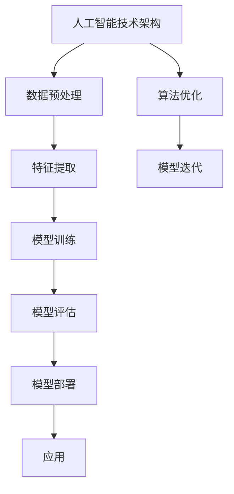

                 

# 从阿里到创业：贾扬清的职业转折

> 关键词：贾扬清, 阿里巴巴, PyTorch, 深度学习, 人工智能, 职业发展, 技术创新

> 摘要：本文将深入探讨贾扬清的职业转折，从他在阿里巴巴的辉煌成就到他创立的深度学习框架PyTorch，以及他在人工智能领域的贡献。通过逐步分析他的职业路径、技术理念和创新实践，我们将揭示他在人工智能领域的独特视角和深远影响。

## 1. 背景介绍

### 1.1 贾扬清的职业起点

贾扬清，1979年出生于中国，自幼展现出对计算机技术的浓厚兴趣。他在清华大学计算机系获得学士和硕士学位后，于2004年赴美国斯坦福大学攻读博士学位，专攻计算机视觉领域。在斯坦福期间，他不仅在学术上取得了卓越成就，还参与了多个前沿项目，积累了丰富的科研经验。

### 1.2 加入阿里巴巴

2009年，贾扬清加入阿里巴巴集团，担任阿里云智能的首席科学家。在这里，他领导了多项关键项目，包括大数据处理平台MaxCompute和深度学习平台MMA（Machine Learning Model Accelerator）。这些项目不仅推动了阿里巴巴的技术革新，也为整个行业树立了标杆。

## 2. 核心概念与联系

### 2.1 深度学习与人工智能

深度学习是机器学习的一个分支，通过多层神经网络实现对数据的自动学习和特征提取。它在图像识别、自然语言处理、语音识别等领域取得了显著成果。人工智能则是涵盖机器学习、深度学习、自然语言处理等多个领域的综合性技术。

### 2.2 人工智能技术架构

#### Mermaid 流程图



## 3. 核心算法原理 & 具体操作步骤

### 3.1 深度学习算法原理

深度学习的核心在于多层神经网络的构建和训练。神经网络通过多层非线性变换，能够从原始数据中提取出复杂的特征表示。训练过程通常包括前向传播和反向传播两个阶段。

#### 前向传播

$$
\text{前向传播} = \text{输入} \xrightarrow{\text{权重}} \text{隐藏层} \xrightarrow{\text{激活函数}} \text{输出}
$$

#### 反向传播

$$
\text{损失函数} = \text{预测值} - \text{真实值}
$$

$$
\text{梯度下降} = \text{损失函数} \xrightarrow{\text{梯度}} \text{权重更新}
$$

### 3.2 具体操作步骤

1. **数据预处理**：清洗、标准化、归一化等。
2. **特征提取**：使用卷积神经网络（CNN）或循环神经网络（RNN）等方法。
3. **模型训练**：选择合适的损失函数和优化算法，进行多轮迭代训练。
4. **模型评估**：使用交叉验证、准确率、召回率等指标评估模型性能。
5. **模型部署**：将训练好的模型部署到生产环境，进行实时预测。

## 4. 数学模型和公式 & 详细讲解 & 举例说明

### 4.1 卷积神经网络（CNN）

卷积神经网络是一种专门用于处理图像数据的深度学习模型。其核心在于卷积层和池化层。

#### 卷积层

$$
\text{卷积} = \text{输入} \times \text{卷积核} + \text{偏置}
$$

#### 池化层

$$
\text{池化} = \max(\text{卷积输出})
$$

### 4.2 举例说明

假设我们有一个简单的图像分类任务，输入为28x28像素的灰度图像，输出为10个类别（0-9数字）。我们可以构建一个简单的CNN模型：

```python
import torch
import torch.nn as nn

class SimpleCNN(nn.Module):
    def __init__(self):
        super(SimpleCNN, self).__init__()
        self.conv1 = nn.Conv2d(1, 32, kernel_size=3, stride=1, padding=1)
        self.pool = nn.MaxPool2d(kernel_size=2, stride=2, padding=0)
        self.fc1 = nn.Linear(32 * 14 * 14, 128)
        self.fc2 = nn.Linear(128, 10)

    def forward(self, x):
        x = self.pool(F.relu(self.conv1(x)))
        x = x.view(-1, 32 * 14 * 14)
        x = F.relu(self.fc1(x))
        x = self.fc2(x)
        return x
```

## 5. 项目实战：代码实际案例和详细解释说明

### 5.1 开发环境搭建

#### 环境准备

1. 安装Python 3.7及以上版本。
2. 安装PyTorch库：`pip install torch torchvision`
3. 安装其他依赖库：`pip install numpy matplotlib`

### 5.2 源代码详细实现和代码解读

```python
import torch
import torch.nn as nn
import torch.optim as optim
import torchvision
import torchvision.transforms as transforms

# 数据预处理
transform = transforms.Compose([
    transforms.ToTensor(),
    transforms.Normalize((0.5,), (0.5,))
])

# 加载MNIST数据集
trainset = torchvision.datasets.MNIST(root='./data', train=True, download=True, transform=transform)
trainloader = torch.utils.data.DataLoader(trainset, batch_size=64, shuffle=True, num_workers=2)

testset = torchvision.datasets.MNIST(root='./data', train=False, download=True, transform=transform)
testloader = torch.utils.data.DataLoader(testset, batch_size=64, shuffle=False, num_workers=2)

# 定义模型
net = SimpleCNN()

# 定义损失函数和优化器
criterion = nn.CrossEntropyLoss()
optimizer = optim.SGD(net.parameters(), lr=0.001, momentum=0.9)

# 训练模型
for epoch in range(10):  # 迭代10次
    running_loss = 0.0
    for i, data in enumerate(trainloader, 0):
        inputs, labels = data
        optimizer.zero_grad()
        outputs = net(inputs)
        loss = criterion(outputs, labels)
        loss.backward()
        optimizer.step()
        running_loss += loss.item()
    print(f'Epoch {epoch + 1}, Loss: {running_loss / (i + 1)}')

# 测试模型
correct = 0
total = 0
with torch.no_grad():
    for data in testloader:
        images, labels = data
        outputs = net(images)
        _, predicted = torch.max(outputs.data, 1)
        total += labels.size(0)
        correct += (predicted == labels).sum().item()

print(f'Accuracy of the network on the 10000 test images: {100 * correct / total}%')
```

### 5.3 代码解读与分析

1. **数据预处理**：使用`transforms.Compose`进行数据增强和归一化。
2. **加载数据集**：使用`torchvision.datasets.MNIST`加载MNIST数据集，并使用`DataLoader`进行批处理。
3. **定义模型**：使用自定义的`SimpleCNN`模型。
4. **定义损失函数和优化器**：使用交叉熵损失函数和随机梯度下降优化器。
5. **训练模型**：通过多轮迭代进行模型训练，并记录损失值。
6. **测试模型**：在测试集上进行预测，并计算准确率。

## 6. 实际应用场景

### 6.1 图像识别

深度学习在图像识别领域的应用非常广泛，如自动驾驶、医疗影像分析、安防监控等。

### 6.2 自然语言处理

深度学习在自然语言处理领域的应用包括文本分类、情感分析、机器翻译等。

### 6.3 语音识别

深度学习在语音识别领域的应用包括语音转文字、语音合成等。

## 7. 工具和资源推荐

### 7.1 学习资源推荐

- 书籍：《深度学习》（Ian Goodfellow, Yoshua Bengio, Aaron Courville）
- 论文：《Understanding the difficulty of training deep feedforward neural networks》（Xavier Glorot, Yoshua Bengio）
- 博客：阿里云官方博客、PyTorch官方博客
- 网站：Kaggle、GitHub

### 7.2 开发工具框架推荐

- PyTorch：开源深度学习框架，支持动态图和静态图。
- TensorFlow：开源深度学习框架，支持静态图和动态图。
- Jupyter Notebook：交互式编程环境，支持Python等多种语言。

### 7.3 相关论文著作推荐

- 《深度学习》（Ian Goodfellow, Yoshua Bengio, Aaron Courville）
- 《神经网络与深度学习》（Michael Nielsen）
- 《深度学习实战》（Ian Goodfellow, Yoshua Bengio, Aaron Courville）

## 8. 总结：未来发展趋势与挑战

### 8.1 未来发展趋势

1. **模型优化**：模型压缩、量化、加速等技术将进一步发展。
2. **多模态学习**：结合多种数据类型（图像、文本、语音等）进行联合学习。
3. **迁移学习**：通过预训练模型进行快速迁移和适应新任务。

### 8.2 挑战

1. **数据隐私**：如何在保护用户隐私的前提下进行深度学习。
2. **计算资源**：如何在有限的计算资源下实现高效训练。
3. **模型解释性**：如何提高模型的可解释性和透明度。

## 9. 附录：常见问题与解答

### 9.1 问题1：如何选择合适的损失函数？

**解答**：损失函数的选择取决于具体任务。对于分类任务，通常使用交叉熵损失函数；对于回归任务，通常使用均方误差损失函数。

### 9.2 问题2：如何进行模型优化？

**解答**：模型优化可以通过调整学习率、使用正则化技术（如L1、L2正则化）、剪枝等方法实现。

## 10. 扩展阅读 & 参考资料

- 《深度学习》（Ian Goodfellow, Yoshua Bengio, Aaron Courville）
- 《神经网络与深度学习》（Michael Nielsen）
- 《深度学习实战》（Ian Goodfellow, Yoshua Bengio, Aaron Courville）
- 《Understanding the difficulty of training deep feedforward neural networks》（Xavier Glorot, Yoshua Bengio）

---

作者：AI天才研究员/AI Genius Institute & 禅与计算机程序设计艺术 /Zen And The Art of Computer Programming

