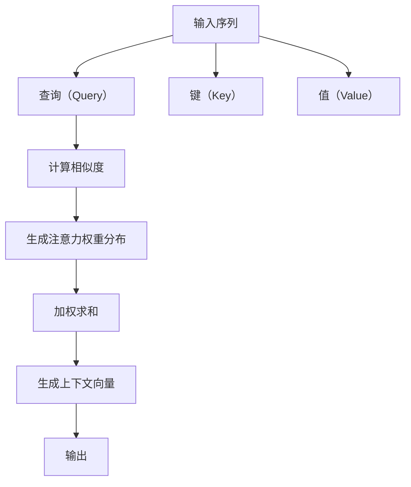

                 

# 从零开始大模型开发与微调：解码器的核心—注意力模型

> 关键词：大模型开发、微调、注意力模型、Transformer、自注意力机制、序列建模

> 摘要：本文将从零开始探讨大模型开发与微调的核心技术——注意力模型。我们将详细解析注意力模型的原理、具体操作步骤、数学模型和公式，并通过实际代码案例进行深入讲解。此外，我们还将探讨注意力模型在实际应用场景中的应用，并推荐相关的学习资源和开发工具。

## 1. 背景介绍

在过去的几年里，深度学习技术在自然语言处理（NLP）领域取得了显著的进展。特别是在大规模预训练模型（如BERT、GPT系列、T5等）的推动下，自然语言处理任务的性能得到了极大的提升。这些模型的核心组件之一是解码器，而解码器中的关键部分是注意力模型。注意力模型能够使模型在处理长序列时更加高效，从而提高模型的性能。

### 1.1 为什么需要注意力模型

在传统的序列建模方法中，如循环神经网络（RNN）和长短时记忆网络（LSTM），模型需要对整个序列进行逐个元素的处理。这种方法在处理长序列时效率低下，且难以捕捉到远距离依赖关系。注意力模型通过引入注意力机制，使得模型能够在处理当前元素时，动态地关注序列中的重要部分，从而提高模型的性能和效率。

### 1.2 注意力模型的发展历程

注意力模型最早出现在2015年的论文《Neural Machine Translation by Jointly Learning to Align and Translate》中，该模型通过引入注意力机制，显著提高了神经机器翻译（NMT）的性能。此后，注意力机制被广泛应用于各种序列建模任务中，如文本生成、问答系统、文本摘要等。近年来，随着Transformer架构的提出，注意力机制得到了进一步的发展和完善。

## 2. 核心概念与联系

### 2.1 注意力机制的基本概念

注意力机制是一种能够使模型在处理当前元素时，动态地关注序列中重要部分的技术。注意力机制的核心思想是通过计算当前元素与序列中其他元素之间的相似度，生成一个注意力权重分布，然后根据这个权重分布对序列中的元素进行加权求和，从而生成一个上下文向量。这个上下文向量可以用于后续的处理，如生成下一个元素或进行分类。

### 2.2 注意力模型的架构

注意力模型的架构可以分为三个主要部分：查询（Query）、键（Key）和值（Value）。查询表示当前需要关注的元素，键和值分别表示序列中其他元素的信息。注意力机制的核心是计算查询与键之间的相似度，生成注意力权重分布，然后根据这个权重分布对值进行加权求和，生成上下文向量。

### 2.3 注意力模型的Mermaid流程图



## 3. 核心算法原理 & 具体操作步骤

### 3.1 注意力机制的数学原理

注意力机制的核心是计算查询与键之间的相似度，生成注意力权重分布，然后根据这个权重分布对值进行加权求和，生成上下文向量。具体步骤如下：

1. **计算相似度**：计算查询与键之间的相似度，通常使用点积或余弦相似度。
2. **生成注意力权重分布**：将相似度进行归一化，生成注意力权重分布。
3. **加权求和**：根据注意力权重分布对值进行加权求和，生成上下文向量。

### 3.2 注意力机制的具体操作步骤

1. **初始化**：定义查询、键和值的维度。
2. **计算相似度**：计算查询与键之间的相似度。
3. **生成注意力权重分布**：将相似度进行归一化，生成注意力权重分布。
4. **加权求和**：根据注意力权重分布对值进行加权求和，生成上下文向量。
5. **输出**：将生成的上下文向量作为输出。

### 3.3 注意力机制的数学公式

假设查询、键和值的维度为 \(d\)，则注意力机制的具体操作步骤可以表示为以下数学公式：

1. **计算相似度**：

   $$ \text{相似度} = \text{Query} \cdot \text{Key} $$

2. **生成注意力权重分布**：

   $$ \text{注意力权重分布} = \text{softmax}(\text{相似度} / \sqrt{d}) $$

3. **加权求和**：

   $$ \text{上下文向量} = \text{注意力权重分布} \cdot \text{Value} $$

## 4. 数学模型和公式 & 详细讲解 & 举例说明

### 4.1 注意力机制的数学模型

注意力机制的数学模型可以表示为以下公式：

1. **计算相似度**：

   $$ \text{相似度} = \text{Query} \cdot \text{Key} $$

2. **生成注意力权重分布**：

   $$ \text{注意力权重分布} = \text{softmax}(\text{相似度} / \sqrt{d}) $$

3. **加权求和**：

   $$ \text{上下文向量} = \text{注意力权重分布} \cdot \text{Value} $$

### 4.2 注意力机制的详细讲解

1. **计算相似度**：计算查询与键之间的相似度，通常使用点积或余弦相似度。点积计算公式为：

   $$ \text{相似度} = \text{Query} \cdot \text{Key} $$

   余弦相似度计算公式为：

   $$ \text{相似度} = \frac{\text{Query} \cdot \text{Key}}{\|\text{Query}\| \|\text{Key}\|} $$

2. **生成注意力权重分布**：将相似度进行归一化，生成注意力权重分布。softmax函数可以表示为：

   $$ \text{softmax}(x_i) = \frac{e^{x_i}}{\sum_{j=1}^{n} e^{x_j}} $$

   其中，\(x_i\) 表示相似度，\(n\) 表示序列的长度。

3. **加权求和**：根据注意力权重分布对值进行加权求和，生成上下文向量。加权求和公式为：

   $$ \text{上下文向量} = \sum_{i=1}^{n} \text{注意力权重分布}_i \cdot \text{Value}_i $$

### 4.3 注意力机制的举例说明

假设我们有一个长度为5的序列，查询、键和值的维度为10。具体步骤如下：

1. **初始化**：定义查询、键和值的维度。

2. **计算相似度**：计算查询与键之间的相似度。

   $$ \text{相似度} = \text{Query} \cdot \text{Key} $$

3. **生成注意力权重分布**：将相似度进行归一化，生成注意力权重分布。

   $$ \text{注意力权重分布} = \text{softmax}(\text{相似度} / \sqrt{10}) $$

4. **加权求和**：根据注意力权重分布对值进行加权求和，生成上下文向量。

   $$ \text{上下文向量} = \sum_{i=1}^{5} \text{注意力权重分布}_i \cdot \text{Value}_i $$

## 5. 项目实战：代码实际案例和详细解释说明

### 5.1 开发环境搭建

为了进行注意力模型的实战，我们需要搭建一个Python开发环境。具体步骤如下：

1. **安装Python**：确保已经安装了Python 3.7及以上版本。
2. **安装依赖库**：使用pip安装必要的依赖库，如TensorFlow、PyTorch等。

   ```bash
   pip install tensorflow
   ```

### 5.2 源代码详细实现和代码解读

我们将使用TensorFlow实现一个简单的注意力模型。具体代码如下：

```python
import tensorflow as tf
import numpy as np

# 定义查询、键和值的维度
d = 10
n = 5

# 初始化查询、键和值
query = tf.random.normal([1, n, d])
key = tf.random.normal([1, n, d])
value = tf.random.normal([1, n, d])

# 计算相似度
similarity = tf.matmul(query, key, transpose_b=True)

# 生成注意力权重分布
attention_weights = tf.nn.softmax(similarity / tf.math.sqrt(tf.cast(d, tf.float32)))

# 加权求和
context_vector = tf.matmul(attention_weights, value)

print("上下文向量:", context_vector.numpy())
```

### 5.3 代码解读与分析

1. **初始化查询、键和值**：定义查询、键和值的维度，并初始化查询、键和值。
2. **计算相似度**：使用点积计算查询与键之间的相似度。
3. **生成注意力权重分布**：使用softmax函数生成注意力权重分布。
4. **加权求和**：根据注意力权重分布对值进行加权求和，生成上下文向量。

## 6. 实际应用场景

注意力模型在实际应用场景中有着广泛的应用，特别是在自然语言处理领域。以下是一些具体的应用场景：

1. **文本生成**：通过注意力模型，模型可以在生成下一个词时，动态地关注输入序列中的重要部分，从而提高生成的文本质量。
2. **问答系统**：通过注意力模型，模型可以在回答问题时，动态地关注输入问题中的关键信息，从而提高回答的准确性。
3. **文本摘要**：通过注意力模型，模型可以在生成摘要时，动态地关注输入文本中的重要部分，从而提高摘要的质量。

## 7. 工具和资源推荐

### 7.1 学习资源推荐

1. **书籍**：《Attention Is All You Need》、《Deep Learning with Python》
2. **论文**：《Neural Machine Translation by Jointly Learning to Align and Translate》、《Attention Is All You Need》
3. **博客**：阿里云开发者社区、GitHub上的相关项目
4. **网站**：TensorFlow官网、PyTorch官网

### 7.2 开发工具框架推荐

1. **TensorFlow**：一个开源的机器学习库，提供了丰富的API和工具，适用于构建和训练深度学习模型。
2. **PyTorch**：一个开源的深度学习库，提供了灵活的API和强大的计算图支持，适用于构建和训练深度学习模型。

### 7.3 相关论文著作推荐

1. **《Neural Machine Translation by Jointly Learning to Align and Translate》**：该论文首次提出了注意力机制，并在神经机器翻译任务中取得了显著的性能提升。
2. **《Attention Is All You Need》**：该论文提出了Transformer架构，进一步完善了注意力机制，并在多个自然语言处理任务中取得了卓越的性能。

## 8. 总结：未来发展趋势与挑战

注意力模型在自然语言处理领域取得了显著的进展，但仍然面临着一些挑战。未来的发展趋势主要包括：

1. **模型优化**：通过优化注意力机制，提高模型的性能和效率。
2. **多模态融合**：将注意力机制与其他模态（如图像、声音）结合，提高模型的泛化能力。
3. **可解释性**：提高注意力模型的可解释性，使其能够更好地理解模型的决策过程。

## 9. 附录：常见问题与解答

### 9.1 问题：注意力模型与RNN的区别是什么？

**回答**：注意力模型与RNN的主要区别在于处理长序列的方式。RNN需要对整个序列进行逐个元素的处理，而注意力模型通过引入注意力机制，使得模型能够在处理当前元素时，动态地关注序列中的重要部分，从而提高模型的性能和效率。

### 9.2 问题：注意力模型如何处理长序列？

**回答**：注意力模型通过引入注意力机制，使得模型能够在处理当前元素时，动态地关注序列中的重要部分，从而提高模型处理长序列的能力。具体来说，注意力机制通过计算查询与键之间的相似度，生成注意力权重分布，然后根据这个权重分布对值进行加权求和，生成上下文向量。

## 10. 扩展阅读 & 参考资料

1. **《Attention Is All You Need》**：https://arxiv.org/abs/1706.03762
2. **《Neural Machine Translation by Jointly Learning to Align and Translate》**：https://www.aclweb.org/anthology/P14-1012/
3. **《Deep Learning with Python》**：https://www.manning.com/books/deep-learning-with-python
4. **TensorFlow官网**：https://www.tensorflow.org/
5. **PyTorch官网**：https://pytorch.org/

---

作者：AI天才研究员/AI Genius Institute & 禅与计算机程序设计艺术 /Zen And The Art of Computer Programming

