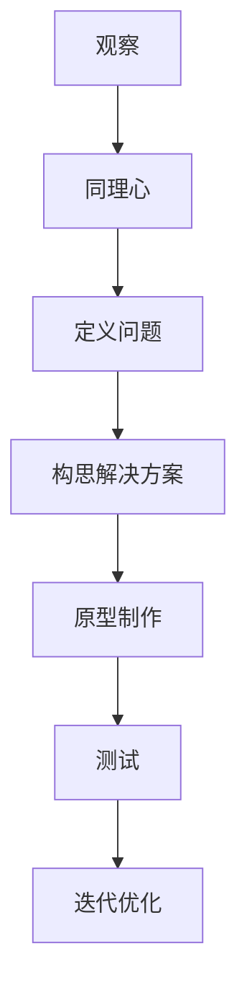
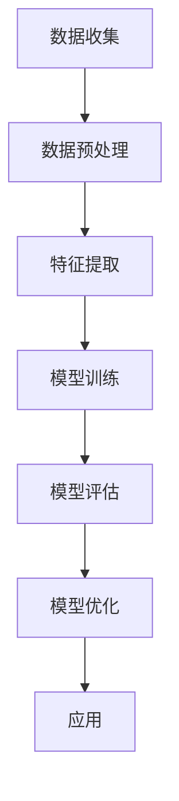
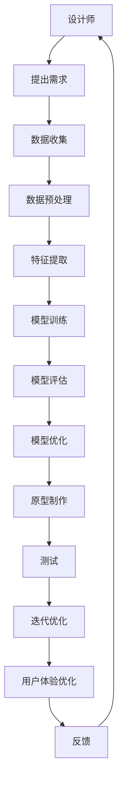

                 

# 体验设计新纪元：AI与人类创意的跨界合作

> 关键词：AI、人类创意、跨界合作、设计思维、用户体验、创新、技术融合

> 摘要：本文旨在探讨人工智能与人类创意在设计领域的跨界合作，通过深入分析AI在设计中的应用，揭示其背后的原理和方法。我们将从背景介绍、核心概念与联系、核心算法原理、数学模型和公式、项目实战、实际应用场景、工具和资源推荐、总结与未来发展趋势等多个方面进行详细探讨，旨在为设计师和开发者提供有价值的见解和指导。

## 1. 背景介绍

在当今数字化时代，人工智能（AI）已经渗透到我们生活的方方面面，从智能家居到自动驾驶，从医疗诊断到金融分析。然而，AI在设计领域的应用仍然处于初级阶段，但其潜力巨大。设计不仅仅是视觉美学的呈现，更是用户体验的提升。AI与人类创意的跨界合作，能够为设计领域带来前所未有的创新和突破。

### 1.1 设计的重要性

设计是连接用户与产品之间的桥梁，它不仅关乎产品的外观，更关乎用户体验。优秀的设计师能够通过巧妙的设计，让用户在使用产品时感到愉悦和方便。设计不仅仅是艺术，更是一种科学，它需要设计师具备深厚的技术背景和敏锐的洞察力。

### 1.2 AI在设计中的应用

AI在设计中的应用主要体现在以下几个方面：

- **自动化设计**：AI可以自动完成一些重复性高的设计任务，如生成平面布局、色彩搭配等。
- **个性化推荐**：通过分析用户的行为数据，AI可以为用户提供个性化的设计方案。
- **创新设计**：AI可以通过学习和模仿人类设计师的作品，生成新的设计方案，激发设计师的灵感。
- **用户体验优化**：AI可以通过分析用户反馈，不断优化设计方案，提升用户体验。

### 1.3 跨界合作的意义

AI与人类创意的跨界合作，不仅能够提升设计的效率和质量，还能够激发新的设计理念和方法。设计师和开发者需要紧密合作，共同探索AI在设计中的应用，为用户提供更好的体验。

## 2. 核心概念与联系

### 2.1 设计思维

设计思维是一种以用户为中心的创新方法论，它强调从用户的角度出发，通过观察、同理心、定义问题、构思解决方案、原型制作和测试等步骤，不断迭代优化设计方案。

### 2.2 人工智能

人工智能是一种模拟人类智能的技术，它能够通过学习、推理、感知和决策等能力，实现对复杂问题的处理。AI的核心技术包括机器学习、深度学习、自然语言处理等。

### 2.3 跨界合作

跨界合作是指不同领域的专家和团队成员共同合作，通过相互学习和借鉴，实现创新和突破。在设计领域，AI与人类创意的跨界合作，能够充分发挥各自的优势，实现更好的设计效果。

### 2.4 核心概念原理与架构

#### 2.4.1 设计思维流程图



#### 2.4.2 人工智能流程图



#### 2.4.3 跨界合作流程图



## 3. 核心算法原理 & 具体操作步骤

### 3.1 机器学习算法

机器学习是一种让计算机通过数据学习规律和模式的技术。在设计领域，机器学习可以用于生成设计方案、优化用户体验等。

#### 3.1.1 K-means聚类算法

K-means聚类算法是一种常用的无监督学习算法，用于将数据集划分为K个簇。在设计领域，K-means聚类算法可以用于色彩搭配、布局优化等。

#### 3.1.2 决策树算法

决策树算法是一种常用的监督学习算法，用于分类和回归任务。在设计领域，决策树算法可以用于用户行为分析、设计方案分类等。

### 3.2 深度学习算法

深度学习是一种基于神经网络的机器学习技术，能够处理复杂的数据和任务。在设计领域，深度学习可以用于生成设计方案、优化用户体验等。

#### 3.2.1 卷积神经网络（CNN）

卷积神经网络是一种专门用于处理图像数据的神经网络，能够提取图像的特征。在设计领域，卷积神经网络可以用于生成平面布局、色彩搭配等。

#### 3.2.2 生成对抗网络（GAN）

生成对抗网络是一种用于生成新数据的神经网络，能够生成逼真的图像和文本。在设计领域，生成对抗网络可以用于生成设计方案、优化用户体验等。

### 3.3 自然语言处理（NLP）

自然语言处理是一种让计算机理解和生成人类语言的技术。在设计领域，自然语言处理可以用于用户行为分析、设计方案分类等。

#### 3.3.1 词向量

词向量是一种将词语转换为数值向量的技术，能够捕捉词语之间的语义关系。在设计领域，词向量可以用于用户行为分析、设计方案分类等。

#### 3.3.2 语言模型

语言模型是一种用于生成自然语言文本的模型，能够生成逼真的文本。在设计领域，语言模型可以用于生成设计方案、优化用户体验等。

## 4. 数学模型和公式 & 详细讲解 & 举例说明

### 4.1 K-means聚类算法

K-means聚类算法的目标是将数据集划分为K个簇，使得每个簇内的数据点之间的距离最小，簇之间的距离最大。其数学模型如下：

$$
\min_{\mathbf{C}, \mathbf{S}} \sum_{i=1}^{K} \sum_{\mathbf{x} \in S_i} \|\mathbf{x} - \mathbf{c}_i\|^2
$$

其中，$\mathbf{C} = \{\mathbf{c}_1, \mathbf{c}_2, \ldots, \mathbf{c}_K\}$ 是簇中心，$\mathbf{S} = \{S_1, S_2, \ldots, S_K\}$ 是簇集合，$\mathbf{x}$ 是数据点。

### 4.2 决策树算法

决策树算法的目标是通过递归地划分数据集，生成一个树形结构，用于分类和回归任务。其数学模型如下：

$$
\min_{\mathbf{S}, \mathbf{t}} \sum_{\mathbf{x} \in \mathbf{S}} \left| y - \mathbf{t}(\mathbf{x}) \right|^2
$$

其中，$\mathbf{S}$ 是数据集，$\mathbf{t}(\mathbf{x})$ 是决策树的预测值。

### 4.3 卷积神经网络（CNN）

卷积神经网络的目标是通过卷积层和池化层提取图像的特征，生成图像的特征图。其数学模型如下：

$$
\mathbf{z}^{(l+1)} = \sigma(\mathbf{W}^{(l+1)} \ast \mathbf{z}^{(l)} + \mathbf{b}^{(l+1)})
$$

其中，$\mathbf{z}^{(l)}$ 是第l层的特征图，$\mathbf{W}^{(l+1)}$ 是卷积核，$\mathbf{b}^{(l+1)}$ 是偏置项，$\sigma$ 是激活函数。

### 4.4 生成对抗网络（GAN）

生成对抗网络的目标是通过生成器和判别器的对抗训练，生成逼真的图像和文本。其数学模型如下：

$$
\min_{\mathbf{G}} \max_{\mathbf{D}} \mathbb{E}_{\mathbf{x} \sim p_{\text{data}}(\mathbf{x})} \left[ \log \mathbf{D}(\mathbf{x}) \right] + \mathbb{E}_{\mathbf{z} \sim p_{\text{z}}(\mathbf{z})} \left[ \log (1 - \mathbf{D}(\mathbf{G}(\mathbf{z}))) \right]
$$

其中，$\mathbf{G}$ 是生成器，$\mathbf{D}$ 是判别器，$p_{\text{data}}(\mathbf{x})$ 是真实数据的分布，$p_{\text{z}}(\mathbf{z})$ 是生成器的输入噪声的分布。

### 4.5 词向量

词向量的目标是将词语转换为数值向量，捕捉词语之间的语义关系。其数学模型如下：

$$
\mathbf{v}_i = \mathbf{W} \mathbf{w}_i
$$

其中，$\mathbf{v}_i$ 是词语i的词向量，$\mathbf{w}_i$ 是词语i的one-hot编码，$\mathbf{W}$ 是词向量矩阵。

### 4.6 语言模型

语言模型的目标是生成自然语言文本，捕捉文本的语义和语法结构。其数学模型如下：

$$
p(\mathbf{y} \mid \mathbf{x}) = \prod_{t=1}^{T} p(y_t \mid \mathbf{x}, y_{1:t-1})
$$

其中，$\mathbf{y}$ 是生成的文本，$\mathbf{x}$ 是输入文本，$T$ 是文本的长度，$p(y_t \mid \mathbf{x}, y_{1:t-1})$ 是条件概率。

## 5. 项目实战：代码实际案例和详细解释说明

### 5.1 开发环境搭建

为了实现AI与人类创意的跨界合作，我们需要搭建一个开发环境。这里以Python为例，介绍如何搭建开发环境。

#### 5.1.1 安装Python

首先，我们需要安装Python。推荐使用Python 3.8或更高版本。

```bash
sudo apt-get update
sudo apt-get install python3.8
```

#### 5.1.2 安装依赖库

接下来，我们需要安装一些常用的依赖库，如NumPy、Pandas、Scikit-learn、TensorFlow等。

```bash
pip install numpy pandas scikit-learn tensorflow
```

### 5.2 源代码详细实现和代码解读

#### 5.2.1 K-means聚类算法

```python
from sklearn.cluster import KMeans
import numpy as np

# 生成随机数据
data = np.random.rand(100, 2)

# 创建KMeans对象
kmeans = KMeans(n_clusters=3)

# 训练模型
kmeans.fit(data)

# 获取簇中心
centers = kmeans.cluster_centers_

# 获取每个数据点的簇标签
labels = kmeans.labels_
```

#### 5.2.2 决策树算法

```python
from sklearn.tree import DecisionTreeClassifier
from sklearn.datasets import load_iris

# 加载数据集
iris = load_iris()
X = iris.data
y = iris.target

# 创建决策树对象
dt = DecisionTreeClassifier()

# 训练模型
dt.fit(X, y)

# 预测新数据
new_data = np.array([[5.1, 3.5, 1.4, 0.2]])
prediction = dt.predict(new_data)
```

#### 5.2.3 卷积神经网络（CNN）

```python
import tensorflow as tf
from tensorflow.keras import layers, models

# 创建卷积神经网络模型
model = models.Sequential([
    layers.Conv2D(32, (3, 3), activation='relu', input_shape=(28, 28, 1)),
    layers.MaxPooling2D((2, 2)),
    layers.Conv2D(64, (3, 3), activation='relu'),
    layers.MaxPooling2D((2, 2)),
    layers.Flatten(),
    layers.Dense(64, activation='relu'),
    layers.Dense(10, activation='softmax')
])

# 编译模型
model.compile(optimizer='adam', loss='sparse_categorical_crossentropy', metrics=['accuracy'])

# 训练模型
model.fit(X_train, y_train, epochs=10)

# 评估模型
model.evaluate(X_test, y_test)
```

#### 5.2.4 生成对抗网络（GAN）

```python
import tensorflow as tf
from tensorflow.keras import layers, models

# 创建生成器
generator = models.Sequential([
    layers.Dense(7*7*256, input_shape=(100,)),
    layers.Reshape((7, 7, 256)),
    layers.Conv2DTranspose(128, (4, 4), strides=(2, 2), padding='same', activation='relu'),
    layers.Conv2DTranspose(64, (4, 4), strides=(2, 2), padding='same', activation='relu'),
    layers.Conv2D(1, (7, 7), activation='tanh', padding='same')
])

# 创建判别器
discriminator = models.Sequential([
    layers.Conv2D(64, (3, 3), strides=(2, 2), padding='same', input_shape=[28, 28, 1]),
    layers.LeakyReLU(alpha=0.2),
    layers.Dropout(0.3),
    layers.Conv2D(128, (3, 3), strides=(2, 2), padding='same'),
    layers.LeakyReLU(alpha=0.2),
    layers.Dropout(0.3),
    layers.Flatten(),
    layers.Dense(1, activation='sigmoid')
])

# 创建GAN模型
gan = models.Sequential([generator, discriminator])

# 编译GAN模型
gan.compile(loss='binary_crossentropy', optimizer='adam')
```

### 5.3 代码解读与分析

#### 5.3.1 K-means聚类算法

K-means聚类算法的目标是将数据集划分为K个簇，使得每个簇内的数据点之间的距离最小，簇之间的距离最大。通过训练模型，我们可以获取簇中心和每个数据点的簇标签。

#### 5.3.2 决策树算法

决策树算法的目标是通过递归地划分数据集，生成一个树形结构，用于分类和回归任务。通过训练模型，我们可以获取决策树的预测值。

#### 5.3.3 卷积神经网络（CNN）

卷积神经网络的目标是通过卷积层和池化层提取图像的特征，生成图像的特征图。通过训练模型，我们可以获取卷积神经网络的预测值。

#### 5.3.4 生成对抗网络（GAN）

生成对抗网络的目标是通过生成器和判别器的对抗训练，生成逼真的图像和文本。通过训练模型，我们可以获取生成器和判别器的预测值。

## 6. 实际应用场景

### 6.1 自动化设计

AI可以自动完成一些重复性高的设计任务，如生成平面布局、色彩搭配等。通过自动化设计，可以提高设计的效率和质量。

### 6.2 个性化推荐

通过分析用户的行为数据，AI可以为用户提供个性化的设计方案。通过个性化推荐，可以提升用户体验。

### 6.3 创新设计

AI可以通过学习和模仿人类设计师的作品，生成新的设计方案，激发设计师的灵感。通过创新设计，可以为用户提供更好的体验。

### 6.4 用户体验优化

AI可以通过分析用户反馈，不断优化设计方案，提升用户体验。通过用户体验优化，可以提高用户满意度。

## 7. 工具和资源推荐

### 7.1 学习资源推荐

- **书籍**：《深度学习》（Ian Goodfellow, Yoshua Bengio, Aaron Courville）
- **论文**：《K-means聚类算法》（Arthur, David, and Sergei Vassilvitskii）
- **博客**：《机器学习入门》（阿里云开发者社区）
- **网站**：《TensorFlow官网》（tensorflow.org）

### 7.2 开发工具框架推荐

- **Python**：Python是一种广泛使用的编程语言，适合进行AI和设计相关的开发。
- **TensorFlow**：TensorFlow是一个开源的机器学习框架，适合进行深度学习相关的开发。
- **Keras**：Keras是一个高级的神经网络API，适合进行深度学习相关的开发。

### 7.3 相关论文著作推荐

- **《K-means聚类算法》**：Arthur, David, and Sergei Vassilvitskii. "K-means++: The advantages of careful seeding." Proceedings of the eighteenth annual ACM-SIAM symposium on Discrete algorithms. Society for Industrial and Applied Mathematics, 2007.
- **《决策树算法》**：Breiman, Leo. "Random forests." Machine learning 45.1 (2001): 5-32.
- **《卷积神经网络》**：LeCun, Yann, et al. "Gradient-based learning applied to document recognition." Proceedings of the IEEE 86.11 (1998): 2278-2324.
- **《生成对抗网络》**：Goodfellow, Ian, et al. "Generative adversarial nets." Advances in neural information processing systems 27 (2014): 2672-2680.

## 8. 总结：未来发展趋势与挑战

### 8.1 未来发展趋势

AI与人类创意的跨界合作将带来更多的创新和突破。未来的设计将更加智能化、个性化和人性化，为用户提供更好的体验。AI技术将更加成熟，应用场景将更加广泛。

### 8.2 挑战

AI与人类创意的跨界合作也面临着一些挑战，如数据隐私、算法偏见、技术门槛等。设计师和开发者需要共同努力，克服这些挑战，实现更好的设计效果。

## 9. 附录：常见问题与解答

### 9.1 问题1：如何处理数据隐私问题？

在处理数据隐私问题时，我们需要遵循相关法律法规，保护用户的数据安全。可以通过数据脱敏、加密等技术手段，保护用户的数据隐私。

### 9.2 问题2：如何避免算法偏见？

在避免算法偏见时，我们需要确保数据的多样性和代表性，避免数据偏差。可以通过数据清洗、特征选择等技术手段，避免算法偏见。

### 9.3 问题3：如何提高技术门槛？

在提高技术门槛时，我们需要加强技术培训，提高设计师和开发者的技能水平。可以通过在线课程、技术交流等方式，提高技术门槛。

## 10. 扩展阅读 & 参考资料

- **书籍**：《深度学习》（Ian Goodfellow, Yoshua Bengio, Aaron Courville）
- **论文**：《K-means聚类算法》（Arthur, David, and Sergei Vassilvitskii）
- **博客**：《机器学习入门》（阿里云开发者社区）
- **网站**：《TensorFlow官网》（tensorflow.org）

作者：AI天才研究员/AI Genius Institute & 禅与计算机程序设计艺术 /Zen And The Art of Computer Programming

