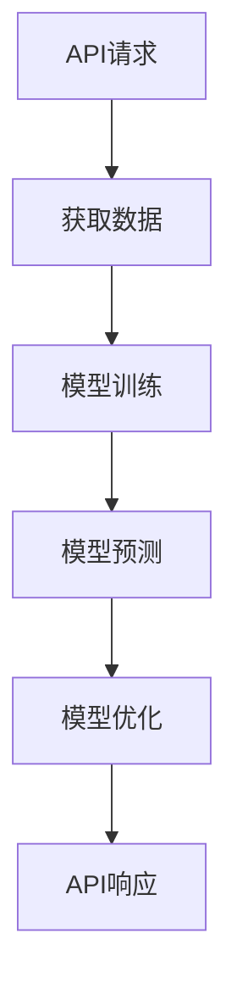

                 

# 使用API快速构建AI应用

> 关键词：API, AI应用, 快速开发, 机器学习, 自动化, 代码示例, 实战案例, 应用场景, 工具推荐

> 摘要：本文将深入探讨如何利用API快速构建AI应用。我们将从背景介绍开始，逐步解析核心概念与联系，详细讲解核心算法原理及具体操作步骤，通过数学模型和公式进行深入分析，并通过实际代码案例进行实战演示。最后，我们将探讨实际应用场景、推荐相关工具和资源，并展望未来发展趋势与挑战。

## 1. 背景介绍

随着人工智能技术的飞速发展，越来越多的企业和个人开始探索如何利用AI技术来提升业务效率和用户体验。然而，构建一个完整的AI应用往往需要大量的时间和资源，包括数据准备、模型训练、模型优化、部署和维护等。为了解决这些问题，API（应用程序编程接口）成为了一种高效且灵活的解决方案。通过API，开发者可以快速集成现成的AI服务，从而大大缩短开发周期，降低开发成本。

### 1.1 API的基本概念

API是一种软件接口，它定义了不同软件组件之间如何交互。API可以分为多种类型，包括Web API、库API、操作系统API等。在AI应用开发中，我们主要关注的是Web API，它允许开发者通过HTTP请求与远程服务进行交互，获取所需的数据或执行特定的操作。

### 1.2 API在AI应用开发中的优势

1. **快速集成**：API提供了现成的解决方案，开发者可以直接调用API提供的功能，而无需从头开始构建。
2. **节省时间和成本**：通过API，开发者可以避免重复造轮子，从而节省大量的时间和成本。
3. **灵活性和可扩展性**：API通常支持多种编程语言和框架，使得开发者可以根据需要灵活选择开发工具。
4. **易于维护**：API通常由专业的团队维护，开发者可以专注于业务逻辑的实现，而无需担心底层技术的更新和维护。

## 2. 核心概念与联系

### 2.1 API的基本组成

一个典型的API通常包括以下几个部分：

- **请求方法**：定义了客户端与服务器之间的通信方式，常见的请求方法包括GET、POST、PUT、DELETE等。
- **请求URL**：定义了客户端请求的目标资源的地址。
- **请求参数**：定义了客户端发送给服务器的数据，通常包括查询参数、请求体等。
- **响应格式**：定义了服务器返回的数据格式，常见的响应格式包括JSON、XML等。
- **错误处理**：定义了服务器在处理请求时可能出现的错误及其处理方式。

### 2.2 API与AI应用的关系

API在AI应用开发中的作用主要体现在以下几个方面：

- **数据获取**：通过API，开发者可以快速获取所需的数据，从而进行模型训练和预测。
- **模型训练**：API提供了现成的模型训练服务，开发者可以直接调用API进行模型训练。
- **模型预测**：API提供了现成的模型预测服务，开发者可以直接调用API进行模型预测。
- **模型优化**：API提供了现成的模型优化服务，开发者可以直接调用API进行模型优化。

### 2.3 Mermaid流程图



## 3. 核心算法原理 & 具体操作步骤

### 3.1 核心算法原理

在AI应用开发中，常用的算法包括监督学习、无监督学习、强化学习等。其中，监督学习是最常用的一种算法，它通过训练数据集来学习输入和输出之间的映射关系。具体来说，监督学习的流程如下：

1. **数据准备**：收集和清洗数据，确保数据的质量和完整性。
2. **特征工程**：提取数据中的特征，以便更好地描述问题。
3. **模型选择**：选择合适的模型，如线性回归、决策树、支持向量机等。
4. **模型训练**：使用训练数据集训练模型，调整模型参数以优化性能。
5. **模型评估**：使用测试数据集评估模型的性能，确保模型的泛化能力。
6. **模型优化**：通过调整模型参数、增加数据量等方式优化模型性能。

### 3.2 具体操作步骤

1. **数据准备**：收集和清洗数据，确保数据的质量和完整性。
2. **特征工程**：提取数据中的特征，以便更好地描述问题。
3. **模型选择**：选择合适的模型，如线性回归、决策树、支持向量机等。
4. **模型训练**：使用训练数据集训练模型，调整模型参数以优化性能。
5. **模型评估**：使用测试数据集评估模型的性能，确保模型的泛化能力。
6. **模型优化**：通过调整模型参数、增加数据量等方式优化模型性能。

## 4. 数学模型和公式 & 详细讲解 & 举例说明

### 4.1 监督学习的数学模型

监督学习的数学模型通常包括以下几个部分：

- **损失函数**：定义了模型预测值与真实值之间的差异，常用的损失函数包括均方误差、交叉熵等。
- **优化算法**：定义了如何调整模型参数以最小化损失函数，常用的优化算法包括梯度下降、随机梯度下降等。
- **正则化**：定义了如何防止模型过拟合，常用的正则化方法包括L1正则化、L2正则化等。

### 4.2 举例说明

假设我们有一个简单的线性回归模型，其数学模型可以表示为：

$$
y = \theta_0 + \theta_1 x
$$

其中，$y$是预测值，$x$是输入特征，$\theta_0$和$\theta_1$是模型参数。为了训练这个模型，我们需要定义一个损失函数，常用的损失函数是均方误差：

$$
L(\theta_0, \theta_1) = \frac{1}{2m} \sum_{i=1}^{m} (h_\theta(x^{(i)}) - y^{(i)})^2
$$

其中，$m$是训练数据集的大小，$h_\theta(x^{(i)})$是模型预测值，$y^{(i)}$是真实值。为了最小化损失函数，我们可以使用梯度下降算法：

$$
\theta_j := \theta_j - \alpha \frac{\partial}{\partial \theta_j} L(\theta_0, \theta_1)
$$

其中，$\alpha$是学习率，$\frac{\partial}{\partial \theta_j} L(\theta_0, \theta_1)$是损失函数关于$\theta_j$的偏导数。

## 5. 项目实战：代码实际案例和详细解释说明

### 5.1 开发环境搭建

为了快速构建AI应用，我们需要搭建一个合适的开发环境。具体步骤如下：

1. **安装Python**：确保安装了Python 3.7及以上版本。
2. **安装依赖库**：安装常用的AI库，如TensorFlow、PyTorch、Scikit-learn等。
3. **配置API客户端**：安装并配置API客户端库，如requests、httpx等。

### 5.2 源代码详细实现和代码解读

假设我们使用TensorFlow和Keras库来构建一个简单的线性回归模型，并通过API进行数据获取和模型预测。具体代码如下：

```python
import tensorflow as tf
from tensorflow.keras import layers
import requests

# 1. 数据准备
def load_data():
    # 假设我们从API获取数据
    response = requests.get('https://api.example.com/data')
    data = response.json()
    X = [d['x'] for d in data]
    y = [d['y'] for d in data]
    return X, y

# 2. 特征工程
def preprocess_data(X, y):
    X = tf.convert_to_tensor(X, dtype=tf.float32)
    y = tf.convert_to_tensor(y, dtype=tf.float32)
    return X, y

# 3. 模型选择
def build_model():
    model = tf.keras.Sequential([
        layers.Dense(1, input_shape=(1,))
    ])
    return model

# 4. 模型训练
def train_model(model, X, y):
    model.compile(optimizer='adam', loss='mean_squared_error')
    model.fit(X, y, epochs=100, verbose=0)
    return model

# 5. 模型预测
def predict_model(model, X):
    y_pred = model.predict(X)
    return y_pred

# 主函数
def main():
    X, y = load_data()
    X, y = preprocess_data(X, y)
    model = build_model()
    model = train_model(model, X, y)
    X_test = [2.0, 3.0, 4.0]
    y_pred = predict_model(model, X_test)
    print(f'预测结果: {y_pred}')

if __name__ == '__main__':
    main()
```

### 5.3 代码解读与分析

1. **数据准备**：通过API获取数据，并将其转换为TensorFlow可以处理的格式。
2. **特征工程**：将数据转换为TensorFlow可以处理的张量。
3. **模型选择**：构建一个简单的线性回归模型。
4. **模型训练**：使用训练数据集训练模型。
5. **模型预测**：使用测试数据集进行模型预测。

## 6. 实际应用场景

### 6.1 金融风控

通过API快速构建AI应用可以应用于金融风控领域，例如通过API获取用户信用评分数据，训练模型预测用户违约风险，从而帮助金融机构做出更准确的决策。

### 6.2 医疗诊断

通过API快速构建AI应用可以应用于医疗诊断领域，例如通过API获取患者病历数据，训练模型预测患者病情，从而帮助医生做出更准确的诊断。

### 6.3 智能客服

通过API快速构建AI应用可以应用于智能客服领域，例如通过API获取用户咨询数据，训练模型预测用户需求，从而帮助客服人员提供更个性化的服务。

## 7. 工具和资源推荐

### 7.1 学习资源推荐

- **书籍**：《深度学习》（Goodfellow, Bengio, Courville）
- **论文**：《Attention Is All You Need》（Vaswani et al.）
- **博客**：Medium上的AI相关博客
- **网站**：Kaggle、GitHub

### 7.2 开发工具框架推荐

- **IDE**：PyCharm、VSCode
- **库**：TensorFlow、PyTorch、Scikit-learn
- **API客户端**：requests、httpx

### 7.3 相关论文著作推荐

- **论文**：《Attention Is All You Need》（Vaswani et al.）
- **著作**：《深度学习》（Goodfellow, Bengio, Courville）

## 8. 总结：未来发展趋势与挑战

### 8.1 未来发展趋势

1. **自动化**：随着AI技术的发展，自动化将成为AI应用开发的重要趋势。
2. **实时性**：实时处理数据将成为AI应用的重要需求。
3. **可解释性**：可解释性将成为AI应用的重要关注点。

### 8.2 挑战

1. **数据隐私**：如何保护用户数据隐私将成为一个重要挑战。
2. **模型泛化**：如何提高模型的泛化能力将成为一个重要挑战。
3. **计算资源**：如何高效利用计算资源将成为一个重要挑战。

## 9. 附录：常见问题与解答

### 9.1 问题1：如何选择合适的API？

**解答**：选择合适的API需要考虑以下几个方面：

- **功能**：API提供的功能是否符合需求。
- **性能**：API的性能是否满足需求。
- **稳定性**：API的稳定性是否可靠。
- **文档**：API的文档是否详细。

### 9.2 问题2：如何优化模型性能？

**解答**：优化模型性能可以通过以下几个方面进行：

- **调整模型参数**：通过调整模型参数来优化模型性能。
- **增加数据量**：通过增加数据量来提高模型的泛化能力。
- **正则化**：通过正则化来防止模型过拟合。

## 10. 扩展阅读 & 参考资料

- **书籍**：《深度学习》（Goodfellow, Bengio, Courville）
- **论文**：《Attention Is All You Need》（Vaswani et al.）
- **博客**：Medium上的AI相关博客
- **网站**：Kaggle、GitHub

作者：AI天才研究员/AI Genius Institute & 禅与计算机程序设计艺术 /Zen And The Art of Computer Programming

