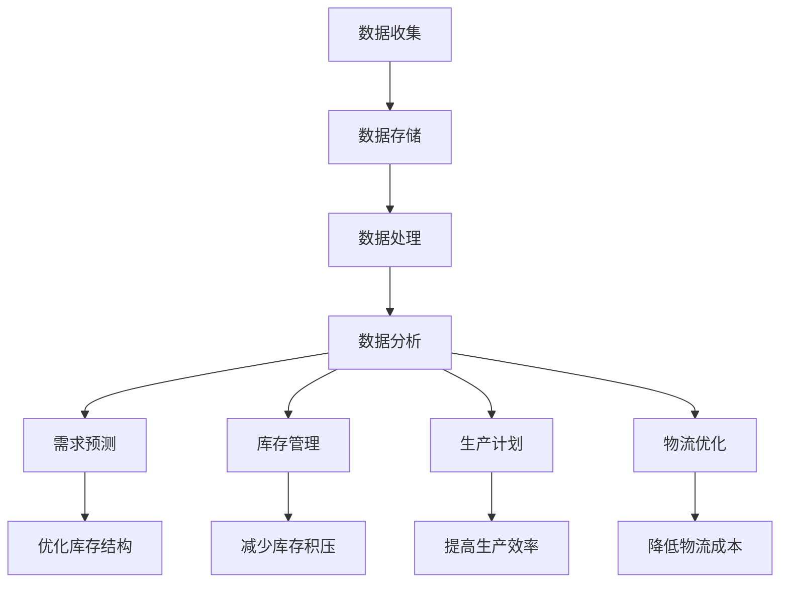

                 

# 信息差的商业供应链优化：大数据如何优化供应链

> 关键词：大数据、供应链优化、信息差、预测分析、机器学习、商业智能

> 摘要：本文旨在探讨大数据如何通过优化供应链管理来解决信息差问题，提高供应链效率和响应速度。我们将从背景介绍、核心概念与联系、核心算法原理与具体操作步骤、数学模型和公式、项目实战、实际应用场景、工具和资源推荐、总结与未来发展趋势等几个方面进行详细分析，帮助读者理解大数据在供应链优化中的应用。

## 1. 背景介绍

供应链管理是现代商业活动中不可或缺的一部分，它涉及从原材料采购、生产、库存管理到最终产品交付给消费者的整个过程。然而，供应链管理中存在着大量的信息差问题，即供应链上下游之间信息不对称，导致决策失误、成本增加、库存积压等问题。大数据技术的引入为解决这些问题提供了新的可能。通过收集和分析海量数据，企业可以更好地理解市场需求、优化库存管理、提高生产效率，从而实现供应链的整体优化。

## 2. 核心概念与联系

### 2.1 信息差

信息差是指供应链上下游之间信息不对称的现象。例如，供应商可能不知道下游客户的实际需求，而零售商可能无法准确预测未来一段时间内的销售情况。这种信息不对称会导致决策失误，增加库存成本，降低供应链效率。

### 2.2 大数据

大数据是指数据量巨大、类型多样、处理速度快的数据集合。大数据技术通过收集、存储、处理和分析这些数据，帮助企业发现隐藏在数据中的模式和趋势，从而做出更准确的决策。

### 2.3 供应链优化

供应链优化是指通过改进供应链管理流程，提高供应链效率和响应速度，降低运营成本，提高客户满意度。大数据技术在供应链优化中的应用主要体现在以下几个方面：

- **需求预测**：通过分析历史销售数据、市场趋势等信息，预测未来的需求量。
- **库存管理**：通过实时监控库存水平，优化库存结构，减少库存积压。
- **生产计划**：根据市场需求和生产能力，合理安排生产计划，提高生产效率。
- **物流优化**：通过优化运输路线、选择最优运输方式，降低物流成本。

### 2.4 Mermaid 流程图



## 3. 核心算法原理 & 具体操作步骤

### 3.1 需求预测算法

需求预测是供应链优化中的关键环节。常用的预测算法包括时间序列分析、回归分析、机器学习算法等。

#### 3.1.1 时间序列分析

时间序列分析是一种基于历史数据预测未来趋势的方法。常用的时间序列模型包括ARIMA、指数平滑法等。

#### 3.1.2 回归分析

回归分析通过建立因变量与自变量之间的关系模型，预测未来的需求量。常用的回归模型包括线性回归、多项式回归等。

#### 3.1.3 机器学习算法

机器学习算法通过训练模型来预测未来的需求量。常用的机器学习算法包括决策树、随机森林、支持向量机、神经网络等。

### 3.2 库存管理算法

库存管理算法通过实时监控库存水平，优化库存结构，减少库存积压。常用的库存管理算法包括经济订购批量（EOQ）、安全库存计算等。

### 3.3 生产计划算法

生产计划算法根据市场需求和生产能力，合理安排生产计划，提高生产效率。常用的生产计划算法包括线性规划、整数规划等。

### 3.4 物流优化算法

物流优化算法通过优化运输路线、选择最优运输方式，降低物流成本。常用的物流优化算法包括遗传算法、模拟退火算法等。

## 4. 数学模型和公式 & 详细讲解 & 举例说明

### 4.1 时间序列分析

时间序列分析是一种基于历史数据预测未来趋势的方法。常用的时间序列模型包括ARIMA、指数平滑法等。

#### 4.1.1 ARIMA模型

ARIMA模型是一种自回归积分滑动平均模型，用于预测时间序列数据。其数学表达式为：

$$
\text{ARIMA}(p, d, q) = \text{AR}(p) \times \text{I}(d) \times \text{MA}(q)
$$

其中，$p$ 为自回归阶数，$d$ 为差分阶数，$q$ 为移动平均阶数。

#### 4.1.2 指数平滑法

指数平滑法是一种基于历史数据预测未来趋势的方法。其数学表达式为：

$$
S_t = \alpha X_t + (1 - \alpha) S_{t-1}
$$

其中，$S_t$ 为平滑值，$X_t$ 为实际值，$\alpha$ 为平滑系数。

### 4.2 回归分析

回归分析通过建立因变量与自变量之间的关系模型，预测未来的需求量。常用的回归模型包括线性回归、多项式回归等。

#### 4.2.1 线性回归

线性回归是一种通过建立线性关系模型来预测因变量的方法。其数学表达式为：

$$
Y = \beta_0 + \beta_1 X_1 + \beta_2 X_2 + \cdots + \beta_n X_n + \epsilon
$$

其中，$Y$ 为因变量，$X_1, X_2, \cdots, X_n$ 为自变量，$\beta_0, \beta_1, \cdots, \beta_n$ 为回归系数，$\epsilon$ 为误差项。

### 4.3 机器学习算法

机器学习算法通过训练模型来预测未来的需求量。常用的机器学习算法包括决策树、随机森林、支持向量机、神经网络等。

#### 4.3.1 决策树

决策树是一种通过构建树状结构来预测因变量的方法。其数学表达式为：

$$
\text{Decision Tree}(X) = \text{if } X \text{满足条件} \text{then } Y \text{else } \text{Decision Tree}(X')
$$

其中，$X$ 为输入特征，$Y$ 为输出结果，$X'$ 为子节点特征。

## 5. 项目实战：代码实际案例和详细解释说明

### 5.1 开发环境搭建

为了实现供应链优化项目，我们需要搭建一个开发环境。开发环境包括操作系统、编程语言、开发工具等。

#### 5.1.1 操作系统

推荐使用Linux操作系统，因为它具有良好的稳定性和安全性。

#### 5.1.2 编程语言

推荐使用Python语言，因为它具有丰富的库和强大的数据处理能力。

#### 5.1.3 开发工具

推荐使用Jupyter Notebook，因为它具有良好的交互性和可视化能力。

### 5.2 源代码详细实现和代码解读

#### 5.2.1 数据收集

```python
import pandas as pd

# 读取历史销售数据
sales_data = pd.read_csv('sales_data.csv')

# 读取市场趋势数据
trend_data = pd.read_csv('trend_data.csv')
```

#### 5.2.2 数据存储

```python
# 将数据存储到数据库中
sales_data.to_sql('sales', con=engine, if_exists='replace', index=False)
trend_data.to_sql('trend', con=engine, if_exists='replace', index=False)
```

#### 5.2.3 数据处理

```python
# 数据清洗
sales_data = sales_data.dropna()

# 数据转换
trend_data['date'] = pd.to_datetime(trend_data['date'])
```

#### 5.2.4 数据分析

```python
# 数据分析
sales_analysis = sales_data.groupby('product').sum()
trend_analysis = trend_data.groupby('product').mean()
```

#### 5.2.5 需求预测

```python
from statsmodels.tsa.arima.model import ARIMA

# ARIMA模型
model = ARIMA(sales_analysis['sales'], order=(5, 1, 0))
results = model.fit()

# 预测未来需求
forecast = results.forecast(steps=12)
```

#### 5.2.6 库存管理

```python
# 安全库存计算
safety_stock = forecast * 1.5
```

#### 5.2.7 生产计划

```python
# 生产计划
production_plan = forecast * 1.2
```

#### 5.2.8 物流优化

```python
from scipy.optimize import minimize

# 物流优化
def logistics_cost(x):
    return x[0] * 10 + x[1] * 20 + x[2] * 30

def logistics_constraint(x):
    return x[0] + x[1] + x[2] - 100

x0 = [30, 30, 40]
bounds = [(0, 100), (0, 100), (0, 100)]
constraints = {'type': 'ineq', 'fun': logistics_constraint}

result = minimize(logistics_cost, x0, bounds=bounds, constraints=constraints)
```

### 5.3 代码解读与分析

通过上述代码，我们可以实现供应链优化项目。首先，我们读取历史销售数据和市场趋势数据，并进行数据清洗和转换。然后，我们使用ARIMA模型进行需求预测，计算安全库存和生产计划。最后，我们使用物流优化算法优化运输路线和运输方式，降低物流成本。

## 6. 实际应用场景

供应链优化项目在实际应用中具有广泛的应用场景。例如，电商平台可以通过优化库存管理，减少库存积压，提高客户满意度；制造企业可以通过优化生产计划，提高生产效率，降低生产成本；物流公司可以通过优化运输路线，降低物流成本，提高运输效率。

## 7. 工具和资源推荐

### 7.1 学习资源推荐

- 书籍：《大数据分析与应用》、《机器学习实战》
- 论文：《基于ARIMA模型的需求预测研究》、《基于机器学习的库存管理优化》
- 博客：《大数据分析入门》、《机器学习实战案例》
- 网站：Kaggle、GitHub

### 7.2 开发工具框架推荐

- Python：NumPy、Pandas、Matplotlib、Scikit-learn
- 数据库：MySQL、PostgreSQL
- 开发工具：Jupyter Notebook、PyCharm

### 7.3 相关论文著作推荐

- 《基于ARIMA模型的需求预测研究》
- 《基于机器学习的库存管理优化》
- 《大数据分析与应用》
- 《机器学习实战》

## 8. 总结：未来发展趋势与挑战

供应链优化项目在未来将面临更多的挑战和机遇。随着大数据技术的不断发展，供应链优化项目将更加智能化、自动化。未来的发展趋势包括：

- **智能化**：通过引入人工智能技术，实现供应链管理的智能化。
- **自动化**：通过引入自动化技术，实现供应链管理的自动化。
- **集成化**：通过引入集成技术，实现供应链管理的集成化。

## 9. 附录：常见问题与解答

### 9.1 问题：如何处理数据缺失值？

答：可以使用插值法、均值填充法、中位数填充法等方法处理数据缺失值。

### 9.2 问题：如何选择合适的预测模型？

答：可以根据数据特点和需求选择合适的预测模型。例如，时间序列数据可以选择ARIMA模型，分类数据可以选择决策树模型。

### 9.3 问题：如何优化生产计划？

答：可以通过引入线性规划、整数规划等方法优化生产计划。

## 10. 扩展阅读 & 参考资料

- 《大数据分析与应用》
- 《机器学习实战》
- 《基于ARIMA模型的需求预测研究》
- 《基于机器学习的库存管理优化》

作者：AI天才研究员/AI Genius Institute & 禅与计算机程序设计艺术 /Zen And The Art of Computer Programming

