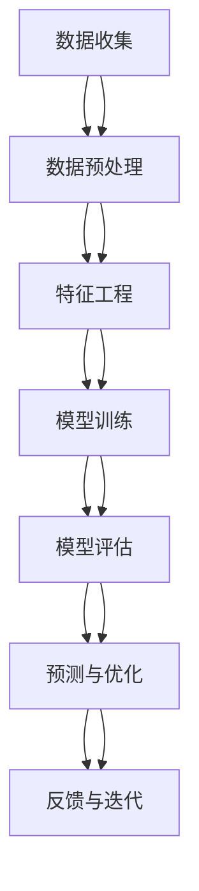

                 

# 信息差的商业渠道管理：大数据如何优化渠道管理

> 关键词：大数据、渠道管理、信息差、商业智能、机器学习、预测分析、客户行为分析

> 摘要：在当今高度竞争的商业环境中，有效管理渠道是企业成功的关键。本文将探讨如何利用大数据技术优化渠道管理，通过分析信息差来提升企业的市场竞争力。我们将从背景介绍、核心概念与联系、核心算法原理、数学模型和公式、项目实战、实际应用场景、工具和资源推荐、总结与未来发展趋势等多方面进行深入探讨。

## 1. 背景介绍

在数字化时代，企业面临着前所未有的挑战和机遇。随着互联网和移动技术的普及，消费者行为变得更加复杂和多样化。为了在激烈的市场竞争中脱颖而出，企业需要更加精准地了解客户需求，优化销售渠道，提高客户满意度和忠诚度。传统的渠道管理方法往往依赖于人工经验，难以应对海量数据和快速变化的市场环境。因此，利用大数据技术优化渠道管理成为了一种必然趋势。

## 2. 核心概念与联系

### 2.1 信息差

信息差是指在信息不对称的情况下，一方拥有另一方所不具备的信息优势。在商业渠道管理中，信息差主要体现在企业与消费者之间、不同渠道之间以及不同市场区域之间的信息不对称。通过大数据技术，企业可以收集和分析海量数据，从而缩小这些信息差，实现更精准的市场定位和渠道优化。

### 2.2 商业智能

商业智能（BI）是指利用数据分析技术来支持企业决策的过程。通过BI，企业可以将复杂的数据转化为易于理解的洞察和报告，帮助企业更好地理解市场趋势、客户需求和渠道表现。

### 2.3 机器学习

机器学习是一种人工智能技术，通过训练模型来自动识别数据中的模式和规律。在渠道管理中，机器学习可以帮助企业预测客户行为、优化库存管理、提高销售转化率等。

### 2.4 预测分析

预测分析是一种基于历史数据和统计模型来预测未来趋势的方法。在渠道管理中，预测分析可以帮助企业提前发现潜在问题，制定相应的策略，从而提高渠道效率和客户满意度。

### 2.5 客户行为分析

客户行为分析是指通过收集和分析客户数据来了解客户的行为模式和偏好。在渠道管理中，客户行为分析可以帮助企业更好地理解客户需求，优化产品和服务，提高客户满意度和忠诚度。

### 2.6 数据流程图



## 3. 核心算法原理 & 具体操作步骤

### 3.1 数据收集

数据收集是大数据分析的第一步。企业可以通过多种渠道收集客户数据，包括但不限于：

- 电商平台
- 社交媒体
- 客户关系管理系统（CRM）
- 问卷调查
- 传感器数据

### 3.2 数据预处理

数据预处理是确保数据质量的关键步骤。主要包括以下几个方面：

- 数据清洗：去除重复数据、处理缺失值、纠正错误数据
- 数据转换：将数据转换为适合分析的格式
- 数据集成：将来自不同来源的数据整合在一起

### 3.3 特征工程

特征工程是指从原始数据中提取有用的特征，以便更好地进行分析。特征工程主要包括以下几个方面：

- 特征选择：选择对分析目标最有帮助的特征
- 特征构造：通过组合和转换原始特征来创建新的特征
- 特征缩放：将特征调整到相同的尺度，以便更好地进行分析

### 3.4 模型训练

模型训练是利用机器学习算法来训练模型的过程。主要包括以下几个方面：

- 选择合适的机器学习算法
- 划分训练集和测试集
- 调整模型参数
- 训练模型

### 3.5 模型评估

模型评估是通过测试集来评估模型性能的过程。主要包括以下几个方面：

- 计算模型的准确率、召回率、F1分数等指标
- 分析模型的预测结果
- 识别模型的不足之处

### 3.6 预测与优化

预测与优化是利用训练好的模型来进行预测和优化的过程。主要包括以下几个方面：

- 使用模型进行预测
- 根据预测结果进行优化
- 反馈与迭代

## 4. 数学模型和公式 & 详细讲解 & 举例说明

### 4.1 逻辑回归模型

逻辑回归是一种常用的分类算法，适用于二分类问题。其数学模型如下：

$$
P(y=1|x) = \frac{1}{1 + e^{-(\beta_0 + \beta_1 x_1 + \beta_2 x_2 + ... + \beta_n x_n)}}
$$

其中，$P(y=1|x)$ 表示在给定特征 $x$ 的情况下，事件 $y=1$ 发生的概率；$\beta_0, \beta_1, \beta_2, ..., \beta_n$ 是模型参数。

### 4.2 决策树模型

决策树是一种常用的分类和回归算法。其数学模型如下：

$$
f(x) = \sum_{i=1}^{m} \alpha_i I(x \in R_i)
$$

其中，$f(x)$ 表示在给定特征 $x$ 的情况下，模型的预测值；$\alpha_i$ 是决策树的权重；$I(x \in R_i)$ 是指示函数，表示特征 $x$ 是否属于区域 $R_i$。

### 4.3 随机森林模型

随机森林是一种集成学习算法，通过多个决策树来提高模型的泛化能力。其数学模型如下：

$$
f(x) = \frac{1}{M} \sum_{m=1}^{M} f_m(x)
$$

其中，$f(x)$ 表示在给定特征 $x$ 的情况下，模型的预测值；$f_m(x)$ 是第 $m$ 棵决策树的预测值；$M$ 是决策树的数量。

### 4.4 举例说明

假设我们有一个电商平台，需要预测客户的购买行为。我们可以使用逻辑回归模型来预测客户是否会购买某个产品。具体步骤如下：

1. 收集客户数据，包括客户的购买历史、浏览行为、个人信息等。
2. 对数据进行预处理，包括数据清洗、数据转换、数据集成等。
3. 进行特征工程，选择对预测目标最有帮助的特征。
4. 选择逻辑回归模型，训练模型。
5. 使用模型进行预测，评估模型性能。
6. 根据预测结果进行优化，提高客户购买率。

## 5. 项目实战：代码实际案例和详细解释说明

### 5.1 开发环境搭建

为了进行项目实战，我们需要搭建一个开发环境。具体步骤如下：

1. 安装Python和相关库，如NumPy、Pandas、Scikit-learn等。
2. 安装Jupyter Notebook，用于编写和运行代码。
3. 安装TensorFlow或PyTorch，用于深度学习模型的训练和预测。

### 5.2 源代码详细实现和代码解读

假设我们有一个电商平台，需要预测客户的购买行为。具体代码如下：

```python
import pandas as pd
from sklearn.model_selection import train_test_split
from sklearn.preprocessing import StandardScaler
from sklearn.linear_model import LogisticRegression
from sklearn.metrics import accuracy_score

# 1. 数据收集
data = pd.read_csv('customer_data.csv')

# 2. 数据预处理
data = data.dropna()  # 去除缺失值
data = pd.get_dummies(data)  # 将分类变量转换为虚拟变量

# 3. 特征工程
X = data.drop('purchase', axis=1)
y = data['purchase']

# 4. 划分训练集和测试集
X_train, X_test, y_train, y_test = train_test_split(X, y, test_size=0.2, random_state=42)

# 5. 数据标准化
scaler = StandardScaler()
X_train = scaler.fit_transform(X_train)
X_test = scaler.transform(X_test)

# 6. 模型训练
model = LogisticRegression()
model.fit(X_train, y_train)

# 7. 模型评估
y_pred = model.predict(X_test)
accuracy = accuracy_score(y_test, y_pred)
print('Accuracy:', accuracy)
```

### 5.3 代码解读与分析

1. **数据收集**：从CSV文件中读取客户数据。
2. **数据预处理**：去除缺失值，将分类变量转换为虚拟变量。
3. **特征工程**：选择特征，包括客户的购买历史、浏览行为、个人信息等。
4. **划分训练集和测试集**：将数据划分为训练集和测试集，用于模型训练和评估。
5. **数据标准化**：对特征进行标准化处理，以便更好地进行模型训练。
6. **模型训练**：使用逻辑回归模型进行训练。
7. **模型评估**：使用测试集进行预测，计算模型的准确率。

## 6. 实际应用场景

### 6.1 电商平台

电商平台可以通过大数据技术优化渠道管理，提高客户购买率。具体应用场景包括：

- 预测客户购买行为，提高客户满意度和忠诚度
- 优化库存管理，减少库存积压和缺货现象
- 提高销售转化率，增加销售额

### 6.2 零售业

零售业可以通过大数据技术优化渠道管理，提高客户满意度和忠诚度。具体应用场景包括：

- 预测客户购买行为，提高客户满意度和忠诚度
- 优化库存管理，减少库存积压和缺货现象
- 提高销售转化率，增加销售额

### 6.3 金融业

金融业可以通过大数据技术优化渠道管理，提高客户满意度和忠诚度。具体应用场景包括：

- 预测客户购买行为，提高客户满意度和忠诚度
- 优化库存管理，减少库存积压和缺货现象
- 提高销售转化率，增加销售额

## 7. 工具和资源推荐

### 7.1 学习资源推荐

- 书籍：《Python数据科学手册》、《机器学习实战》
- 论文：《大数据技术在商业渠道管理中的应用》
- 博客：阿里云开发者社区、GitHub
- 网站：Kaggle、DataCamp

### 7.2 开发工具框架推荐

- Python：NumPy、Pandas、Scikit-learn、TensorFlow、PyTorch
- R：caret、randomForest
- Java：Weka

### 7.3 相关论文著作推荐

- 《大数据技术在商业渠道管理中的应用》
- 《机器学习在商业渠道管理中的应用》
- 《大数据分析在商业渠道管理中的应用》

## 8. 总结：未来发展趋势与挑战

### 8.1 未来发展趋势

- 大数据技术将进一步发展，提供更多高级分析工具和算法
- 人工智能技术将进一步普及，提高渠道管理的智能化水平
- 云计算技术将进一步成熟，提供更强大的计算能力和存储能力

### 8.2 挑战

- 数据安全和隐私保护问题
- 数据质量和数据治理问题
- 人才短缺问题

## 9. 附录：常见问题与解答

### 9.1 问题：如何处理缺失值？

- 回答：可以使用均值、中位数或众数填充缺失值，或者使用插值方法进行填充。

### 9.2 问题：如何选择合适的机器学习算法？

- 回答：可以根据问题类型（分类、回归）和数据特性（线性、非线性）选择合适的算法。

### 9.3 问题：如何评估模型性能？

- 回答：可以使用准确率、召回率、F1分数等指标来评估模型性能。

## 10. 扩展阅读 & 参考资料

- 《Python数据科学手册》
- 《机器学习实战》
- 《大数据技术在商业渠道管理中的应用》
- 《机器学习在商业渠道管理中的应用》
- 《大数据分析在商业渠道管理中的应用》

---

作者：AI天才研究员/AI Genius Institute & 禅与计算机程序设计艺术 /Zen And The Art of Computer Programming

