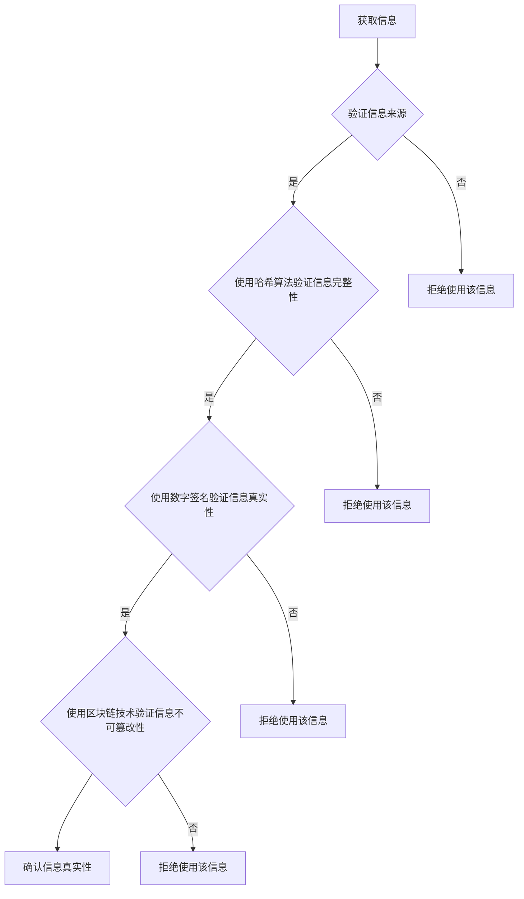

                 

# 信息验证和信息素养教育重要性：为数字时代培养信息素养能力

> 关键词：信息验证, 信息素养, 数字时代, 信息素养教育, 人工智能, 数据分析, 信息安全

> 摘要：在数字时代，信息的爆炸性增长使得信息验证和信息素养教育变得尤为重要。本文将从信息验证的基本概念出发，探讨信息验证的重要性，分析信息验证的核心算法原理，通过实际案例展示如何进行信息验证，讨论信息验证在实际应用场景中的价值，并提供学习资源和开发工具推荐，最后展望未来发展趋势与挑战。

## 1. 背景介绍

随着互联网的普及和大数据技术的发展，信息的获取变得前所未有的便捷。然而，信息的爆炸性增长也带来了信息质量参差不齐的问题。虚假信息、误导性信息、恶意信息等充斥网络，给个人和社会带来了巨大的困扰。因此，如何有效验证信息的真实性，提高信息素养，成为了一个亟待解决的问题。

### 1.1 信息爆炸与信息质量

- **信息爆炸**：互联网的普及使得信息的产生和传播速度达到了前所未有的水平。根据Statista的数据，全球互联网用户数量从2005年的10亿增长到2021年的49亿，预计到2025年将达到57亿。这不仅意味着信息量的激增，也意味着信息的种类和来源更加多样化。
- **信息质量**：信息质量的参差不齐主要体现在以下几个方面：
  - **虚假信息**：包括谣言、假新闻、误导性信息等。
  - **误导性信息**：信息虽然真实，但被有意或无意地扭曲，导致读者产生错误的理解。
  - **恶意信息**：包括网络诈骗、恶意软件、网络攻击等。

### 1.2 信息验证的重要性

- **个人层面**：信息验证有助于个人做出正确的决策，避免受到虚假信息的误导，保护个人隐私和财产安全。
- **社会层面**：信息验证有助于维护社会秩序，减少谣言和虚假信息的传播，促进社会和谐。
- **企业层面**：信息验证有助于企业做出正确的市场决策，避免因虚假信息导致的经济损失。

## 2. 核心概念与联系

### 2.1 信息验证的基本概念

- **信息验证**：是指通过一系列方法和技术手段，对信息的真实性、准确性和可靠性进行评估的过程。
- **信息素养**：是指个人具备的信息获取、分析、评价和利用的能力，包括信息意识、信息知识、信息能力和信息伦理。

### 2.2 信息验证的核心算法原理

#### 2.2.1 哈希算法

哈希算法是一种将任意长度的数据转换为固定长度的字符串（哈希值）的过程。哈希算法具有以下特点：

- **唯一性**：相同的输入数据会产生相同的哈希值。
- **不可逆性**：从哈希值无法反推出原始数据。
- **抗碰撞性**：即使输入数据发生微小变化，产生的哈希值也会完全不同。

#### 2.2.2 数字签名

数字签名是一种通过公钥加密技术对信息进行签名的过程。数字签名具有以下特点：

- **身份验证**：验证发送者的身份。
- **完整性**：验证信息在传输过程中是否被篡改。
- **不可否认性**：发送者无法否认发送的信息。

#### 2.2.3 区块链技术

区块链技术是一种去中心化的分布式账本技术，具有以下特点：

- **去中心化**：没有单一的控制点，数据存储在多个节点上。
- **不可篡改**：一旦数据被写入区块链，就无法被修改或删除。
- **透明性**：所有交易记录都是公开的，任何人都可以查看。

### 2.3 信息验证的流程图



## 3. 核心算法原理 & 具体操作步骤

### 3.1 哈希算法的具体操作步骤

1. **选择哈希函数**：根据需求选择合适的哈希函数，如MD5、SHA-1、SHA-256等。
2. **输入数据**：将需要验证的信息输入哈希函数。
3. **计算哈希值**：哈希函数将输入数据转换为固定长度的哈希值。
4. **比较哈希值**：将计算得到的哈希值与已知的正确哈希值进行比较，如果一致，则信息未被篡改。

### 3.2 数字签名的具体操作步骤

1. **生成私钥和公钥**：使用公钥加密技术生成一对私钥和公钥。
2. **生成签名**：使用私钥对信息进行签名。
3. **验证签名**：使用公钥对签名进行验证，验证通过则信息未被篡改。

### 3.3 区块链技术的具体操作步骤

1. **创建区块**：将交易信息打包成一个区块。
2. **生成区块哈希**：使用哈希算法生成区块哈希值。
3. **链接区块**：将新区块链接到区块链的末尾。
4. **广播区块**：将新区块广播给网络中的其他节点。
5. **验证区块**：其他节点验证新区块的有效性，包括哈希值和前一个区块的哈希值。
6. **确认区块**：新区块被确认后，被添加到区块链中。

## 4. 数学模型和公式 & 详细讲解 & 举例说明

### 4.1 哈希算法的数学模型

哈希算法的数学模型可以表示为：

$$
H = H_{\text{func}}(M)
$$

其中，$H$ 表示哈希值，$H_{\text{func}}$ 表示哈希函数，$M$ 表示输入数据。

### 4.2 数字签名的数学模型

数字签名的数学模型可以表示为：

$$
S = S_{\text{func}}(M, K_{\text{private}})
$$

其中，$S$ 表示签名，$S_{\text{func}}$ 表示签名函数，$M$ 表示输入数据，$K_{\text{private}}$ 表示私钥。

### 4.3 区块链技术的数学模型

区块链技术的数学模型可以表示为：

$$
B_{i} = B_{i-1} + H_{\text{func}}(B_{i-1}, M_{i})
$$

其中，$B_{i}$ 表示第 $i$ 个区块，$B_{i-1}$ 表示前一个区块，$M_{i}$ 表示第 $i$ 个区块的交易信息，$H_{\text{func}}$ 表示哈希函数。

### 4.4 举例说明

#### 4.4.1 哈希算法举例

假设输入数据为 "Hello, World!"，使用SHA-256哈希函数进行计算：

$$
H = \text{SHA-256}("Hello, World!") = 64e61af1e2f3d7e5c7d9c62e8b3c5a0c0b2e3f1c0a2b3d4e5f6a7b8c9d0e1f2
$$

#### 4.4.2 数字签名举例

假设输入数据为 "Hello, World!"，私钥为 $K_{\text{private}}$，使用RSA算法进行签名：

$$
S = \text{RSA-Sign}("Hello, World!", K_{\text{private}}) = \text{签名值}
$$

#### 4.4.3 区块链技术举例

假设第 $i-1$ 个区块的哈希值为 $H_{i-1}$，第 $i$ 个区块的交易信息为 $M_{i}$，使用SHA-256哈希函数进行计算：

$$
B_{i} = B_{i-1} + \text{SHA-256}(B_{i-1}, M_{i}) = \text{区块值}
$$

## 5. 项目实战：代码实际案例和详细解释说明

### 5.1 开发环境搭建

#### 5.1.1 环境要求

- **操作系统**：Windows 10/Ubuntu 20.04
- **编程语言**：Python 3.8
- **开发工具**：Visual Studio Code

#### 5.1.2 安装依赖

```bash
pip install hashlib
pip install cryptography
pip install pysha3
```

### 5.2 源代码详细实现和代码解读

#### 5.2.1 哈希算法实现

```python
import hashlib

def hash_data(data):
    hash_object = hashlib.sha256()
    hash_object.update(data.encode('utf-8'))
    return hash_object.hexdigest()

data = "Hello, World!"
hash_value = hash_data(data)
print(f"Hash value: {hash_value}")
```

#### 5.2.2 数字签名实现

```python
from cryptography.hazmat.primitives import hashes
from cryptography.hazmat.primitives.asymmetric import padding
from cryptography.hazmat.primitives.asymmetric import rsa
from cryptography.hazmat.primitives import serialization
from cryptography.hazmat.backends import default_backend

def generate_key_pair():
    private_key = rsa.generate_private_key(
        public_exponent=65537,
        key_size=2048,
        backend=default_backend()
    )
    public_key = private_key.public_key()
    return private_key, public_key

def sign_data(private_key, data):
    signature = private_key.sign(
        data.encode('utf-8'),
        padding.PSS(
            mgf=padding.MGF1(hashes.SHA256()),
            salt_length=padding.PSS.MAX_LENGTH
        ),
        hashes.SHA256()
    )
    return signature

def verify_signature(public_key, data, signature):
    try:
        public_key.verify(
            signature,
            data.encode('utf-8'),
            padding.PSS(
                mgf=padding.MGF1(hashes.SHA256()),
                salt_length=padding.PSS.MAX_LENGTH
            ),
            hashes.SHA256()
        )
        return True
    except:
        return False

private_key, public_key = generate_key_pair()
data = "Hello, World!"
signature = sign_data(private_key, data)
print(f"Signature: {signature.hex()}")
print(f"Verification: {verify_signature(public_key, data, signature.hex())}")
```

#### 5.2.3 区块链技术实现

```python
import hashlib
import json
from time import time

class Block:
    def __init__(self, index, previous_hash, timestamp, data, hash):
        self.index = index
        self.previous_hash = previous_hash
        self.timestamp = timestamp
        self.data = data
        self.hash = hash

def hash_block(block):
    block_string = json.dumps(block, sort_keys=True).encode()
    return hashlib.sha256(block_string).hexdigest()

def create_genesis_block():
    return Block(0, "0", time(), "Genesis Block", hash_block({"index": 0, "previous_hash": "0", "timestamp": time(), "data": "Genesis Block"}))

def create_new_block(previous_block, data):
    index = previous_block.index + 1
    timestamp = time()
    hash = hash_block(previous_block)
    return Block(index, hash, timestamp, data, hash_block({"index": index, "previous_hash": hash, "timestamp": timestamp, "data": data}))

blockchain = [create_genesis_block()]
previous_block = blockchain[0]

# Add 20 new blocks to the chain
for i in range(1, 21):
    new_block = create_new_block(previous_block, f"Block #{i}")
    blockchain.append(new_block)
    previous_block = new_block

for block in blockchain:
    print(f"Block #{block.index}: {block.data}")
```

### 5.3 代码解读与分析

#### 5.3.1 哈希算法解读

- **hash_data** 函数使用 SHA-256 哈希函数对输入数据进行哈希计算。
- **hash_value** 是计算得到的哈希值。

#### 5.3.2 数字签名解读

- **generate_key_pair** 函数生成一对公钥和私钥。
- **sign_data** 函数使用私钥对输入数据进行签名。
- **verify_signature** 函数使用公钥验证签名的有效性。

#### 5.3.3 区块链技术解读

- **Block** 类定义了一个区块的结构。
- **hash_block** 函数计算区块的哈希值。
- **create_genesis_block** 函数创建创世区块。
- **create_new_block** 函数创建新的区块。
- **blockchain** 是一个包含多个区块的列表。

## 6. 实际应用场景

### 6.1 信息验证在新闻领域的应用

- **新闻真实性验证**：通过哈希算法和数字签名技术验证新闻的真实性，确保新闻来源可靠。
- **新闻传播监控**：通过区块链技术监控新闻的传播路径，防止虚假新闻的传播。

### 6.2 信息验证在电子商务领域的应用

- **商品信息验证**：通过哈希算法和数字签名技术验证商品信息的真实性，防止假冒伪劣商品的销售。
- **交易记录验证**：通过区块链技术验证交易记录的真实性，确保交易的安全性。

### 6.3 信息验证在金融领域的应用

- **交易记录验证**：通过区块链技术验证交易记录的真实性，确保金融交易的安全性。
- **身份验证**：通过数字签名技术验证用户身份，确保金融交易的安全性。

## 7. 工具和资源推荐

### 7.1 学习资源推荐

- **书籍**：《信息素养：数字时代的生存技能》、《区块链技术原理与应用》
- **论文**：《哈希算法在信息验证中的应用》、《数字签名技术在信息安全中的应用》
- **博客**：《区块链技术入门》、《哈希算法详解》
- **网站**：Coursera、edX、GitHub

### 7.2 开发工具框架推荐

- **开发工具**：Visual Studio Code、PyCharm
- **框架**：Flask、Django

### 7.3 相关论文著作推荐

- **论文**：《区块链技术在金融领域的应用研究》、《哈希算法在信息安全中的应用研究》
- **著作**：《区块链技术原理与应用》、《信息素养：数字时代的生存技能》

## 8. 总结：未来发展趋势与挑战

### 8.1 未来发展趋势

- **信息验证技术的普及**：随着技术的发展，信息验证技术将更加普及，成为数字时代的基本技能。
- **信息验证技术的创新**：新的哈希算法、数字签名算法和区块链技术将不断涌现，提高信息验证的效率和准确性。
- **信息验证技术的应用**：信息验证技术将在更多领域得到应用，如电子商务、金融、医疗等。

### 8.2 未来挑战

- **技术挑战**：如何提高信息验证技术的效率和准确性，如何应对新的信息安全威胁。
- **社会挑战**：如何提高公众的信息素养，如何建立完善的信息验证机制。
- **法律挑战**：如何制定和完善相关法律法规，保护个人隐私和信息安全。

## 9. 附录：常见问题与解答

### 9.1 哈希算法常见问题

- **问题**：哈希算法是否安全？
- **解答**：哈希算法的安全性取决于哈希函数的选择。目前，SHA-256、SHA-3等哈希函数被认为是安全的。

### 9.2 数字签名常见问题

- **问题**：数字签名是否可靠？
- **解答**：数字签名的可靠性取决于私钥的安全性。私钥应妥善保管，防止被泄露。

### 9.3 区块链技术常见问题

- **问题**：区块链技术是否适合所有应用场景？
- **解答**：区块链技术适用于需要去中心化、不可篡改和透明性的应用场景，如金融、供应链管理等。

## 10. 扩展阅读 & 参考资料

- **书籍**：《信息素养：数字时代的生存技能》、《区块链技术原理与应用》
- **论文**：《哈希算法在信息验证中的应用》、《数字签名技术在信息安全中的应用》
- **网站**：Coursera、edX、GitHub

---

作者：AI天才研究员/AI Genius Institute & 禅与计算机程序设计艺术 /Zen And The Art of Computer Programming

