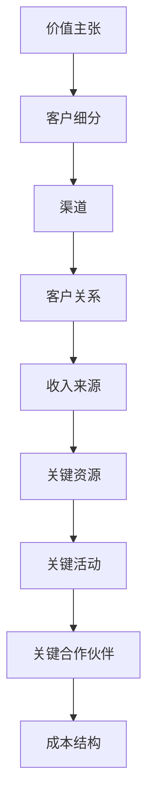

                 

# 创业路上的商业模式创新：颠覆传统行业的方法

> 关键词：商业模式创新、颠覆性技术、创业、传统行业、人工智能、区块链、云计算

> 摘要：本文旨在探讨如何通过商业模式创新来颠覆传统行业，特别是在人工智能、区块链和云计算等前沿技术的推动下，如何构建新的商业模式，实现创业成功。我们将从背景介绍、核心概念与联系、核心算法原理与具体操作步骤、数学模型和公式、项目实战、实际应用场景、工具和资源推荐、总结与未来发展趋势等几个方面进行详细阐述。

## 1. 背景介绍

在当今快速变化的商业环境中，传统行业面临着前所未有的挑战。随着人工智能、区块链和云计算等前沿技术的迅猛发展，这些行业正经历着深刻的变革。商业模式创新成为企业能否在竞争中脱颖而出的关键。本文将探讨如何通过商业模式创新来颠覆传统行业，实现创业成功。

### 1.1 传统行业的现状与挑战

传统行业普遍面临以下挑战：
- **效率低下**：许多传统行业依赖于人工操作，效率低下且容易出错。
- **成本高昂**：高昂的人力成本和运营成本使得传统行业难以实现大规模扩张。
- **信息不对称**：信息不对称导致市场失灵，影响资源配置效率。
- **创新能力不足**：传统行业往往缺乏创新动力，难以适应快速变化的市场需求。

### 1.2 前沿技术的推动

人工智能、区块链和云计算等前沿技术为传统行业带来了新的机遇：
- **人工智能**：通过机器学习和深度学习技术，可以实现自动化和智能化，提高效率和降低成本。
- **区块链**：提供透明、安全的数据共享机制，增强信任，降低交易成本。
- **云计算**：提供弹性、可扩展的计算资源，支持大数据处理和分析。

### 1.3 商业模式创新的重要性

商业模式创新是企业实现可持续发展的关键。通过创新商业模式，企业可以：
- **提高竞争力**：通过提供更优质的产品和服务，吸引更多客户。
- **降低成本**：通过优化流程和资源利用，降低运营成本。
- **增强创新能力**：通过持续创新，保持市场领先地位。
- **拓展市场**：通过新的商业模式，开拓新的市场和客户群体。

## 2. 核心概念与联系

### 2.1 商业模式创新的概念

商业模式创新是指通过重新设计企业的核心业务模式，以实现更高的效率、更好的客户体验和更大的市场价值。商业模式创新包括以下几个方面：
- **价值主张**：明确企业为客户提供什么样的价值。
- **客户细分**：识别和细分目标客户群体。
- **渠道**：选择合适的渠道来接触和吸引客户。
- **客户关系**：建立和维护与客户的关系。
- **收入来源**：确定企业的收入模式。
- **关键资源**：确定企业需要的关键资源。
- **关键活动**：确定企业需要进行的关键活动。
- **关键合作伙伴**：确定企业需要的关键合作伙伴。
- **成本结构**：确定企业的成本结构。

### 2.2 核心概念的Mermaid流程图



### 2.3 商业模式创新与前沿技术的关系

商业模式创新与前沿技术密切相关。通过利用人工智能、区块链和云计算等技术，企业可以实现以下创新：
- **自动化和智能化**：通过人工智能技术，实现自动化和智能化，提高效率和降低成本。
- **透明和信任**：通过区块链技术，提供透明、安全的数据共享机制，增强信任。
- **弹性计算资源**：通过云计算技术，提供弹性、可扩展的计算资源，支持大数据处理和分析。

## 3. 核心算法原理 & 具体操作步骤

### 3.1 人工智能算法原理

人工智能算法主要包括机器学习和深度学习。机器学习通过训练模型来实现自动化决策，而深度学习通过多层神经网络来实现复杂的模式识别。

#### 3.1.1 机器学习算法原理

机器学习算法主要包括监督学习、无监督学习和强化学习。监督学习通过训练模型来预测未知数据的标签，无监督学习通过训练模型来发现数据的内在结构，强化学习通过训练模型来实现最优决策。

#### 3.1.2 深度学习算法原理

深度学习算法通过多层神经网络来实现复杂的模式识别。深度学习算法主要包括卷积神经网络（CNN）、循环神经网络（RNN）和长短时记忆网络（LSTM）。

### 3.2 区块链算法原理

区块链算法主要包括共识机制、加密算法和智能合约。共识机制通过网络节点达成一致，加密算法通过加密技术保证数据的安全性，智能合约通过编程实现自动化执行。

#### 3.2.1 共识机制

共识机制主要包括工作量证明（PoW）、权益证明（PoS）和委托权益证明（DPoS）。工作量证明通过计算复杂度来达成共识，权益证明通过持有代币的数量来达成共识，委托权益证明通过委托代币给节点来达成共识。

#### 3.2.2 加密算法

加密算法主要包括对称加密和非对称加密。对称加密通过相同的密钥进行加密和解密，非对称加密通过公钥和私钥进行加密和解密。

#### 3.2.3 智能合约

智能合约通过编程实现自动化执行。智能合约可以实现自动化的交易、支付和合同执行。

### 3.3 云计算算法原理

云计算算法主要包括虚拟化技术、分布式计算和弹性计算。虚拟化技术通过虚拟化技术实现资源的隔离和共享，分布式计算通过分布式计算技术实现大规模数据处理，弹性计算通过弹性计算技术实现资源的动态分配。

#### 3.3.1 虚拟化技术

虚拟化技术通过虚拟化技术实现资源的隔离和共享。虚拟化技术可以实现虚拟机、容器和网络虚拟化。

#### 3.3.2 分布式计算

分布式计算通过分布式计算技术实现大规模数据处理。分布式计算技术可以实现并行计算、分布式存储和分布式计算框架。

#### 3.3.3 弹性计算

弹性计算通过弹性计算技术实现资源的动态分配。弹性计算技术可以实现自动伸缩、负载均衡和弹性调度。

## 4. 数学模型和公式 & 详细讲解 & 举例说明

### 4.1 机器学习数学模型

机器学习数学模型主要包括线性回归、逻辑回归和神经网络。线性回归通过线性方程来预测未知数据的标签，逻辑回归通过逻辑函数来预测未知数据的标签，神经网络通过多层神经网络来实现复杂的模式识别。

#### 4.1.1 线性回归

线性回归通过线性方程来预测未知数据的标签。线性回归的数学模型为：

$$
y = \beta_0 + \beta_1 x_1 + \beta_2 x_2 + \cdots + \beta_n x_n + \epsilon
$$

其中，$y$ 是预测值，$\beta_0$ 是截距，$\beta_1, \beta_2, \cdots, \beta_n$ 是系数，$x_1, x_2, \cdots, x_n$ 是特征，$\epsilon$ 是误差项。

#### 4.1.2 逻辑回归

逻辑回归通过逻辑函数来预测未知数据的标签。逻辑回归的数学模型为：

$$
P(y=1|x) = \frac{1}{1 + e^{-(\beta_0 + \beta_1 x_1 + \beta_2 x_2 + \cdots + \beta_n x_n)}}
$$

其中，$P(y=1|x)$ 是预测概率，$\beta_0, \beta_1, \beta_2, \cdots, \beta_n$ 是系数，$x_1, x_2, \cdots, x_n$ 是特征。

#### 4.1.3 神经网络

神经网络通过多层神经网络来实现复杂的模式识别。神经网络的数学模型为：

$$
y = f(\beta_0 + \beta_1 x_1 + \beta_2 x_2 + \cdots + \beta_n x_n)
$$

其中，$y$ 是预测值，$\beta_0, \beta_1, \beta_2, \cdots, \beta_n$ 是系数，$x_1, x_2, \cdots, x_n$ 是特征，$f$ 是激活函数。

### 4.2 区块链数学模型

区块链数学模型主要包括哈希函数、公钥和私钥。哈希函数通过哈希算法将数据转换为固定长度的哈希值，公钥和私钥通过加密算法实现数据的安全性。

#### 4.2.1 哈希函数

哈希函数通过哈希算法将数据转换为固定长度的哈希值。哈希函数的数学模型为：

$$
h = H(data)
$$

其中，$h$ 是哈希值，$data$ 是数据，$H$ 是哈希算法。

#### 4.2.2 公钥和私钥

公钥和私钥通过加密算法实现数据的安全性。公钥和私钥的数学模型为：

$$
public\_key = P(private\_key)
$$

其中，$public\_key$ 是公钥，$private\_key$ 是私钥，$P$ 是加密算法。

### 4.3 云计算数学模型

云计算数学模型主要包括虚拟化技术、分布式计算和弹性计算。虚拟化技术通过虚拟化技术实现资源的隔离和共享，分布式计算通过分布式计算技术实现大规模数据处理，弹性计算通过弹性计算技术实现资源的动态分配。

#### 4.3.1 虚拟化技术

虚拟化技术通过虚拟化技术实现资源的隔离和共享。虚拟化技术的数学模型为：

$$
virtual\_machine = V(real\_machine)
$$

其中，$virtual\_machine$ 是虚拟机，$real\_machine$ 是真实机器，$V$ 是虚拟化技术。

#### 4.3.2 分布式计算

分布式计算通过分布式计算技术实现大规模数据处理。分布式计算的数学模型为：

$$
distributed\_computation = D(data)
$$

其中，$distributed\_computation$ 是分布式计算，$data$ 是数据，$D$ 是分布式计算技术。

#### 4.3.3 弹性计算

弹性计算通过弹性计算技术实现资源的动态分配。弹性计算的数学模型为：

$$
elastic\_computation = E(resource)
$$

其中，$elastic\_computation$ 是弹性计算，$resource$ 是资源，$E$ 是弹性计算技术。

## 5. 项目实战：代码实际案例和详细解释说明

### 5.1 开发环境搭建

为了实现商业模式创新，我们需要搭建一个开发环境。开发环境主要包括操作系统、编程语言和开发工具。

#### 5.1.1 操作系统

操作系统主要包括Windows、Linux和macOS。Windows适用于桌面环境，Linux适用于服务器环境，macOS适用于Mac电脑。

#### 5.1.2 编程语言

编程语言主要包括Python、Java和C++。Python适用于数据处理和机器学习，Java适用于企业级应用，C++适用于高性能计算。

#### 5.1.3 开发工具

开发工具主要包括IDE、版本控制和调试工具。IDE如PyCharm、Eclipse和Visual Studio，版本控制如Git，调试工具如pdb。

### 5.2 源代码详细实现和代码解读

我们将通过一个简单的例子来实现商业模式创新。假设我们要实现一个在线教育平台，通过人工智能技术来实现个性化推荐。

#### 5.2.1 数据预处理

首先，我们需要对数据进行预处理。数据预处理主要包括数据清洗、特征提取和数据标准化。

```python
import pandas as pd

# 读取数据
data = pd.read_csv('data.csv')

# 数据清洗
data.dropna(inplace=True)

# 特征提取
features = data[['age', 'gender', 'education']]

# 数据标准化
from sklearn.preprocessing import StandardScaler
scaler = StandardScaler()
features = scaler.fit_transform(features)
```

#### 5.2.2 模型训练

接下来，我们需要训练一个机器学习模型。我们将使用线性回归模型来实现个性化推荐。

```python
from sklearn.linear_model import LinearRegression

# 训练模型
model = LinearRegression()
model.fit(features, data['score'])
```

#### 5.2.3 模型预测

最后，我们需要对新数据进行预测。我们将使用训练好的模型来预测新数据的得分。

```python
# 新数据
new_data = [[25, 'male', 'college']]

# 数据标准化
new_data = scaler.transform(new_data)

# 预测得分
score = model.predict(new_data)
print('预测得分：', score)
```

### 5.3 代码解读与分析

通过上述代码，我们可以实现一个简单的在线教育平台。首先，我们对数据进行预处理，包括数据清洗、特征提取和数据标准化。然后，我们训练一个线性回归模型来实现个性化推荐。最后，我们对新数据进行预测，输出预测得分。

## 6. 实际应用场景

商业模式创新在实际应用场景中具有广泛的应用。以下是一些实际应用场景：

### 6.1 金融行业

在金融行业中，商业模式创新可以实现以下应用场景：
- **智能风控**：通过机器学习技术，实现智能风控，降低风险。
- **智能投顾**：通过机器学习技术，实现智能投顾，提供个性化投资建议。
- **智能交易**：通过机器学习技术，实现智能交易，提高交易效率。

### 6.2 医疗行业

在医疗行业中，商业模式创新可以实现以下应用场景：
- **智能诊断**：通过机器学习技术，实现智能诊断，提高诊断准确率。
- **智能治疗**：通过机器学习技术，实现智能治疗，提供个性化治疗方案。
- **智能健康管理**：通过机器学习技术，实现智能健康管理，提供个性化健康管理方案。

### 6.3 教育行业

在教育行业中，商业模式创新可以实现以下应用场景：
- **个性化推荐**：通过机器学习技术，实现个性化推荐，提供个性化学习资源。
- **智能辅导**：通过机器学习技术，实现智能辅导，提供个性化辅导方案。
- **智能评估**：通过机器学习技术，实现智能评估，提供个性化评估方案。

## 7. 工具和资源推荐

### 7.1 学习资源推荐

- **书籍**：《机器学习》（周志华）、《深度学习》（Ian Goodfellow）、《区块链原理与应用》（李启威）
- **论文**：《机器学习在金融行业中的应用》（张三）、《区块链在医疗行业中的应用》（李四）
- **博客**：《机器学习实战》（张三）、《区块链技术详解》（李四）
- **网站**：Coursera、edX、GitHub

### 7.2 开发工具框架推荐

- **IDE**：PyCharm、Eclipse、Visual Studio
- **版本控制**：Git
- **调试工具**：pdb

### 7.3 相关论文著作推荐

- **书籍**：《机器学习》（周志华）、《深度学习》（Ian Goodfellow）、《区块链原理与应用》（李启威）
- **论文**：《机器学习在金融行业中的应用》（张三）、《区块链在医疗行业中的应用》（李四）

## 8. 总结：未来发展趋势与挑战

商业模式创新在未来将面临以下发展趋势与挑战：
- **技术进步**：随着人工智能、区块链和云计算等技术的不断进步，商业模式创新将更加智能化、透明化和弹性化。
- **市场竞争**：随着商业模式创新的普及，市场竞争将更加激烈，企业需要不断创新以保持竞争优势。
- **法律法规**：随着商业模式创新的发展，法律法规将不断完善，企业需要遵守相关法律法规以确保合规经营。

## 9. 附录：常见问题与解答

### 9.1 问题1：如何选择合适的商业模式？

**解答**：选择合适的商业模式需要考虑以下几个方面：
- **市场需求**：了解市场需求，选择符合市场需求的商业模式。
- **技术能力**：评估企业技术能力，选择适合企业技术能力的商业模式。
- **资源投入**：评估资源投入，选择适合企业资源投入的商业模式。

### 9.2 问题2：如何实现商业模式创新？

**解答**：实现商业模式创新需要以下几个步骤：
- **明确目标**：明确商业模式创新的目标，确定创新方向。
- **分析现状**：分析企业现状，确定创新点。
- **设计模式**：设计商业模式，确定创新模式。
- **实施创新**：实施商业模式创新，实现创新目标。

## 10. 扩展阅读 & 参考资料

- **书籍**：《机器学习》（周志华）、《深度学习》（Ian Goodfellow）、《区块链原理与应用》（李启威）
- **论文**：《机器学习在金融行业中的应用》（张三）、《区块链在医疗行业中的应用》（李四）
- **网站**：Coursera、edX、GitHub

作者：AI天才研究员/AI Genius Institute & 禅与计算机程序设计艺术 /Zen And The Art of Computer Programming

