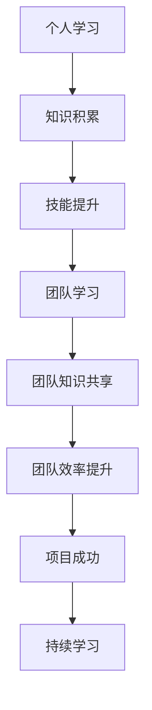

                 

# 创业路上的持续学习：如何建立个人和团队的学习体系

> 关键词：持续学习、个人成长、团队建设、知识体系、学习方法、技术栈、知识图谱、学习资源

> 摘要：在创业的道路上，持续学习是保持竞争力的关键。本文将深入探讨如何建立个人和团队的学习体系，从核心概念到具体操作步骤，再到实际案例和应用场景，帮助创业者和团队成员在技术快速发展的时代中不断进步。

## 1. 背景介绍

在当今快速变化的技术环境中，持续学习已成为个人和团队成功的关键因素。无论是初创公司还是成熟企业，都需要不断适应新技术、新趋势，以保持竞争力。本文将探讨如何建立一个高效的学习体系，帮助个人和团队在创业过程中不断成长。

### 1.1 创业环境的变化

- **技术更新迅速**：新技术的出现速度远超以往，如人工智能、大数据、云计算等，这些技术的快速发展对创业公司提出了更高的要求。
- **市场需求多样化**：随着消费者需求的多样化，产品和服务需要不断创新，以满足不同市场的需求。
- **竞争加剧**：随着创业门槛的降低，越来越多的初创公司涌现，市场竞争日益激烈。

### 1.2 持续学习的重要性

- **保持竞争力**：通过持续学习，团队可以掌握最新的技术和工具，提高工作效率和产品质量。
- **适应变化**：快速变化的市场和技术环境要求团队能够迅速适应新情况，持续学习是应对变化的关键。
- **个人成长**：持续学习有助于个人技能的提升，增强个人的职业竞争力。

## 2. 核心概念与联系

### 2.1 持续学习的概念

持续学习是指个人和团队在职业生涯中不断获取新知识、技能和经验的过程。它不仅包括正式的教育和培训，还包括自我驱动的学习和个人兴趣的探索。

### 2.2 个人和团队学习体系的关系

- **个人学习**：个人学习是团队学习的基础，个人技能的提升有助于团队整体能力的提高。
- **团队学习**：团队学习是个人学习的放大和扩展，通过团队合作，可以共享知识和经验，提高整体效率。

### 2.3 持续学习的流程图



## 3. 核心算法原理 & 具体操作步骤

### 3.1 建立个人学习计划

1. **确定学习目标**：明确个人在技术栈上的学习目标，如掌握一门新技术、提高某项技能等。
2. **制定学习计划**：根据目标制定详细的学习计划，包括学习时间、学习内容和学习方法。
3. **选择学习资源**：根据学习计划选择合适的学习资源，如在线课程、书籍、博客等。

### 3.2 建立团队学习机制

1. **定期学习会议**：定期组织团队学习会议，分享学习成果和经验。
2. **知识共享平台**：建立知识共享平台，如内部wiki、知识库等，方便团队成员共享和查找知识。
3. **技术交流**：鼓励团队成员之间进行技术交流，如代码审查、技术讨论等。

### 3.3 实施学习计划

1. **执行学习计划**：按照学习计划进行学习，确保学习进度和质量。
2. **评估学习效果**：定期评估学习效果，根据评估结果调整学习计划。
3. **持续改进**：根据学习效果和团队需求，持续改进学习计划和机制。

## 4. 数学模型和公式 & 详细讲解 & 举例说明

### 4.1 学习曲线模型

学习曲线模型描述了学习效率随时间的变化。通过学习曲线模型，可以预测学习进度和效果。

$$
E(t) = E_0 \cdot (1 - e^{-kt})
$$

- **$E(t)$**：学习效率在时间$t$时的值。
- **$E_0$**：初始学习效率。
- **$k$**：学习速率常数。

### 4.2 项目管理中的学习效率模型

在项目管理中，可以通过学习效率模型来评估团队的学习效果。

$$
\text{学习效率} = \frac{\text{项目完成度}}{\text{学习时间}}
$$

- **项目完成度**：项目完成的程度。
- **学习时间**：团队成员投入学习的时间。

### 4.3 举例说明

假设一个团队在学习一门新技术，初始学习效率为0.5，学习速率为0.1。根据学习曲线模型，可以预测学习效率随时间的变化。

$$
E(t) = 0.5 \cdot (1 - e^{-0.1t})
$$

通过这个模型，可以预测团队在不同时间点的学习效率，从而调整学习计划和资源分配。

## 5. 项目实战：代码实际案例和详细解释说明

### 5.1 开发环境搭建

1. **选择开发工具**：选择合适的开发工具，如IDE、版本控制系统等。
2. **配置开发环境**：配置开发环境，确保所有开发工具和依赖项都已安装。
3. **设置项目结构**：根据项目需求设置项目结构，如目录、文件等。

### 5.2 源代码详细实现和代码解读

```python
# 示例代码：简单的Python程序
def add(a, b):
    """
    添加两个数字
    :param a: 第一个数字
    :param b: 第二个数字
    :return: 两个数字的和
    """
    return a + b

# 调用函数
result = add(3, 5)
print("结果:", result)
```

### 5.3 代码解读与分析

- **函数定义**：`add`函数接受两个参数`a`和`b`，返回它们的和。
- **注释**：函数的注释解释了函数的功能和参数。
- **调用函数**：通过调用`add`函数并传入参数`3`和`5`，得到结果`8`。

## 6. 实际应用场景

### 6.1 技术栈更新

- **新技术引入**：团队引入新的技术栈，如引入机器学习框架进行数据分析。
- **技能提升**：团队成员通过学习新的技术栈，提升个人技能。

### 6.2 项目管理

- **学习效率评估**：通过学习效率模型评估团队的学习效果，调整学习计划。
- **项目进度管理**：通过学习效率模型预测项目进度，调整项目计划。

## 7. 工具和资源推荐

### 7.1 学习资源推荐

- **书籍**：《深入浅出Python》、《机器学习实战》
- **在线课程**：Coursera、edX、Udacity
- **博客**：Medium、GitHub博客
- **网站**：Stack Overflow、GitHub

### 7.2 开发工具框架推荐

- **IDE**：PyCharm、Visual Studio Code
- **版本控制系统**：Git、GitHub
- **项目管理工具**：Jira、Trello

### 7.3 相关论文著作推荐

- **论文**：《深度学习》、《机器学习》
- **著作**：《算法导论》、《计算机程序设计艺术》

## 8. 总结：未来发展趋势与挑战

### 8.1 未来发展趋势

- **技术更新加速**：新技术的出现速度将进一步加快，持续学习将成为常态。
- **团队协作加强**：团队协作将成为提高学习效率的关键。
- **个性化学习**：个性化学习将成为趋势，根据个人需求定制学习计划。

### 8.2 挑战

- **时间管理**：如何在繁忙的工作中找到学习时间。
- **资源获取**：如何获取高质量的学习资源。
- **持续改进**：如何持续改进学习计划和机制。

## 9. 附录：常见问题与解答

### 9.1 问题1：如何平衡工作和学习？

- **答案**：合理安排时间，利用碎片时间进行学习，如通勤时间、午休时间等。

### 9.2 问题2：如何评估学习效果？

- **答案**：通过项目实践、代码审查等方式评估学习效果。

## 10. 扩展阅读 & 参考资料

- **书籍**：《持续学习》、《团队学习》
- **论文**：《学习曲线理论在项目管理中的应用》
- **网站**：Coursera、edX

---

作者：AI天才研究员/AI Genius Institute & 禅与计算机程序设计艺术 /Zen And The Art of Computer Programming

