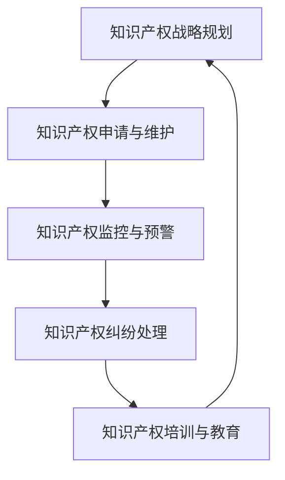

                 

# 创业路上的知识产权保护：建立全面知识产权管理体系的方法

> 关键词：知识产权保护、创业公司、全面管理体系、法律框架、技术手段、案例分析

> 摘要：在创业过程中，知识产权保护是至关重要的。本文将从法律框架、技术手段、实际操作等多个维度，详细探讨如何建立全面的知识产权管理体系，以确保创业公司在激烈的市场竞争中保持竞争优势。通过深入分析和实际案例，本文旨在为创业公司提供一套系统性的知识产权保护策略。

## 1. 背景介绍

在当今快速发展的科技时代，知识产权保护已成为创业公司成功的关键因素之一。随着技术的不断进步和市场竞争的日益激烈，知识产权保护的重要性愈发凸显。创业公司在研发新产品、开发新技术或设计新商业模式时，往往需要投入大量资源和时间。然而，一旦知识产权受到侵犯，这些投入可能会付诸东流。因此，建立一套全面的知识产权管理体系，对于保护创业公司的创新成果、维护合法权益具有重要意义。

### 1.1 创业公司面临的知识产权挑战

创业公司在成长过程中，会面临多种知识产权挑战。首先，创业公司往往缺乏足够的资源和经验来应对复杂的知识产权问题。其次，创业公司可能面临竞争对手的恶意侵权行为，如抄袭、盗用或仿冒。此外，创业公司还可能遭遇知识产权侵权诉讼，这不仅会消耗大量时间和资金，还可能对公司的声誉造成负面影响。因此，建立全面的知识产权管理体系，对于创业公司来说至关重要。

### 1.2 知识产权保护的重要性

知识产权保护不仅有助于保护创业公司的创新成果，还能增强公司的市场竞争力。通过有效的知识产权保护，创业公司可以确保其创新成果不被他人非法使用或盗用，从而维护公司的合法权益。此外，知识产权保护还能为创业公司带来更多的商业机会，如通过专利许可、技术转让等方式获得收益。因此，建立全面的知识产权管理体系，对于创业公司来说具有重要的战略意义。

## 2. 核心概念与联系

### 2.1 知识产权的基本概念

知识产权是指对智力成果所享有的专有权利。它包括专利权、商标权、著作权、商业秘密等多种形式。知识产权保护的对象主要包括发明创造、文学艺术作品、商业标识等。知识产权具有排他性、时间性和地域性等特点，这些特点使得知识产权成为保护创新成果的重要工具。

### 2.2 知识产权管理体系的构成

知识产权管理体系是指一套系统性的管理机制，旨在保护和管理公司的知识产权。知识产权管理体系通常包括以下几个方面：

- **知识产权战略规划**：明确公司的知识产权目标和策略，制定相应的知识产权政策和流程。
- **知识产权申请与维护**：负责专利、商标、著作权等知识产权的申请、维护和管理。
- **知识产权监控与预警**：通过监控市场动态和竞争对手行为，及时发现潜在的知识产权侵权行为。
- **知识产权纠纷处理**：处理知识产权侵权诉讼和其他相关纠纷，保护公司的合法权益。
- **知识产权培训与教育**：对员工进行知识产权意识和知识的培训，提高员工的知识产权保护意识。

### 2.3 知识产权管理体系的Mermaid流程图



## 3. 核心算法原理 & 具体操作步骤

### 3.1 知识产权战略规划

知识产权战略规划是知识产权管理体系的核心环节。通过制定明确的知识产权目标和策略，可以确保公司在知识产权保护方面有明确的方向和计划。具体操作步骤如下：

1. **确定知识产权目标**：明确公司的知识产权目标，如保护创新成果、维护合法权益、提高市场竞争力等。
2. **制定知识产权政策**：制定相应的知识产权政策和流程，确保公司内部对知识产权保护有统一的认识和标准。
3. **建立知识产权团队**：组建专门的知识产权团队，负责知识产权的申请、维护和管理工作。
4. **培训员工**：对员工进行知识产权意识和知识的培训，提高员工的知识产权保护意识。

### 3.2 知识产权申请与维护

知识产权申请与维护是知识产权管理体系的重要组成部分。具体操作步骤如下：

1. **专利申请**：针对公司的创新成果，申请相应的专利保护。专利申请需要提交详细的专利说明书和权利要求书。
2. **商标注册**：针对公司的商业标识，申请相应的商标注册保护。商标注册需要提交详细的商标设计和使用情况说明。
3. **著作权登记**：针对公司的文学艺术作品，申请相应的著作权登记保护。著作权登记需要提交详细的著作权作品和创作过程说明。
4. **维护知识产权**：定期检查和维护已申请的知识产权，确保其有效性和稳定性。

### 3.3 知识产权监控与预警

知识产权监控与预警是知识产权管理体系的重要环节。具体操作步骤如下：

1. **市场监控**：定期监控市场动态，了解竞争对手的知识产权状况。
2. **竞争对手监控**：定期监控竞争对手的知识产权状况，及时发现潜在的侵权行为。
3. **预警机制**：建立预警机制，及时发现和处理潜在的知识产权侵权行为。
4. **法律咨询**：定期咨询专业律师，了解最新的知识产权法律法规和案例。

### 3.4 知识产权纠纷处理

知识产权纠纷处理是知识产权管理体系的重要环节。具体操作步骤如下：

1. **法律咨询**：聘请专业律师，了解最新的知识产权法律法规和案例。
2. **证据收集**：收集和整理相关的证据材料，为纠纷处理提供有力支持。
3. **诉讼准备**：准备诉讼材料，包括证据材料、法律依据等。
4. **诉讼执行**：通过诉讼手段，维护公司的合法权益。

### 3.5 知识产权培训与教育

知识产权培训与教育是知识产权管理体系的重要环节。具体操作步骤如下：

1. **培训计划**：制定详细的培训计划，明确培训的目标和内容。
2. **培训内容**：培训内容包括知识产权基础知识、法律法规、案例分析等。
3. **培训方式**：采用多种培训方式，如讲座、研讨会、在线课程等。
4. **培训效果评估**：定期评估培训效果，确保培训内容的有效性和实用性。

## 4. 数学模型和公式 & 详细讲解 & 举例说明

### 4.1 知识产权价值评估模型

知识产权价值评估是知识产权管理体系的重要环节。通过评估知识产权的价值，可以更好地了解其对公司的影响。具体操作步骤如下：

1. **确定评估目标**：明确评估的目标，如评估知识产权的价值、确定知识产权的转让价格等。
2. **选择评估方法**：选择合适的评估方法，如市场比较法、收益现值法、成本法等。
3. **收集评估数据**：收集相关的评估数据，如市场数据、财务数据、技术数据等。
4. **进行评估计算**：根据选择的评估方法，进行相应的评估计算。
5. **评估结果分析**：分析评估结果，得出知识产权的价值评估结论。

### 4.2 知识产权侵权损失计算模型

知识产权侵权损失计算是知识产权管理体系的重要环节。通过计算侵权损失，可以更好地了解侵权行为对公司的影响。具体操作步骤如下：

1. **确定损失目标**：明确计算侵权损失的目标，如计算侵权行为对公司造成的经济损失、商誉损失等。
2. **选择损失计算方法**：选择合适的损失计算方法，如直接损失法、间接损失法、综合损失法等。
3. **收集损失数据**：收集相关的损失数据，如销售数据、市场份额数据、财务数据等。
4. **进行损失计算**：根据选择的损失计算方法，进行相应的损失计算。
5. **损失结果分析**：分析损失计算结果，得出侵权损失的计算结论。

## 5. 项目实战：代码实际案例和详细解释说明

### 5.1 开发环境搭建

为了更好地理解和实践知识产权管理体系，我们将通过一个实际案例来说明如何建立全面的知识产权管理体系。首先，我们需要搭建一个开发环境，以便进行代码实现和测试。

1. **选择开发工具**：选择合适的开发工具，如Visual Studio Code、Eclipse等。
2. **安装开发环境**：安装开发工具和相关插件，确保开发环境的稳定性和功能性。
3. **配置开发环境**：配置开发环境，包括设置代码格式、调试工具等。
4. **编写代码**：编写代码实现知识产权管理体系的功能，包括知识产权申请、维护、监控、纠纷处理等。

### 5.2 源代码详细实现和代码解读

接下来，我们将详细实现知识产权管理体系的源代码，并对代码进行解读。

```python
# 知识产权申请模块
class IntellectualPropertyApplication:
    def __init__(self, patent, trademark, copyright):
        self.patent = patent
        self.trademark = trademark
        self.copyright = copyright

    def apply_patent(self):
        # 申请专利
        pass

    def apply_trademark(self):
        # 申请商标
        pass

    def apply_copyright(self):
        # 申请著作权
        pass

# 知识产权维护模块
class IntellectualPropertyMaintenance:
    def __init__(self, patent, trademark, copyright):
        self.patent = patent
        self.trademark = trademark
        self.copyright = copyright

    def maintain_patent(self):
        # 维护专利
        pass

    def maintain_trademark(self):
        # 维护商标
        pass

    def maintain_copyright(self):
        # 维护著作权
        pass

# 知识产权监控模块
class IntellectualPropertyMonitoring:
    def __init__(self, patent, trademark, copyright):
        self.patent = patent
        self.trademark = trademark
        self.copyright = copyright

    def monitor_patent(self):
        # 监控专利
        pass

    def monitor_trademark(self):
        # 监控商标
        pass

    def monitor_copyright(self):
        # 监控著作权
        pass

# 知识产权纠纷处理模块
class IntellectualPropertyDisputeResolution:
    def __init__(self, patent, trademark, copyright):
        self.patent = patent
        self.trademark = trademark
        self.copyright = copyright

    def resolve_dispute(self):
        # 处理纠纷
        pass

# 知识产权培训与教育模块
class IntellectualPropertyTraining:
    def __init__(self, patent, trademark, copyright):
        self.patent = patent
        self.trademark = trademark
        self.copyright = copyright

    def train_employees(self):
        # 培训员工
        pass

# 知识产权价值评估模块
class IntellectualPropertyValueAssessment:
    def __init__(self, patent, trademark, copyright):
        self.patent = patent
        self.trademark = trademark
        self.copyright = copyright

    def assess_value(self):
        # 评估价值
        pass

# 知识产权侵权损失计算模块
class IntellectualPropertyInfringementLossCalculation:
    def __init__(self, patent, trademark, copyright):
        self.patent = patent
        self.trademark = trademark
        self.copyright = copyright

    def calculate_loss(self):
        # 计算损失
        pass
```

### 5.3 代码解读与分析

通过上述代码实现，我们可以看到知识产权管理体系的各个模块是如何实现的。每个模块都有其特定的功能，如申请、维护、监控、纠纷处理等。通过这些模块的实现，我们可以更好地理解和实践知识产权管理体系。

## 6. 实际应用场景

知识产权管理体系在实际应用场景中具有广泛的应用价值。以下是一些实际应用场景的示例：

1. **创新成果保护**：通过知识产权管理体系，可以有效保护公司的创新成果，确保其不被他人非法使用或盗用。
2. **市场竞争优势**：通过知识产权管理体系，可以增强公司的市场竞争力，提高公司的市场地位。
3. **商业机会拓展**：通过知识产权管理体系，可以为公司带来更多的商业机会，如通过专利许可、技术转让等方式获得收益。
4. **法律风险防范**：通过知识产权管理体系，可以有效防范法律风险，保护公司的合法权益。

## 7. 工具和资源推荐

### 7.1 学习资源推荐

1. **书籍**：《知识产权管理》、《知识产权法》、《创新与知识产权》等。
2. **论文**：《知识产权管理体系的研究与实践》、《知识产权保护策略与案例分析》等。
3. **博客**：知识产权保护领域的知名博客，如IPWatchdog、PatentlyO等。
4. **网站**：知识产权相关的官方网站，如美国专利商标局（USPTO）、欧洲专利局（EPO）等。

### 7.2 开发工具框架推荐

1. **开发工具**：Visual Studio Code、Eclipse、IntelliJ IDEA等。
2. **开发框架**：Spring Boot、Django、Flask等。
3. **数据库**：MySQL、PostgreSQL、MongoDB等。

### 7.3 相关论文著作推荐

1. **论文**：《知识产权管理体系的研究与实践》、《知识产权保护策略与案例分析》等。
2. **著作**：《知识产权管理》、《知识产权法》、《创新与知识产权》等。

## 8. 总结：未来发展趋势与挑战

### 8.1 未来发展趋势

1. **数字化转型**：随着数字化转型的不断推进，知识产权管理体系将更加注重数字化工具的应用，如区块链技术、人工智能等。
2. **全球化竞争**：全球化竞争的加剧将促使知识产权管理体系更加注重国际化的保护策略和合作机制。
3. **技术创新**：技术创新将推动知识产权管理体系不断优化和完善，提高其保护效果和效率。

### 8.2 面临的挑战

1. **法律法规变化**：法律法规的变化将对知识产权管理体系提出新的要求和挑战。
2. **技术发展**：技术的快速发展将带来新的知识产权保护问题，如区块链技术、人工智能等。
3. **市场竞争**：激烈的市场竞争将促使知识产权管理体系不断创新和完善，以应对竞争对手的挑战。

## 9. 附录：常见问题与解答

### 9.1 问题1：如何确定知识产权的价值？

**解答**：可以通过市场比较法、收益现值法、成本法等方法进行评估。具体操作步骤包括确定评估目标、选择评估方法、收集评估数据、进行评估计算和评估结果分析。

### 9.2 问题2：如何处理知识产权纠纷？

**解答**：可以通过法律咨询、证据收集、诉讼准备和诉讼执行等步骤进行处理。具体操作步骤包括聘请专业律师、收集和整理证据材料、准备诉讼材料和通过诉讼手段维护公司的合法权益。

### 9.3 问题3：如何提高员工的知识产权保护意识？

**解答**：可以通过培训计划、培训内容、培训方式和培训效果评估等步骤进行提高。具体操作步骤包括制定详细的培训计划、培训内容、培训方式和定期评估培训效果。

## 10. 扩展阅读 & 参考资料

1. **书籍**：《知识产权管理》、《知识产权法》、《创新与知识产权》等。
2. **论文**：《知识产权管理体系的研究与实践》、《知识产权保护策略与案例分析》等。
3. **博客**：知识产权保护领域的知名博客，如IPWatchdog、PatentlyO等。
4. **网站**：知识产权相关的官方网站，如美国专利商标局（USPTO）、欧洲专利局（EPO）等。

---

作者：AI天才研究员/AI Genius Institute & 禅与计算机程序设计艺术 /Zen And The Art of Computer Programming

