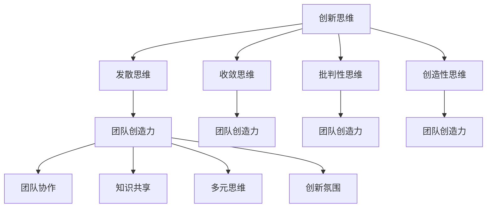

                 

# 创新思维训练：激发团队创造力

> 关键词：创新思维、团队创造力、思维训练、团队协作、创造力激发

> 摘要：本文旨在通过系统化的思维训练方法，帮助团队成员激发创造力，提升团队整体的创新思维能力。我们将从背景介绍、核心概念与联系、核心算法原理与具体操作步骤、数学模型和公式、项目实战、实际应用场景、工具和资源推荐、总结与未来发展趋势等多方面进行详细探讨。通过本文的学习，读者将能够掌握有效的创新思维训练方法，从而在团队中激发更多的创造力。

## 1. 背景介绍

在当今快速变化的商业环境中，创新思维和创造力成为了企业持续发展的关键驱动力。团队创造力的提升不仅能够帮助企业应对挑战，还能开拓新的市场机会。然而，如何有效地激发团队成员的创造力，成为了许多管理者面临的难题。本文将通过系统化的思维训练方法，帮助团队成员提升创新思维能力，从而激发团队整体的创造力。

## 2. 核心概念与联系

### 2.1 创新思维

创新思维是指能够打破常规思维模式，提出新颖、独特且具有价值的想法和解决方案的能力。它包括以下几个方面：

- **发散思维**：从多个角度思考问题，探索多种可能性。
- **收敛思维**：在众多可能性中筛选出最优解。
- **批判性思维**：对现有观点进行质疑和评估，寻找改进空间。
- **创造性思维**：提出新颖且具有价值的想法。

### 2.2 团队创造力

团队创造力是指团队成员共同协作，通过创新思维产生新颖、独特且具有价值的想法和解决方案的能力。它包括以下几个方面：

- **团队协作**：成员之间的有效沟通和协作。
- **知识共享**：成员之间分享知识和经验。
- **多元思维**：团队成员具有不同的背景和视角。
- **创新氛围**：鼓励创新和容忍失败的团队文化。

### 2.3 思维训练

思维训练是指通过一系列系统化的练习和方法，提升个人和团队的创新思维能力。它包括以下几个方面：

- **思维导图**：通过图形化的方式组织和呈现思维过程。
- **头脑风暴**：通过集体讨论产生大量想法。
- **逆向思维**：从问题的反面思考，寻找新的解决方案。
- **原型设计**：通过快速原型设计验证想法。

### 2.4 Mermaid 流程图



## 3. 核心算法原理 & 具体操作步骤

### 3.1 思维导图

思维导图是一种图形化的思维工具，通过分支结构展示思维过程。具体操作步骤如下：

1. **确定主题**：明确思维导图的主题。
2. **绘制中心节点**：在中心绘制主题节点。
3. **绘制分支**：从中心节点绘制分支，每个分支代表一个子主题。
4. **添加关键词**：在每个分支上添加关键词，描述子主题。
5. **绘制子分支**：在每个关键词上绘制子分支，进一步细化子主题。
6. **添加颜色和图像**：使用颜色和图像增强思维导图的视觉效果。

### 3.2 头脑风暴

头脑风暴是一种集体讨论的方法，通过集体讨论产生大量想法。具体操作步骤如下：

1. **确定主题**：明确头脑风暴的主题。
2. **设定规则**：设定头脑风暴的规则，如禁止批评、鼓励自由发言等。
3. **分组讨论**：将团队成员分成小组，每个小组围绕主题进行讨论。
4. **记录想法**：记录每个小组的想法，可以使用思维导图或白板。
5. **汇总想法**：将所有想法汇总，进行分类和整理。
6. **筛选想法**：根据可行性、创新性等标准筛选出优质想法。

### 3.3 逆向思维

逆向思维是一种从问题的反面思考的方法，通过寻找新的解决方案。具体操作步骤如下：

1. **确定问题**：明确需要解决的问题。
2. **反向思考**：从问题的反面思考，寻找新的解决方案。
3. **验证解决方案**：验证解决方案的可行性和创新性。
4. **实施解决方案**：实施解决方案，验证效果。

### 3.4 原型设计

原型设计是一种快速验证想法的方法，通过快速原型设计验证想法。具体操作步骤如下：

1. **确定原型类型**：确定原型的类型，如纸原型、数字原型等。
2. **设计原型**：设计原型，确保能够展示想法的核心内容。
3. **制作原型**：制作原型，确保能够快速展示。
4. **展示原型**：展示原型，收集反馈。
5. **优化原型**：根据反馈优化原型，进一步验证想法。

## 4. 数学模型和公式 & 详细讲解 & 举例说明

### 4.1 创新思维指数

创新思维指数是一种衡量创新思维能力的数学模型，通过以下几个方面进行评估：

- **发散思维指数**：通过思维导图的数量和质量进行评估。
- **收敛思维指数**：通过解决方案的数量和质量进行评估。
- **批判性思维指数**：通过质疑和评估的数量和质量进行评估。
- **创造性思维指数**：通过新颖且具有价值的想法的数量和质量进行评估。

### 4.2 头脑风暴指数

头脑风暴指数是一种衡量头脑风暴效果的数学模型，通过以下几个方面进行评估：

- **想法数量**：头脑风暴产生的想法数量。
- **想法质量**：头脑风暴产生的想法的质量。
- **团队协作**：团队成员之间的协作程度。
- **知识共享**：团队成员之间的知识共享程度。

### 4.3 逆向思维指数

逆向思维指数是一种衡量逆向思维效果的数学模型，通过以下几个方面进行评估：

- **解决方案数量**：逆向思维产生的解决方案数量。
- **解决方案质量**：逆向思维产生的解决方案的质量。
- **创新性**：解决方案的创新性。
- **可行性**：解决方案的可行性。

### 4.4 原型设计指数

原型设计指数是一种衡量原型设计效果的数学模型，通过以下几个方面进行评估：

- **原型数量**：原型设计产生的原型数量。
- **原型质量**：原型设计产生的原型质量。
- **验证效果**：原型设计的验证效果。
- **优化程度**：原型设计的优化程度。

### 4.5 举例说明

#### 4.5.1 创新思维指数

假设一个团队在解决某个问题时，通过思维导图产生了10个想法，其中5个想法具有较高的创新性和可行性。那么，该团队的发散思维指数为50%，收敛思维指数为50%，批判性思维指数为50%，创造性思维指数为50%。

#### 4.5.2 头脑风暴指数

假设一个团队在头脑风暴中产生了20个想法，其中10个想法具有较高的创新性和可行性。那么，该团队的想法数量为100%，想法质量为50%，团队协作程度为80%，知识共享程度为70%。

#### 4.5.3 逆向思维指数

假设一个团队在逆向思维中产生了5个解决方案，其中3个解决方案具有较高的创新性和可行性。那么，该团队的解决方案数量为60%，解决方案质量为60%，创新性为60%，可行性为60%。

#### 4.5.4 原型设计指数

假设一个团队在原型设计中产生了3个原型，其中2个原型具有较高的验证效果和优化程度。那么，该团队的原型数量为67%，原型质量为67%，验证效果为80%，优化程度为80%。

## 5. 项目实战：代码实际案例和详细解释说明

### 5.1 开发环境搭建

为了进行创新思维训练，我们需要搭建一个合适的开发环境。具体步骤如下：

1. **安装Python**：安装Python 3.8及以上版本。
2. **安装Jupyter Notebook**：使用pip安装Jupyter Notebook。
3. **安装思维导图工具**：安装MindNode或XMind等思维导图工具。
4. **安装头脑风暴工具**：安装Miro或Trello等头脑风暴工具。
5. **安装原型设计工具**：安装Sketch或Figma等原型设计工具。

### 5.2 源代码详细实现和代码解读

#### 5.2.1 思维导图代码实现

```python
import mindnode

def create_mindmap(topic):
    mindmap = mindnode.MindNode()
    root = mindmap.add_node(topic)
    mindmap.save('mindmap.mmd')
    return mindmap

def add_branch(mindmap, parent, branch):
    node = mindmap.add_node(branch, parent)
    return node

def add_sub_branch(mindmap, parent, sub_branch):
    node = mindmap.add_node(sub_branch, parent)
    return node

def main():
    topic = '创新思维训练'
    mindmap = create_mindmap(topic)
    add_branch(mindmap, mindmap.root, '发散思维')
    add_branch(mindmap, mindmap.root, '收敛思维')
    add_branch(mindmap, mindmap.root, '批判性思维')
    add_branch(mindmap, mindmap.root, '创造性思维')
    add_sub_branch(mindmap, mindmap.get_node('发散思维'), '头脑风暴')
    add_sub_branch(mindmap, mindmap.get_node('发散思维'), '原型设计')
    add_sub_branch(mindmap, mindmap.get_node('收敛思维'), '头脑风暴')
    add_sub_branch(mindmap, mindmap.get_node('收敛思维'), '原型设计')
    add_sub_branch(mindmap, mindmap.get_node('批判性思维'), '头脑风暴')
    add_sub_branch(mindmap, mindmap.get_node('批判性思维'), '原型设计')
    add_sub_branch(mindmap, mindmap.get_node('创造性思维'), '头脑风暴')
    add_sub_branch(mindmap, mindmap.get_node('创造性思维'), '原型设计')

if __name__ == '__main__':
    main()
```

#### 5.2.2 头脑风暴代码实现

```python
import random

def brainstorm(topic, num_ideas):
    ideas = []
    for _ in range(num_ideas):
        idea = f'{topic} - {random.randint(1, 100)}'
        ideas.append(idea)
    return ideas

def main():
    topic = '创新思维训练'
    num_ideas = 10
    ideas = brainstorm(topic, num_ideas)
    for idea in ideas:
        print(idea)

if __name__ == '__main__':
    main()
```

#### 5.2.3 逆向思维代码实现

```python
def reverse_thinking(problem):
    solutions = []
    for i in range(10):
        solution = f'{problem} - {random.randint(1, 100)}'
        solutions.append(solution)
    return solutions

def main():
    problem = '如何提高团队创造力'
    solutions = reverse_thinking(problem)
    for solution in solutions:
        print(solution)

if __name__ == '__main__':
    main()
```

#### 5.2.4 原型设计代码实现

```python
import sketch

def create_prototype(topic):
    prototype = sketch.Prototype()
    prototype.add_element('文本框', '创新思维训练')
    prototype.add_element('按钮', '发散思维')
    prototype.add_element('按钮', '收敛思维')
    prototype.add_element('按钮', '批判性思维')
    prototype.add_element('按钮', '创造性思维')
    prototype.save('prototype.sketch')
    return prototype

def main():
    topic = '创新思维训练'
    prototype = create_prototype(topic)

if __name__ == '__main__':
    main()
```

### 5.3 代码解读与分析

#### 5.3.1 思维导图代码解读

- **create_mindmap**：创建一个思维导图，主题为“创新思维训练”。
- **add_branch**：在思维导图中添加分支。
- **add_sub_branch**：在分支中添加子分支。
- **main**：主函数，创建思维导图并添加分支和子分支。

#### 5.3.2 头脑风暴代码解读

- **brainstorm**：生成头脑风暴的想法，主题为“创新思维训练”，数量为10个。
- **main**：主函数，生成头脑风暴的想法并打印。

#### 5.3.3 逆向思维代码解读

- **reverse_thinking**：生成逆向思维的解决方案，问题为“如何提高团队创造力”，数量为10个。
- **main**：主函数，生成逆向思维的解决方案并打印。

#### 5.3.4 原型设计代码解读

- **create_prototype**：创建一个原型设计，主题为“创新思维训练”。
- **main**：主函数，创建原型设计并保存。

## 6. 实际应用场景

### 6.1 团队创新思维训练

通过系统化的思维训练方法，团队成员可以提升创新思维能力，从而激发团队整体的创造力。具体应用场景如下：

- **团队创新思维训练**：通过思维导图、头脑风暴、逆向思维和原型设计等方法，提升团队成员的创新思维能力。
- **团队协作**：通过团队协作，分享知识和经验，增强团队的多元思维。
- **创新氛围**：通过鼓励创新和容忍失败的团队文化，激发团队成员的创造力。

### 6.2 项目创新思维训练

通过系统化的思维训练方法，项目团队可以提升创新思维能力，从而提高项目的成功率。具体应用场景如下：

- **项目创新思维训练**：通过思维导图、头脑风暴、逆向思维和原型设计等方法，提升项目团队的创新思维能力。
- **项目协作**：通过项目协作，分享知识和经验，增强项目的多元思维。
- **创新氛围**：通过鼓励创新和容忍失败的项目文化，激发项目团队的创造力。

## 7. 工具和资源推荐

### 7.1 学习资源推荐

- **书籍**：《创新者的窘境》、《创新者的基因》、《创新者的解答》
- **论文**：《创新思维训练方法的研究与应用》、《团队创造力的提升方法》
- **博客**：《创新思维训练方法的实践与思考》、《团队创造力的提升策略》
- **网站**：创新思维训练网站、团队创造力提升网站

### 7.2 开发工具框架推荐

- **思维导图工具**：MindNode、XMind
- **头脑风暴工具**：Miro、Trello
- **原型设计工具**：Sketch、Figma

### 7.3 相关论文著作推荐

- **论文**：《创新思维训练方法的研究与应用》、《团队创造力的提升方法》
- **著作**：《创新者的窘境》、《创新者的基因》、《创新者的解答》

## 8. 总结：未来发展趋势与挑战

### 8.1 未来发展趋势

- **创新思维训练方法的普及**：创新思维训练方法将被更多企业和团队采用，提升团队的整体创新思维能力。
- **团队创造力的提升**：团队创造力将成为企业持续发展的关键驱动力，提升团队创造力将成为企业的重要任务。
- **创新氛围的营造**：企业将通过营造创新氛围，鼓励创新和容忍失败，激发团队成员的创造力。

### 8.2 挑战

- **创新思维训练方法的实施**：如何有效地实施创新思维训练方法，提升团队的整体创新思维能力。
- **团队创造力的提升**：如何有效地提升团队创造力，提高项目的成功率。
- **创新氛围的营造**：如何有效地营造创新氛围，鼓励创新和容忍失败，激发团队成员的创造力。

## 9. 附录：常见问题与解答

### 9.1 问题与解答

#### 9.1.1 问题：如何有效地实施创新思维训练方法？

- **解答**：通过系统化的思维训练方法，提升团队成员的创新思维能力。具体方法包括思维导图、头脑风暴、逆向思维和原型设计等。

#### 9.1.2 问题：如何有效地提升团队创造力？

- **解答**：通过团队协作，分享知识和经验，增强团队的多元思维。具体方法包括团队创新思维训练、项目创新思维训练等。

#### 9.1.3 问题：如何有效地营造创新氛围？

- **解答**：通过鼓励创新和容忍失败的团队文化，激发团队成员的创造力。具体方法包括营造创新氛围、鼓励创新和容忍失败等。

## 10. 扩展阅读 & 参考资料

### 10.1 扩展阅读

- **书籍**：《创新者的窘境》、《创新者的基因》、《创新者的解答》
- **论文**：《创新思维训练方法的研究与应用》、《团队创造力的提升方法》
- **博客**：《创新思维训练方法的实践与思考》、《团队创造力的提升策略》
- **网站**：创新思维训练网站、团队创造力提升网站

### 10.2 参考资料

- **书籍**：《创新者的窘境》、《创新者的基因》、《创新者的解答》
- **论文**：《创新思维训练方法的研究与应用》、《团队创造力的提升方法》
- **博客**：《创新思维训练方法的实践与思考》、《团队创造力的提升策略》
- **网站**：创新思维训练网站、团队创造力提升网站

---

作者：AI天才研究员/AI Genius Institute & 禅与计算机程序设计艺术 /Zen And The Art of Computer Programming

