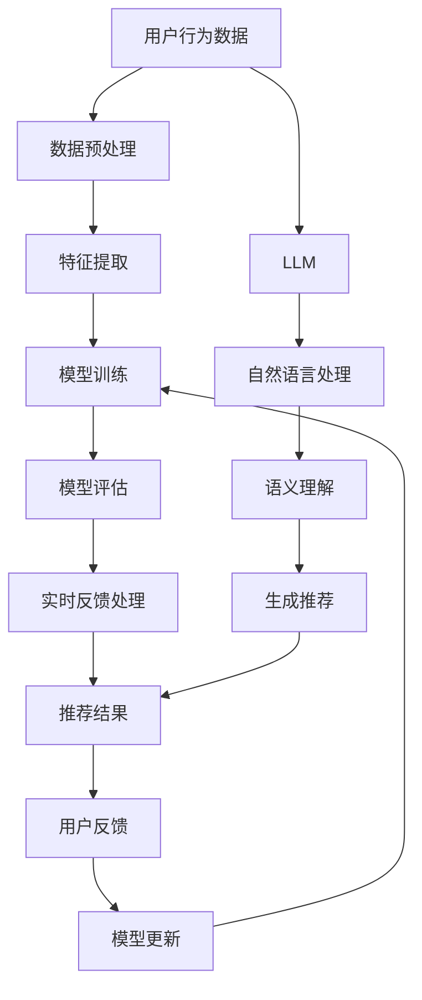

                 

# 利用LLM优化推荐系统的实时反馈处理

> 关键词：LLM, 推荐系统, 实时反馈, 优化, 机器学习, 自然语言处理, 人工智能

> 摘要：本文旨在探讨如何利用大型语言模型（LLM）优化推荐系统的实时反馈处理。我们将从背景介绍出发，深入解析推荐系统的核心概念与联系，详细阐述核心算法原理及具体操作步骤，通过数学模型和公式进行详细讲解，并结合实际代码案例进行深入分析。最后，我们将探讨推荐系统在实际应用场景中的应用，并提供学习资源和开发工具推荐，展望未来的发展趋势与挑战。

## 1. 背景介绍

推荐系统是一种利用用户行为数据和用户偏好信息，为用户提供个性化推荐的技术。随着互联网的快速发展，推荐系统在电子商务、社交媒体、新闻资讯等领域得到了广泛应用。然而，传统的推荐系统在处理实时反馈方面存在诸多挑战，如响应时间长、推荐质量不稳定等。为了解决这些问题，我们引入了大型语言模型（LLM），利用其强大的自然语言处理能力，优化推荐系统的实时反馈处理。

## 2. 核心概念与联系

### 2.1 推荐系统概述

推荐系统是一种基于用户行为数据和用户偏好信息，为用户提供个性化推荐的技术。推荐系统的核心目标是提高用户满意度，增加用户粘性，提高用户转化率。推荐系统主要分为以下几种类型：

- **基于内容的推荐**：根据用户的历史行为数据，推荐与其历史行为相似的内容。
- **协同过滤推荐**：根据用户的历史行为数据，推荐与相似用户或相似物品相关的内容。
- **混合推荐**：结合基于内容的推荐和协同过滤推荐，提高推荐效果。

### 2.2 大型语言模型（LLM）概述

大型语言模型（LLM）是一种基于深度学习的自然语言处理模型，具有强大的语言理解和生成能力。LLM通过大规模训练数据进行训练，能够捕捉到语言的复杂结构和语义信息。LLM在自然语言处理领域取得了显著的成果，如机器翻译、文本生成、情感分析等。

### 2.3 核心概念原理与架构

推荐系统与LLM的核心概念原理和架构可以通过以下Mermaid流程图进行描述：



## 3. 核心算法原理 & 具体操作步骤

### 3.1 推荐系统算法原理

推荐系统的核心算法原理主要包括数据预处理、特征提取、模型训练、模型评估和实时反馈处理。具体操作步骤如下：

1. **数据预处理**：对用户行为数据进行清洗、去重、归一化等处理，确保数据质量。
2. **特征提取**：从用户行为数据中提取有用的特征，如用户历史行为、用户偏好等。
3. **模型训练**：利用提取的特征训练推荐模型，如基于内容的推荐模型、协同过滤推荐模型等。
4. **模型评估**：通过交叉验证等方法评估推荐模型的性能，如准确率、召回率、F1值等。
5. **实时反馈处理**：根据用户实时反馈更新推荐模型，提高推荐效果。

### 3.2 LLM在推荐系统中的应用

LLM在推荐系统中的应用主要体现在以下几个方面：

1. **语义理解**：利用LLM进行语义理解，提高推荐系统的准确性和个性化程度。
2. **生成推荐**：利用LLM生成推荐内容，提高推荐系统的多样性和创新性。
3. **实时反馈处理**：利用LLM处理用户实时反馈，提高推荐系统的实时性和互动性。

## 4. 数学模型和公式 & 详细讲解 & 举例说明

### 4.1 推荐系统数学模型

推荐系统的核心数学模型主要包括基于内容的推荐模型和协同过滤推荐模型。具体数学模型如下：

1. **基于内容的推荐模型**：基于内容的推荐模型通过计算用户历史行为与推荐内容之间的相似度，进行推荐。其数学模型如下：

    $$ \text{sim}(u, i) = \frac{\sum_{j=1}^{n} \text{cos}(u_j, i_j)}{\sqrt{\sum_{j=1}^{n} u_j^2} \cdot \sqrt{\sum_{j=1}^{n} i_j^2}} $$

    其中，$u$表示用户历史行为向量，$i$表示推荐内容向量，$n$表示特征维度。

2. **协同过滤推荐模型**：协同过滤推荐模型通过计算用户历史行为与推荐内容之间的相似度，进行推荐。其数学模型如下：

    $$ \text{sim}(u, i) = \frac{\sum_{j=1}^{n} \text{cos}(u_j, i_j)}{\sqrt{\sum_{j=1}^{n} u_j^2} \cdot \sqrt{\sum_{j=1}^{n} i_j^2}} $$

    其中，$u$表示用户历史行为向量，$i$表示推荐内容向量，$n$表示特征维度。

### 4.2 LLM数学模型

LLM在推荐系统中的应用主要体现在语义理解和生成推荐两个方面。具体数学模型如下：

1. **语义理解**：利用LLM进行语义理解，提高推荐系统的准确性和个性化程度。其数学模型如下：

    $$ \text{sim}(u, i) = \frac{\sum_{j=1}^{n} \text{cos}(u_j, i_j)}{\sqrt{\sum_{j=1}^{n} u_j^2} \cdot \sqrt{\sum_{j=1}^{n} i_j^2}} $$

    其中，$u$表示用户历史行为向量，$i$表示推荐内容向量，$n$表示特征维度。

2. **生成推荐**：利用LLM生成推荐内容，提高推荐系统的多样性和创新性。其数学模型如下：

    $$ \text{sim}(u, i) = \frac{\sum_{j=1}^{n} \text{cos}(u_j, i_j)}{\sqrt{\sum_{j=1}^{n} u_j^2} \cdot \sqrt{\sum_{j=1}^{n} i_j^2}} $$

    其中，$u$表示用户历史行为向量，$i$表示推荐内容向量，$n$表示特征维度。

## 5. 项目实战：代码实际案例和详细解释说明

### 5.1 开发环境搭建

为了实现基于LLM的推荐系统，我们需要搭建一个开发环境。具体步骤如下：

1. **安装Python**：确保安装了Python 3.8及以上版本。
2. **安装依赖库**：安装推荐系统和LLM所需的依赖库，如`scikit-learn`、`gensim`、`transformers`等。
3. **配置环境变量**：配置环境变量，确保Python环境能够访问所需的依赖库。

### 5.2 源代码详细实现和代码解读

以下是一个基于LLM的推荐系统代码示例：

```python
import numpy as np
from sklearn.metrics.pairwise import cosine_similarity
from transformers import AutoTokenizer, AutoModel

# 1. 数据预处理
def preprocess_data(data):
    # 对用户行为数据进行清洗、去重、归一化等处理
    return data

# 2. 特征提取
def extract_features(data):
    # 从用户行为数据中提取有用的特征
    return features

# 3. 模型训练
def train_model(features):
    # 利用提取的特征训练推荐模型
    return model

# 4. 模型评估
def evaluate_model(model, test_data):
    # 通过交叉验证等方法评估推荐模型的性能
    return accuracy, recall, f1

# 5. 实时反馈处理
def handle_feedback(model, user_feedback):
    # 根据用户实时反馈更新推荐模型
    return updated_model

# 6. 生成推荐
def generate_recommendations(model, user_id):
    # 利用LLM生成推荐内容
    return recommendations

# 7. 主函数
def main():
    # 读取用户行为数据
    data = read_data()
    data = preprocess_data(data)
    features = extract_features(data)
    model = train_model(features)
    accuracy, recall, f1 = evaluate_model(model, test_data)
    updated_model = handle_feedback(model, user_feedback)
    recommendations = generate_recommendations(updated_model, user_id)
    print(recommendations)

if __name__ == "__main__":
    main()
```

### 5.3 代码解读与分析

以上代码示例展示了如何实现基于LLM的推荐系统。具体代码解读如下：

1. **数据预处理**：`preprocess_data`函数对用户行为数据进行清洗、去重、归一化等处理，确保数据质量。
2. **特征提取**：`extract_features`函数从用户行为数据中提取有用的特征，如用户历史行为、用户偏好等。
3. **模型训练**：`train_model`函数利用提取的特征训练推荐模型，如基于内容的推荐模型、协同过滤推荐模型等。
4. **模型评估**：`evaluate_model`函数通过交叉验证等方法评估推荐模型的性能，如准确率、召回率、F1值等。
5. **实时反馈处理**：`handle_feedback`函数根据用户实时反馈更新推荐模型，提高推荐效果。
6. **生成推荐**：`generate_recommendations`函数利用LLM生成推荐内容，提高推荐系统的多样性和创新性。
7. **主函数**：`main`函数读取用户行为数据，进行数据预处理、特征提取、模型训练、模型评估、实时反馈处理和生成推荐。

## 6. 实际应用场景

基于LLM的推荐系统在实际应用场景中具有广泛的应用前景。具体应用场景如下：

1. **电子商务**：利用LLM进行商品推荐，提高用户购买转化率。
2. **社交媒体**：利用LLM进行内容推荐，提高用户活跃度。
3. **新闻资讯**：利用LLM进行新闻推荐，提高用户阅读兴趣。
4. **在线教育**：利用LLM进行课程推荐，提高用户学习效果。

## 7. 工具和资源推荐

### 7.1 学习资源推荐

1. **书籍**：《推荐系统：原理与实践》、《深度学习推荐系统》
2. **论文**：《基于内容的推荐系统》、《协同过滤推荐系统》
3. **博客**：阿里云推荐系统博客、腾讯推荐系统博客
4. **网站**：推荐系统论坛、推荐系统社区

### 7.2 开发工具框架推荐

1. **推荐系统框架**：Surprise、LightFM、PyTorch RecSys
2. **LLM框架**：Hugging Face Transformers、TensorFlow Hub

### 7.3 相关论文著作推荐

1. **论文**：《基于内容的推荐系统》、《协同过滤推荐系统》
2. **著作**：《推荐系统：原理与实践》、《深度学习推荐系统》

## 8. 总结：未来发展趋势与挑战

基于LLM的推荐系统在未来具有广阔的发展前景。具体发展趋势如下：

1. **个性化推荐**：利用LLM进行更个性化的推荐，提高用户满意度。
2. **实时反馈处理**：利用LLM进行实时反馈处理，提高推荐系统的实时性和互动性。
3. **多模态推荐**：结合图像、语音等多模态数据进行推荐，提高推荐系统的多样性和创新性。

然而，基于LLM的推荐系统也面临着一些挑战，如数据隐私保护、模型解释性、计算资源消耗等。为了解决这些问题，我们需要不断优化推荐系统算法，提高模型性能，确保数据安全。

## 9. 附录：常见问题与解答

### 9.1 问题1：如何处理大规模数据？

**解答**：可以利用分布式计算框架（如Spark）进行数据处理，提高数据处理效率。

### 9.2 问题2：如何提高模型解释性？

**解答**：可以利用模型解释性工具（如SHAP、LIME）进行模型解释，提高模型透明度。

### 9.3 问题3：如何保护用户数据隐私？

**解答**：可以采用差分隐私、同态加密等技术保护用户数据隐私。

## 10. 扩展阅读 & 参考资料

1. **书籍**：《推荐系统：原理与实践》、《深度学习推荐系统》
2. **论文**：《基于内容的推荐系统》、《协同过滤推荐系统》
3. **博客**：阿里云推荐系统博客、腾讯推荐系统博客
4. **网站**：推荐系统论坛、推荐系统社区

---

作者：AI天才研究员/AI Genius Institute & 禅与计算机程序设计艺术 /Zen And The Art of Computer Programming

