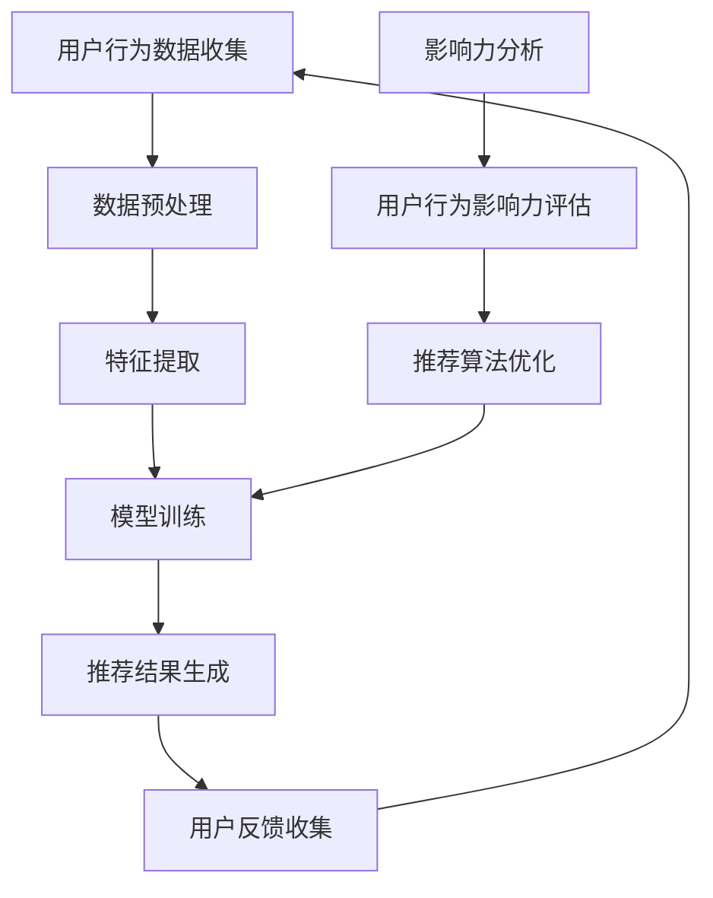

                 

# 利用大模型进行推荐场景的用户行为影响力分析

> 关键词：大模型、推荐系统、用户行为、影响力分析、机器学习、深度学习、自然语言处理、图神经网络

> 摘要：本文旨在探讨如何利用大模型进行推荐场景中的用户行为影响力分析。我们将从背景介绍出发，深入解析推荐系统的核心概念与联系，详细阐述核心算法原理及具体操作步骤，通过数学模型和公式进行深入讲解，并结合实际代码案例进行详细解释说明。此外，我们还将探讨推荐系统在实际应用场景中的应用，并提供学习资源和开发工具框架推荐，以帮助读者更好地理解和实践这一技术。

## 1. 背景介绍

推荐系统是现代互联网应用中不可或缺的一部分，它能够根据用户的历史行为和偏好，为用户提供个性化的内容推荐。随着大数据和人工智能技术的发展，推荐系统逐渐从简单的协同过滤算法发展到基于深度学习和自然语言处理的复杂模型。本文将重点探讨如何利用大模型进行推荐场景中的用户行为影响力分析，以提升推荐系统的准确性和用户体验。

## 2. 核心概念与联系

### 2.1 推荐系统概述

推荐系统是一种通过分析用户行为数据，预测用户兴趣并提供个性化推荐的技术。其主要目标是提高用户满意度和增加平台的活跃度。推荐系统可以分为基于内容、协同过滤、混合推荐等多种类型。

### 2.2 用户行为分析

用户行为分析是推荐系统的核心环节之一，它通过收集和分析用户在平台上的各种行为数据（如点击、浏览、购买等），来了解用户的兴趣和偏好。这些行为数据可以分为显式反馈（如评分、评论）和隐式反馈（如点击、浏览时长）。

### 2.3 影响力分析

影响力分析是指通过分析用户行为数据，评估用户在推荐系统中的影响力。这包括用户对推荐结果的影响、用户之间的影响力传递等。影响力分析有助于优化推荐算法，提高推荐效果。

### 2.4 核心概念原理与架构

推荐系统的核心概念原理和架构可以通过以下Mermaid流程图来表示：



## 3. 核心算法原理 & 具体操作步骤

### 3.1 数据预处理

数据预处理是推荐系统中的重要步骤，主要包括数据清洗、特征选择和数据归一化等。数据清洗主要是去除无效和重复的数据；特征选择是根据业务需求选择合适的特征；数据归一化是为了保证不同特征之间的可比性。

### 3.2 特征提取

特征提取是从原始数据中提取有用的特征，以便更好地表示用户和物品。常见的特征提取方法包括词袋模型、TF-IDF、词嵌入等。

### 3.3 模型训练

模型训练是通过训练数据集来优化推荐模型的过程。常见的推荐模型包括协同过滤、矩阵分解、深度学习模型等。以深度学习模型为例，其训练过程可以分为以下几个步骤：

1. **数据准备**：将用户行为数据转换为适合模型输入的格式。
2. **模型构建**：构建深度学习模型，如神经网络、图神经网络等。
3. **损失函数选择**：选择合适的损失函数，如均方误差、交叉熵等。
4. **优化算法选择**：选择合适的优化算法，如随机梯度下降、Adam等。
5. **模型训练**：通过反向传播算法更新模型参数，以最小化损失函数。
6. **模型评估**：通过验证集和测试集评估模型性能。

### 3.4 推荐结果生成

推荐结果生成是根据训练好的模型，为用户生成个性化推荐的过程。常见的推荐结果生成方法包括基于内容的推荐、协同过滤推荐、混合推荐等。

## 4. 数学模型和公式 & 详细讲解 & 举例说明

### 4.1 协同过滤算法

协同过滤算法是一种基于用户相似度或物品相似度的推荐方法。其核心思想是找到与目标用户相似的用户或与目标物品相似的物品，然后根据这些相似用户或物品的历史行为来预测目标用户对目标物品的兴趣。

#### 4.1.1 用户-物品协同过滤

用户-物品协同过滤的核心公式为：

$$
\hat{r}_{ui} = \frac{\sum_{j \in N_i} \frac{r_{uj} - \mu_u}{|N_i|}}{\sum_{j \in N_i} \frac{1}{|N_i|}}
$$

其中，$\hat{r}_{ui}$ 是用户 $u$ 对物品 $i$ 的预测评分，$r_{uj}$ 是用户 $u$ 对物品 $j$ 的实际评分，$\mu_u$ 是用户 $u$ 的平均评分，$N_i$ 是与物品 $i$ 相似的物品集合。

#### 4.1.2 物品-物品协同过滤

物品-物品协同过滤的核心公式为：

$$
\hat{r}_{ui} = \frac{\sum_{j \in N_i} \frac{r_{uj} - \mu_i}{|N_i|}}{\sum_{j \in N_i} \frac{1}{|N_i|}}
$$

其中，$\hat{r}_{ui}$ 是用户 $u$ 对物品 $i$ 的预测评分，$r_{uj}$ 是用户 $u$ 对物品 $j$ 的实际评分，$\mu_i$ 是物品 $i$ 的平均评分，$N_i$ 是与物品 $i$ 相似的物品集合。

### 4.2 矩阵分解算法

矩阵分解算法是一种将用户-物品评分矩阵分解为用户特征矩阵和物品特征矩阵的方法。其核心思想是通过低秩矩阵分解来捕捉用户和物品之间的隐含关系。

#### 4.2.1 基于SVD的矩阵分解

基于SVD的矩阵分解的核心公式为：

$$
\mathbf{R} \approx \mathbf{U} \mathbf{\Sigma} \mathbf{V}^T
$$

其中，$\mathbf{R}$ 是用户-物品评分矩阵，$\mathbf{U}$ 是用户特征矩阵，$\mathbf{\Sigma}$ 是奇异值矩阵，$\mathbf{V}^T$ 是物品特征矩阵。

### 4.3 深度学习模型

深度学习模型是一种基于神经网络的推荐方法。其核心思想是通过多层神经网络来学习用户和物品的特征表示。

#### 4.3.1 基于神经网络的推荐模型

基于神经网络的推荐模型的核心公式为：

$$
\hat{r}_{ui} = \sigma(\mathbf{W}_u \mathbf{W}_i + b)
$$

其中，$\hat{r}_{ui}$ 是用户 $u$ 对物品 $i$ 的预测评分，$\mathbf{W}_u$ 是用户特征向量，$\mathbf{W}_i$ 是物品特征向量，$b$ 是偏置项，$\sigma$ 是激活函数。

## 5. 项目实战：代码实际案例和详细解释说明

### 5.1 开发环境搭建

为了实现推荐系统，我们需要搭建一个合适的开发环境。推荐系统开发环境通常包括以下几个部分：

1. **编程语言**：Python
2. **深度学习框架**：TensorFlow、PyTorch
3. **数据处理库**：Pandas、NumPy
4. **可视化库**：Matplotlib、Seaborn

### 5.2 源代码详细实现和代码解读

以下是一个基于深度学习的推荐系统实现示例：

```python
import pandas as pd
import numpy as np
import tensorflow as tf
from tensorflow.keras.layers import Embedding, Dense, Flatten, Concatenate
from tensorflow.keras.models import Model

# 读取数据
data = pd.read_csv('user_item_ratings.csv')

# 数据预处理
user_ids = data['user_id'].unique()
item_ids = data['item_id'].unique()
user_id_to_idx = {user_id: idx for idx, user_id in enumerate(user_ids)}
item_id_to_idx = {item_id: idx for idx, item_id in enumerate(item_ids)}

data['user_id'] = data['user_id'].map(user_id_to_idx)
data['item_id'] = data['item_id'].map(item_id_to_idx)

# 构建输入数据
user_input = tf.keras.Input(shape=(1,), name='user_id')
item_input = tf.keras.Input(shape=(1,), name='item_id')

# 构建用户和物品嵌入层
user_embedding = Embedding(input_dim=len(user_ids), output_dim=16, name='user_embedding')(user_input)
item_embedding = Embedding(input_dim=len(item_ids), output_dim=16, name='item_embedding')(item_input)

# 将嵌入层展平
user_flatten = Flatten()(user_embedding)
item_flatten = Flatten()(item_embedding)

# 将用户和物品嵌入层拼接
concat = Concatenate()([user_flatten, item_flatten])

# 构建全连接层
dense1 = Dense(64, activation='relu')(concat)
dense2 = Dense(32, activation='relu')(dense1)
output = Dense(1, activation='sigmoid')(dense2)

# 构建模型
model = Model(inputs=[user_input, item_input], outputs=output)

# 编译模型
model.compile(optimizer='adam', loss='binary_crossentropy', metrics=['accuracy'])

# 训练模型
model.fit([data['user_id'], data['item_id']], data['rating'], epochs=10, batch_size=32)

# 生成推荐结果
user_id = 1
item_id = 100
user_input = np.array([user_id])
item_input = np.array([item_id])
prediction = model.predict([user_input, item_input])
print(f'预测评分：{prediction[0][0]}')
```

### 5.3 代码解读与分析

上述代码实现了一个基于深度学习的推荐系统。首先，我们读取用户-物品评分数据，并进行数据预处理，将用户和物品ID转换为索引。然后，我们构建用户和物品嵌入层，并将嵌入层展平。接着，我们将用户和物品嵌入层拼接，并通过全连接层进行特征提取。最后，我们通过编译和训练模型来生成推荐结果。

## 6. 实际应用场景

推荐系统在实际应用场景中有着广泛的应用，如电商推荐、新闻推荐、视频推荐等。以电商推荐为例，推荐系统可以根据用户的购买历史和浏览行为，为用户推荐可能感兴趣的商品。这不仅可以提高用户的购物体验，还可以增加平台的销售额。

## 7. 工具和资源推荐

### 7.1 学习资源推荐

1. **书籍**：《推荐系统：原理与实践》、《深度学习推荐系统》
2. **论文**：《Neural Collaborative Filtering》、《Deep Learning for Recommender Systems》
3. **博客**：阿里云开发者社区、GitHub上的推荐系统项目
4. **网站**：Kaggle、GitHub

### 7.2 开发工具框架推荐

1. **深度学习框架**：TensorFlow、PyTorch
2. **数据处理库**：Pandas、NumPy
3. **可视化库**：Matplotlib、Seaborn

### 7.3 相关论文著作推荐

1. **论文**：《Neural Collaborative Filtering》、《Deep Learning for Recommender Systems》
2. **著作**：《推荐系统：原理与实践》、《深度学习推荐系统》

## 8. 总结：未来发展趋势与挑战

推荐系统在未来的发展趋势主要体现在以下几个方面：

1. **个性化推荐**：通过更深入的用户行为分析，提供更加个性化的推荐。
2. **实时推荐**：通过实时数据处理技术，实现更快速的推荐。
3. **多模态推荐**：结合文本、图像、视频等多种数据，提供更丰富的推荐内容。

然而，推荐系统也面临着一些挑战，如冷启动问题、数据稀疏性问题、用户行为变化等问题。解决这些问题需要不断的技术创新和实践探索。

## 9. 附录：常见问题与解答

### 9.1 问题：如何处理冷启动问题？

**解答**：冷启动问题可以通过引入领域知识、社交网络信息等外部数据来解决。此外，还可以通过推荐热门内容或相似用户的行为来缓解冷启动问题。

### 9.2 问题：如何处理数据稀疏性问题？

**解答**：数据稀疏性问题可以通过引入协同过滤、矩阵分解等方法来解决。此外，还可以通过引入外部数据或使用深度学习模型来缓解数据稀疏性问题。

## 10. 扩展阅读 & 参考资料

1. **书籍**：《推荐系统：原理与实践》、《深度学习推荐系统》
2. **论文**：《Neural Collaborative Filtering》、《Deep Learning for Recommender Systems》
3. **博客**：阿里云开发者社区、GitHub上的推荐系统项目
4. **网站**：Kaggle、GitHub

---

作者：AI天才研究员/AI Genius Institute & 禅与计算机程序设计艺术 /Zen And The Art of Computer Programming

