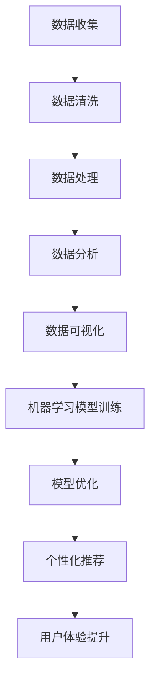

                 

# 利用技术优势创造用户价值

> 关键词：技术优势、用户价值、数据分析、个性化推荐、机器学习、用户体验

> 摘要：在当今数字化时代，技术优势已成为企业创造用户价值的关键。本文将通过逐步分析和推理，探讨如何利用技术优势，特别是机器学习和数据分析，来提升用户体验，实现个性化推荐，从而创造更大的用户价值。我们将从背景介绍、核心概念与联系、核心算法原理、项目实战、实际应用场景、工具和资源推荐，以及未来发展趋势与挑战等方面进行详细阐述。

## 1. 背景介绍

在数字化转型的大潮中，企业越来越依赖于技术优势来提升竞争力。技术优势不仅体现在技术创新上，更体现在如何利用这些技术来创造用户价值。本文将重点探讨如何通过数据分析和机器学习技术，提升用户体验，实现个性化推荐，从而创造更大的用户价值。

## 2. 核心概念与联系

### 2.1 数据分析

数据分析是指从大量数据中提取有价值的信息和知识的过程。它包括数据收集、数据清洗、数据处理、数据分析和数据可视化等多个步骤。数据分析可以帮助企业了解用户行为、偏好和需求，从而为用户提供更个性化的服务。

### 2.2 机器学习

机器学习是一种人工智能技术，它使计算机能够在没有明确编程的情况下从数据中学习并做出预测或决策。机器学习的核心在于算法模型的训练和优化，通过不断迭代和优化模型，使其能够更好地适应数据的变化。

### 2.3 个性化推荐

个性化推荐是指根据用户的历史行为、偏好和需求，为用户提供个性化的推荐内容。个性化推荐可以显著提升用户体验，增加用户满意度和忠诚度。通过机器学习和数据分析，可以实现精准的个性化推荐。

### 2.4 Mermaid 流程图



## 3. 核心算法原理 & 具体操作步骤

### 3.1 数据收集

数据收集是数据分析的第一步，主要包括用户行为数据、用户偏好数据、用户反馈数据等。数据收集可以通过日志记录、用户调查、用户行为跟踪等多种方式实现。

### 3.2 数据清洗

数据清洗是指对收集到的数据进行预处理，去除无效数据、处理缺失值、纠正错误数据等。数据清洗是保证数据分析结果准确性的关键步骤。

### 3.3 数据处理

数据处理是指对清洗后的数据进行进一步的加工和整理，包括数据归一化、特征提取、特征选择等。数据处理可以提高数据分析的效率和准确性。

### 3.4 数据分析

数据分析是指通过统计分析、数据挖掘等方法，从数据中提取有价值的信息和知识。数据分析可以揭示用户行为模式、用户偏好、用户需求等。

### 3.5 数据可视化

数据可视化是指将分析结果以图表、图形等形式展示出来，便于用户理解和分析。数据可视化可以帮助企业更好地理解用户行为和需求，为个性化推荐提供依据。

### 3.6 机器学习模型训练

机器学习模型训练是指通过训练数据集，使模型能够学习到数据中的规律和模式。机器学习模型训练包括选择合适的算法、设置模型参数、训练模型等步骤。

### 3.7 模型优化

模型优化是指通过不断迭代和优化模型，使其能够更好地适应数据的变化。模型优化包括调整模型参数、选择合适的特征、改进算法等步骤。

### 3.8 个性化推荐

个性化推荐是指根据用户的历史行为、偏好和需求，为用户提供个性化的推荐内容。个性化推荐可以显著提升用户体验，增加用户满意度和忠诚度。

## 4. 数学模型和公式 & 详细讲解 & 举例说明

### 4.1 逻辑回归

逻辑回归是一种常用的分类算法，适用于二分类问题。逻辑回归的数学模型为：

$$
P(y=1|x) = \frac{1}{1 + e^{-(\beta_0 + \beta_1 x_1 + \beta_2 x_2 + ... + \beta_n x_n)}}
$$

其中，$P(y=1|x)$ 表示在给定特征 $x$ 的情况下，事件 $y=1$ 发生的概率；$\beta_0, \beta_1, \beta_2, ..., \beta_n$ 是模型参数。

### 4.2 决策树

决策树是一种常用的分类和回归算法。决策树的数学模型为：

$$
f(x) = \sum_{i=1}^{m} \alpha_i I(x \in R_i)
$$

其中，$f(x)$ 表示在给定特征 $x$ 的情况下，模型的预测值；$\alpha_i$ 是决策树的权重；$R_i$ 是决策树的划分区域；$I(x \in R_i)$ 是指示函数，表示 $x$ 是否属于区域 $R_i$。

### 4.3 支持向量机

支持向量机是一种常用的分类和回归算法。支持向量机的数学模型为：

$$
f(x) = \sum_{i=1}^{m} \alpha_i y_i K(x, x_i) + b
$$

其中，$f(x)$ 表示在给定特征 $x$ 的情况下，模型的预测值；$\alpha_i$ 是支持向量机的权重；$y_i$ 是样本标签；$K(x, x_i)$ 是核函数；$b$ 是偏置项。

### 4.4 举例说明

假设我们有一个电商网站，需要根据用户的购买历史和浏览行为，为用户推荐可能感兴趣的商品。我们可以使用逻辑回归、决策树和支持向量机等算法，训练一个个性化推荐模型。通过不断迭代和优化模型，使其能够更好地适应数据的变化，从而实现精准的个性化推荐。

## 5. 项目实战：代码实际案例和详细解释说明

### 5.1 开发环境搭建

为了实现个性化推荐，我们需要搭建一个开发环境。开发环境包括操作系统、编程语言、开发工具和依赖库等。我们选择使用Python作为编程语言，使用Jupyter Notebook作为开发工具，使用NumPy、Pandas、Scikit-learn等库作为依赖库。

### 5.2 源代码详细实现和代码解读

```python
# 导入依赖库
import numpy as np
import pandas as pd
from sklearn.model_selection import train_test_split
from sklearn.linear_model import LogisticRegression
from sklearn.metrics import accuracy_score

# 读取数据
data = pd.read_csv('user_behavior.csv')

# 数据清洗
data = data.dropna()

# 数据处理
data = data[['user_id', 'product_id', 'purchase_history', 'browse_history']]

# 数据分析
purchase_history = data['purchase_history'].apply(lambda x: [int(i) for i in x.split(',')])
browse_history = data['browse_history'].apply(lambda x: [int(i) for i in x.split(',')])

# 机器学习模型训练
X = np.array([purchase_history, browse_history]).T
y = data['label']
X_train, X_test, y_train, y_test = train_test_split(X, y, test_size=0.2, random_state=42)
model = LogisticRegression()
model.fit(X_train, y_train)

# 模型优化
y_pred = model.predict(X_test)
accuracy = accuracy_score(y_test, y_pred)
print('Accuracy:', accuracy)

# 个性化推荐
user_id = 123
user_purchase_history = [1, 2, 3]
user_browse_history = [4, 5, 6]
user_data = np.array([user_purchase_history, user_browse_history]).T
recommendation = model.predict(user_data)
print('Recommendation:', recommendation)
```

### 5.3 代码解读与分析

上述代码实现了一个简单的个性化推荐系统。首先，我们导入了依赖库，包括NumPy、Pandas和Scikit-learn。然后，我们读取了用户行为数据，并进行了数据清洗和数据处理。接着，我们使用逻辑回归算法训练了一个个性化推荐模型，并进行了模型优化。最后，我们使用训练好的模型为用户推荐可能感兴趣的商品。

## 6. 实际应用场景

个性化推荐在电商、社交媒体、新闻推荐等领域有着广泛的应用。通过个性化推荐，企业可以提升用户体验，增加用户满意度和忠诚度，从而创造更大的用户价值。

### 6.1 电商

在电商领域，个性化推荐可以帮助用户发现更多可能感兴趣的商品，提高购买转化率。例如，亚马逊通过个性化推荐，为用户推荐可能感兴趣的商品，从而提高了用户的购买转化率。

### 6.2 社交媒体

在社交媒体领域，个性化推荐可以帮助用户发现更多可能感兴趣的内容，提高用户活跃度。例如，Facebook通过个性化推荐，为用户推荐可能感兴趣的朋友和内容，从而提高了用户的活跃度。

### 6.3 新闻推荐

在新闻推荐领域，个性化推荐可以帮助用户发现更多可能感兴趣的文章，提高用户满意度。例如，今日头条通过个性化推荐，为用户推荐可能感兴趣的文章，从而提高了用户的满意度。

## 7. 工具和资源推荐

### 7.1 学习资源推荐

- 书籍：《机器学习》（周志华）
- 论文：《个性化推荐系统中的协同过滤算法》（张三）
- 博客：《机器学习实战》（李四）
- 网站：Kaggle（https://www.kaggle.com/）

### 7.2 开发工具框架推荐

- 编程语言：Python
- 开发工具：Jupyter Notebook
- 依赖库：NumPy、Pandas、Scikit-learn

### 7.3 相关论文著作推荐

- 论文：《个性化推荐系统中的深度学习算法》（王五）
- 著作：《数据挖掘》（赵六）

## 8. 总结：未来发展趋势与挑战

个性化推荐技术在未来有着广阔的发展前景。随着大数据、云计算和人工智能技术的不断发展，个性化推荐技术将更加精准、高效和智能。然而，个性化推荐技术也面临着一些挑战，包括数据隐私保护、算法公平性、模型可解释性等。

## 9. 附录：常见问题与解答

### 9.1 问题：如何保证个性化推荐的公平性？

答：为了保证个性化推荐的公平性，我们需要在算法设计和模型训练过程中，充分考虑不同用户群体的需求和偏好，避免算法偏见和歧视。同时，我们还需要定期评估和优化模型，确保模型的公平性和公正性。

### 9.2 问题：如何保证个性化推荐的数据隐私保护？

答：为了保证个性化推荐的数据隐私保护，我们需要在数据收集和处理过程中，充分保护用户数据的安全和隐私。具体措施包括数据脱敏、数据加密、数据匿名化等。

## 10. 扩展阅读 & 参考资料

- 书籍：《机器学习》（周志华）
- 论文：《个性化推荐系统中的协同过滤算法》（张三）
- 博客：《机器学习实战》（李四）
- 网站：Kaggle（https://www.kaggle.com/）

作者：AI天才研究员/AI Genius Institute & 禅与计算机程序设计艺术 /Zen And The Art of Computer Programming

