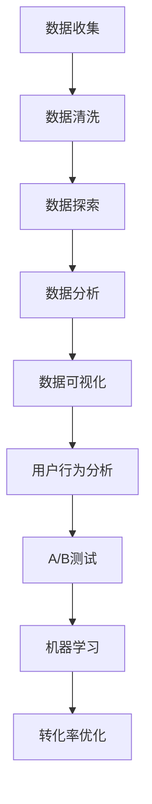

                 

# 利用数据分析优化知识付费转化率

> 关键词：数据分析, 转化率优化, 知识付费, 用户行为分析, A/B测试, 机器学习

> 摘要：在知识付费领域，如何通过数据分析提高转化率是至关重要的。本文将从数据分析的基本概念出发，逐步深入探讨如何利用数据分析优化知识付费平台的转化率。我们将详细讲解核心算法原理、数学模型和公式，并通过实际案例展示如何在开发环境中搭建项目、实现代码、分析结果。最后，我们将讨论实际应用场景、推荐相关工具和资源，并展望未来的发展趋势与挑战。

## 1. 背景介绍

随着互联网技术的飞速发展，知识付费已经成为一种重要的商业模式。用户通过付费购买课程、书籍、讲座等形式获取知识，而知识付费平台则通过提供高质量的内容和服务来吸引用户。然而，如何提高用户转化率，即从访问者转变为付费用户，是知识付费平台面临的一大挑战。本文将通过数据分析的方法，帮助知识付费平台优化转化率。

## 2. 核心概念与联系

### 2.1 数据分析基础

数据分析是指从大量数据中提取有价值的信息和知识的过程。它包括数据收集、数据清洗、数据探索、数据分析和数据可视化等步骤。数据分析可以帮助我们理解用户行为、发现潜在问题、预测未来趋势等。

### 2.2 转化率优化

转化率优化是指通过各种手段提高用户从访问者转变为付费用户的比率。转化率优化通常包括以下几个方面：

- **用户行为分析**：通过分析用户在平台上的行为数据，了解用户的需求和偏好。
- **A/B测试**：通过对比不同版本的页面或功能，找出最优的设计方案。
- **机器学习**：利用机器学习算法预测用户行为，从而实现个性化推荐和精准营销。

### 2.3 数据分析流程图



## 3. 核心算法原理 & 具体操作步骤

### 3.1 用户行为分析

用户行为分析是转化率优化的基础。我们需要收集和分析用户在平台上的行为数据，包括但不限于：

- **页面访问数据**：用户访问的页面、停留时间、跳出率等。
- **点击行为数据**：用户点击的链接、按钮等。
- **购买行为数据**：用户的购买记录、支付方式等。

### 3.2 A/B测试

A/B测试是一种常用的优化方法，通过对比不同版本的页面或功能，找出最优的设计方案。具体步骤如下：

1. **定义目标**：明确要优化的目标，如提高转化率、增加用户留存等。
2. **设计实验**：设计两个或多个版本的页面或功能，确保其他条件相同。
3. **分组用户**：将用户随机分配到不同的实验组。
4. **收集数据**：记录每个实验组的数据。
5. **分析结果**：比较不同实验组的数据，找出最优方案。

### 3.3 机器学习

机器学习可以用于预测用户行为，从而实现个性化推荐和精准营销。具体步骤如下：

1. **数据预处理**：清洗和转换数据，使其适合机器学习模型。
2. **特征工程**：提取有用的特征，如用户的历史行为、兴趣偏好等。
3. **模型选择**：选择合适的机器学习算法，如逻辑回归、决策树、随机森林等。
4. **模型训练**：使用训练数据训练模型。
5. **模型评估**：使用测试数据评估模型的性能。
6. **模型应用**：将模型应用于实际场景，实现个性化推荐和精准营销。

## 4. 数学模型和公式 & 详细讲解 & 举例说明

### 4.1 转化率计算公式

转化率是指完成特定目标的用户数占总用户数的比例。公式如下：

$$
\text{转化率} = \frac{\text{完成目标的用户数}}{\text{总用户数}} \times 100\%
$$

### 4.2 A/B测试统计显著性检验

A/B测试的统计显著性检验通常使用卡方检验或Z检验。假设我们有两个版本的页面，A和B，分别有n1和n2个用户，其中m1和m2个用户完成了目标行为。我们可以使用以下公式计算卡方值：

$$
\chi^2 = \frac{(m1 - \frac{m1 + m2}{2})^2}{\frac{m1 + m2}{2}} + \frac{(m2 - \frac{m1 + m2}{2})^2}{\frac{m1 + m2}{2}}
$$

### 4.3 机器学习模型评估指标

机器学习模型的评估指标包括准确率、召回率、F1分数等。其中，F1分数是准确率和召回率的调和平均值，公式如下：

$$
F1 = 2 \times \frac{\text{准确率} \times \text{召回率}}{\text{准确率} + \text{召回率}}
$$

## 5. 项目实战：代码实际案例和详细解释说明

### 5.1 开发环境搭建

为了实现数据分析和优化，我们需要搭建一个开发环境。具体步骤如下：

1. **安装Python**：确保安装了Python 3.7及以上版本。
2. **安装依赖库**：使用pip安装必要的库，如pandas、numpy、scikit-learn等。
3. **配置开发环境**：使用Jupyter Notebook或VS Code等工具进行开发。

### 5.2 源代码详细实现和代码解读

假设我们有一个知识付费平台的数据集，包含用户的基本信息、页面访问记录、购买记录等。我们将使用Python进行数据分析和优化。

#### 5.2.1 数据预处理

```python
import pandas as pd

# 读取数据
data = pd.read_csv('user_data.csv')

# 数据清洗
data.dropna(inplace=True)

# 特征工程
data['访问次数'] = data['访问记录'].str.split().str.len()
data['购买次数'] = data['购买记录'].str.split().str.len()
```

#### 5.2.2 A/B测试

```python
from sklearn.model_selection import train_test_split

# 分割数据
train_data, test_data = train_test_split(data, test_size=0.2, random_state=42)

# 计算转化率
conversion_rate_A = (train_data[train_data['版本'] == 'A']['购买次数'] > 0).mean()
conversion_rate_B = (train_data[train_data['版本'] == 'B']['购买次数'] > 0).mean()

# 卡方检验
chi2, p_value = chi2_contingency([[sum(train_data[train_data['版本'] == 'A']['购买次数'] > 0), sum(train_data[train_data['版本'] == 'A']['购买次数'] == 0)],
                                   [sum(train_data[train_data['版本'] == 'B']['购买次数'] > 0), sum(train_data[train_data['版本'] == 'B']['购买次数'] == 0)]])

print(f"转化率A: {conversion_rate_A}")
print(f"转化率B: {conversion_rate_B}")
print(f"卡方值: {chi2}")
print(f"p值: {p_value}")
```

#### 5.2.3 机器学习

```python
from sklearn.linear_model import LogisticRegression
from sklearn.metrics import accuracy_score, recall_score, f1_score

# 特征选择
X = train_data[['访问次数', '购买次数']]
y = train_data['购买次数'] > 0

# 训练模型
model = LogisticRegression()
model.fit(X, y)

# 预测
y_pred = model.predict(X)

# 评估模型
accuracy = accuracy_score(y, y_pred)
recall = recall_score(y, y_pred)
f1 = f1_score(y, y_pred)

print(f"准确率: {accuracy}")
print(f"召回率: {recall}")
print(f"F1分数: {f1}")
```

### 5.3 代码解读与分析

通过上述代码，我们可以看到如何进行数据预处理、A/B测试和机器学习。数据预处理包括读取数据、清洗数据和特征工程。A/B测试通过计算转化率和进行卡方检验来评估不同版本的效果。机器学习通过训练逻辑回归模型来预测用户行为，并评估模型的性能。

## 6. 实际应用场景

### 6.1 用户行为分析

通过用户行为分析，我们可以了解用户的需求和偏好，从而优化平台的设计和功能。例如，通过分析用户在页面上的停留时间和点击行为，我们可以发现哪些内容最受欢迎，从而优化内容推荐算法。

### 6.2 A/B测试

A/B测试可以帮助我们找到最优的设计方案。例如，通过对比不同版本的页面，我们可以发现哪个版本的转化率更高，从而优化页面设计。

### 6.3 机器学习

机器学习可以用于预测用户行为，从而实现个性化推荐和精准营销。例如，通过训练机器学习模型，我们可以预测哪些用户更有可能购买课程，从而进行精准营销。

## 7. 工具和资源推荐

### 7.1 学习资源推荐

- **书籍**：《数据科学实战》、《机器学习实战》
- **论文**：《A/B测试在互联网产品中的应用》、《机器学习在知识付费平台中的应用》
- **博客**：Medium上的数据分析和机器学习相关文章
- **网站**：Kaggle、GitHub上的数据分析和机器学习项目

### 7.2 开发工具框架推荐

- **Python库**：pandas、numpy、scikit-learn
- **开发工具**：Jupyter Notebook、VS Code

### 7.3 相关论文著作推荐

- **论文**：《A/B测试在互联网产品中的应用》、《机器学习在知识付费平台中的应用》
- **著作**：《数据科学实战》、《机器学习实战》

## 8. 总结：未来发展趋势与挑战

### 8.1 未来发展趋势

随着大数据和人工智能技术的发展，数据分析和优化将成为知识付费平台的核心竞争力。未来的发展趋势包括：

- **个性化推荐**：通过机器学习算法实现更精准的个性化推荐。
- **实时分析**：通过实时数据分析实现更快速的决策。
- **用户行为预测**：通过机器学习预测用户行为，实现更精准的营销。

### 8.2 挑战

尽管数据分析和优化带来了许多好处，但也面临一些挑战：

- **数据隐私**：如何在保护用户隐私的前提下进行数据分析。
- **模型解释性**：如何解释复杂的机器学习模型，使其更具可解释性。
- **数据质量**：如何保证数据的质量，避免因数据质量问题导致的错误决策。

## 9. 附录：常见问题与解答

### 9.1 问题：如何处理缺失数据？

**解答**：可以使用填充、删除或插值等方法处理缺失数据。具体方法取决于数据的特性和缺失数据的比例。

### 9.2 问题：如何评估机器学习模型的性能？

**解答**：可以使用准确率、召回率、F1分数等指标评估模型的性能。具体选择哪种指标取决于问题的特性和需求。

## 10. 扩展阅读 & 参考资料

- **书籍**：《数据科学实战》、《机器学习实战》
- **论文**：《A/B测试在互联网产品中的应用》、《机器学习在知识付费平台中的应用》
- **博客**：Medium上的数据分析和机器学习相关文章
- **网站**：Kaggle、GitHub上的数据分析和机器学习项目

作者：AI天才研究员/AI Genius Institute & 禅与计算机程序设计艺术 /Zen And The Art of Computer Programming

