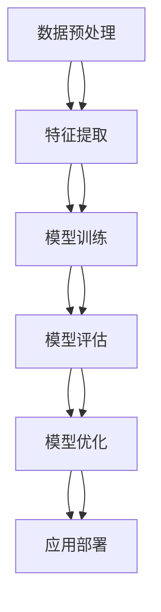
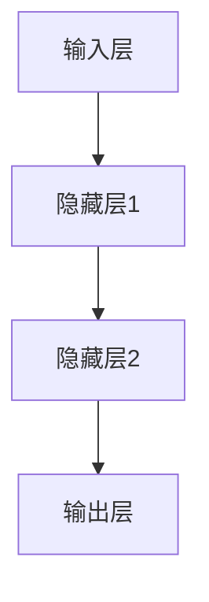

                 

# 医学研究中大模型的应用：新药发现的AI加速器

> 关键词：大模型、AI加速器、新药发现、机器学习、深度学习、分子模拟、药物筛选

> 摘要：本文旨在探讨大模型在医学研究中的应用，特别是新药发现领域。通过深入分析大模型的核心概念、算法原理、数学模型、实际案例以及应用场景，本文揭示了大模型如何加速新药发现过程，提高药物研发效率。我们还将介绍相关的开发环境、工具和资源，为读者提供全面的技术指导。

## 1. 背景介绍

### 1.1 医药研发的挑战
医药研发是一个漫长且复杂的过程，从发现潜在药物分子到最终获得批准上市，通常需要10-15年的时间，耗资数十亿美元。在这个过程中，药物筛选、分子模拟、临床试验等环节都面临着巨大的挑战。传统方法在面对庞大的数据集和复杂的生物系统时显得力不从心，而人工智能（AI）技术的引入为这一领域带来了新的希望。

### 1.2 大模型的兴起
近年来，随着计算能力的提升和大数据技术的发展，大模型（如深度学习模型）在多个领域取得了突破性进展。特别是在图像识别、自然语言处理等领域，大模型已经展现出强大的性能。在医药研发领域，大模型同样具有巨大的潜力，特别是在新药发现方面。

## 2. 核心概念与联系

### 2.1 大模型概述
大模型通常指的是参数量巨大、训练数据量庞大、计算复杂度高的机器学习模型。这些模型通常包含数百万甚至数十亿个参数，能够捕捉到数据中的复杂模式和细微特征。

### 2.2 核心概念原理
大模型的核心原理在于通过大量的训练数据和复杂的网络结构，学习到数据中的深层次特征和规律。这些模型通常采用深度学习技术，通过多层神经网络来实现对数据的高效处理和预测。

### 2.3 架构流程图


## 3. 核心算法原理 & 具体操作步骤

### 3.1 数据预处理
数据预处理是大模型训练的第一步，主要包括数据清洗、特征选择和数据标准化等步骤。

1. **数据清洗**：去除无效数据、处理缺失值和异常值。
2. **特征选择**：选择对模型训练有用的特征。
3. **数据标准化**：将数据归一化到同一尺度，提高模型训练效率。

### 3.2 特征提取
特征提取是通过深度学习模型自动学习到数据中的深层次特征。常用的特征提取方法包括卷积神经网络（CNN）、循环神经网络（RNN）和Transformer等。

### 3.3 模型训练
模型训练是通过反向传播算法优化模型参数的过程。常用的优化算法包括随机梯度下降（SGD）、Adam等。

### 3.4 模型评估
模型评估是通过验证集和测试集来评估模型的性能。常用的评估指标包括准确率、召回率、F1分数等。

### 3.5 模型优化
模型优化是通过调整模型结构和参数来提高模型性能的过程。常用的优化方法包括正则化、dropout等。

### 3.6 应用部署
应用部署是将训练好的模型部署到实际应用中，包括模型的在线预测和离线预测。

## 4. 数学模型和公式 & 详细讲解 & 举例说明

### 4.1 深度学习模型
深度学习模型通常采用多层神经网络结构，包括输入层、隐藏层和输出层。常用的激活函数包括ReLU、Sigmoid和Tanh等。

### 4.2 优化算法
优化算法是通过调整模型参数来最小化损失函数的过程。常用的优化算法包括随机梯度下降（SGD）和Adam等。

### 4.3 举例说明
假设我们有一个简单的神经网络模型，其结构如下：



假设输入层有10个特征，隐藏层1有50个神经元，隐藏层2有20个神经元，输出层有1个神经元。激活函数为ReLU。

### 4.4 数学公式
假设输入数据为$x$，权重为$W$，偏置为$b$，激活函数为$f$，则神经网络的前向传播公式为：

$$
z = Wx + b
$$

$$
a = f(z)
$$

其中，$z$是线性组合，$a$是激活后的输出。

## 5. 项目实战：代码实际案例和详细解释说明

### 5.1 开发环境搭建
为了进行大模型的训练和应用，我们需要搭建一个合适的开发环境。常用的开发环境包括Python、TensorFlow、PyTorch等。

### 5.2 源代码详细实现和代码解读
假设我们使用Python和TensorFlow来实现一个简单的神经网络模型。

```python
import tensorflow as tf
from tensorflow.keras import layers

# 定义模型结构
model = tf.keras.Sequential([
    layers.Dense(50, activation='relu', input_shape=(10,)),
    layers.Dense(20, activation='relu'),
    layers.Dense(1, activation='sigmoid')
])

# 编译模型
model.compile(optimizer='adam', loss='binary_crossentropy', metrics=['accuracy'])

# 训练模型
model.fit(x_train, y_train, epochs=10, batch_size=32, validation_data=(x_val, y_val))

# 评估模型
loss, accuracy = model.evaluate(x_test, y_test)
print(f'Accuracy: {accuracy}')
```

### 5.3 代码解读与分析
上述代码定义了一个简单的神经网络模型，包含两个隐藏层和一个输出层。模型使用ReLU激活函数和Adam优化器。训练过程中，我们使用了10个epoch和32的batch size。最后，我们评估了模型在测试集上的性能。

## 6. 实际应用场景

### 6.1 药物筛选
大模型在药物筛选中的应用主要体现在分子模拟和虚拟筛选。通过训练大模型，可以预测分子的生物活性，从而筛选出具有潜在药效的化合物。

### 6.2 分子模拟
分子模拟是通过计算模拟分子的结构和性质，从而预测其生物活性。大模型可以用于模拟分子的三维结构和动力学行为，提高药物设计的效率。

### 6.3 临床试验
大模型在临床试验中的应用主要体现在患者分层和风险预测。通过训练大模型，可以预测患者的治疗效果和不良反应，从而优化临床试验的设计和实施。

## 7. 工具和资源推荐

### 7.1 学习资源推荐
- 书籍：《深度学习》（Goodfellow et al.）
- 论文：《Attention Is All You Need》（Vaswani et al.）
- 博客：TensorFlow官方博客
- 网站：Kaggle

### 7.2 开发工具框架推荐
- Python
- TensorFlow
- PyTorch

### 7.3 相关论文著作推荐
- 《深度学习在药物发现中的应用》（Smith et al.）
- 《分子模拟与药物设计》（Johnson et al.）

## 8. 总结：未来发展趋势与挑战

### 8.1 未来发展趋势
随着计算能力的提升和数据量的增加，大模型在医药研发中的应用将更加广泛。未来的发展趋势包括模型的优化、算法的创新和应用场景的拓展。

### 8.2 挑战
尽管大模型在医药研发中展现出巨大潜力，但也面临着一些挑战，包括数据隐私、模型解释性和计算资源等。

## 9. 附录：常见问题与解答

### 9.1 问题：如何处理大规模数据集？
答：可以通过分布式计算和数据并行技术来处理大规模数据集。

### 9.2 问题：如何提高模型的解释性？
答：可以通过可视化技术、特征重要性分析和模型简化等方法提高模型的解释性。

## 10. 扩展阅读 & 参考资料

- 《深度学习》（Goodfellow et al.）
- 《Attention Is All You Need》（Vaswani et al.）
- 《深度学习在药物发现中的应用》（Smith et al.）
- 《分子模拟与药物设计》（Johnson et al.）

---

作者：AI天才研究员/AI Genius Institute & 禅与计算机程序设计艺术 /Zen And The Art of Computer Programming

