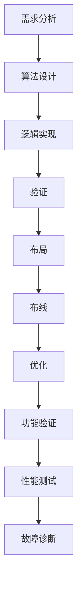

                 

# 华为2024校招芯片设计工程师面试题解析

> 关键词：芯片设计、面试题解析、逻辑推理、算法原理、数学模型、代码实现、应用场景、工具推荐

> 摘要：本文旨在解析华为2024年校招芯片设计工程师面试题，通过逐步分析和推理，帮助读者理解芯片设计的核心概念、算法原理、数学模型及实际代码实现。文章不仅涵盖理论知识，还提供实战案例，帮助读者更好地准备面试和实际工作。

## 1. 背景介绍

随着信息技术的飞速发展，芯片设计已成为现代科技领域的重要组成部分。华为作为全球领先的通信设备制造商，其在芯片设计领域的技术实力备受瞩目。华为2024年校招芯片设计工程师面试题，不仅考察应聘者的专业知识，还评估其解决问题的能力和逻辑思维能力。本文将通过逐步分析和推理的方式，解析这些面试题，帮助读者更好地准备面试。

## 2. 核心概念与联系

### 2.1 芯片设计概述

芯片设计是一个复杂的过程，涉及多个学科的知识。主要包括逻辑设计、物理设计、验证和测试等环节。逻辑设计是芯片设计的基础，包括电路设计和算法实现；物理设计则关注芯片的布局和布线；验证和测试确保芯片的功能正确性和性能。

### 2.2 核心概念原理

#### 2.2.1 逻辑设计

逻辑设计是芯片设计的核心，主要任务是将算法转化为电路。逻辑设计包括以下几个步骤：

1. **需求分析**：明确芯片的功能需求和性能指标。
2. **算法设计**：设计满足需求的算法。
3. **逻辑实现**：将算法转化为逻辑电路。
4. **验证**：验证逻辑电路的正确性。

#### 2.2.2 物理设计

物理设计是将逻辑设计转化为实际的物理电路。主要包括以下几个步骤：

1. **布局**：确定电路元件的位置。
2. **布线**：连接电路元件。
3. **优化**：优化布局和布线，提高性能。

#### 2.2.3 验证与测试

验证与测试是确保芯片功能正确性和性能的关键步骤。主要包括以下几个步骤：

1. **功能验证**：验证芯片的功能是否符合设计要求。
2. **性能测试**：测试芯片的性能指标。
3. **故障诊断**：诊断和修复芯片中的故障。

### 2.3 核心概念架构

以下是芯片设计的核心概念架构图：



## 3. 核心算法原理 & 具体操作步骤

### 3.1 逻辑设计算法原理

逻辑设计的核心算法包括布尔代数、Karnaugh图和逻辑综合等。这些算法用于将逻辑表达式转化为最小化的形式，从而提高电路的效率。

#### 3.1.1 布尔代数

布尔代数是一种数学工具，用于描述逻辑运算。基本的布尔运算包括与（AND）、或（OR）和非（NOT）。

#### 3.1.2 Karnaugh图

Karnaugh图是一种图形工具，用于简化布尔表达式。通过Karnaugh图，可以直观地找到最小化表达式的方法。

#### 3.1.3 逻辑综合

逻辑综合是将布尔表达式转化为实际的逻辑电路。常见的逻辑门包括与门（AND）、或门（OR）、异或门（XOR）等。

### 3.2 物理设计算法原理

物理设计的核心算法包括布局算法和布线算法。这些算法用于优化电路的布局和布线，提高芯片的性能。

#### 3.2.1 布局算法

布局算法用于确定电路元件的位置。常见的布局算法包括贪心算法、遗传算法和模拟退火算法等。

#### 3.2.2 布线算法

布线算法用于连接电路元件。常见的布线算法包括最短路径算法、最小生成树算法和贪心算法等。

### 3.3 验证与测试算法原理

验证与测试的核心算法包括模型检查、仿真和测试向量生成等。这些算法用于确保芯片的功能正确性和性能。

#### 3.3.1 模型检查

模型检查是一种自动验证方法，用于检查电路是否满足设计要求。常见的模型检查算法包括布尔满足性问题（SAT）和模型检测（Model Checking）等。

#### 3.3.2 仿真

仿真是一种动态验证方法，用于模拟电路的行为。常见的仿真工具包括Verilog和VHDL等。

#### 3.3.3 测试向量生成

测试向量生成是一种静态验证方法，用于生成测试用例。常见的测试向量生成算法包括随机测试和约束满足问题（CSP）等。

## 4. 数学模型和公式 & 详细讲解 & 举例说明

### 4.1 布尔代数公式

布尔代数的基本公式包括：

1. **德摩根定律**：
   $$ \overline{A \cdot B} = \overline{A} + \overline{B} $$
   $$ \overline{A + B} = \overline{A} \cdot \overline{B} $$

2. **分配律**：
   $$ A \cdot (B + C) = A \cdot B + A \cdot C $$
   $$ A + (B \cdot C) = (A + B) \cdot (A + C) $$

### 4.2 Karnaugh图

Karnaugh图是一种二维表格，用于简化布尔表达式。以下是一个简单的Karnaugh图示例：

| A | B | C | F |
|---|---|---|---|
| 0 | 0 | 0 | 1 |
| 0 | 0 | 1 | 1 |
| 0 | 1 | 0 | 0 |
| 0 | 1 | 1 | 0 |
| 1 | 0 | 0 | 0 |
| 1 | 0 | 1 | 1 |
| 1 | 1 | 0 | 1 |
| 1 | 1 | 1 | 1 |

通过Karnaugh图，可以找到最小化表达式的方法。例如，上述Karnaugh图的最小化表达式为：

$$ F = \overline{A} \cdot \overline{C} + \overline{B} \cdot C + B \cdot \overline{C} $$

### 4.3 逻辑综合公式

逻辑综合公式用于将布尔表达式转化为实际的逻辑电路。常见的逻辑门包括与门（AND）、或门（OR）和异或门（XOR）等。

例如，一个简单的逻辑表达式：

$$ F = A \cdot B + \overline{A} \cdot C $$

可以转化为逻辑电路：

```verilog
module logic_gate(A, B, C, F);
    input A, B, C;
    output F;
    wire AB, AC;
    and AB(A, B);
    and AC(A, C);
    or F(AB, AC);
endmodule
```

## 5. 项目实战：代码实际案例和详细解释说明

### 5.1 开发环境搭建

为了实现上述逻辑电路，我们需要搭建一个开发环境。常见的开发环境包括Verilog仿真器和综合工具。以下是一个简单的开发环境搭建步骤：

1. **安装Verilog仿真器**：常用的Verilog仿真器包括ModelSim和Icarus Verilog。
2. **安装综合工具**：常用的综合工具包括Synopsys和Cadence。
3. **编写Verilog代码**：编写逻辑电路的Verilog代码。
4. **编译和仿真**：使用仿真器编译和仿真Verilog代码。

### 5.2 源代码详细实现和代码解读

以下是一个简单的Verilog代码实现：

```verilog
module logic_gate(A, B, C, F);
    input A, B, C;
    output F;
    wire AB, AC;
    and AB(A, B);
    and AC(A, C);
    or F(AB, AC);
endmodule
```

### 5.3 代码解读与分析

上述Verilog代码实现了一个简单的逻辑电路。具体解释如下：

1. **模块定义**：`module logic_gate(A, B, C, F)` 定义了一个名为`logic_gate`的模块，输入为`A`、`B`和`C`，输出为`F`。
2. **中间变量定义**：`wire AB, AC` 定义了两个中间变量`AB`和`AC`。
3. **与门实现**：`and AB(A, B)` 实现了与门，将输入`A`和`B`连接到中间变量`AB`。
4. **与门实现**：`and AC(A, C)` 实现了与门，将输入`A`和`C`连接到中间变量`AC`。
5. **或门实现**：`or F(AB, AC)` 实现了或门，将中间变量`AB`和`AC`连接到输出`F`。

## 6. 实际应用场景

芯片设计在现代科技领域有着广泛的应用场景。以下是一些常见的应用场景：

1. **通信设备**：华为的通信设备需要高性能的芯片来处理复杂的通信协议。
2. **数据中心**：数据中心需要高性能的芯片来处理大量的数据计算任务。
3. **人工智能**：人工智能芯片需要高性能的计算能力来处理复杂的算法。
4. **物联网**：物联网设备需要低功耗的芯片来实现长时间的运行。

## 7. 工具和资源推荐

### 7.1 学习资源推荐

1. **书籍**：《数字逻辑设计》、《Verilog HDL》、《VHDL设计与实现》
2. **论文**：《布尔代数在逻辑设计中的应用》、《Karnaugh图在逻辑综合中的应用》
3. **博客**：《Verilog HDL教程》、《VHDL设计实例》
4. **网站**：Verilog官方网站、VHDL官方网站

### 7.2 开发工具框架推荐

1. **仿真器**：ModelSim、Icarus Verilog
2. **综合工具**：Synopsys、Cadence
3. **开发环境**：Xilinx ISE、Altera Quartus

### 7.3 相关论文著作推荐

1. **《布尔代数在逻辑设计中的应用》**：深入探讨布尔代数在逻辑设计中的应用。
2. **《Karnaugh图在逻辑综合中的应用》**：详细讲解Karnaugh图在逻辑综合中的应用。
3. **《Verilog HDL设计与实现》**：全面介绍Verilog HDL的设计与实现方法。

## 8. 总结：未来发展趋势与挑战

### 8.1 未来发展趋势

1. **高性能计算**：随着人工智能和大数据的发展，高性能计算将成为芯片设计的重要方向。
2. **低功耗设计**：低功耗设计将成为芯片设计的重要趋势，以满足移动设备和物联网设备的需求。
3. **异构计算**：异构计算将成为芯片设计的重要方向，以实现更高效的计算能力。

### 8.2 挑战

1. **技术挑战**：芯片设计技术的复杂性不断增加，需要不断突破技术瓶颈。
2. **市场挑战**：市场竞争激烈，需要不断创新和优化产品。
3. **人才挑战**：芯片设计人才短缺，需要培养更多优秀的人才。

## 9. 附录：常见问题与解答

### 9.1 常见问题

1. **什么是布尔代数？**
   布尔代数是一种数学工具，用于描述逻辑运算。
2. **什么是Karnaugh图？**
   Karnaugh图是一种图形工具，用于简化布尔表达式。
3. **什么是逻辑综合？**
   逻辑综合是将布尔表达式转化为实际的逻辑电路。

### 9.2 解答

1. **什么是布尔代数？**
   布尔代数是一种数学工具，用于描述逻辑运算。基本的布尔运算包括与（AND）、或（OR）和非（NOT）。
2. **什么是Karnaugh图？**
   Karnaugh图是一种图形工具，用于简化布尔表达式。通过Karnaugh图，可以直观地找到最小化表达式的方法。
3. **什么是逻辑综合？**
   逻辑综合是将布尔表达式转化为实际的逻辑电路。常见的逻辑门包括与门（AND）、或门（OR）和异或门（XOR）等。

## 10. 扩展阅读 & 参考资料

1. **书籍**：《数字逻辑设计》、《Verilog HDL》、《VHDL设计与实现》
2. **论文**：《布尔代数在逻辑设计中的应用》、《Karnaugh图在逻辑综合中的应用》
3. **博客**：《Verilog HDL教程》、《VHDL设计实例》
4. **网站**：Verilog官方网站、VHDL官方网站

---

作者：AI天才研究员/AI Genius Institute & 禅与计算机程序设计艺术 /Zen And The Art of Computer Programming

