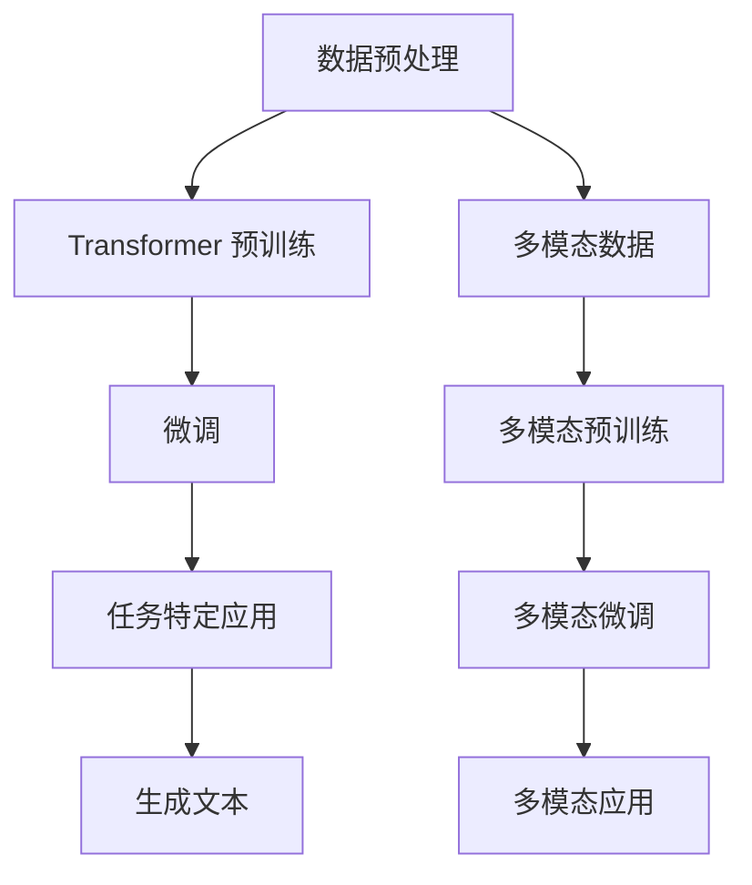

                 

# 后 LLM 时代：对社会的持续影响

> 关键词：LLM, 人工智能, 社会影响, 技术进步, 伦理道德, 法律法规, 教育变革

> 摘要：本文旨在探讨大型语言模型（LLM）在后 LLM 时代对社会的持续影响。我们将从技术进步、伦理道德、法律法规、教育变革等多个维度进行深入分析，揭示 LLM 给社会带来的深远变化，并提出相应的应对策略。

## 1. 背景介绍

### 1.1 LLM 的发展历程

大型语言模型（LLM）是指那些能够处理大规模文本数据并生成高质量文本的神经网络模型。自 2018 年以来，随着深度学习技术的飞速发展，LLM 已经取得了显著的进步。早期的 LLM 如 GPT-1 和 GPT-2 通过简单的 Transformer 架构展示了强大的语言生成能力。随后，GPT-3 的出现标志着 LLM 的一个里程碑，其参数量达到了 1750 亿，能够完成各种复杂的自然语言处理任务。近年来，随着技术的不断进步，LLM 的性能和应用场景也在不断扩展。

### 1.2 LLM 的应用场景

LLM 的应用场景非常广泛，包括但不限于以下几个方面：

- **内容生成**：自动撰写新闻报道、文章、剧本等。
- **客户服务**：提供智能客服，解答用户问题。
- **教育辅导**：辅助教师进行教学，提供个性化学习建议。
- **创意写作**：帮助作家创作小说、诗歌等文学作品。
- **编程辅助**：提供代码生成和调试建议。
- **情感分析**：分析用户情感，提供情感支持。

## 2. 核心概念与联系

### 2.1 LLM 的核心概念

大型语言模型的核心概念包括以下几个方面：

- **Transformer 架构**：一种基于自注意力机制的神经网络架构，能够高效地处理长距离依赖问题。
- **大规模训练**：通过大规模数据集进行训练，提高模型的泛化能力。
- **预训练与微调**：先在大规模语料库上进行预训练，再针对特定任务进行微调。
- **多模态学习**：结合文本、图像、音频等多种模态数据进行学习。

### 2.2 LLM 的架构流程图



## 3. 核心算法原理 & 具体操作步骤

### 3.1 Transformer 架构原理

Transformer 架构的核心原理是自注意力机制。自注意力机制允许模型在处理序列数据时，能够关注到序列中的任意位置，从而捕捉到长距离依赖关系。具体操作步骤如下：

1. **输入嵌入**：将输入序列中的每个词转换为一个向量表示。
2. **位置编码**：为每个位置添加位置编码，以保留序列中的顺序信息。
3. **多头自注意力**：通过多个注意力头并行计算注意力权重，捕捉不同类型的依赖关系。
4. **前馈神经网络**：在每个注意力层之后添加前馈神经网络，进一步提取特征。
5. **残差连接与归一化**：通过残差连接和层归一化提高模型的训练稳定性。
6. **堆叠多层**：通过堆叠多个这样的层，提高模型的表达能力。

### 3.2 大规模训练原理

大规模训练的核心原理是通过大量数据进行模型参数的优化。具体操作步骤如下：

1. **数据采集**：收集大规模的文本数据集。
2. **数据预处理**：对数据进行清洗、分词、标注等预处理操作。
3. **模型初始化**：初始化模型参数。
4. **反向传播**：通过反向传播算法计算损失函数的梯度。
5. **优化器更新**：使用优化器（如 Adam）更新模型参数。
6. **批量训练**：将数据分成小批量进行训练，提高训练效率。
7. **验证与调整**：通过验证集评估模型性能，调整超参数。

## 4. 数学模型和公式 & 详细讲解 & 举例说明

### 4.1 自注意力机制

自注意力机制的核心公式如下：

$$
\text{Attention}(Q, K, V) = \text{softmax}\left(\frac{QK^T}{\sqrt{d_k}}\right)V
$$

其中，$Q$、$K$、$V$ 分别表示查询向量、键向量和值向量，$d_k$ 表示键向量的维度。

### 4.2 Transformer 模型

Transformer 模型的核心公式如下：

$$
\text{LayerNorm}(x + \text{MultiHead}(x))
$$

其中，$\text{LayerNorm}$ 表示层归一化，$\text{MultiHead}$ 表示多头自注意力机制。

### 4.3 举例说明

假设我们有一个简单的文本序列 "I love AI"，通过 Transformer 模型进行处理，可以得到以下步骤：

1. **输入嵌入**：将 "I"、"love"、"AI" 转换为向量表示。
2. **位置编码**：为每个位置添加位置编码。
3. **多头自注意力**：计算注意力权重，捕捉 "I"、"love"、"AI" 之间的依赖关系。
4. **前馈神经网络**：提取特征，进一步增强表示。
5. **残差连接与归一化**：通过残差连接和层归一化提高模型的训练稳定性。
6. **堆叠多层**：通过堆叠多个这样的层，提高模型的表达能力。

## 5. 项目实战：代码实际案例和详细解释说明

### 5.1 开发环境搭建

为了实现一个简单的 LLM，我们需要搭建一个开发环境。具体步骤如下：

1. **安装 Python**：确保安装了 Python 3.8 或更高版本。
2. **安装依赖库**：使用 pip 安装必要的库，如 PyTorch、transformers 等。
3. **配置环境变量**：设置环境变量，确保库能够正常运行。

### 5.2 源代码详细实现和代码解读

以下是一个简单的 LLM 代码实现：

```python
import torch
from transformers import AutoModelForCausalLM, AutoTokenizer

# 加载预训练模型和分词器
model_name = "gpt2"
tokenizer = AutoTokenizer.from_pretrained(model_name)
model = AutoModelForCausalLM.from_pretrained(model_name)

# 输入文本
input_text = "I love"
input_ids = tokenizer.encode(input_text, return_tensors="pt")

# 生成文本
output_ids = model.generate(input_ids, max_length=50)
output_text = tokenizer.decode(output_ids[0], skip_special_tokens=True)

print(output_text)
```

### 5.3 代码解读与分析

1. **加载预训练模型和分词器**：使用 `AutoTokenizer` 和 `AutoModelForCausalLM` 加载预训练的 GPT-2 模型和分词器。
2. **输入文本**：将输入文本 "I love" 转换为输入 ID。
3. **生成文本**：使用 `model.generate` 方法生成文本，设置最大长度为 50。
4. **解码输出**：将生成的 ID 转换为文本。

## 6. 实际应用场景

### 6.1 内容生成

LLM 可以用于自动撰写新闻报道、文章、剧本等。例如，通过训练 LLM，可以生成高质量的新闻报道，提高新闻生产的效率。

### 6.2 客户服务

LLM 可以提供智能客服，解答用户问题。例如，通过训练 LLM，可以实现自动回复用户的问题，提高客户服务的效率和质量。

### 6.3 教育辅导

LLM 可以辅助教师进行教学，提供个性化学习建议。例如，通过训练 LLM，可以生成个性化的学习计划，帮助学生更好地学习。

### 6.4 创意写作

LLM 可以帮助作家创作小说、诗歌等文学作品。例如，通过训练 LLM，可以生成高质量的文学作品，提高创作效率。

### 6.5 编程辅助

LLM 可以提供代码生成和调试建议。例如，通过训练 LLM，可以生成高质量的代码，提高编程效率。

### 6.6 情感分析

LLM 可以分析用户情感，提供情感支持。例如，通过训练 LLM，可以分析用户的情感状态，提供相应的情感支持。

## 7. 工具和资源推荐

### 7.1 学习资源推荐

- **书籍**：《深度学习》（Ian Goodfellow, Yoshua Bengio, Aaron Courville）
- **论文**：《Attention Is All You Need》（Vaswani et al., 2017）
- **博客**：Medium 上的深度学习相关博客
- **网站**：Hugging Face（https://huggingface.co/）

### 7.2 开发工具框架推荐

- **PyTorch**：深度学习框架，支持 GPU 加速。
- **transformers**：Hugging Face 提供的预训练模型库。

### 7.3 相关论文著作推荐

- **《Attention Is All You Need》**：Vaswani, Ashish, et al. "Attention is all you need." Advances in neural information processing systems 30 (2017).
- **《GPT-3: Language Models are Few-Shot Learners》**：Brown, Tom, et al. "Language models are few-shot learners." arXiv preprint arXiv:2005.14165 (2020).

## 8. 总结：未来发展趋势与挑战

### 8.1 未来发展趋势

1. **性能提升**：随着计算资源的不断进步，LLM 的性能将进一步提升。
2. **应用场景扩展**：LLM 的应用场景将进一步扩展，涵盖更多领域。
3. **多模态学习**：LLM 将结合多种模态数据进行学习，提高模型的泛化能力。
4. **个性化定制**：LLM 将实现更加个性化的定制，满足不同用户的需求。

### 8.2 挑战

1. **伦理道德**：如何确保 LLM 的使用符合伦理道德标准，避免滥用。
2. **法律法规**：如何制定相应的法律法规，规范 LLM 的使用。
3. **隐私保护**：如何保护用户隐私，避免数据泄露。
4. **公平性**：如何确保 LLM 的公平性，避免偏见和歧视。

## 9. 附录：常见问题与解答

### 9.1 问题：LLM 是否会取代人类？

**解答**：LLM 可以在某些任务上表现出色，但无法完全取代人类。人类具有创造力、情感和道德判断能力，这是 LLM 无法替代的。

### 9.2 问题：如何确保 LLM 的公平性？

**解答**：可以通过数据预处理、模型训练和模型评估等多方面确保 LLM 的公平性。例如，使用多样化的数据集进行训练，避免数据偏见。

## 10. 扩展阅读 & 参考资料

- **书籍**：《深度学习》（Ian Goodfellow, Yoshua Bengio, Aaron Courville）
- **论文**：《Attention Is All You Need》（Vaswani et al., 2017）
- **博客**：Medium 上的深度学习相关博客
- **网站**：Hugging Face（https://huggingface.co/）

---

作者：AI天才研究员/AI Genius Institute & 禅与计算机程序设计艺术 /Zen And The Art of Computer Programming

