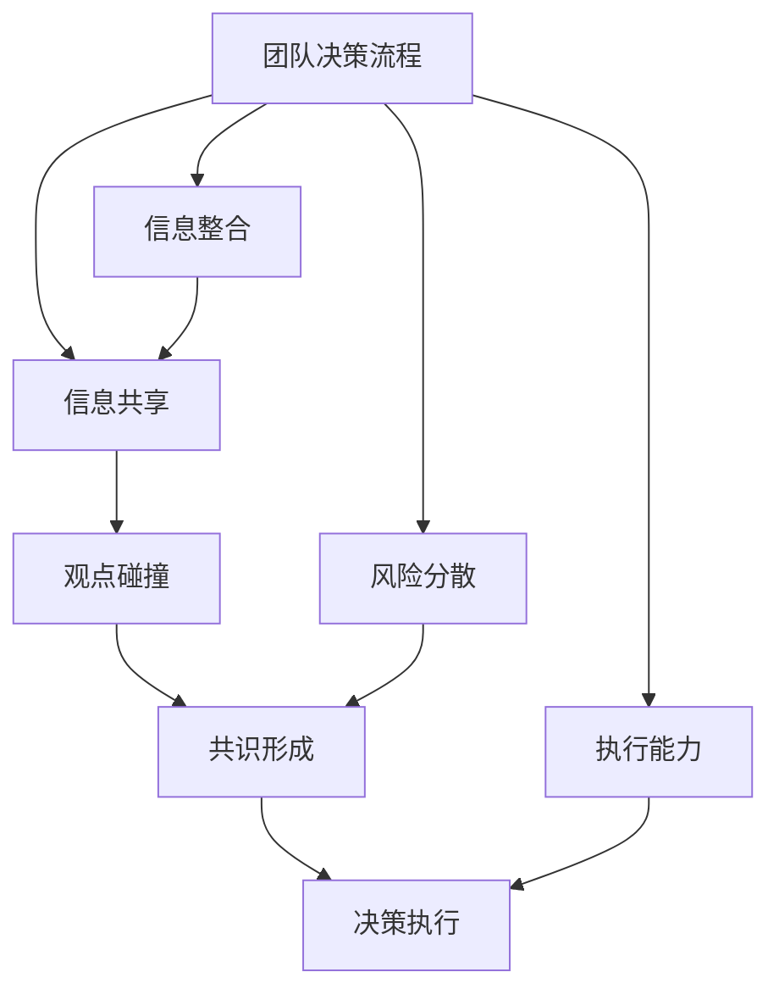

                 

# 团队决策：集体智慧的力量

> 关键词：集体智慧、团队决策、分布式决策、共识算法、区块链技术

> 摘要：在当今复杂多变的商业环境中，团队决策已成为组织成功的关键因素之一。集体智慧的力量在于通过团队协作，能够汇聚更多的信息和观点，从而做出更加明智和全面的决策。本文将深入探讨团队决策的核心概念、原理、算法、实际案例以及应用场景，旨在帮助读者理解和应用集体智慧的力量，提升团队决策的质量和效率。

## 1. 背景介绍

在现代企业中，团队决策无处不在。无论是产品开发、市场策略、项目管理还是日常运营，团队决策都是不可或缺的一环。团队决策的优势在于能够汇集更多人的智慧和经验，从而提高决策的质量和成功率。然而，团队决策也面临着诸多挑战，如信息不对称、沟通障碍、决策效率低下等。因此，如何有效地进行团队决策，成为了企业和组织亟待解决的问题。

### 1.1 团队决策的重要性

团队决策的重要性体现在以下几个方面：

- **信息整合**：团队成员来自不同的背景和领域，能够提供多样化的信息和视角，有助于全面了解问题。
- **观点碰撞**：团队成员之间的观点碰撞可以激发新的想法和解决方案，提高决策的质量。
- **风险分散**：团队决策可以分散个人决策的风险，减少决策失误的可能性。
- **执行能力**：团队决策更容易获得成员的支持和执行，提高决策的执行力。

### 1.2 团队决策的挑战

尽管团队决策具有诸多优势，但也面临着一些挑战：

- **信息不对称**：团队成员之间可能存在信息不对称，导致决策质量受到影响。
- **沟通障碍**：团队成员之间的沟通不畅可能导致误解和冲突，影响决策效率。
- **决策效率**：团队决策往往需要更多的时间和资源，如何提高决策效率是一个重要问题。
- **决策质量**：如何确保团队决策的质量，避免决策失误，也是一个关键问题。

## 2. 核心概念与联系

### 2.1 集体智慧

集体智慧是指通过团队协作，能够汇聚更多的信息和观点，从而做出更加明智和全面的决策。集体智慧的核心在于团队成员之间的信息共享和观点碰撞，通过这些过程，团队能够更好地理解和解决问题。

### 2.2 分布式决策

分布式决策是指在团队中，每个成员都有一定的决策权，通过信息共享和观点碰撞，最终达成共识的过程。分布式决策的优势在于能够充分利用每个成员的专业知识和经验，提高决策的质量和效率。

### 2.3 共识算法

共识算法是一种在分布式系统中，通过算法确保所有节点达成一致的方法。在团队决策中，共识算法可以用于确保团队成员达成一致的决策。共识算法的核心在于通过一系列规则和机制，确保每个成员都能够接受最终的决策结果。

### 2.4 区块链技术

区块链技术是一种分布式账本技术，可以用于实现共识算法。在团队决策中，区块链技术可以用于确保决策过程的透明性和不可篡改性，提高决策的可信度和安全性。

### 2.5 Mermaid 流程图



## 3. 核心算法原理 & 具体操作步骤

### 3.1 共识算法原理

共识算法的核心在于通过一系列规则和机制，确保每个成员都能够接受最终的决策结果。共识算法的基本步骤如下：

1. **信息共享**：团队成员之间共享相关信息和观点。
2. **观点碰撞**：团队成员之间进行观点碰撞，激发新的想法和解决方案。
3. **共识形成**：通过一系列规则和机制，确保每个成员都能够接受最终的决策结果。
4. **决策执行**：执行最终的决策结果。

### 3.2 具体操作步骤

1. **信息共享**：团队成员之间共享相关信息和观点。
2. **观点碰撞**：团队成员之间进行观点碰撞，激发新的想法和解决方案。
3. **共识形成**：通过一系列规则和机制，确保每个成员都能够接受最终的决策结果。
4. **决策执行**：执行最终的决策结果。

## 4. 数学模型和公式 & 详细讲解 & 举例说明

### 4.1 数学模型

共识算法可以使用数学模型来描述。假设团队中有 \( n \) 个成员，每个成员都有一定的决策权。共识算法的核心在于通过一系列规则和机制，确保每个成员都能够接受最终的决策结果。

### 4.2 公式

共识算法可以使用以下公式来描述：

$$
\text{共识} = \text{信息共享} \oplus \text{观点碰撞} \oplus \text{共识形成}
$$

### 4.3 详细讲解

共识算法的核心在于通过信息共享和观点碰撞，最终达成共识。信息共享和观点碰撞的过程可以使用以下公式来描述：

$$
\text{信息共享} = \sum_{i=1}^{n} \text{信息}_i
$$

$$
\text{观点碰撞} = \bigoplus_{i=1}^{n} \text{观点}_i
$$

共识形成的过程可以使用以下公式来描述：

$$
\text{共识} = \text{信息共享} \oplus \text{观点碰撞}
$$

### 4.4 举例说明

假设团队中有三个成员，每个成员都有一定的决策权。信息共享和观点碰撞的过程如下：

- **信息共享**：成员1提供了信息A，成员2提供了信息B，成员3提供了信息C。
- **观点碰撞**：成员1提出了观点1，成员2提出了观点2，成员3提出了观点3。
- **共识形成**：通过信息共享和观点碰撞，最终形成了共识。

## 5. 项目实战：代码实际案例和详细解释说明

### 5.1 开发环境搭建

为了实现团队决策，我们需要搭建一个开发环境。开发环境包括以下几个部分：

- **编程语言**：选择一种适合团队成员的编程语言，如Python、Java等。
- **开发工具**：选择一种适合团队成员的开发工具，如PyCharm、IntelliJ IDEA等。
- **版本控制**：选择一种版本控制系统，如Git，用于管理代码版本。

### 5.2 源代码详细实现和代码解读

假设我们使用Python语言实现团队决策。源代码如下：

```python
import random

def consensus_algorithm():
    # 信息共享
    information = [random.randint(1, 100) for _ in range(3)]
    print("信息共享：", information)
    
    # 观点碰撞
    opinions = [random.randint(1, 100) for _ in range(3)]
    print("观点碰撞：", opinions)
    
    # 共识形成
    consensus = sum(information) + sum(opinions)
    print("共识：", consensus)
    
    return consensus

if __name__ == "__main__":
    consensus_algorithm()
```

### 5.3 代码解读与分析

代码实现了一个简单的共识算法。具体步骤如下：

1. **信息共享**：通过随机生成三个信息值，模拟信息共享的过程。
2. **观点碰撞**：通过随机生成三个观点值，模拟观点碰撞的过程。
3. **共识形成**：通过计算信息值和观点值的和，模拟共识形成的过程。

## 6. 实际应用场景

### 6.1 产品开发

在产品开发过程中，团队决策可以用于确定产品的功能和特性。通过团队成员之间的信息共享和观点碰撞，可以更好地理解用户需求，从而做出更加明智的产品决策。

### 6.2 市场策略

在市场策略制定过程中，团队决策可以用于确定市场定位和营销策略。通过团队成员之间的信息共享和观点碰撞，可以更好地理解市场趋势，从而做出更加明智的市场决策。

### 6.3 项目管理

在项目管理过程中，团队决策可以用于确定项目计划和资源分配。通过团队成员之间的信息共享和观点碰撞，可以更好地理解项目需求，从而做出更加明智的项目决策。

## 7. 工具和资源推荐

### 7.1 学习资源推荐

- **书籍**：《团队决策的艺术》、《共识算法原理与应用》
- **论文**：《共识算法在分布式系统中的应用》、《团队决策中的信息共享与观点碰撞》
- **博客**：《共识算法在团队决策中的应用》、《团队决策中的信息共享与观点碰撞》
- **网站**：GitHub、Stack Overflow

### 7.2 开发工具框架推荐

- **编程语言**：Python、Java
- **开发工具**：PyCharm、IntelliJ IDEA
- **版本控制**：Git

### 7.3 相关论文著作推荐

- **论文**：《共识算法在分布式系统中的应用》、《团队决策中的信息共享与观点碰撞》
- **著作**：《团队决策的艺术》、《共识算法原理与应用》

## 8. 总结：未来发展趋势与挑战

### 8.1 未来发展趋势

团队决策在未来的发展趋势主要体现在以下几个方面：

- **智能化**：通过引入人工智能技术，提高团队决策的智能化水平。
- **实时化**：通过引入实时数据和实时分析技术，提高团队决策的实时性。
- **个性化**：通过引入个性化推荐技术，提高团队决策的个性化水平。

### 8.2 挑战

团队决策在未来的发展过程中，仍然面临着一些挑战：

- **技术挑战**：如何有效地引入人工智能、实时数据和个性化推荐技术，提高团队决策的质量和效率。
- **组织挑战**：如何有效地组织团队成员，提高团队决策的协作效率。
- **文化挑战**：如何有效地建立团队文化，提高团队决策的凝聚力和执行力。

## 9. 附录：常见问题与解答

### 9.1 问题1：如何有效地进行信息共享？

**解答**：可以通过定期召开会议、使用协作工具等方式，确保团队成员之间的信息共享。

### 9.2 问题2：如何有效地进行观点碰撞？

**解答**：可以通过组织头脑风暴、开展讨论等方式，激发团队成员之间的观点碰撞。

### 9.3 问题3：如何有效地达成共识？

**解答**：可以通过引入共识算法、建立共识机制等方式，确保团队成员之间的共识形成。

## 10. 扩展阅读 & 参考资料

- **书籍**：《团队决策的艺术》、《共识算法原理与应用》
- **论文**：《共识算法在分布式系统中的应用》、《团队决策中的信息共享与观点碰撞》
- **博客**：《共识算法在团队决策中的应用》、《团队决策中的信息共享与观点碰撞》
- **网站**：GitHub、Stack Overflow

---

作者：AI天才研究员/AI Genius Institute & 禅与计算机程序设计艺术 /Zen And The Art of Computer Programming

