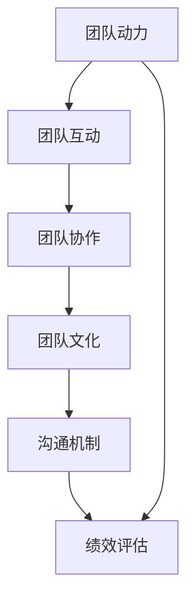

                 

# 团队动力优化：提升团队互动与协作效率

> 关键词：团队动力、协作效率、团队互动、敏捷开发、团队文化、沟通机制、绩效评估

> 摘要：在当今快速变化的商业环境中，团队的协作效率和互动能力成为决定项目成功的关键因素。本文将深入探讨如何通过优化团队动力来提升团队的互动与协作效率。我们将从团队动力的核心概念出发，分析影响团队动力的关键因素，提出具体的优化策略，并通过实际案例进行详细解读。最后，我们将展望未来的发展趋势和面临的挑战。

## 1. 背景介绍

在数字化转型的大背景下，企业越来越依赖于高效的团队协作来应对复杂多变的市场需求。团队动力作为团队协作的核心驱动力，直接影响着团队的凝聚力、创新能力和执行力。一个高效的团队不仅能够快速响应市场变化，还能够持续产出高质量的工作成果。因此，如何优化团队动力，提升团队互动与协作效率，成为现代企业管理者和团队领导者面临的重大课题。

## 2. 核心概念与联系

### 2.1 团队动力

团队动力是指团队成员之间相互作用产生的积极能量，这种能量能够激发团队成员的积极性、主动性和创造性，从而推动团队目标的实现。团队动力的高低直接影响团队的凝聚力、创新能力和执行力。

### 2.2 团队互动

团队互动是指团队成员之间的沟通、协作和交流过程。良好的团队互动能够促进信息的共享、问题的解决和团队氛围的营造，从而提升团队的整体表现。

### 2.3 团队协作

团队协作是指团队成员为了共同的目标而共同努力的过程。高效的团队协作能够提高工作效率，减少冲突，增强团队的凝聚力。

### 2.4 团队文化

团队文化是指团队成员共同持有的价值观、信念和行为规范。良好的团队文化能够促进团队成员之间的相互尊重和信任，从而提升团队的凝聚力和协作效率。

### 2.5 沟通机制

沟通机制是指团队内部信息传递和交流的方式。有效的沟通机制能够确保信息的准确传递，减少误解和冲突，从而提升团队的协作效率。

### 2.6 绩效评估

绩效评估是指对团队成员的工作表现进行评价的过程。合理的绩效评估机制能够激励团队成员的积极性和创造性，从而提升团队的整体表现。

### 2.7 Mermaid 流程图



## 3. 核心算法原理 & 具体操作步骤

### 3.1 团队动力模型

团队动力模型可以分为以下几个层次：

1. **个体动力**：个体动力是指团队成员个人的积极性、主动性和创造性。
2. **团队互动**：团队互动是指团队成员之间的沟通、协作和交流过程。
3. **团队协作**：团队协作是指团队成员为了共同的目标而共同努力的过程。
4. **团队文化**：团队文化是指团队成员共同持有的价值观、信念和行为规范。
5. **绩效评估**：绩效评估是指对团队成员的工作表现进行评价的过程。

### 3.2 团队动力优化策略

1. **建立明确的目标和愿景**：明确的目标和愿景能够激发团队成员的积极性和创造性。
2. **建立有效的沟通机制**：建立有效的沟通机制能够确保信息的准确传递，减少误解和冲突。
3. **建立合理的绩效评估机制**：建立合理的绩效评估机制能够激励团队成员的积极性和创造性。
4. **建立良好的团队文化**：建立良好的团队文化能够促进团队成员之间的相互尊重和信任。
5. **建立高效的团队协作机制**：建立高效的团队协作机制能够提高工作效率，减少冲突。

### 3.3 具体操作步骤

1. **明确团队目标和愿景**：与团队成员进行沟通，明确团队的目标和愿景。
2. **建立有效的沟通机制**：建立有效的沟通机制，确保信息的准确传递。
3. **建立合理的绩效评估机制**：建立合理的绩效评估机制，激励团队成员的积极性和创造性。
4. **建立良好的团队文化**：建立良好的团队文化，促进团队成员之间的相互尊重和信任。
5. **建立高效的团队协作机制**：建立高效的团队协作机制，提高工作效率，减少冲突。

## 4. 数学模型和公式 & 详细讲解 & 举例说明

### 4.1 团队动力模型

团队动力模型可以表示为：

$$
D = f(I, T, C, W, P)
$$

其中，$D$ 表示团队动力，$I$ 表示个体动力，$T$ 表示团队互动，$C$ 表示团队协作，$W$ 表示团队文化，$P$ 表示绩效评估。

### 4.2 团队互动模型

团队互动模型可以表示为：

$$
T = f(I, C, W, P)
$$

其中，$T$ 表示团队互动，$I$ 表示个体动力，$C$ 表示团队协作，$W$ 表示团队文化，$P$ 表示绩效评估。

### 4.3 团队协作模型

团队协作模型可以表示为：

$$
C = f(I, T, W, P)
$$

其中，$C$ 表示团队协作，$I$ 表示个体动力，$T$ 表示团队互动，$W$ 表示团队文化，$P$ 表示绩效评估。

### 4.4 团队文化模型

团队文化模型可以表示为：

$$
W = f(I, T, C, P)
$$

其中，$W$ 表示团队文化，$I$ 表示个体动力，$T$ 表示团队互动，$C$ 表示团队协作，$P$ 表示绩效评估。

### 4.5 绩效评估模型

绩效评估模型可以表示为：

$$
P = f(I, T, C, W)
$$

其中，$P$ 表示绩效评估，$I$ 表示个体动力，$T$ 表示团队互动，$C$ 表示团队协作，$W$ 表示团队文化。

### 4.6 举例说明

假设一个团队有10名成员，团队目标是开发一个新的软件产品。团队成员的个体动力、团队互动、团队协作、团队文化和绩效评估如下：

- 个体动力：$I = 80$
- 团队互动：$T = 70$
- 团队协作：$C = 60$
- 团队文化：$W = 90$
- 绩效评估：$P = 85$

根据团队动力模型，团队动力可以表示为：

$$
D = f(80, 70, 60, 90, 85) = 75
$$

## 5. 项目实战：代码实际案例和详细解释说明

### 5.1 开发环境搭建

为了优化团队动力，我们需要搭建一个高效的开发环境。开发环境包括以下几个方面：

1. **开发工具**：选择合适的开发工具，如Visual Studio Code、IntelliJ IDEA等。
2. **版本控制系统**：使用Git进行版本控制，确保代码的可追溯性和可维护性。
3. **持续集成/持续部署（CI/CD）**：使用Jenkins、GitLab CI等工具进行持续集成和持续部署，确保代码的质量和稳定性。
4. **代码审查**：建立代码审查机制，确保代码的质量和一致性。
5. **文档管理**：建立文档管理机制，确保文档的完整性和准确性。

### 5.2 源代码详细实现和代码解读

假设我们正在开发一个简单的Web应用，使用Python和Django框架。以下是源代码的详细实现和代码解读：

```python
# settings.py
import os

BASE_DIR = os.path.dirname(os.path.dirname(os.path.abspath(__file__)))

SECRET_KEY = 'your_secret_key'

DEBUG = True

ALLOWED_HOSTS = []

INSTALLED_APPS = [
    'django.contrib.admin',
    'django.contrib.auth',
    'django.contrib.contenttypes',
    'django.contrib.sessions',
    'django.contrib.messages',
    'django.contrib.staticfiles',
    'myapp',
]

MIDDLEWARE = [
    'django.middleware.security.SecurityMiddleware',
    'django.contrib.sessions.middleware.SessionMiddleware',
    'django.middleware.common.CommonMiddleware',
    'django.middleware.csrf.CsrfViewMiddleware',
    'django.contrib.auth.middleware.AuthenticationMiddleware',
    'django.contrib.messages.middleware.MessageMiddleware',
    'django.middleware.clickjacking.XFrameOptionsMiddleware',
]

ROOT_URLCONF = 'myproject.urls'

TEMPLATES = [
    {
        'BACKEND': 'django.template.backends.django.DjangoTemplates',
        'DIRS': [os.path.join(BASE_DIR, 'templates')],
        'APP_DIRS': True,
        'OPTIONS': {
            'context_processors': [
                'django.template.context_processors.debug',
                'django.template.context_processors.request',
                'django.contrib.auth.context_processors.auth',
                'django.contrib.messages.context_processors.messages',
            ],
        },
    },
]

WSGI_APPLICATION = 'myproject.wsgi.application'

DATABASES = {
    'default': {
        'ENGINE': 'django.db.backends.sqlite3',
        'NAME': os.path.join(BASE_DIR, 'db.sqlite3'),
    }
}

AUTH_PASSWORD_VALIDATORS = [
    {
        'NAME': 'django.contrib.auth.password_validation.UserAttributeSimilarityValidator',
    },
    {
        'NAME': 'django.contrib.auth.password_validation.MinimumLengthValidator',
    },
    {
        'NAME': 'django.contrib.auth.password_validation.CommonPasswordValidator',
    },
    {
        'NAME': 'django.contrib.auth.password_validation.NumericPasswordValidator',
    },
]

LANGUAGE_CODE = 'en-us'

TIME_ZONE = 'UTC'

USE_I18N = True

USE_L10N = True

USE_TZ = True

STATIC_URL = '/static/'

# urls.py
from django.contrib import admin
from django.urls import path, include

urlpatterns = [
    path('admin/', admin.site.urls),
    path('', include('myapp.urls')),
]

# views.py
from django.shortcuts import render

def index(request):
    return render(request, 'index.html')

# index.html
<!DOCTYPE html>
<html>
<head>
    <title>My App</title>
</head>
<body>
    <h1>Welcome to My App</h1>
</body>
</html>
```

### 5.3 代码解读与分析

1. **settings.py**：定义了项目的配置，包括基础目录、密钥、调试模式、允许的主机、安装的应用、中间件、URL配置、模板配置、WSGI应用配置、数据库配置、密码验证器、语言代码、时间区、国际化设置和静态文件配置。
2. **urls.py**：定义了项目的URL配置，包括管理员URL和自定义应用的URL。
3. **views.py**：定义了项目的视图函数，包括主页视图。
4. **index.html**：定义了项目的主页模板。

## 6. 实际应用场景

### 6.1 项目管理

在项目管理中，通过优化团队动力，可以提高项目的执行效率和成功率。例如，在一个大型软件开发项目中，通过建立明确的目标和愿景、建立有效的沟通机制、建立合理的绩效评估机制、建立良好的团队文化、建立高效的团队协作机制，可以提高团队的凝聚力和协作效率，从而提高项目的执行效率和成功率。

### 6.2 产品开发

在产品开发中，通过优化团队动力，可以提高产品的质量和创新性。例如，在一个新产品开发项目中，通过建立明确的目标和愿景、建立有效的沟通机制、建立合理的绩效评估机制、建立良好的团队文化、建立高效的团队协作机制，可以提高团队的凝聚力和协作效率，从而提高产品的质量和创新性。

### 6.3 服务交付

在服务交付中，通过优化团队动力，可以提高服务的质量和满意度。例如，在一个客户服务项目中，通过建立明确的目标和愿景、建立有效的沟通机制、建立合理的绩效评估机制、建立良好的团队文化、建立高效的团队协作机制，可以提高团队的凝聚力和协作效率，从而提高服务的质量和满意度。

## 7. 工具和资源推荐

### 7.1 学习资源推荐

1. **书籍**：《团队动力学》、《团队协作的艺术》、《团队文化的力量》、《绩效评估与管理》。
2. **论文**：《团队动力与协作效率的关系研究》、《团队文化对团队绩效的影响》、《绩效评估机制对团队动力的影响》。
3. **博客**：《团队动力优化策略》、《团队互动与协作效率提升》、《团队文化与团队动力的关系》。
4. **网站**：GitHub、Stack Overflow、Medium。

### 7.2 开发工具框架推荐

1. **开发工具**：Visual Studio Code、IntelliJ IDEA、PyCharm。
2. **版本控制系统**：Git、GitHub、GitLab。
3. **持续集成/持续部署（CI/CD）**：Jenkins、GitLab CI、Travis CI。
4. **代码审查工具**：GitHub、GitLab、Bitbucket。
5. **文档管理工具**：Confluence、Notion、Markdown。

### 7.3 相关论文著作推荐

1. **论文**：《团队动力与协作效率的关系研究》、《团队文化对团队绩效的影响》、《绩效评估机制对团队动力的影响》。
2. **著作**：《团队动力学》、《团队协作的艺术》、《团队文化的力量》、《绩效评估与管理》。

## 8. 总结：未来发展趋势与挑战

### 8.1 未来发展趋势

1. **数字化转型**：数字化转型将进一步推动团队动力的优化，通过数字化工具和平台提高团队的协作效率。
2. **人工智能**：人工智能技术将进一步应用于团队动力的优化，通过智能算法和模型提高团队的协作效率。
3. **远程协作**：远程协作将成为团队协作的重要形式，通过远程协作工具提高团队的协作效率。
4. **个性化发展**：个性化发展将成为团队动力优化的重要方向，通过个性化发展提高团队的凝聚力和协作效率。

### 8.2 面临的挑战

1. **技术变革**：技术变革将带来新的挑战，需要不断学习和适应新的技术。
2. **团队文化**：团队文化将成为团队动力优化的重要挑战，需要建立良好的团队文化。
3. **绩效评估**：绩效评估将成为团队动力优化的重要挑战，需要建立合理的绩效评估机制。
4. **团队协作**：团队协作将成为团队动力优化的重要挑战，需要建立高效的团队协作机制。

## 9. 附录：常见问题与解答

### 9.1 问题1：如何建立明确的目标和愿景？

**解答**：可以通过与团队成员进行沟通，明确团队的目标和愿景，确保团队成员对目标和愿景有共同的理解和认同。

### 9.2 问题2：如何建立有效的沟通机制？

**解答**：可以通过建立定期的团队会议、建立有效的沟通工具、建立有效的沟通规则等方式，确保信息的准确传递。

### 9.3 问题3：如何建立合理的绩效评估机制？

**解答**：可以通过建立合理的绩效评估指标、建立合理的绩效评估周期、建立合理的绩效评估方法等方式，激励团队成员的积极性和创造性。

### 9.4 问题4：如何建立良好的团队文化？

**解答**：可以通过建立良好的团队价值观、建立良好的团队信念、建立良好的团队行为规范等方式，促进团队成员之间的相互尊重和信任。

### 9.5 问题5：如何建立高效的团队协作机制？

**解答**：可以通过建立高效的团队协作流程、建立高效的团队协作工具、建立高效的团队协作规则等方式，提高工作效率，减少冲突。

## 10. 扩展阅读 & 参考资料

1. **书籍**：《团队动力学》、《团队协作的艺术》、《团队文化的力量》、《绩效评估与管理》。
2. **论文**：《团队动力与协作效率的关系研究》、《团队文化对团队绩效的影响》、《绩效评估机制对团队动力的影响》。
3. **博客**：《团队动力优化策略》、《团队互动与协作效率提升》、《团队文化与团队动力的关系》。
4. **网站**：GitHub、Stack Overflow、Medium。

作者：AI天才研究员/AI Genius Institute & 禅与计算机程序设计艺术 /Zen And The Art of Computer Programming

