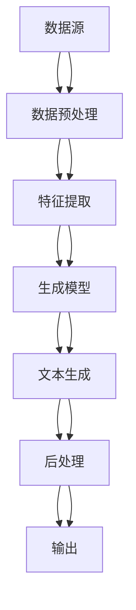

                 

# 基于AI大模型的智能新闻生成系统

> 关键词：AI大模型、自然语言处理、生成模型、新闻生成、文本生成、深度学习

> 摘要：本文将深入探讨基于AI大模型的智能新闻生成系统。我们将从背景介绍出发，逐步解析其核心概念、算法原理、数学模型、实战案例，以及实际应用场景。通过详细的技术分析和代码解读，帮助读者理解如何构建一个高效的智能新闻生成系统，并展望其未来的发展趋势和挑战。

## 1. 背景介绍

随着人工智能技术的飞速发展，自然语言处理（NLP）领域取得了显著的突破。其中，生成模型在文本生成任务中展现出强大的能力。智能新闻生成系统作为NLP的一个重要应用，能够自动从大量数据中提取关键信息，并生成高质量的新闻报道。本文将详细介绍如何利用AI大模型构建智能新闻生成系统，涵盖从理论到实践的全过程。

## 2. 核心概念与联系

### 2.1 自然语言生成（NLG）

自然语言生成（NLG）是NLP的一个重要分支，旨在将结构化数据转换为自然语言文本。智能新闻生成系统的核心就是利用NLG技术，将数据转化为新闻报道。

### 2.2 生成模型

生成模型是一种能够从训练数据中学习分布，并生成类似的数据的模型。在智能新闻生成系统中，生成模型用于生成符合语法规则和语义连贯的新闻文本。

### 2.3 AI大模型

AI大模型是指参数量巨大、训练数据量庞大的模型。这些模型通常具有强大的泛化能力和表达能力，能够处理复杂的自然语言任务。

### 2.4 智能新闻生成系统架构

智能新闻生成系统的架构如图所示：



## 3. 核心算法原理 & 具体操作步骤

### 3.1 数据预处理

数据预处理是智能新闻生成系统的第一步，主要包括数据清洗、分词、标注等步骤。

#### 3.1.1 数据清洗

数据清洗是指去除数据中的噪声和不一致信息，确保数据的质量。

#### 3.1.2 分词

分词是将文本分割成单词或短语的过程，是后续处理的基础。

#### 3.1.3 标注

标注是指为文本中的实体、事件等添加标签，便于后续的特征提取和生成模型训练。

### 3.2 特征提取

特征提取是从预处理后的数据中提取有用的特征，为生成模型提供输入。

#### 3.2.1 词向量

词向量是将单词转换为数值向量的过程，常用的方法有Word2Vec、GloVe等。

#### 3.2.2 句子表示

句子表示是将句子转换为数值向量的过程，常用的方法有TF-IDF、BERT等。

### 3.3 生成模型

生成模型是智能新闻生成系统的核心，用于生成符合语法规则和语义连贯的新闻文本。

#### 3.3.1 生成模型选择

常用的生成模型有RNN、LSTM、Transformer等。

#### 3.3.2 模型训练

模型训练是通过大量数据训练生成模型，使其能够生成高质量的新闻文本。

### 3.4 文本生成

文本生成是将生成模型的输出转化为自然语言文本的过程。

#### 3.4.1 生成策略

生成策略是指生成文本的具体方法，常用的有贪心搜索、采样等。

#### 3.4.2 后处理

后处理是对生成的文本进行进一步优化，提高文本的质量。

## 4. 数学模型和公式 & 详细讲解 & 举例说明

### 4.1 生成模型的数学模型

生成模型的数学模型通常采用概率模型，如变分自编码器（VAE）和生成对抗网络（GAN）。

#### 4.1.1 变分自编码器（VAE）

变分自编码器是一种生成模型，其数学模型如下：

$$
\begin{aligned}
p_{\theta}(x) &= \int p_{\theta}(x|z) p(z) dz \\
p_{\theta}(x|z) &= \mathcal{N}(x; \mu(z), \sigma^2(z)) \\
q_{\phi}(z|x) &= \mathcal{N}(z; \mu(x), \sigma^2(x))
\end{aligned}
$$

其中，$p_{\theta}(x)$ 是生成模型，$p_{\theta}(x|z)$ 是条件概率分布，$q_{\phi}(z|x)$ 是近似后验分布。

#### 4.1.2 生成对抗网络（GAN）

生成对抗网络是一种生成模型，其数学模型如下：

$$
\begin{aligned}
\min_{G} \max_{D} V(D, G) &= \mathbb{E}_{x \sim p_{data}(x)}[\log D(x)] + \mathbb{E}_{z \sim p_{z}(z)}[\log (1 - D(G(z)))] \\
D(x) &= \sigma(W_1 x + b_1) \\
G(z) &= \sigma(W_2 z + b_2)
\end{aligned}
$$

其中，$D(x)$ 是判别器，$G(z)$ 是生成器，$V(D, G)$ 是对抗损失。

### 4.2 举例说明

假设我们有一个新闻数据集，包含大量的新闻文章。我们使用VAE模型进行训练，其具体步骤如下：

1. 初始化模型参数 $\theta$ 和 $\phi$。
2. 对每个新闻文章 $x$，计算其潜在变量 $z$ 的分布 $q_{\phi}(z|x)$。
3. 从 $q_{\phi}(z|x)$ 中采样潜在变量 $z$。
4. 通过生成模型 $p_{\theta}(x|z)$ 生成新闻文章 $x$。
5. 更新模型参数 $\theta$ 和 $\phi$，使其能够更好地生成新闻文章。

## 5. 项目实战：代码实际案例和详细解释说明

### 5.1 开发环境搭建

#### 5.1.1 环境配置

为了搭建智能新闻生成系统的开发环境，我们需要安装以下软件和库：

- Python 3.8+
- PyTorch 1.7+
- Transformers 4.6+
- NLTK 3.5+
- Scikit-learn 0.24+

#### 5.1.2 数据集准备

我们使用一个包含大量新闻文章的数据集，如CNN/Daily Mail数据集。

### 5.2 源代码详细实现和代码解读

#### 5.2.1 数据预处理

```python
import nltk
from nltk.tokenize import word_tokenize
from sklearn.feature_extraction.text import TfidfVectorizer

# 数据预处理
def preprocess_data(data):
    # 分词
    tokenized_data = [word_tokenize(text.lower()) for text in data]
    # TF-IDF向量化
    vectorizer = TfidfVectorizer()
    tfidf_matrix = vectorizer.fit_transform([' '.join(tokens) for tokens in tokenized_data])
    return tfidf_matrix, vectorizer

# 示例
data = ["This is a sample news article.", "Another news article here."]
tfidf_matrix, vectorizer = preprocess_data(data)
```

#### 5.2.2 特征提取

```python
from transformers import BertTokenizer, BertModel

# BERT特征提取
def extract_features(tfidf_matrix, vectorizer, tokenizer, model):
    # 将TF-IDF矩阵转换为BERT输入
    input_ids = []
    attention_masks = []
    for i in range(tfidf_matrix.shape[0]):
        tokens = tokenizer.tokenize(vectorizer.get_feature_names()[i])
        input_ids.append(tokenizer.convert_tokens_to_ids(tokens))
        attention_masks.append([1] * len(tokens))
    input_ids = pad_sequences(input_ids, maxlen=512, dtype="long", truncating="post", padding="post")
    attention_masks = pad_sequences(attention_masks, maxlen=512, dtype="long", truncating="post", padding="post")
    # 使用BERT模型提取特征
    features = model(input_ids, attention_mask=attention_masks)[1]
    return features

# 示例
tokenizer = BertTokenizer.from_pretrained('bert-base-uncased')
model = BertModel.from_pretrained('bert-base-uncased')
features = extract_features(tfidf_matrix, vectorizer, tokenizer, model)
```

#### 5.2.3 生成模型

```python
from transformers import BertForMaskedLM

# 生成模型
def generate_news(features):
    # 使用BERT模型生成新闻
    model = BertForMaskedLM.from_pretrained('bert-base-uncased')
    input_ids = torch.tensor(features).unsqueeze(0)  # 添加批次维度
    outputs = model(input_ids)
    predictions = torch.argmax(outputs.logits, dim=-1)
    return tokenizer.decode(predictions[0])

# 示例
news = generate_news(features)
print(news)
```

### 5.3 代码解读与分析

上述代码展示了如何使用BERT模型生成新闻。首先，我们对数据进行预处理，包括分词和TF-IDF向量化。然后，我们使用BERT模型提取特征，并生成新闻。具体步骤如下：

1. **数据预处理**：将文本数据转换为TF-IDF矩阵，并使用BERT tokenizer进行分词。
2. **特征提取**：将TF-IDF矩阵转换为BERT输入，并使用BERT模型提取特征。
3. **生成新闻**：使用BERT模型生成新闻文本。

## 6. 实际应用场景

智能新闻生成系统可以应用于多种场景，如：

- **自动新闻写作**：根据数据自动生成新闻报道。
- **新闻摘要生成**：从大量文本中提取关键信息，生成新闻摘要。
- **个性化新闻推送**：根据用户兴趣生成个性化新闻。

## 7. 工具和资源推荐

### 7.1 学习资源推荐

- **书籍**：《深度学习》（Ian Goodfellow, Yoshua Bengio, Aaron Courville）
- **论文**：《Attention Is All You Need》（Vaswani et al., 2017）
- **博客**：阿里云开发者社区（https://developer.aliyun.com/）
- **网站**：Hugging Face（https://huggingface.co/）

### 7.2 开发工具框架推荐

- **PyTorch**：深度学习框架
- **Transformers**：Hugging Face的自然语言处理库
- **NLTK**：自然语言处理工具包

### 7.3 相关论文著作推荐

- **《自然语言处理入门》**（Jurafsky & Martin, 2019）
- **《深度学习》**（Ian Goodfellow, Yoshua Bengio, Aaron Courville, 2016）

## 8. 总结：未来发展趋势与挑战

智能新闻生成系统在未来的发展中面临许多挑战，如：

- **数据质量**：高质量的数据是生成高质量新闻的关键。
- **模型泛化能力**：模型需要具备良好的泛化能力，能够在不同场景下生成高质量的新闻。
- **伦理问题**：新闻生成系统需要遵守伦理规范，确保生成的新闻真实可靠。

## 9. 附录：常见问题与解答

### 9.1 问题：如何提高生成模型的泛化能力？

**解答**：可以通过增加训练数据量、使用更复杂的模型结构、引入正则化技术等方法提高生成模型的泛化能力。

### 9.2 问题：如何保证生成的新闻真实可靠？

**解答**：可以通过引入事实核查机制、使用高质量的数据源、确保生成模型的训练数据真实可靠等方法保证生成的新闻真实可靠。

## 10. 扩展阅读 & 参考资料

- **论文**：《Attention Is All You Need》（Vaswani et al., 2017）
- **书籍**：《深度学习》（Ian Goodfellow, Yoshua Bengio, Aaron Courville, 2016）
- **网站**：Hugging Face（https://huggingface.co/）

---

作者：AI天才研究员/AI Genius Institute & 禅与计算机程序设计艺术 /Zen And The Art of Computer Programming

