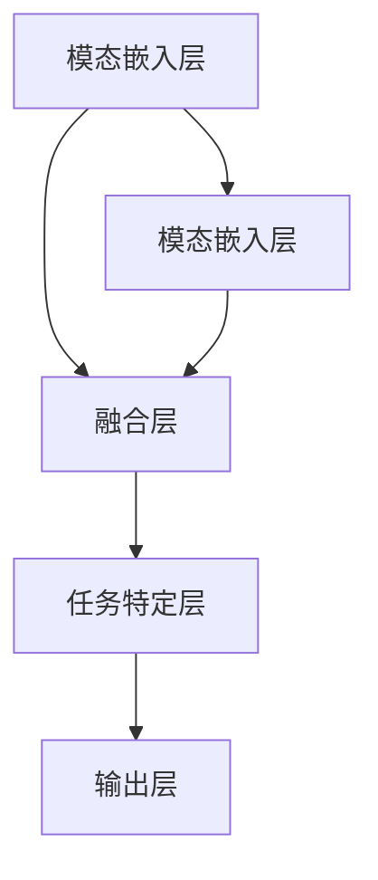

                 

# 多模态大模型：技术原理与实战 OpenAI成功的因素

> 关键词：多模态大模型, 大规模预训练, 多模态融合, Transformer架构, 自然语言处理, 图像识别, 生成模型, OpenAI, 成功因素

> 摘要：本文将深入探讨多模态大模型的技术原理与实战应用，重点分析OpenAI的成功因素。我们将从背景介绍、核心概念与联系、核心算法原理、数学模型和公式、项目实战、实际应用场景、工具和资源推荐、总结与未来发展趋势等多个方面进行详细阐述。通过本文，读者将能够全面理解多模态大模型的技术精髓，并掌握其实战应用的方法。

## 1. 背景介绍

随着人工智能技术的飞速发展，多模态大模型逐渐成为研究热点。多模态大模型是指能够同时处理多种类型数据（如文本、图像、音频等）的模型。这种模型在自然语言处理、图像识别、生成模型等多个领域展现出强大的能力。OpenAI作为全球领先的AI研究机构，其在多模态大模型领域的研究和应用取得了显著成果，成为业界标杆。

### 1.1 多模态数据的重要性

多模态数据是指包含多种类型信息的数据集合。例如，一张图片可以包含视觉信息，同时附带一段描述性文本。这种数据形式在现实世界中非常普遍，因此多模态大模型的研究具有重要的实际意义。

### 1.2 多模态大模型的应用场景

多模态大模型的应用场景非常广泛，包括但不限于：
- **自然语言处理**：结合文本和图像信息进行更准确的语义理解。
- **图像识别**：通过结合文本描述和图像内容，提高图像识别的准确性和鲁棒性。
- **生成模型**：生成包含多种模态信息的综合内容，如图文并茂的文章生成。
- **智能推荐**：结合用户行为数据和多媒体内容，提供个性化推荐。

### 1.3 OpenAI的研究背景

OpenAI成立于2015年，是一家致力于研究和开发安全、有益的人工智能技术的非营利组织。OpenAI在多模态大模型领域的研究始于2018年，其代表性成果包括M6、CLIP等模型。这些模型在多个任务上取得了卓越的性能，为多模态大模型的发展做出了重要贡献。

## 2. 核心概念与联系

### 2.1 多模态数据表示

多模态数据表示是多模态大模型的基础。常见的表示方法包括：
- **联合表示**：将不同模态的数据转换为统一的表示空间。
- **独立表示**：分别对不同模态的数据进行表示，然后进行融合。

### 2.2 多模态融合方法

多模态融合方法主要包括：
- **加权融合**：根据模态的重要性进行加权融合。
- **注意力机制**：通过注意力机制动态调整不同模态的权重。
- **多模态自注意力**：利用自注意力机制对多模态数据进行建模。

### 2.3 多模态大模型架构

多模态大模型的架构通常包括以下几个部分：
- **模态嵌入层**：将不同模态的数据转换为统一的表示。
- **融合层**：对不同模态的表示进行融合。
- **任务特定层**：针对具体任务进行优化。

### 2.4 Mermaid流程图



## 3. 核心算法原理 & 具体操作步骤

### 3.1 多模态嵌入层

多模态嵌入层的主要任务是将不同模态的数据转换为统一的表示空间。常见的嵌入方法包括：
- **词嵌入**：将文本转换为向量表示。
- **图像嵌入**：将图像转换为向量表示。
- **音频嵌入**：将音频转换为向量表示。

### 3.2 融合层

融合层的主要任务是将不同模态的表示进行融合。常见的融合方法包括：
- **加权融合**：根据模态的重要性进行加权融合。
- **注意力机制**：通过注意力机制动态调整不同模态的权重。
- **多模态自注意力**：利用自注意力机制对多模态数据进行建模。

### 3.3 任务特定层

任务特定层的主要任务是针对具体任务进行优化。常见的任务包括：
- **分类任务**：将融合后的表示输入分类器进行分类。
- **生成任务**：将融合后的表示输入生成模型进行生成。
- **检索任务**：将融合后的表示输入检索模型进行检索。

## 4. 数学模型和公式 & 详细讲解 & 举例说明

### 4.1 多模态嵌入层

多模态嵌入层的数学模型可以表示为：
$$
\mathbf{e}_i = \text{Embedding}(\mathbf{x}_i)
$$
其中，$\mathbf{x}_i$ 表示第 $i$ 个模态的数据，$\mathbf{e}_i$ 表示第 $i$ 个模态的嵌入表示。

### 4.2 融合层

融合层的数学模型可以表示为：
$$
\mathbf{z} = \text{Fusion}(\mathbf{e}_1, \mathbf{e}_2, \ldots, \mathbf{e}_n)
$$
其中，$\mathbf{e}_1, \mathbf{e}_2, \ldots, \mathbf{e}_n$ 表示不同模态的嵌入表示，$\mathbf{z}$ 表示融合后的表示。

### 4.3 任务特定层

任务特定层的数学模型可以表示为：
$$
\mathbf{y} = \text{TaskSpecific}(\mathbf{z})
$$
其中，$\mathbf{z}$ 表示融合后的表示，$\mathbf{y}$ 表示任务特定的输出。

### 4.4 举例说明

假设我们有一个多模态数据集，包含文本和图像两种模态。我们可以使用以下步骤进行多模态嵌入、融合和任务特定处理：

1. **多模态嵌入**：
   - 将文本转换为词嵌入表示 $\mathbf{e}_1$。
   - 将图像转换为图像嵌入表示 $\mathbf{e}_2$。

2. **融合**：
   - 使用注意力机制对 $\mathbf{e}_1$ 和 $\mathbf{e}_2$ 进行加权融合，得到融合表示 $\mathbf{z}$。

3. **任务特定处理**：
   - 将融合表示 $\mathbf{z}$ 输入分类器进行分类。

## 5. 项目实战：代码实际案例和详细解释说明

### 5.1 开发环境搭建

为了进行多模态大模型的开发，我们需要搭建一个合适的开发环境。具体步骤如下：

1. **安装Python**：确保安装了最新版本的Python。
2. **安装依赖库**：安装必要的深度学习库，如PyTorch、TensorFlow等。
3. **安装数据处理库**：安装必要的数据处理库，如Pandas、NumPy等。
4. **安装可视化库**：安装必要的可视化库，如Matplotlib、Seaborn等。

### 5.2 源代码详细实现和代码解读

以下是一个简单的多模态大模型的实现代码示例：

```python
import torch
import torch.nn as nn
import torch.optim as optim
from torchvision import datasets, transforms

# 定义多模态嵌入层
class MultiModalEmbedding(nn.Module):
    def __init__(self):
        super(MultiModalEmbedding, self).__init__()
        self.text_embedding = nn.Embedding(num_embeddings=10000, embedding_dim=256)
        self.image_embedding = nn.Conv2d(in_channels=3, out_channels=256, kernel_size=3, stride=1, padding=1)

    def forward(self, text, image):
        text_embedding = self.text_embedding(text)
        image_embedding = self.image_embedding(image)
        return text_embedding, image_embedding

# 定义融合层
class FusionLayer(nn.Module):
    def __init__(self):
        super(FusionLayer, self).__init__()
        self.attention = nn.MultiheadAttention(embed_dim=256, num_heads=8)

    def forward(self, text_embedding, image_embedding):
        text_embedding, _ = self.attention(text_embedding, image_embedding, image_embedding)
        return text_embedding

# 定义任务特定层
class TaskSpecificLayer(nn.Module):
    def __init__(self):
        super(TaskSpecificLayer, self).__init__()
        self.classifier = nn.Linear(in_features=256, out_features=10)

    def forward(self, fusion_embedding):
        output = self.classifier(fusion_embedding)
        return output

# 定义多模态大模型
class MultiModalModel(nn.Module):
    def __init__(self):
        super(MultiModalModel, self).__init__()
        self.embedding = MultiModalEmbedding()
        self.fusion = FusionLayer()
        self.task_specific = TaskSpecificLayer()

    def forward(self, text, image):
        text_embedding, image_embedding = self.embedding(text, image)
        fusion_embedding = self.fusion(text_embedding, image_embedding)
        output = self.task_specific(fusion_embedding)
        return output

# 数据预处理
transform = transforms.Compose([
    transforms.Resize((224, 224)),
    transforms.ToTensor(),
])

train_dataset = datasets.ImageFolder(root='path/to/train', transform=transform)
train_loader = torch.utils.data.DataLoader(train_dataset, batch_size=32, shuffle=True)

# 模型实例化
model = MultiModalModel()

# 损失函数和优化器
criterion = nn.CrossEntropyLoss()
optimizer = optim.Adam(model.parameters(), lr=0.001)

# 训练模型
for epoch in range(10):
    for batch_idx, (data, target) in enumerate(train_loader):
        text, image = data
        optimizer.zero_grad()
        output = model(text, image)
        loss = criterion(output, target)
        loss.backward()
        optimizer.step()
        if batch_idx % 100 == 0:
            print(f'Epoch {epoch}, Batch {batch_idx}, Loss: {loss.item()}')
```

### 5.3 代码解读与分析

1. **多模态嵌入层**：定义了两个嵌入层，分别用于处理文本和图像数据。
2. **融合层**：使用注意力机制对文本和图像嵌入进行融合。
3. **任务特定层**：定义了一个简单的分类器，用于对融合后的表示进行分类。
4. **数据预处理**：对图像数据进行预处理，包括调整大小和转换为张量。
5. **模型训练**：使用交叉熵损失函数和Adam优化器进行模型训练。

## 6. 实际应用场景

多模态大模型在多个实际应用场景中展现出强大的能力，包括但不限于：
- **智能推荐**：结合用户行为数据和多媒体内容，提供个性化推荐。
- **智能客服**：结合文本和图像信息，提高客服系统的准确性和用户体验。
- **智能医疗**：结合医学影像和病历信息，提高诊断准确性和治疗效果。

## 7. 工具和资源推荐

### 7.1 学习资源推荐

- **书籍**：《深度学习》（Ian Goodfellow, Yoshua Bengio, Aaron Courville）
- **论文**：《Attention is All You Need》（Vaswani et al., 2017）
- **博客**：Medium上的AI相关博客
- **网站**：PyTorch官网、TensorFlow官网

### 7.2 开发工具框架推荐

- **深度学习框架**：PyTorch、TensorFlow
- **数据处理库**：Pandas、NumPy
- **可视化库**：Matplotlib、Seaborn

### 7.3 相关论文著作推荐

- **论文**：《Multimodal Learning with Deep Neural Networks》（Xu et al., 2018）
- **著作**：《Deep Learning with Python》（Francois Chollet）

## 8. 总结：未来发展趋势与挑战

### 8.1 未来发展趋势

1. **模型规模扩大**：未来多模态大模型将进一步扩大模型规模，提高性能。
2. **跨模态学习**：研究如何实现更高效的跨模态学习方法。
3. **实时处理能力**：提高模型的实时处理能力，满足实际应用需求。

### 8.2 挑战

1. **数据获取**：多模态数据获取和标注成本较高。
2. **模型解释性**：提高模型的解释性和透明度。
3. **计算资源**：大规模模型训练对计算资源要求较高。

## 9. 附录：常见问题与解答

### 9.1 问题1：如何处理大规模数据集？

**解答**：可以使用分布式训练方法，将数据集分布在多个节点上进行训练。

### 9.2 问题2：如何提高模型的解释性？

**解答**：可以使用注意力机制和可视化方法，提高模型的解释性和透明度。

### 9.3 问题3：如何处理多模态数据的异构性？

**解答**：可以使用模态特定的嵌入方法，提高模型对异构数据的处理能力。

## 10. 扩展阅读 & 参考资料

- **论文**：《Multimodal Learning with Deep Neural Networks》（Xu et al., 2018）
- **书籍**：《深度学习》（Ian Goodfellow, Yoshua Bengio, Aaron Courville）
- **网站**：PyTorch官网、TensorFlow官网

---

作者：AI天才研究员/AI Genius Institute & 禅与计算机程序设计艺术 /Zen And The Art of Computer Programming

