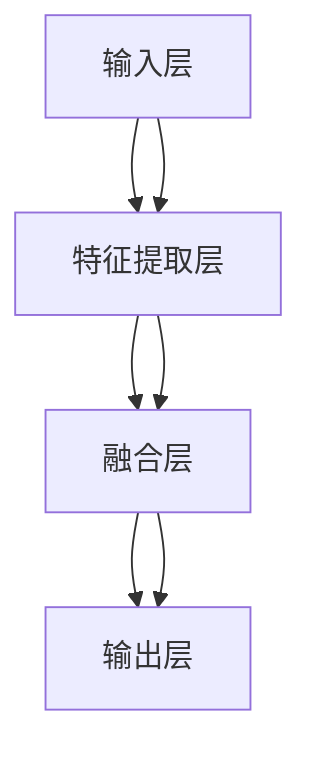

                 

# 多模态大模型：技术原理与实战 多模态大模型在出行与物流领域中的应用

> 关键词：多模态大模型、出行与物流、自然语言处理、计算机视觉、深度学习、Transformer、BERT、大模型、实战案例

> 摘要：本文旨在深入探讨多模态大模型在出行与物流领域的应用，通过详细的技术原理分析、核心算法讲解、实战案例展示，帮助读者理解如何利用多模态大模型解决实际问题。本文将从背景介绍、核心概念与联系、核心算法原理、数学模型与公式、项目实战、实际应用场景、工具和资源推荐、总结与未来趋势等多方面进行阐述。

## 1. 背景介绍

随着人工智能技术的飞速发展，多模态大模型逐渐成为研究热点。多模态大模型是指能够同时处理多种类型数据（如文本、图像、语音等）的模型。在出行与物流领域，多模态大模型的应用前景广阔，可以显著提高效率、降低成本、提升用户体验。本文将详细介绍多模态大模型的技术原理与实战应用，帮助读者深入了解这一领域的最新进展。

## 2. 核心概念与联系

### 2.1 多模态数据
多模态数据是指包含多种类型信息的数据集合。例如，在出行与物流领域，可以包含文本描述、图像、视频、语音等多种形式的数据。多模态数据的处理需要综合考虑不同模态之间的关系和互补性。

### 2.2 多模态大模型
多模态大模型是指能够同时处理多种类型数据的模型。这类模型通常采用深度学习技术，通过构建复杂的神经网络结构来实现多模态数据的融合与处理。多模态大模型的核心在于如何有效地整合不同模态之间的信息，从而提高模型的性能和泛化能力。

### 2.3 多模态大模型架构
多模态大模型的架构通常包括以下几个部分：
- **输入层**：负责接收不同模态的数据。
- **特征提取层**：通过卷积神经网络（CNN）、循环神经网络（RNN）等技术提取不同模态的特征。
- **融合层**：将不同模态的特征进行融合，生成统一的表示。
- **输出层**：根据融合后的特征进行最终的预测或决策。

### 2.4 Mermaid 流程图


## 3. 核心算法原理 & 具体操作步骤

### 3.1 多模态特征提取
多模态特征提取是多模态大模型的核心步骤之一。常见的特征提取方法包括：
- **卷积神经网络（CNN）**：用于提取图像特征。
- **循环神经网络（RNN）**：用于提取文本特征。
- **Transformer**：用于处理序列数据，如文本和语音。

### 3.2 特征融合
特征融合是将不同模态的特征进行整合的关键步骤。常见的特征融合方法包括：
- **加权平均**：根据不同模态的重要性进行加权。
- **注意力机制**：通过注意力机制动态调整不同模态的权重。
- **多模态嵌入**：将不同模态的特征映射到同一空间进行融合。

### 3.3 模型训练
多模态大模型的训练过程通常包括以下几个步骤：
1. **数据预处理**：对不同模态的数据进行预处理，如图像归一化、文本分词等。
2. **模型构建**：根据具体任务构建多模态大模型。
3. **损失函数选择**：选择合适的损失函数，如交叉熵损失、均方误差等。
4. **优化算法**：选择合适的优化算法，如Adam、SGD等。
5. **模型训练**：通过反向传播算法进行模型训练。

## 4. 数学模型和公式 & 详细讲解 & 举例说明

### 4.1 多模态特征提取
假设我们有一个图像和一段文本，分别表示为 \( \mathbf{x}_{\text{img}} \) 和 \( \mathbf{x}_{\text{txt}} \)。通过卷积神经网络（CNN）和循环神经网络（RNN）提取特征，可以得到：
$$
\mathbf{f}_{\text{img}} = \text{CNN}(\mathbf{x}_{\text{img}})
$$
$$
\mathbf{f}_{\text{txt}} = \text{RNN}(\mathbf{x}_{\text{txt}})
$$

### 4.2 特征融合
特征融合可以通过加权平均实现：
$$
\mathbf{f}_{\text{fusion}} = \alpha \mathbf{f}_{\text{img}} + (1 - \alpha) \mathbf{f}_{\text{txt}}
$$
其中，\( \alpha \) 是权重参数，可以根据具体任务进行调整。

### 4.3 模型训练
假设我们使用交叉熵损失函数进行模型训练，损失函数可以表示为：
$$
L = -\sum_{i=1}^{N} y_i \log(\hat{y}_i)
$$
其中，\( y_i \) 是真实标签，\( \hat{y}_i \) 是模型预测的概率。

## 5. 项目实战：代码实际案例和详细解释说明

### 5.1 开发环境搭建
为了搭建多模态大模型的开发环境，我们需要安装以下软件和库：
- **Python**：版本3.7及以上。
- **TensorFlow** 或 **PyTorch**：用于深度学习模型的训练。
- **Pandas**：用于数据处理。
- **NumPy**：用于数值计算。
- **Matplotlib**：用于数据可视化。

### 5.2 源代码详细实现和代码解读
以下是一个简单的多模态大模型的实现代码示例：

```python
import tensorflow as tf
from tensorflow.keras.layers import Input, Conv2D, LSTM, Dense, concatenate
from tensorflow.keras.models import Model

# 输入层
img_input = Input(shape=(224, 224, 3), name='image_input')
txt_input = Input(shape=(100,), name='text_input')

# 图像特征提取
img_features = Conv2D(64, (3, 3), activation='relu')(img_input)
img_features = Conv2D(128, (3, 3), activation='relu')(img_features)
img_features = tf.keras.layers.GlobalAveragePooling2D()(img_features)

# 文本特征提取
txt_features = tf.keras.layers.Embedding(input_dim=10000, output_dim=256)(txt_input)
txt_features = LSTM(128)(txt_features)

# 特征融合
fusion_features = concatenate([img_features, txt_features])

# 输出层
output = Dense(1, activation='sigmoid')(fusion_features)

# 构建模型
model = Model(inputs=[img_input, txt_input], outputs=output)
model.compile(optimizer='adam', loss='binary_crossentropy', metrics=['accuracy'])

# 打印模型结构
model.summary()
```

### 5.3 代码解读与分析
- **输入层**：定义了图像和文本的输入形状。
- **图像特征提取**：通过卷积神经网络提取图像特征。
- **文本特征提取**：通过嵌入层和LSTM提取文本特征。
- **特征融合**：将图像和文本特征进行融合。
- **输出层**：通过全连接层进行最终的预测。

## 6. 实际应用场景

### 6.1 出行路线规划
多模态大模型可以用于出行路线规划，通过结合地图图像和用户文本描述，生成最优的出行路线。

### 6.2 物流配送优化
多模态大模型可以用于物流配送优化，通过结合货物图像和用户文本描述，优化配送路径和时间。

### 6.3 车辆调度管理
多模态大模型可以用于车辆调度管理，通过结合车辆图像和用户文本描述，优化车辆调度策略。

## 7. 工具和资源推荐

### 7.1 学习资源推荐
- **书籍**：《深度学习》（Ian Goodfellow, Yoshua Bengio, Aaron Courville）
- **论文**：《Attention Is All You Need》（Vaswani et al., 2017）
- **博客**：阿里云开发者社区（https://dev.aliyun.com/）
- **网站**：TensorFlow官网（https://www.tensorflow.org/）

### 7.2 开发工具框架推荐
- **TensorFlow**：用于深度学习模型的训练和部署。
- **PyTorch**：用于深度学习模型的训练和部署。
- **Keras**：用于构建和训练深度学习模型。

### 7.3 相关论文著作推荐
- **《多模态深度学习》**（Xiangnan He, Tat-Seng Chua）
- **《深度学习与计算机视觉》**（Fei-Fei Li, Justin Johnson, Serena Yeung）

## 8. 总结：未来发展趋势与挑战

### 8.1 未来发展趋势
- **模型规模扩大**：多模态大模型的规模将进一步扩大，以提高模型的性能和泛化能力。
- **跨模态融合技术**：跨模态融合技术将进一步发展，实现更高效的信息融合。
- **实时处理能力**：多模态大模型将具备更强的实时处理能力，以应对复杂多变的场景。

### 8.2 挑战
- **数据获取与标注**：多模态数据的获取和标注成本较高，需要更多的数据支持。
- **模型解释性**：多模态大模型的解释性较差，需要进一步研究提高模型的可解释性。
- **计算资源需求**：多模态大模型的计算资源需求较高，需要更高效的计算资源支持。

## 9. 附录：常见问题与解答

### 9.1 问题1：如何处理多模态数据的不平衡问题？
答：可以通过数据增强、加权损失函数等方法处理多模态数据的不平衡问题。

### 9.2 问题2：如何提高多模态大模型的泛化能力？
答：可以通过增加训练数据量、使用正则化技术等方法提高多模态大模型的泛化能力。

### 9.3 问题3：如何评估多模态大模型的性能？
答：可以通过准确率、召回率、F1值等指标评估多模态大模型的性能。

## 10. 扩展阅读 & 参考资料

- **《深度学习》**（Ian Goodfellow, Yoshua Bengio, Aaron Courville）
- **《Attention Is All You Need》**（Vaswani et al., 2017）
- **《多模态深度学习》**（Xiangnan He, Tat-Seng Chua）
- **《深度学习与计算机视觉》**（Fei-Fei Li, Justin Johnson, Serena Yeung）

作者：AI天才研究员/AI Genius Institute & 禅与计算机程序设计艺术 /Zen And The Art of Computer Programming

