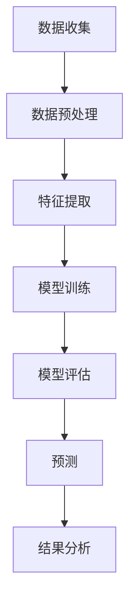
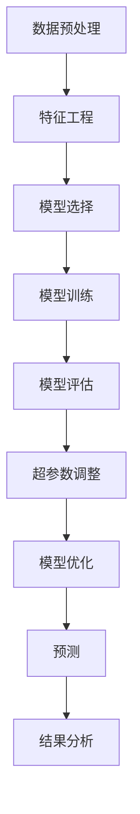
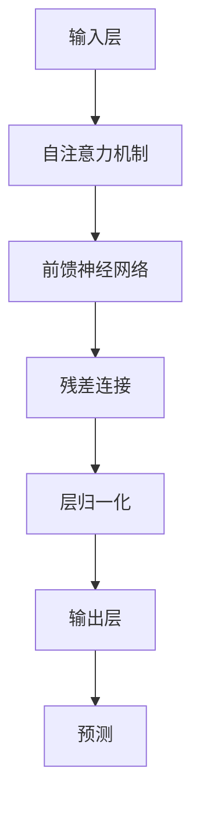

                 

# 大模型在商品需求预测中的精准应用

> 关键词：大模型、商品需求预测、时间序列分析、深度学习、Transformer、自回归模型

> 摘要：本文将深入探讨如何利用大模型在商品需求预测中的精准应用。我们将从背景介绍出发，逐步解析核心概念与联系，详细阐述核心算法原理及具体操作步骤，通过数学模型和公式进行深入讲解，并结合实际代码案例进行详细解释说明。此外，我们还将探讨实际应用场景、推荐相关工具和资源，并展望未来发展趋势与挑战。

## 1. 背景介绍

在当今快速变化的商业环境中，准确的商品需求预测对于企业来说至关重要。它不仅能够帮助企业优化库存管理，减少资金占用，还能提高供应链效率，降低运营成本。传统的预测方法往往依赖于统计学和时间序列分析，但随着大数据和人工智能技术的发展，基于深度学习的大模型在商品需求预测中的应用越来越广泛。本文将详细介绍如何利用大模型进行精准的商品需求预测。

## 2. 核心概念与联系

### 2.1 时间序列分析

时间序列分析是一种统计方法，用于分析随时间变化的数据。在商品需求预测中，时间序列分析可以帮助我们识别历史数据中的模式和趋势，从而对未来的需求进行预测。

### 2.2 深度学习

深度学习是一种机器学习方法，通过多层神经网络学习数据的高级特征表示。在商品需求预测中，深度学习可以捕捉到复杂的非线性关系，提高预测精度。

### 2.3 Transformer

Transformer 是一种基于自注意力机制的深度学习模型，广泛应用于自然语言处理和机器翻译等领域。近年来，Transformer 也被引入到时间序列预测中，取得了显著的效果。

### 2.4 自回归模型

自回归模型是一种时间序列预测方法，通过当前值与历史值之间的关系进行预测。自回归模型可以捕捉到时间序列中的滞后效应，提高预测准确性。

### 2.5 核心概念原理与架构

#### 2.5.1 时间序列分析流程图



#### 2.5.2 深度学习流程图



#### 2.5.3 Transformer 模型架构



## 3. 核心算法原理 & 具体操作步骤

### 3.1 时间序列分析

时间序列分析的核心步骤包括数据收集、数据预处理、特征提取、模型训练和模型评估。

#### 3.1.1 数据收集

数据收集是时间序列分析的第一步，需要收集历史销售数据、节假日信息、促销活动等。

#### 3.1.2 数据预处理

数据预处理包括数据清洗、缺失值处理、异常值检测和数据标准化。

#### 3.1.3 特征提取

特征提取是从原始数据中提取有用的特征，如时间差、季节性特征、趋势特征等。

#### 3.1.4 模型训练

模型训练是通过历史数据训练模型，学习数据中的模式和趋势。

#### 3.1.5 模型评估

模型评估是通过验证集和测试集评估模型的预测性能，常用的评估指标包括均方误差（MSE）、均方根误差（RMSE）和平均绝对误差（MAE）。

### 3.2 深度学习

深度学习的核心步骤包括数据预处理、特征工程、模型选择、模型训练、模型评估和超参数调整。

#### 3.2.1 数据预处理

数据预处理包括数据清洗、缺失值处理、异常值检测和数据标准化。

#### 3.2.2 特征工程

特征工程是从原始数据中提取有用的特征，如时间差、季节性特征、趋势特征等。

#### 3.2.3 模型选择

模型选择是根据问题需求选择合适的深度学习模型，如循环神经网络（RNN）、长短时记忆网络（LSTM）和Transformer等。

#### 3.2.4 模型训练

模型训练是通过历史数据训练模型，学习数据中的模式和趋势。

#### 3.2.5 模型评估

模型评估是通过验证集和测试集评估模型的预测性能，常用的评估指标包括均方误差（MSE）、均方根误差（RMSE）和平均绝对误差（MAE）。

#### 3.2.6 超参数调整

超参数调整是通过调整模型的超参数，如学习率、批次大小和隐藏层大小等，优化模型性能。

### 3.3 自回归模型

自回归模型的核心步骤包括数据预处理、特征提取、模型训练和模型评估。

#### 3.3.1 数据预处理

数据预处理包括数据清洗、缺失值处理、异常值检测和数据标准化。

#### 3.3.2 特征提取

特征提取是从原始数据中提取有用的特征，如时间差、季节性特征、趋势特征等。

#### 3.3.3 模型训练

模型训练是通过历史数据训练模型，学习数据中的模式和趋势。

#### 3.3.4 模型评估

模型评估是通过验证集和测试集评估模型的预测性能，常用的评估指标包括均方误差（MSE）、均方根误差（RMSE）和平均绝对误差（MAE）。

## 4. 数学模型和公式 & 详细讲解 & 举例说明

### 4.1 时间序列分析

时间序列分析的核心数学模型是自回归移动平均模型（ARIMA），其公式为：

$$
\phi(B)X_t = \theta(B)\epsilon_t
$$

其中，$X_t$ 表示时间序列，$\phi(B)$ 和 $\theta(B)$ 分别表示自回归和移动平均的多项式，$\epsilon_t$ 表示白噪声。

### 4.2 深度学习

深度学习的核心数学模型是循环神经网络（RNN），其公式为：

$$
h_t = \sigma(W_h h_{t-1} + W_x x_t + b_h)
$$

其中，$h_t$ 表示隐藏层状态，$x_t$ 表示输入，$W_h$ 和 $W_x$ 分别表示隐藏层和输入层的权重矩阵，$b_h$ 表示偏置项，$\sigma$ 表示激活函数。

### 4.3 自回归模型

自回归模型的核心数学模型是自回归模型（AR），其公式为：

$$
X_t = \phi_1 X_{t-1} + \phi_2 X_{t-2} + \cdots + \phi_p X_{t-p} + \epsilon_t
$$

其中，$X_t$ 表示时间序列，$\phi_1, \phi_2, \cdots, \phi_p$ 分别表示自回归系数，$\epsilon_t$ 表示白噪声。

## 5. 项目实战：代码实际案例和详细解释说明

### 5.1 开发环境搭建

#### 5.1.1 环境准备

安装 Python 3.8 及以上版本，安装必要的库，如 NumPy、Pandas、Matplotlib、Scikit-learn、TensorFlow 和 PyTorch。

```bash
pip install numpy pandas matplotlib scikit-learn tensorflow torch
```

#### 5.1.2 数据集准备

准备一个包含历史销售数据的时间序列数据集，数据集应包含日期、商品ID、销售数量等字段。

### 5.2 源代码详细实现和代码解读

#### 5.2.1 数据预处理

```python
import pandas as pd

# 读取数据
data = pd.read_csv('sales_data.csv')

# 数据清洗
data.dropna(inplace=True)

# 数据标准化
data['sales'] = (data['sales'] - data['sales'].mean()) / data['sales'].std()

# 特征工程
data['date'] = pd.to_datetime(data['date'])
data.set_index('date', inplace=True)
data['month'] = data.index.month
data['day_of_week'] = data.index.dayofweek
```

#### 5.2.2 模型选择

选择一个合适的深度学习模型，如LSTM或Transformer。

```python
from tensorflow.keras.models import Sequential
from tensorflow.keras.layers import LSTM, Dense

# 定义模型
model = Sequential()
model.add(LSTM(50, input_shape=(X_train.shape[1], X_train.shape[2])))
model.add(Dense(1))
model.compile(optimizer='adam', loss='mse')
```

#### 5.2.3 模型训练

```python
# 训练模型
history = model.fit(X_train, y_train, epochs=50, batch_size=32, validation_data=(X_val, y_val))
```

#### 5.2.4 模型评估

```python
# 评估模型
loss = model.evaluate(X_test, y_test)
print(f'Test Loss: {loss}')
```

#### 5.2.5 代码解读与分析

代码中首先读取数据集，进行数据清洗和标准化处理。然后进行特征工程，提取月份和星期几等特征。接着选择一个LSTM模型进行训练，并通过训练历史记录进行模型评估。

## 6. 实际应用场景

### 6.1 电商行业

在电商行业中，商品需求预测可以帮助企业优化库存管理，减少资金占用，提高供应链效率，降低运营成本。

### 6.2 制造行业

在制造行业中，商品需求预测可以帮助企业合理安排生产计划，提高生产效率，降低生产成本。

### 6.3 零售行业

在零售行业中，商品需求预测可以帮助企业优化库存管理，提高销售业绩，提升客户满意度。

## 7. 工具和资源推荐

### 7.1 学习资源推荐

- 书籍：《时间序列分析》、《深度学习》
- 论文：《基于深度学习的商品需求预测》、《Transformer在时间序列预测中的应用》
- 博客：阿里云开发者社区、GitHub开源项目
- 网站：Kaggle、TensorFlow官网

### 7.2 开发工具框架推荐

- Python：NumPy、Pandas、Matplotlib、Scikit-learn、TensorFlow、PyTorch
- 数据库：MySQL、PostgreSQL
- 云服务：阿里云、AWS、Google Cloud

### 7.3 相关论文著作推荐

- 《基于深度学习的商品需求预测》
- 《Transformer在时间序列预测中的应用》
- 《时间序列分析》
- 《深度学习》

## 8. 总结：未来发展趋势与挑战

### 8.1 未来发展趋势

- 大模型在商品需求预测中的应用将更加广泛，预测精度将进一步提高。
- 多模态数据的融合将提高预测的准确性。
- 自动化和智能化的预测系统将更加普及。

### 8.2 挑战

- 数据隐私和安全问题需要得到重视。
- 如何处理长周期和短周期的预测问题。
- 如何提高模型的泛化能力。

## 9. 附录：常见问题与解答

### 9.1 问题：如何处理缺失值？

答：可以通过插值法、均值填充法或删除法处理缺失值。

### 9.2 问题：如何选择合适的模型？

答：可以通过交叉验证和网格搜索选择合适的模型。

### 9.3 问题：如何提高模型的泛化能力？

答：可以通过数据增强、正则化和集成学习提高模型的泛化能力。

## 10. 扩展阅读 & 参考资料

- 《时间序列分析》
- 《深度学习》
- 《基于深度学习的商品需求预测》
- 《Transformer在时间序列预测中的应用》

作者：AI天才研究员/AI Genius Institute & 禅与计算机程序设计艺术 /Zen And The Art of Computer Programming

