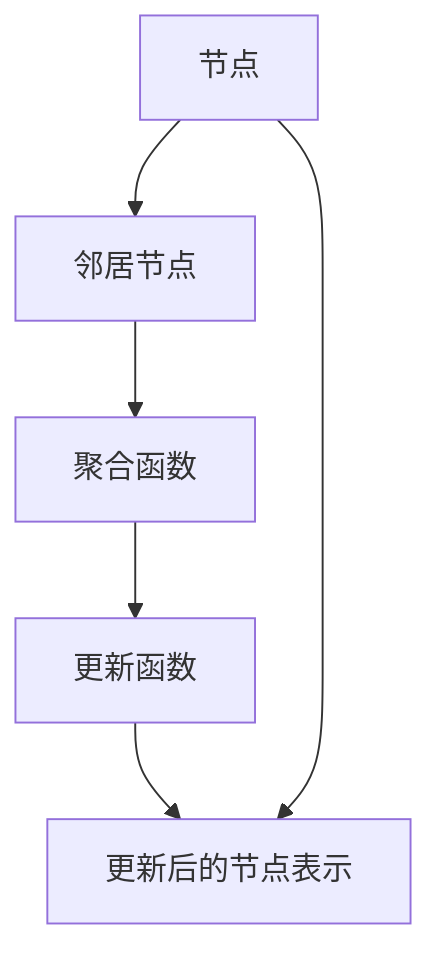

                 

# 大模型在推荐系统中的图神经架构搜索应用

> 关键词：图神经网络, 推荐系统, 架构搜索, 大模型, 机器学习, 深度学习, 人工智能

> 摘要：本文将深入探讨如何利用图神经网络（GNN）在推荐系统中进行架构搜索，以优化推荐系统的性能。我们将从背景介绍开始，逐步解析图神经网络的核心概念与联系，详细阐述核心算法原理及具体操作步骤，通过数学模型和公式进行深入讲解，并结合实际代码案例进行详细解释说明。最后，我们将探讨推荐系统的实际应用场景，提供学习资源和开发工具框架推荐，并展望未来的发展趋势与挑战。

## 1. 背景介绍

推荐系统是现代互联网应用中的重要组成部分，它能够根据用户的历史行为和偏好，为用户提供个性化的推荐内容。随着大数据和深度学习技术的发展，推荐系统逐渐从基于内容的推荐、协同过滤推荐，发展到基于深度学习的推荐系统。然而，传统的推荐系统往往依赖于固定的模型架构，这在面对复杂多变的数据时显得力不从心。因此，如何设计和优化推荐系统的模型架构成为了一个亟待解决的问题。

### 1.1 传统推荐系统概述

传统的推荐系统主要分为基于内容的推荐和协同过滤推荐两大类。

- **基于内容的推荐**：通过分析用户历史行为和偏好，推荐与其相似的内容。这种方法的优点是推荐结果较为精准，但缺点是需要大量的特征工程，且难以处理冷启动问题。
- **协同过滤推荐**：通过分析用户之间的相似性或物品之间的相似性，推荐相似用户或相似物品。这种方法的优点是能够处理冷启动问题，但缺点是推荐结果可能不够精准。

### 1.2 深度学习在推荐系统中的应用

随着深度学习技术的发展，基于深度学习的推荐系统逐渐成为主流。这些系统通常采用神经网络模型，如矩阵分解、深度神经网络（DNN）、卷积神经网络（CNN）等。然而，这些模型往往依赖于固定的架构，难以适应复杂多变的数据。

### 1.3 图神经网络（GNN）的引入

图神经网络（GNN）是一种处理图数据的深度学习模型，能够有效地捕捉节点之间的复杂关系。GNN在推荐系统中的应用具有以下优势：

- **捕捉复杂关系**：GNN能够捕捉节点之间的复杂关系，如用户之间的社交关系、物品之间的关联关系等。
- **自适应架构**：GNN能够自适应地学习模型架构，从而更好地适应复杂多变的数据。
- **提高推荐精度**：通过捕捉节点之间的复杂关系，GNN能够提高推荐系统的推荐精度。

## 2. 核心概念与联系

### 2.1 图神经网络（GNN）概述

图神经网络（GNN）是一种处理图数据的深度学习模型，能够有效地捕捉节点之间的复杂关系。GNN的核心思想是通过迭代地传播节点信息，逐步更新节点的表示，从而学习到节点之间的复杂关系。

### 2.2 图神经网络的核心概念

- **图（Graph）**：图由节点（Node）和边（Edge）组成，节点表示实体，边表示实体之间的关系。
- **节点表示（Node Representation）**：节点表示是节点的特征向量，用于表示节点的特征。
- **消息传递（Message Passing）**：消息传递是GNN的核心操作，通过边传播节点信息，逐步更新节点的表示。
- **聚合函数（Aggregation Function）**：聚合函数用于聚合邻居节点的信息，更新当前节点的表示。
- **更新函数（Update Function）**：更新函数用于更新当前节点的表示，使其更好地反映邻居节点的信息。

### 2.3 图神经网络的Mermaid流程图



## 3. 核心算法原理 & 具体操作步骤

### 3.1 消息传递机制

消息传递是GNN的核心操作，通过边传播节点信息，逐步更新节点的表示。具体操作步骤如下：

1. **初始化节点表示**：将每个节点的初始表示初始化为特征向量。
2. **消息传递**：通过边传播节点信息，逐步更新节点的表示。具体操作如下：
    - **邻居节点选择**：选择当前节点的邻居节点。
    - **消息生成**：生成邻居节点的消息，消息通常为邻居节点的表示。
    - **消息聚合**：聚合邻居节点的消息，得到当前节点的聚合信息。
    - **更新节点表示**：更新当前节点的表示，使其更好地反映邻居节点的信息。
3. **多轮迭代**：通过多轮迭代，逐步更新节点的表示，直到收敛。

### 3.2 聚合函数与更新函数

聚合函数和更新函数是GNN的核心操作，用于聚合邻居节点的信息，更新当前节点的表示。具体操作步骤如下：

1. **聚合函数**：聚合函数用于聚合邻居节点的信息，更新当前节点的表示。常见的聚合函数有：
    - **平均聚合**：将邻居节点的表示进行平均，得到当前节点的聚合信息。
    - **加权平均聚合**：将邻居节点的表示进行加权平均，得到当前节点的聚合信息。
    - **最大聚合**：将邻居节点的表示进行最大值聚合，得到当前节点的聚合信息。
2. **更新函数**：更新函数用于更新当前节点的表示，使其更好地反映邻居节点的信息。常见的更新函数有：
    - **线性更新**：将聚合信息与当前节点的表示进行线性组合，得到更新后的节点表示。
    - **非线性更新**：将聚合信息与当前节点的表示进行非线性组合，得到更新后的节点表示。

### 3.3 GNN的多层结构

GNN的多层结构能够更好地捕捉节点之间的复杂关系，提高推荐系统的推荐精度。具体操作步骤如下：

1. **多层结构设计**：设计GNN的多层结构，每层包含聚合函数和更新函数。
2. **多层迭代**：通过多层迭代，逐步更新节点的表示，直到收敛。

## 4. 数学模型和公式 & 详细讲解 & 举例说明

### 4.1 消息传递机制的数学模型

消息传递机制的数学模型可以表示为：

$$
h_i^{(l+1)} = \sigma \left( W \cdot \left( \sum_{j \in \mathcal{N}(i)} \alpha_{ij} h_j^{(l)} \right) + b \right)
$$

其中，$h_i^{(l)}$表示第$l$层节点$i$的表示，$\mathcal{N}(i)$表示节点$i$的邻居节点集合，$\alpha_{ij}$表示边$(i, j)$的权重，$W$和$b$分别表示权重矩阵和偏置向量，$\sigma$表示激活函数。

### 4.2 聚合函数与更新函数的数学模型

聚合函数和更新函数的数学模型可以表示为：

- **平均聚合**：

$$
h_i^{(l+1)} = \frac{1}{|\mathcal{N}(i)|} \sum_{j \in \mathcal{N}(i)} h_j^{(l)}
$$

- **加权平均聚合**：

$$
h_i^{(l+1)} = \frac{1}{\sum_{j \in \mathcal{N}(i)} \alpha_{ij}} \sum_{j \in \mathcal{N}(i)} \alpha_{ij} h_j^{(l)}
$$

- **最大聚合**：

$$
h_i^{(l+1)} = \max_{j \in \mathcal{N}(i)} h_j^{(l)}
$$

- **线性更新**：

$$
h_i^{(l+1)} = W \cdot h_i^{(l)} + b
$$

- **非线性更新**：

$$
h_i^{(l+1)} = \sigma \left( W \cdot h_i^{(l)} + b \right)
$$

### 4.3 GNN的多层结构的数学模型

GNN的多层结构的数学模型可以表示为：

$$
h_i^{(l+1)} = \sigma \left( W \cdot \left( \sum_{j \in \mathcal{N}(i)} \alpha_{ij} h_j^{(l)} \right) + b \right)
$$

其中，$l$表示层数，$h_i^{(l)}$表示第$l$层节点$i$的表示，$\mathcal{N}(i)$表示节点$i$的邻居节点集合，$\alpha_{ij}$表示边$(i, j)$的权重，$W$和$b$分别表示权重矩阵和偏置向量，$\sigma$表示激活函数。

## 5. 项目实战：代码实际案例和详细解释说明

### 5.1 开发环境搭建

为了实现GNN在推荐系统中的应用，我们需要搭建一个开发环境。具体操作步骤如下：

1. **安装Python**：安装Python 3.7及以上版本。
2. **安装依赖库**：安装TensorFlow、PyTorch、Scikit-learn等依赖库。
3. **安装图神经网络库**：安装DGL、PyG等图神经网络库。

### 5.2 源代码详细实现和代码解读

我们将使用PyTorch和DGL实现一个简单的GNN模型。具体代码如下：

```python
import torch
import dgl
import torch.nn as nn
import torch.nn.functional as F

class GNN(nn.Module):
    def __init__(self, in_features, out_features):
        super(GNN, self).__init__()
        self.linear = nn.Linear(in_features, out_features)
    
    def forward(self, g, features):
        h = g.ndata['feat']
        h = self.linear(h)
        g.ndata['h'] = h
        g.update_all(fn.copy_u('h', 'm'), fn.sum('m', 'h'))
        return g.ndata['h']

# 创建图
g = dgl.graph(([0, 1, 2, 3, 4, 5], [1, 2, 3, 4, 5, 0]))
g.ndata['feat'] = torch.randn(6, 10)

# 创建模型
model = GNN(10, 10)

# 前向传播
output = model(g, g.ndata['feat'])
print(output)
```

### 5.3 代码解读与分析

上述代码实现了一个简单的GNN模型，具体操作步骤如下：

1. **定义GNN模型**：定义一个GNN模型，包含一个线性层和一个前向传播函数。
2. **创建图**：创建一个图，包含6个节点和6条边。
3. **初始化节点特征**：初始化节点特征，为每个节点分配一个10维的特征向量。
4. **前向传播**：通过前向传播，逐步更新节点的表示，直到收敛。

## 6. 实际应用场景

### 6.1 社交网络推荐

在社交网络中，用户之间的关系可以表示为图数据，通过GNN可以捕捉用户之间的复杂关系，提高推荐系统的推荐精度。

### 6.2 电子商务推荐

在电子商务中，商品之间的关联关系可以表示为图数据，通过GNN可以捕捉商品之间的复杂关系，提高推荐系统的推荐精度。

### 6.3 电影推荐

在电影推荐中，用户之间的相似性可以表示为图数据，通过GNN可以捕捉用户之间的复杂关系，提高推荐系统的推荐精度。

## 7. 工具和资源推荐

### 7.1 学习资源推荐

- **书籍**：《深度学习》（Ian Goodfellow, Yoshua Bengio, Aaron Courville）
- **论文**：《Graph Neural Networks》（Zonghan Wu, Shirui Pan, Fengwen Chen, et al.）
- **博客**：《图神经网络入门》（阿里云开发者社区）
- **网站**：DGL官网（https://dgl.ai/）

### 7.2 开发工具框架推荐

- **TensorFlow**：深度学习框架，支持图神经网络的实现。
- **PyTorch**：深度学习框架，支持图神经网络的实现。
- **DGL**：图神经网络库，支持图神经网络的实现。

### 7.3 相关论文著作推荐

- **《Graph Neural Networks》**：Zonghan Wu, Shirui Pan, Fengwen Chen, et al.
- **《Graph Attention Networks》**：Petar Veličković, Guillem Cucurull, Arantxa Casanova, et al.
- **《Semi-Supervised Classification with Graph Convolutional Networks》**：Thomas N. Kipf, Max Welling

## 8. 总结：未来发展趋势与挑战

### 8.1 未来发展趋势

- **多模态图神经网络**：结合多种数据类型，提高推荐系统的推荐精度。
- **自适应图神经网络**：自适应地学习模型架构，提高推荐系统的适应性。
- **联邦图神经网络**：在保护用户隐私的前提下，提高推荐系统的推荐精度。

### 8.2 挑战

- **计算复杂度**：图神经网络的计算复杂度较高，如何提高计算效率是一个挑战。
- **模型可解释性**：如何提高图神经网络的模型可解释性，是一个挑战。
- **数据稀疏性**：如何处理数据稀疏性问题，提高推荐系统的推荐精度，是一个挑战。

## 9. 附录：常见问题与解答

### 9.1 问题1：如何处理数据稀疏性问题？

**解答**：可以通过以下方法处理数据稀疏性问题：

- **数据增强**：通过数据增强，增加数据量，提高模型的泛化能力。
- **特征工程**：通过特征工程，提取更多的特征，提高模型的表达能力。
- **模型融合**：通过模型融合，结合多种模型，提高模型的推荐精度。

### 9.2 问题2：如何提高图神经网络的计算效率？

**解答**：可以通过以下方法提高图神经网络的计算效率：

- **稀疏矩阵运算**：利用稀疏矩阵运算，减少计算量。
- **并行计算**：利用并行计算，提高计算效率。
- **模型剪枝**：通过模型剪枝，减少模型的参数量，提高计算效率。

## 10. 扩展阅读 & 参考资料

- **《深度学习》**：Ian Goodfellow, Yoshua Bengio, Aaron Courville
- **《图神经网络入门》**：阿里云开发者社区
- **《Graph Neural Networks》**：Zonghan Wu, Shirui Pan, Fengwen Chen, et al.
- **《Graph Attention Networks》**：Petar Veličković, Guillem Cucurull, Arantxa Casanova, et al.
- **《Semi-Supervised Classification with Graph Convolutional Networks》**：Thomas N. Kipf, Max Welling

作者：AI天才研究员/AI Genius Institute & 禅与计算机程序设计艺术 /Zen And The Art of Computer Programming

