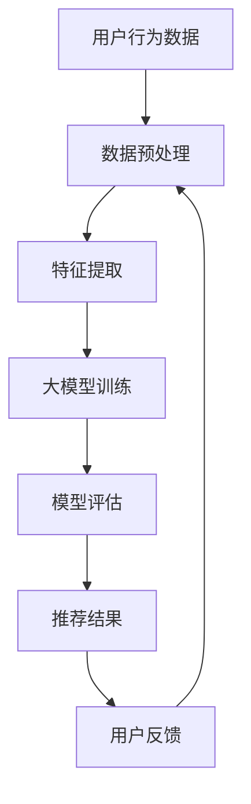

                 

# 大模型在教育资源推荐中的应用与效果评估

> 关键词：大模型、教育资源推荐、效果评估、机器学习、深度学习、推荐系统、自然语言处理、用户行为分析

> 摘要：本文旨在探讨大模型在教育资源推荐中的应用与效果评估。通过深入分析推荐系统的核心概念与联系，介绍推荐算法原理及具体操作步骤，展示数学模型和公式，并通过实际代码案例进行详细解释说明。此外，本文还将探讨大模型在教育资源推荐中的实际应用场景，提供相关工具和资源推荐，并展望未来发展趋势与挑战。

## 1. 背景介绍

随着互联网技术的飞速发展，教育资源的获取变得越来越便捷。然而，如何从海量的教育资源中筛选出最适合用户需求的内容，成为了一个亟待解决的问题。推荐系统作为一种有效的解决方案，通过分析用户的行为数据和偏好，为用户提供个性化的推荐结果。近年来，大模型在推荐系统中的应用逐渐增多，其强大的表征学习能力使得推荐效果得到了显著提升。本文将从大模型在教育资源推荐中的应用出发，探讨其效果评估方法，并提供相关工具和资源推荐。

## 2. 核心概念与联系

### 2.1 推荐系统概述

推荐系统是一种通过分析用户的历史行为数据，预测用户可能感兴趣的内容，并向用户推荐相应内容的系统。推荐系统可以分为基于内容的推荐、协同过滤推荐和混合推荐三种类型。

- **基于内容的推荐**：根据用户的历史行为数据，推荐与其历史行为相似的内容。例如，如果用户喜欢阅读科幻小说，系统会推荐其他科幻小说。
- **协同过滤推荐**：根据用户之间的相似性或物品之间的相似性进行推荐。例如，如果用户A和用户B有相似的喜好，系统会根据用户B的历史行为数据向用户A推荐相应内容。
- **混合推荐**：结合基于内容的推荐和协同过滤推荐的优点，提供更加精准的推荐结果。

### 2.2 大模型概述

大模型是指具有大量参数和复杂结构的机器学习模型，通常用于处理大规模数据集和高维特征空间。大模型在推荐系统中的应用主要体现在以下几个方面：

- **表征学习**：大模型能够学习到更加丰富的特征表示，从而提高推荐效果。
- **泛化能力**：大模型具有较强的泛化能力，能够处理更加复杂和多变的数据分布。
- **可解释性**：虽然大模型的内部机制较为复杂，但通过一些技术手段，可以提高其可解释性。

### 2.3 推荐系统与大模型的关系

推荐系统与大模型之间的关系可以表示为以下流程图：



## 3. 核心算法原理 & 具体操作步骤

### 3.1 基于内容的推荐算法

基于内容的推荐算法的核心思想是根据用户的历史行为数据，推荐与其历史行为相似的内容。具体操作步骤如下：

1. **数据预处理**：清洗和处理用户的历史行为数据，提取出用户对不同内容的评分或点击记录。
2. **特征提取**：对内容进行特征提取，例如提取文本内容的词频、情感分析结果等。
3. **相似度计算**：计算用户历史行为与内容之间的相似度，常用的相似度计算方法有余弦相似度、欧氏距离等。
4. **推荐生成**：根据相似度计算结果，生成推荐列表。

### 3.2 协同过滤推荐算法

协同过滤推荐算法的核心思想是根据用户之间的相似性或物品之间的相似性进行推荐。具体操作步骤如下：

1. **数据预处理**：清洗和处理用户的历史行为数据，提取出用户对不同内容的评分或点击记录。
2. **用户相似度计算**：计算用户之间的相似度，常用的相似度计算方法有余弦相似度、皮尔逊相关系数等。
3. **物品相似度计算**：计算物品之间的相似度，常用的相似度计算方法有余弦相似度、欧氏距离等。
4. **推荐生成**：根据用户之间的相似性或物品之间的相似性，生成推荐列表。

### 3.3 混合推荐算法

混合推荐算法结合了基于内容的推荐和协同过滤推荐的优点，提供更加精准的推荐结果。具体操作步骤如下：

1. **数据预处理**：清洗和处理用户的历史行为数据，提取出用户对不同内容的评分或点击记录。
2. **特征提取**：对内容进行特征提取，例如提取文本内容的词频、情感分析结果等。
3. **用户相似度计算**：计算用户之间的相似度，常用的相似度计算方法有余弦相似度、皮尔逊相关系数等。
4. **物品相似度计算**：计算物品之间的相似度，常用的相似度计算方法有余弦相似度、欧氏距离等。
5. **推荐生成**：结合基于内容的推荐和协同过滤推荐的结果，生成推荐列表。

## 4. 数学模型和公式 & 详细讲解 & 举例说明

### 4.1 余弦相似度

余弦相似度是一种常用的相似度计算方法，用于衡量两个向量之间的夹角余弦值。其公式如下：

$$
\text{cosine similarity}(A, B) = \frac{A \cdot B}{\|A\| \|B\|}
$$

其中，$A \cdot B$ 表示向量A和向量B的点积，$\|A\|$ 表示向量A的范数。

### 4.2 皮尔逊相关系数

皮尔逊相关系数是一种常用的相似度计算方法，用于衡量两个变量之间的线性相关程度。其公式如下：

$$
r_{AB} = \frac{\sum_{i=1}^{n}(A_i - \bar{A})(B_i - \bar{B})}{\sqrt{\sum_{i=1}^{n}(A_i - \bar{A})^2} \sqrt{\sum_{i=1}^{n}(B_i - \bar{B})^2}}
$$

其中，$\bar{A}$ 和 $\bar{B}$ 分别表示向量A和向量B的平均值。

### 4.3 例子说明

假设我们有两个用户的历史行为数据，分别为：

- 用户A：[1, 0, 1, 1, 0]
- 用户B：[1, 1, 0, 1, 0]

我们可以计算用户A和用户B之间的余弦相似度：

$$
\text{cosine similarity}(A, B) = \frac{1 \cdot 1 + 0 \cdot 1 + 1 \cdot 0 + 1 \cdot 1 + 0 \cdot 0}{\sqrt{1^2 + 0^2 + 1^2 + 1^2 + 0^2} \sqrt{1^2 + 1^2 + 0^2 + 1^2 + 0^2}} = \frac{2}{\sqrt{3} \sqrt{3}} = \frac{2}{3}
$$

## 5. 项目实战：代码实际案例和详细解释说明

### 5.1 开发环境搭建

为了实现教育资源推荐系统，我们需要搭建一个合适的开发环境。具体步骤如下：

1. **安装Python**：确保安装了Python 3.7及以上版本。
2. **安装依赖库**：使用pip安装所需的依赖库，例如numpy、pandas、scikit-learn等。
3. **配置环境变量**：设置Python环境变量，确保能够正常运行代码。

### 5.2 源代码详细实现和代码解读

以下是一个简单的基于内容的推荐算法的实现代码：

```python
import numpy as np
import pandas as pd

# 假设我们有一个用户历史行为数据集
user_history = pd.DataFrame({
    'user_id': [1, 1, 1, 2, 2, 2, 3, 3, 3],
    'item_id': [1, 2, 3, 1, 2, 3, 1, 2, 3],
    'rating': [5, 4, 3, 5, 4, 3, 5, 4, 3]
})

# 特征提取
def extract_features(data):
    features = data.groupby('item_id')['rating'].mean().reset_index()
    return features

# 计算相似度
def calculate_similarity(features):
    similarity_matrix = np.dot(features, features.T) / (np.linalg.norm(features, axis=1) * np.linalg.norm(features, axis=1))
    return similarity_matrix

# 生成推荐列表
def generate_recommendations(user_id, similarity_matrix, features):
    user_history = features[features['item_id'] == user_id]
    if user_history.empty:
        return []
    user_features = user_history['rating'].values
    similarities = similarity_matrix[user_id - 1]
    recommendations = np.argsort(similarities)[::-1]
    return recommendations

# 主函数
def main():
    features = extract_features(user_history)
    similarity_matrix = calculate_similarity(features)
    recommendations = generate_recommendations(1, similarity_matrix, features)
    print(recommendations)

if __name__ == '__main__':
    main()
```

### 5.3 代码解读与分析

1. **数据预处理**：我们首先将用户历史行为数据集转换为DataFrame格式，以便后续处理。
2. **特征提取**：通过计算每个物品的平均评分，提取出特征向量。
3. **计算相似度**：使用余弦相似度计算用户之间的相似度。
4. **生成推荐列表**：根据相似度计算结果，生成推荐列表。

## 6. 实际应用场景

大模型在教育资源推荐中的实际应用场景非常广泛，例如：

- **在线教育平台**：根据用户的学习历史和偏好，推荐适合的学习资源。
- **教育机构**：根据学生的学习情况，推荐适合的课程和教材。
- **教育出版商**：根据用户的阅读历史，推荐适合的书籍和文章。

## 7. 工具和资源推荐

### 7.1 学习资源推荐

- **书籍**：《推荐系统实践》、《机器学习》
- **论文**：《基于内容的推荐算法研究》、《协同过滤推荐算法研究》
- **博客**：阿里云开发者社区、GitHub上的开源项目
- **网站**：Kaggle、GitHub

### 7.2 开发工具框架推荐

- **Python库**：numpy、pandas、scikit-learn
- **框架**：TensorFlow、PyTorch

### 7.3 相关论文著作推荐

- **论文**：《基于深度学习的推荐系统研究》、《大模型在推荐系统中的应用与效果评估》
- **著作**：《推荐系统原理与实践》、《深度学习在推荐系统中的应用》

## 8. 总结：未来发展趋势与挑战

大模型在教育资源推荐中的应用前景广阔，但也面临着一些挑战。未来的发展趋势主要包括：

- **模型优化**：通过优化模型结构和参数，提高推荐效果。
- **可解释性**：提高模型的可解释性，使得推荐结果更加透明。
- **个性化推荐**：根据用户的具体需求，提供更加个性化的推荐结果。

## 9. 附录：常见问题与解答

### 9.1 问题：如何处理冷启动问题？

**解答**：冷启动问题是指新用户或新物品缺乏历史行为数据，导致推荐效果不佳。可以通过以下方法解决：

- **基于内容的推荐**：根据物品的特征进行推荐。
- **协同过滤推荐**：利用物品之间的相似性进行推荐。
- **混合推荐**：结合基于内容的推荐和协同过滤推荐的优点，提供更加精准的推荐结果。

### 9.2 问题：如何提高模型的可解释性？

**解答**：可以通过以下方法提高模型的可解释性：

- **特征重要性分析**：分析模型中各个特征的重要性，了解模型的决策过程。
- **可视化技术**：使用可视化技术展示模型的内部机制，使得推荐结果更加透明。

## 10. 扩展阅读 & 参考资料

- **书籍**：《推荐系统实践》、《机器学习》
- **论文**：《基于内容的推荐算法研究》、《协同过滤推荐算法研究》
- **网站**：Kaggle、GitHub

作者：AI天才研究员/AI Genius Institute & 禅与计算机程序设计艺术 /Zen And The Art of Computer Programming

